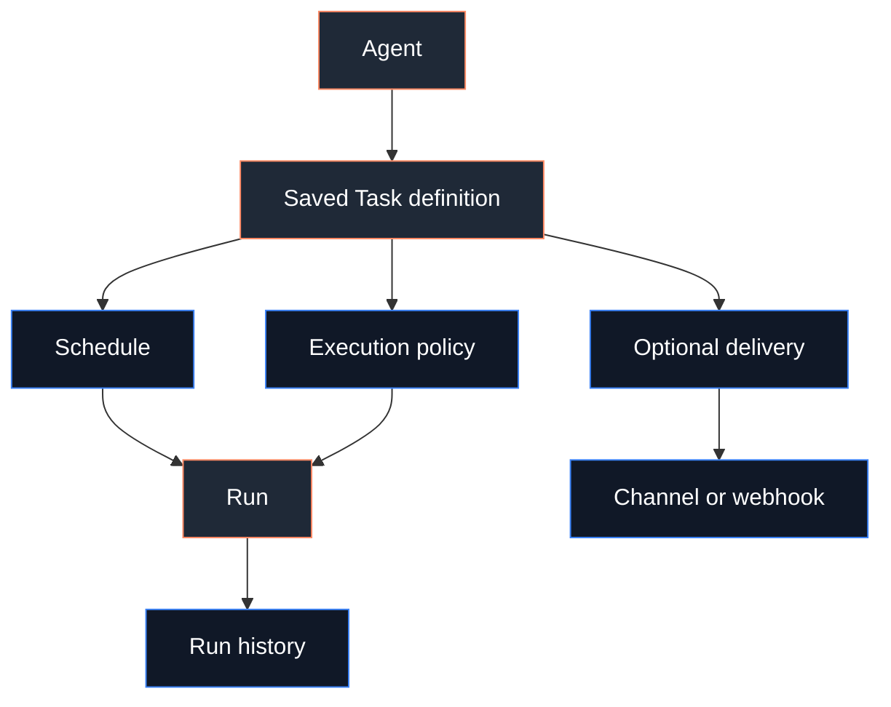

# Scheduled Tasks

Tasks are saved Agent instructions that run later, repeat on a schedule, or run
on demand. The gateway still exposes the older internal name `cron` in CLI/RPC
surfaces, but the user-facing concept is **Task**.

Use [Tasks vs Heartbeat](/automation/cron-vs-heartbeat) if you are deciding
between scheduled work and the Agent heartbeat.



## What tasks are for

Use a Task when Fased should:

- run a prompt at a time or interval
- keep the run isolated from the main Agent session
- announce a result to a channel or webhook
- run with narrowed model, memory, or skill access
- keep reusable setup separate from run history

Use a Workflow when the work is a checklist or approval sequence. Use Graph only
when that workflow needs branches.

## Quick start

1. Open `http://localhost:18789/`.
2. Go to **Agents**.
3. Select the Agent that should own the task.
4. Open **Tasks**.
5. Create the task and choose its schedule.
6. Run it once, then open the row's run history if it needs review.

CLI equivalent:

```bash
fased task add \
  --name "Reminder" \
  --at "20m" \
  --session main \
  --system-event "Reminder: review the automation docs" \
  --wake now \
  --delete-after-run

fased task list
fased task run <task-id>
fased task runs --id <task-id>
```

See [Task CLI](/cli/task) and [Cron CLI](/cli/cron) for the full command
surface.

## Create Task fields

The browser **Create task** dialog writes one saved task definition through
`cron.add`. The definition is attached to the selected Agent unless the global
Tasks view explicitly chooses another Agent.

**Name**

Human label shown in Agent > Tasks.

**Prompt**

Instruction the Agent runs on each schedule.

**Objective**

Optional goal stored with the task for planning and review.

**Success**

Optional completion criteria for review and stop-on-success.

**Schedule**

One-time, interval, or cron expression.

**Session**

`New task session` isolates each run. `Main Agent session` posts into the
Agent's main lane.

**Delivery target**

`No delivery` keeps the result internal. Channel or webhook delivery sends the
result to the selected target.

**Execution**

Auto, Agent turn, skill-only, or no-model execution.

**Memory**

Retrieval scope for this run.

**Skill access**

Inherit, narrow, or disable skills for the task.

**Ask Agents**

Optional helper Agents that add evidence before final synthesis.

**Session key**

Advanced routing key. Leave default unless you are wiring a specific route.

**Presets**

Policy shortcuts that set execution, memory, model, evaluator, or stop-policy
fields.

## Definitions vs run history

Agent > Tasks starts with saved definitions:

- Task
- Trigger
- Workflow
- Graph
- Program

Templates are starter presets. They become saved definitions after you save the
resulting task.

Every time one of them runs, Fased writes run history. History is evidence of
what happened. The saved definition controls future runs.

Run history can include scheduled tasks, webhook triggers, channel runs, helper
Agents, wallet approvals, marketplace order records, mining events, media jobs,
CLI/system runs, and workflow nodes. Domain pages keep control of their own
actions. Wallets still approve/sign, Marketplace still handles orders, and
Mining still handles start/stop, capital, commit, claim, and recovery controls.

Open a task row's run history or the explicit **Run history** filter when you
need audit detail. Use **Advanced > Debug** when history looks stale or a run
needs maintenance.

## Task templates

Task templates fill the whole task shape: schedule, prompt, objective, success
criteria, execution policy, memory, skill access, and delivery. Saving the form
turns the template into a normal Task definition.

**Mining strategy review**

Use when you want strategy review from mining status/history while funding,
withdraw, start/stop, wallet send, and bond controls stay unchanged.

**Mining status report**

Use when you want a read-only mining report: running/stopped state, current
cycle, wallet SOL/SAT, capital, locked capital, claimable SAT, and blockers.

**Strategy A/B review**

Use when you want evidence across `balanced`, `top_k`, `ranked`,
`crowd_aware`, and `adaptive` while active commit settings stay unchanged.

**Wallet reserve watch**

Use when you want alerts before Agent, Vault, or Mining wallet fee reserves get
too low.

**Staking rewards watch**

Use when you want a read-only Fased Network check for bond amount, claimable
SAT, reward pool, and vault balance.

**Provider health check**

Use when you want recurring checks for model providers, channels, tools,
signer, and RPC readiness.

**Marketplace follow-up**

Use when you want open orders with payment, delivery, receipt, or review state
surfaced for manual action.

**RPC pressure report**

Use when you want an operator report for RPC calls, `getAccountInfo` pressure,
failover, and cost-reduction targets.

Presets are smaller than templates. A preset changes execution, memory, skill,
model, evaluator, or stop policy fields without replacing the full task.

## Delivery

Tasks can keep results internal or deliver them outward.

**None**

The result stays in the Agent UI and run history.

**Channel**

The result is sent through a connected channel such as Telegram, Discord,
WhatsApp, or Slack.

**Webhook**

The finished run payload is POSTed to the configured URL.

The selected Agent owns the task even when the result is announced to a
channel.

## Main vs isolated session

**Main Agent session**

Use when the run belongs in the Agent's main conversation lane.

**New task session**

Use when the run should stay isolated, quieter, or easier to audit by run.

Most recurring tasks should use a new task session. Use the main session when
the scheduled work is part of the ongoing conversation.

## Storage and operations

The gateway manages scheduled tasks under `~/.fased/cron/` internally.

- task definitions: `~/.fased/cron/jobs.json`
- queued task-run state: `~/.fased/tasks/task-ledger.sqlite` (legacy import: `~/.fased/cron/task-runs/queue.json`)
- run logs: `~/.fased/cron/runs/<jobId>.jsonl`

Use the UI, CLI, or RPC for changes while the gateway is running.

Relevant reference pages:

- [Task CLI](/cli/task)
- [Cron CLI](/cli/cron)
- [System events](/cli/system)
- [Automation troubleshooting](/automation/troubleshooting)
- [Gateway configuration](/gateway/configuration-reference)

## Troubleshooting

If a task does not run:

- confirm the gateway is running continuously
- confirm scheduling is enabled
- check timezone and cron expression assumptions
- run the task manually from Agent > Tasks or `fased task run <task-id>`
- open run history for the latest error

If a recurring task keeps delaying after failures, the scheduler may be applying
retry backoff. The backoff resets after a successful run.

If delivery goes to the wrong Telegram place, use an explicit topic route such
as `-1001234567890:topic:123`.

For stale running rows, missing delivery state, or old queue records, use
[Automation Troubleshooting](/automation/troubleshooting) and **Advanced >
Debug**.
