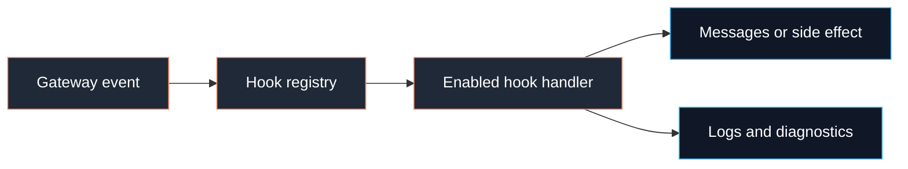

# Hooks

Hooks are local event handlers that run inside the gateway when matching Fased
events occur. They are useful for small runtime extensions such as session
memory, startup files, command logging, and plugin-side tool-result transforms.

Hooks are not webhooks. For inbound HTTP automation, read
[Webhooks](/automation/webhook).



## Normal path

Most users only need the bundled `session-memory` hook.

1. Enable `session-memory` during onboarding or from **Agent > Memory**.
2. Use **Extensions > Hooks** to inspect enabled hook packs.
3. Use **Advanced > Config** only when a hook has no UI yet.
4. Restart the gateway if the UI says runtime hook state has not caught up.

Custom hooks and hook packs are executable code. Review the source before
installing or enabling them.

## Bundled hooks

| Hook                    | Event            | Purpose                                                               | Normal user path              |
| ----------------------- | ---------------- | --------------------------------------------------------------------- | ----------------------------- |
| `session-memory`        | `/new`, `/reset` | Archives recent session context into the Agent workspace memory area. | Onboarding or Agent > Memory. |
| `boot-md`               | gateway startup  | Runs `BOOT.md` from each Agent workspace on gateway start.            | Operator startup automation.  |
| `bootstrap-extra-files` | agent bootstrap  | Adds extra workspace files into Agent bootstrap context.              | Advanced workspace setup.     |
| `command-logger`        | commands         | Appends command events to `~/.fased/logs/commands.log`.               | Debug command usage.          |

Useful commands:

```bash
fased hooks list
fased hooks enable session-memory
fased hooks disable session-memory
fased hooks info session-memory
fased hooks check
```

## Discovery

Hooks are loaded from these sources, later sources winning name conflicts:

1. extra hook directories from `hooks.internal.load.extraDirs`
2. bundled hooks: `<fased>/dist/hooks/bundled/`
3. managed hooks: `~/.fased/hooks/`
4. workspace hooks: `<workspace>/hooks/`

Each hook is a directory:

```text
my-hook/
├── HOOK.md
└── handler.ts
```

## Hook packs

Hook packs are npm packages that expose one or more hooks through
`package.json -> fased.hooks`.

Install with:

```bash
fased hooks install <path-or-spec>
```

Rules:

- npm specs are registry-only
- local directories and local archives are supported for operator-controlled
  installs
- Git, URL, and arbitrary remote specs are rejected
- hook entries must resolve inside the package directory
- dependencies install with `npm install --ignore-scripts`

Example:

```json
{
  "name": "@acme/my-hooks",
  "version": "0.1.0",
  "fased": {
    "hooks": ["./hooks/my-hook"]
  }
}
```

Keep hook-pack dependency trees small and treat third-party hook packs as
executable code.

## Hook metadata

`HOOK.md` combines metadata and human docs.

```markdown
---
name: my-hook
description: "Short description"
metadata:
  { "fased": { "emoji": "hook", "events": ["command:new"], "requires": { "bins": ["node"] } } }
---

# My Hook

Explain what it does and how to enable it.
```

Supported `metadata.fased` fields:

- `emoji`
- `events`
- `export`
- `homepage`
- `requires`
- `always`
- `install`

`requires` can check binaries, environment variables, config keys, and OS
constraints before a hook is considered eligible.

## Handler shape

Handlers are async functions that inspect an event, optionally append messages
to the event, and may perform a small side effect.

```ts
const handler = async (event) => {
  if (event.type !== "command" || event.action !== "new") {
    return;
  }

  console.log(`[my-hook] new session ${event.sessionKey}`);
};

export default handler;
```

Handlers receive:

- `type`
- `action`
- `sessionKey`
- `agentId`
- `config`
- event-specific payload

Filter events early, keep handlers fast, and avoid throwing for ordinary
non-matching events.

## Event families

| Family      | Examples                                         |
| ----------- | ------------------------------------------------ |
| Command     | `command:new`, `command:reset`, `command:custom` |
| Agent       | `agent:bootstrap`                                |
| Gateway     | `gateway:startup`, `gateway:shutdown`            |
| Message     | `message:received`, `message:sent`               |
| Tool result | plugin-side tool-result transforms               |

Tool-result hooks are intentionally narrow. They can transform tool output for
a participating plugin path; they do not create tools, grant credentials, or
change wallet/mining/marketplace control.

## Configuration

Current config shape:

```json5
{
  hooks: {
    internal: {
      enabled: true,
      load: {
        extraDirs: [],
      },
      entries: {
        "session-memory": {
          enabled: true,
          messages: 20,
        },
      },
    },
  },
}
```

For internal runtime hooks, use `hooks.internal.enabled` and
`hooks.internal.entries`. Top-level `hooks.enabled` belongs to HTTP webhook
ingress, not local runtime hooks.

## Debugging

Start with:

```bash
fased hooks list
fased hooks info <name>
fased hooks check
fased logs --follow
```

Common causes:

| Symptom             | Check                                                        |
| ------------------- | ------------------------------------------------------------ |
| Hook not discovered | Directory name, `HOOK.md`, load source, and name collisions. |
| Hook not eligible   | Missing binary, env var, config key, or OS requirement.      |
| Hook not executing  | Event name, enabled state, gateway restart, and logs.        |
| Handler errors      | Catch expected failures and write concise diagnostics.       |

## See also

- [Webhooks](/automation/webhook)
- [Automation](/automation)
- [Hooks CLI](/cli/hooks)
- [Agent workspace](/concepts/agent-workspace)
