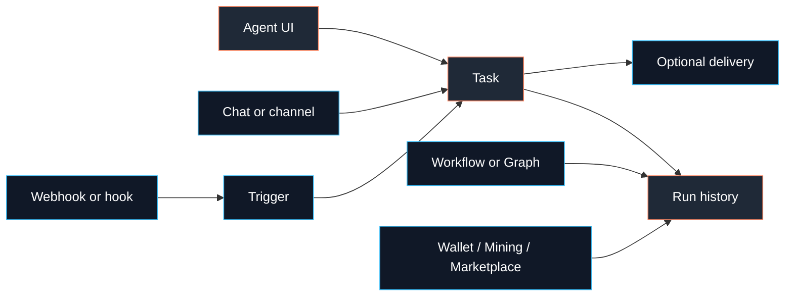

# Automation

Automation is how Fased does work when you are not actively typing in Chat.

Use **Agent > Tasks** for saved work. Use domain pages for domain control:
Wallets approve and sign, Mining controls mining, Marketplace handles orders,
and Channels owns delivery routes.



## Choose the right surface

| Need                                   | Use                    | Setup path                                |
| -------------------------------------- | ---------------------- | ----------------------------------------- |
| Run something later or repeatedly      | Task                   | Agents > selected Agent > Tasks           |
| Periodic awareness in the main chat    | Heartbeat              | Agent workspace `HEARTBEAT.md` and config |
| Receive external HTTP events           | Webhook trigger        | Agents > selected Agent > Tasks           |
| Save session context on reset/new chat | Hook: `session-memory` | Onboarding or Agent > Memory              |
| Gmail push notifications               | Gmail Pub/Sub helper   | `fased webhooks gmail setup`              |
| Send a poll to a chat app              | Poll                   | `fased message poll ...`                  |

Most users should start with a Task.

## Beginner path

1. Open `http://localhost:18789/dash`.
2. Go to **Agents**.
3. Select the Agent that should own the work.
4. Open **Tasks**.
5. Create a Task, Trigger, Workflow, Graph, or Program.
6. Open the row's run history only when you need to inspect a run.

Useful CLI commands:

```bash
fased task list
fased task run <task-id>
fased task runs --id <task-id>
fased task run-show <run-id>
fased logs --follow
```

Use CLI when you are scripting, operating a headless host, or recovering a
broken setup.

## Definitions and history

Saved definitions are reusable setup:

- **Task**: scheduled or manually runnable Agent instruction
- **Trigger**: external event that starts work
- **Workflow**: linear checklist or approval flow
- **Graph**: branching workflow definition
- **Program**: standing order that proposes work for review
- **Template**: starter preset for a saved definition

Run history is what happened after something ran. It can record scheduled runs,
webhook fires, channel-triggered work, helper Agents, workflow nodes, wallet
approval mirrors, marketplace order records, mining events, media jobs, and
CLI/system actions.

History does not replace the saved definition list. Deleting or editing a
definition does not rewrite old run records.

## What to create first

Create a **Task** when work needs a schedule, prompt, execution policy, memory
policy, skill limits, or delivery.

Create a **Trigger** when an outside system should call Fased over HTTP. A
trigger does not think by itself; it starts an Agent prompt, a saved workflow, a
graph workflow, or a heartbeat wake.

Create a **Workflow** for a short review or approval sequence. Use **Graph**
only when that sequence needs branches.

Use **Programs** for standing instructions that propose work for review. A
Program does not create wallet, marketplace, mining, tool, or service authority
by itself.

## Task templates

Fased ships starter Task templates for recurring work:

| Template               | Purpose                                                                                                                           |
| ---------------------- | --------------------------------------------------------------------------------------------------------------------------------- |
| Mining strategy review | Review mining status/history and strategy settings without touching funding, withdraw, wallet send, start/stop, or bond controls. |
| Mining status report   | Report running/stopped state, current cycle, wallet SOL/SAT, capital, locked capital, claimable SAT, and blockers.                |
| Strategy A/B review    | Compare mining strategy modes while active commit settings stay unchanged.                                                        |
| Wallet reserve watch   | Watch Agent, Vault, and Mining wallet fee reserves.                                                                               |
| Staking rewards watch  | Watch bond amount, claimable SAT, reward pool, and vault balance.                                                                 |
| Provider health check  | Check model providers, channels, tools, signer, and RPC readiness.                                                                |
| Marketplace follow-up  | Surface open orders with payment, delivery, receipt, or review state.                                                             |
| RPC pressure report    | Summarize RPC calls, pressure points, failover, and reduction targets.                                                            |

Task templates are not workflow templates. Use a Task template when something
runs on a schedule. Use a Workflow or Graph when a human review sequence matters.

## Workflows and graphs

Workflows are small operator procedures. Supported step types include note,
checkpoint, wait, approval, handoff, and notify.

Graph workflows are the branching version of the same idea. The visual builder
edits the same graph JSON the runtime executes.

Workflows and graphs:

- write run history
- can pause on approval
- can link to source records
- do not run arbitrary scripts
- do not grant wallet, marketplace, mining, tool, or service access by
  themselves

## Programs

A Program is an Agent-scoped standing order. It can write a blocked proposal
record for review. The operator decides whether to convert the proposal into a
real Task or Workflow.

Use Programs for durable intent, not for direct execution.

## Security rules

- Keep webhook ingress private: localhost, Tailscale, or a trusted reverse
  proxy.
- Use a dedicated webhook token, not your gateway owner token.
- Do not let external payloads choose arbitrary Agent IDs unless you
  intentionally allow that.
- Do not let external payloads choose arbitrary session keys unless you set
  explicit prefixes.
- Installing or enabling a hook is code execution inside the gateway; use hook
  packs from sources you trust.

## Pages in this folder

- [Scheduled Tasks](/automation/cron-jobs)
- [Tasks vs Heartbeat](/automation/cron-vs-heartbeat)
- [Webhooks](/automation/webhook)
- [Gmail Pub/Sub](/automation/gmail-pubsub)
- [Hooks](/automation/hooks)
- [Polls](/automation/poll)
- [Auth Monitoring](/automation/auth-monitoring)
- [Troubleshooting](/automation/troubleshooting)
