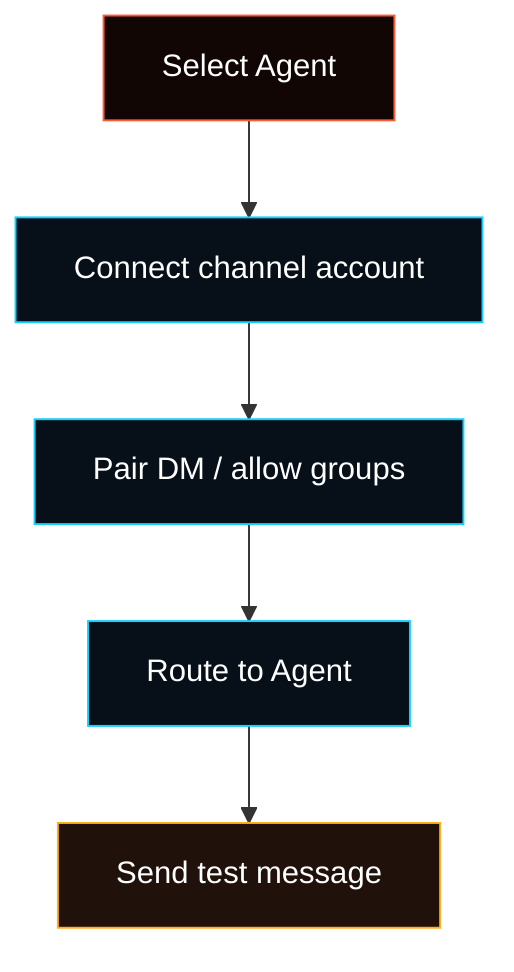

# Chat channels

Fased connects to the chat apps you already use through the gateway. Text works
everywhere; media, reactions, threads, voice, and advanced actions depend on
the channel.

For normal browser setup, open **Agents**, select the Agent, then use
**Agent > Channels**. That page owns channel credentials, QR/login flows,
account status, routing to the selected Agent, DM access, allowlists, and
restart-required notices.

The Control UI Channels tab is split into:

- **Accounts**: grouped channel cards and the Connect modal for required fields.
- **Behavior**: reply behavior, reactions, group mention behavior, and TTS.
- **Access**: command and native-tool access for channel users.
- **Sessions**: channel-to-session binding and reset rules.
- **Gateway**: web and gateway settings for channel delivery.

Account cards are grouped as Major, Enterprise, Self-hosted/protocol, and
Optional/plugin so first-run setup stays focused on the common channels.

## Channel map

<CardGroup cols={2}>
  <Card title="Common Setup" icon="message-circle" href="/channels/telegram">
    Start here for WhatsApp, Telegram, Discord, Slack, Signal, or BlueBubbles.
    These are the fastest practical routes to DMs, groups, and team chat.
  </Card>
  <Card title="Team And Enterprise" icon="building-2" href="/channels/googlechat">
    Use Google Chat, Feishu, Microsoft Teams, LINE, Zalo, or Zalo Personal for
    company, regional, or business chat surfaces.
  </Card>
  <Card title="Self-Hosted And Protocol" icon="server" href="/channels/matrix">
    Use IRC, Mattermost, Matrix, Nextcloud Talk, Synology Chat, Nostr, or Tlon
    for self-hosted, protocol-native, or private collaboration routes.
  </Card>
  <Card title="Optional And Legacy" icon="archive" href="/channels/twitch">
    Use Twitch for live chat. Use iMessage only for established `imsg` setups;
    new iMessage-style setups should start with BlueBubbles.
  </Card>
</CardGroup>

Common setup:

- [WhatsApp](/channels/whatsapp)
- [Telegram](/channels/telegram)
- [Discord](/channels/discord)
- [Slack](/channels/slack)
- [Signal](/channels/signal)
- [BlueBubbles](/channels/bluebubbles)

Team and enterprise:

- [Google Chat](/channels/googlechat)
- [Feishu](/channels/feishu)
- [Microsoft Teams](/channels/msteams)
- [LINE](/channels/line)
- [Zalo](/channels/zalo)
- [Zalo Personal](/channels/zalouser)

Self-hosted and protocol:

- [IRC](/channels/irc)
- [Mattermost](/channels/mattermost)
- [Matrix](/channels/matrix)
- [Nextcloud Talk](/channels/nextcloud-talk)
- [Synology Chat](/channels/synology-chat)
- [Nostr](/channels/nostr)
- [Tlon](/channels/tlon)

Optional and legacy:

- [Twitch](/channels/twitch)
- [iMessage](/channels/imessage)

## Runtime status

- **Agent > Channels** shows available channels, including official add-ons
  that are not downloaded yet.
- Telegram, WhatsApp, Discord, Slack, Feishu, and Google Chat show **Install** on a fresh core
  install. The Control UI downloads the matching official npm package.
- Saving credentials enables that channel for the selected Agent.
- Installed channel add-ons need a Gateway restart before their credential and
  login flow becomes active.
- The onboarding wizard and `fased channels add` can install the same official
  add-ons before configuration.

## Good first choices

- **Telegram** for fastest public bot setup.
- **WhatsApp** for a familiar personal or group assistant.
- **Discord** or **Slack** for team spaces.
- **BlueBubbles** for new iMessage-style setups.
- **Matrix** or **Nextcloud Talk** for self-hosted collaboration.

## Notes

- multiple channels can run at the same time
- Telegram, WhatsApp, Discord, Slack, Feishu, and Google Chat are official add-ons; install only the
  channels you use
- other advanced channel extensions may need a source install or
  channel-specific dependencies until a published add-on exists
- if a channel shows restart required, restart the Gateway before testing live
  messages
- routing is deterministic per peer and per channel; see
  [Channel Routing](/channels/channel-routing)
- group behavior is documented separately in [Groups](/channels/groups)
- DM pairing and allowlists are part of the security model; see
  [Security](/gateway/security) and [Pairing](/channels/pairing)
- fast failure triage starts at
  [Channel Troubleshooting](/channels/troubleshooting)
- the full core/add-on boundary is in
  [Core And Optional Components](/install/components)
