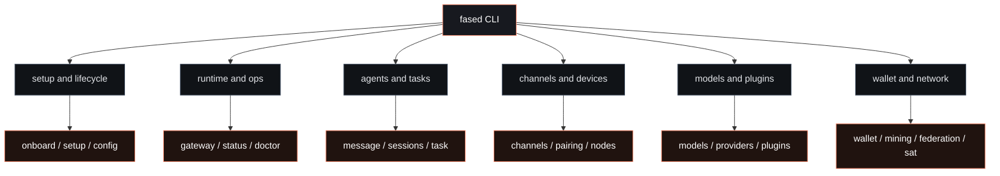

# CLI reference

`fased` is the control surface for the self-hosted runtime. It is not just a
gateway wrapper. The CLI manages:

- onboarding and install flows
- config and secrets
- Agent workspaces, channel accounts, routing, skills, services, tools, and tasks
- live gateway control and diagnostics
- plugins, skills, and hooks
- wallets, Fased Network, and mining where enabled

The browser setup path is Agent-first: open **Agents**, select an Agent, then use
Models, Channels, Skills, Tools, Memory, Sessions, Services, Tasks,
Coordination, and Files. CLI commands are the scriptable/admin equivalent.
Diagnostics map to **Logs**, **Usage**, **Advanced > Debug**, and **Advanced >
Nodes**.

## Command map

## Main command groups

<CardGroup cols={2}>
  <Card title="Setup and lifecycle" icon="rocket" href="/cli/onboard">
    Onboarding, config, update, uninstall, shell completion, and reset flows.
  </Card>
  <Card title="Runtime and ops" icon="activity" href="/cli/gateway">
    Gateway control, health, doctor, logs, services, security, secrets, and sandboxing.
  </Card>
  <Card title="Agents and tasks" icon="bot" href="/cli/agents">
    Agents, messages, sessions, memory, task definitions, hooks, approvals, and skills.
  </Card>
  <Card title="Channels and devices" icon="message-circle" href="/cli/channels">
    Channel accounts, pairing, QR flows, local nodes, browser, voice call, and DNS.
  </Card>
  <Card title="Models and plugins" icon="blocks" href="/cli/models">
    Model selection, provider status, plugin management, and ACP agents.
  </Card>
  <Card title="Wallet and network" icon="network" href="/cli/wallet">
    Wallets, mining, Fased Network, directory, federation, and SAT operator operations.
  </Card>
</CardGroup>

`cron` is still documented as a compatibility alias for `task`. `daemon` is
still documented as a compatibility service command.

## Global flags

- `--dev`
  - isolate state under `~/.fased-dev`
- `--profile <name>`
  - isolate state under `~/.fased-<name>`
- `--no-color`
  - disable ANSI colors
- `--update`
  - shorthand for `fased update`
- `-V`, `--version`, `-v`
  - print version and exit

## Output behavior

- human output is styled only in TTY sessions
- `--json` disables styling and is the preferred scripting mode
- `--no-color` and `NO_COLOR=1` disable ANSI colors
- progress indicators are shown for long-running commands when the terminal
  supports them

## Important current behavior

- install and update are still repo-backed by default
- `fased onboard --install-daemon` is for setup and service installation, not
  the primary version-update path
- plugin and hook installs are executable-code paths; treat them with the same
  care as normal software installs
- legacy alias namespaces remain supported for migration, but the main docs
  should prefer the top-level `fased ...` forms

## Related

- [Install](/install/index)
- [Updating](/install/updating)
- [Onboarding](/start/onboarding)
- [Gateway configuration](/gateway/configuration)
- [Diagnostics](/diagnostics/index)
