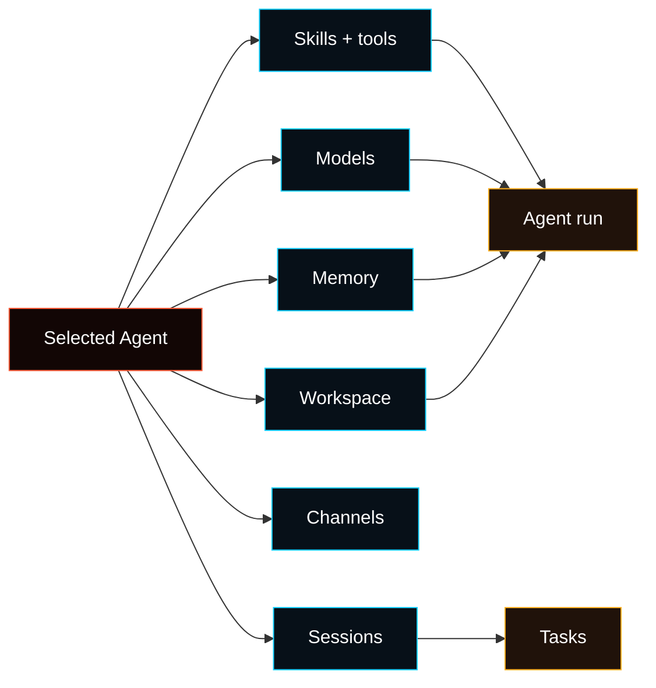

# Agent Runtime

Fased runs one Gateway process that can host multiple durable Agents. Each
Agent has its own identity, workspace, model selection, skill/tool policy,
channels, sessions, tasks, and workspace files.



## Agent workbench

Normal setup starts from **Agents**, then the selected Agent. The selected Agent
owns the user-facing setup tabs:

| Tab          | Owns                                                                                                                                   |
| ------------ | -------------------------------------------------------------------------------------------------------------------------------------- |
| Setup        | Summary cards for identity, workspace, memory, skills, models, channels, tools, services, tasks, sessions, usage, and extension health |
| Models       | Connected providers plus this Agent's primary, fallback, and task model refs                                                           |
| Channels     | Chat account setup, QR/login flows, routing, DM/group policy, and delivery to this Agent                                               |
| Skills       | Skill library/catalog, create/edit/config, dependency install, and this Agent's skill access policy                                    |
| Tools        | Per-Agent allow/deny for runtime tools after services/extensions expose them                                                           |
| Memory       | Session archive enable/disable, workspace memory roots, backend, QMD status, and per-Agent validation                                  |
| Sessions     | This Agent's conversations, token/session metadata, attached tasks, and protected delete/restore actions                               |
| Services     | Connector setup/status in the selected Agent context; service credentials remain global where the service requires it                  |
| Tasks        | Scheduled and event-triggered work owned by this Agent and its sessions                                                                |
| Coordination | Multi-Agent task evidence, selected-Agent review, and retry-with-evidence controls                                                     |
| Files        | User-owned workspace bootstrap files such as `AGENTS.md`, `SOUL.md`, `TOOLS.md`, `IDENTITY.md`, `USER.md`, and `MEMORY.md`             |

Global/operator pages such as Dashboard, Usage, Logs, Advanced, Extensions,
Wallets, Mining, Fased Network, and Marketplace still exist for runtime,
security, specialized controls, and diagnostics. Advanced groups raw Config,
Debug, and Nodes for operators. Normal Agent setup should not require raw config
edits.

## Workspace (required)

Each Agent has a workspace directory. The default Agent uses
`agents.defaults.workspace` when configured, otherwise `~/.fased/workspace`.
Additional Agents can override their workspace with `agents.list[].workspace`.
Without an explicit workspace, Fased derives one from the default workspace or
the Fased state directory. The active Agent workspace is the working directory
for file tools and workspace context.

Recommended: use `fased setup` to create `~/.fased/fased.json` if missing and initialize the workspace files.

Full workspace layout + backup guide: [Agent workspace](/concepts/agent-workspace)

If sandboxing is enabled and `workspaceAccess` is not `"rw"`, a run uses a
sandbox workspace under `agents.defaults.sandbox.workspaceRoot` instead of
writing directly to the host workspace (see [Gateway configuration](/gateway/configuration)).

## Bootstrap files (injected)

Inside the selected Agent workspace, Fased recognizes these user-editable files:

- `AGENTS.md` — operating instructions + “memory”
- `SOUL.md` — persona, boundaries, tone
- `TOOLS.md` — user-maintained tool notes (e.g. `imsg`, `sag`, conventions)
- `BOOTSTRAP.md` — one-time first-run ritual (deleted after completion)
- `IDENTITY.md` — agent name/vibe/emoji
- `USER.md` — user profile + preferred address
- `HEARTBEAT.md` — compact heartbeat checklist
- `MEMORY.md` / `memory.md` — curated long-term memory root

For a run, Fased builds context from the recognized bootstrap files. Full
sessions receive the normal bootstrap context; lightweight heartbeat runs keep
only the heartbeat context.

Blank files are skipped. Large files are trimmed and truncated with a marker so
prompts stay lean; use file or memory tools to read the full content when needed.

If a file is missing, Fased injects a single “missing file” marker line (and `fased setup` will create a baseline template).

`BOOTSTRAP.md` is only created for a **brand new workspace** (no other bootstrap files present). If you delete it after completing the ritual, it should not be recreated on later restarts.

To disable bootstrap file creation entirely (for pre-seeded workspaces), set:

```json5
{ agents: { defaults: { skipBootstrap: true } } }
```

## Built-in tools

Core tool families such as read, exec, edit, write, and related system tools are
part of the runtime, but policy can allow, deny, or narrow what a specific Agent
may use. `apply_patch` is optional and gated by `tools.exec.applyPatch`.
`TOOLS.md` does **not** control which tools exist; it’s guidance for how _you_
want them used.

## Skills

Fased loads skills from three locations (workspace wins on name conflict):

- Bundled (shipped with the install)
- Managed/local: `~/.fased/skills`
- Workspace: `<workspace>/skills`

Skills can be gated by config/env (see `skills` in [Gateway configuration](/gateway/configuration)).
The normal UI for install, edit, dependency setup, and per-Agent allow/deny is
**Agent > Skills**. A skill can be present in the shared library without being
allowed for a specific Agent.

## Embedded runtime integration

Some internal model/tool code still carries older runtime names while migration
continues, but session management, discovery, tool wiring, and user-facing
behavior are Fased-owned.

- No legacy upstream agent runtime.
- No `~/.pi/agent` or `<workspace>/.pi` settings are consulted.

## Sessions

Session transcripts are stored as JSONL at:

- `~/.fased/agents/<agentId>/sessions/<SessionId>.jsonl`

The session ID is stable and chosen by Fased.
Legacy pre-Fased session folders are **not** read.

## Steering while streaming

When queue mode is `steer`, inbound messages are injected into the current run.
The queue is checked **after each tool call**; if a queued message is present,
remaining tool calls from the current assistant message are skipped (error tool
results with "Skipped due to queued user message."), then the queued user
message is injected before the next assistant response.

When queue mode is `followup` or `collect`, inbound messages are held until the
current turn ends, then a new agent turn starts with the queued payloads. See
[Queue](/concepts/queue) for mode + debounce/cap behavior.

Block streaming sends completed assistant blocks as soon as they finish; it is
**off by default** (`agents.defaults.blockStreamingDefault: "off"`).
Tune the boundary via `agents.defaults.blockStreamingBreak` (`text_end` vs `message_end`; defaults to text_end).
Control soft block chunking with `agents.defaults.blockStreamingChunk` (defaults to
800–1200 chars; prefers paragraph breaks, then newlines; sentences last).
Coalesce streamed chunks with `agents.defaults.blockStreamingCoalesce` to reduce
single-line spam (idle-based merging before send). Non-Telegram channels require
explicit `*.blockStreaming: true` to enable block replies.
Verbose tool summaries are emitted at tool start (no debounce); Control UI
streams tool output via agent events when available.
More details: [Streaming + chunking](/concepts/streaming).

## Model refs

Model refs are normally selected in **Agent > Models**. Raw config refs (for
example `agents.defaults.model`, `agents.defaults.models`, and
`agents.list[].model`) are parsed by splitting on the **first** `/`.

- Use `provider/model` when configuring models.
- If the model ID itself contains `/` (OpenRouter-style), include the provider prefix (example: `openrouter/moonshotai/kimi-k2`).
- If you omit the provider, Fased treats the input as an alias or a model for the default provider (only works when there is no `/` in the model ID).

## Configuration (minimal)

At minimum, set:

- `agents.defaults.workspace`
- one usable model in **Agent > Models**
- optional channel routes in **Agent > Channels** if the Agent should receive
  Telegram, Discord, WhatsApp, Slack, Signal, or other app messages

---

_Next: [Groups](/channels/groups)_
