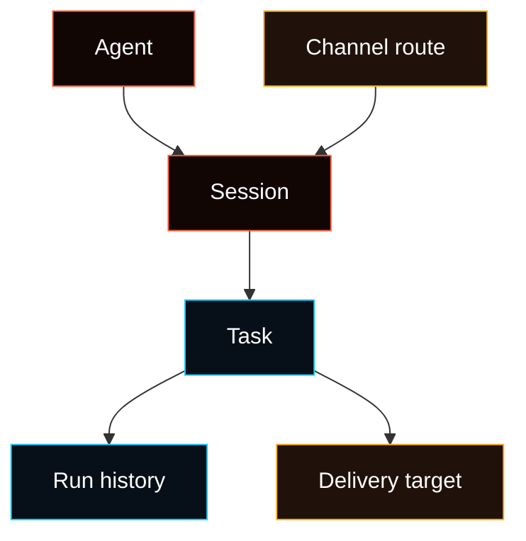

# Agents, Sessions, And Tasks

This page defines the product vocabulary for Fased work.

The short rule:



Channels do not own work. Channels are transport and delivery surfaces. Work is
owned by Agents and Sessions. Saved Task definitions are the control surface;
run history is audit data.

For task policy and execution behavior, read
[Task Operating Layer](/concepts/task-operating-layer). For the current release
boundary, read [Tasks v1 Freeze](/concepts/tasks-v1-freeze).

## Core objects

- **Agent** owns identity, workspace, model choices, skills, memory namespace,
  wallet policy, channel permissions, and task permissions.
  Boundary: another Agent's private memory and the channel transport itself.
- **Channel** owns a transport connection such as Telegram, Discord, Slack,
  WhatsApp, WebChat, or another chat surface.
  Boundary: task ownership, model choice, and private transcript state.
- **Route** maps channel/account/peer/thread traffic to an Agent/session.
  Boundary: execution and transcript storage.
- **Session** owns conversation or task context under one Agent.
  Boundary: global channel setup and provider credentials.
- **Task** owns scheduled, manual, webhook, channel, or event-triggered work
  under one Agent/session.
  Boundary: channel ownership and domain authority.
- **Helper Agent** is a temporary worker session or another configured Agent
  asked to help with part of a task.
  Boundary: durable ownership of the parent Agent's task.
- **Run history** records what happened.
  Boundary: saved task definition and control ownership.

## Agent

An Agent is the durable worker identity a user configures and trusts.

An Agent can have:

- workspace files
- model choices and task model roles
- provider auth profiles
- skills, services, tools, and memory
- wallet policy and approvals
- channel route permissions
- task definitions and sessions

Multiple Agents can run in one gateway. They should not silently share auth,
memory, sessions, or wallet policy unless the user configures that behavior.

Provider catalog data can be shared, but usable credentials resolve through the
selected Agent's auth profile path and fallback rules.

## Channel and route

A Channel is a transport/account connection.

Examples:

```text
Telegram bot account
Discord bot account
Slack app
WebChat local UI
WhatsApp account
```

A Route decides which Agent receives an inbound message:

```text
Telegram account A + peer 123 -> Research Agent
Discord #support -> Support Agent
WebChat local session -> Assistant
```

If a route has no explicit Agent binding, runtime may fall back to the default
Agent. UI should show that as fallback behavior, not as a real assignment.

## Session

A Session is the working context under one Agent.

Session history, token counts, model overrides, delivery hints, and transcript
metadata live with the session. Channel messages and WebChat messages are both
inputs into a session.

Current behavior:

- WebChat can create named local sessions.
- Channel sessions are created from transport shape: DM peer, group, thread,
  topic, or configured scope.
- `/new` and `/reset` start a fresh session id under the same session key.
- Channel chats can create and switch named sessions with `/session new`,
  `/session list`, and `/session switch`.
- WebChat and channel sessions can create scheduled tasks attached to the
  active Agent/session.

## Task

A Task is saved or event-triggered work attached to an Agent and Session.

A Task stores:

- owning Agent
- owning Session/session key
- trigger or schedule
- prompt or event payload
- execution policy
- optional delivery target

Delivery does not change ownership.

Correct model:

```text
Research Agent -> Service watch session -> hourly task -> deliver to Telegram peer
```

Incorrect model:

```text
Telegram owns the hourly task
```

UI implications:

- **Agent > Tasks** creates and manages saved definitions for the selected
  Agent: Tasks, Triggers, Workflows, Graphs, Programs, and Templates.
- **Agent > Sessions** shows sessions and task contexts for that Agent.
- **Agent > Channels** assigns routes and delivery permissions; it does not own
  tasks.
- Chat and channel commands can create tasks, but the created task is still
  owned by the active Agent/session.
- Domain pages remain control owners. Wallets approves/signs, Marketplace owns
  order review, Mining owns start/stop and cycle controls, Channels owns
  routing, and Services owns service setup.
- Wallet, Marketplace, and Mining records may appear in run history, but they
  are not saved Task definitions.

## Helper Agents and coordination

A helper Agent is either a temporary subagent session or another configured
Agent asked to help with part of a task.

Example:

```text
Research Agent / Service watch session
  -> helper Agent session
  -> helper researches one part
  -> result returns to the parent task
```

Helper Agents are useful for parallel work, isolation, review, and temporary
delegation. They should inherit clear policy from the parent Agent unless
explicitly configured otherwise.

Local multi-Agent collaboration is explicit:

- one Agent sends a message to another Agent session
- one Agent asks another Agent to review or continue a task
- one Agent spawns a helper/subagent run
- parent task receives the evidence and final result

Cross-Agent access requires policy. Helper Agents do not bypass wallet, mining,
marketplace, tool, service, memory, or delivery rules.

## Future network task rooms

Cross-node task rooms are a later Fased Network layer. They should reuse the
same ownership model instead of creating a separate task system:

```text
Local Agent/Session task
  -> A2A task envelope
  -> remote Agent/Session execution
  -> result/artifact/status
  -> local Agent/Session delivery
```

Network task rooms should carry explicit task ids, participants, status,
artifact refs, and shared context. They should not merge private transcripts or
private memory by default.

## UI direction

Build UI around ownership:

| Surface  | Role                                                                       |
| -------- | -------------------------------------------------------------------------- |
| Chat     | Operator surface into one Agent/session.                                   |
| Channels | Connect transports and assign routes to Agents.                            |
| Sessions | Inspect and manage conversations/task contexts.                            |
| Tasks    | Create, schedule, pause, run, delete, and inspect Agent-owned definitions. |
| Agents   | Configure durable worker identities and policies.                          |
| Network  | Discover nodes and inspect remote work when that feature is enabled.       |

Normal setup should start in the selected Agent. Global views can exist for
diagnostics, but they should not hide which Agent owns the work.

## Command layer

Channel commands mirror WebChat controls without adding a second task system.
This page shows the ownership shape, not the full command reference.

```text
/agent list
/agent switch Assistant
/session new Service watch
/session list
/session switch Service watch
/task new every 1h Service watch: Check provider status with a cheap check first and escalate if needed.
/task list
/task show <id>
/task run <id>
/task runs <id>
/task last <id>
```

Task edit, pause/resume, cancel, retry, repair, approval, and run-inspection
commands operate on the same scheduler-backed task schema as the browser UI.
Use the task docs for full syntax.

## Guardrails

- Keep task ownership in Agent/session state, not Channel setup.
- Treat Channel assignment as routing and delivery, not shared model/provider
  state.
- Present helper/subagent sessions as work helpers, not channel identities.
- Use fan-out only when it is an explicit routed-task feature.
- Keep future network task-room state separate from local private transcript
  state.
- Require policy, budget, and delivery controls before cross-Agent or
  cross-node sharing.

## Related docs

- [Task Operating Layer](/concepts/task-operating-layer)
- [Tasks v1 Freeze](/concepts/tasks-v1-freeze)
- [Task UI Standard](/concepts/task-ui-standard)
- [Session Management](/concepts/session)
- [Session Tools](/concepts/session-tool)
- [Multi-Agent Routing](/concepts/multi-agent)
