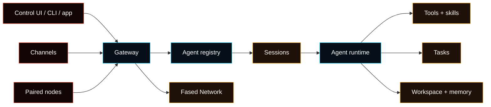
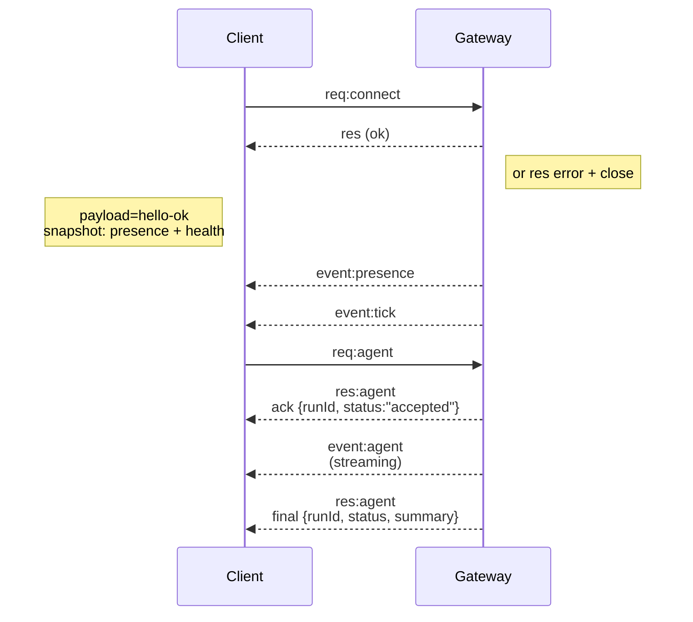

# Gateway architecture

## Overview

- A long-lived **Gateway** owns configured messaging channels and runtime
  control surfaces: WhatsApp via Baileys, Telegram via grammY, Slack, Discord,
  Signal, iMessage, WebChat, Control UI, CLI, and app clients.
- Control-plane clients connect to the Gateway over **WebSocket** on the
  configured bind host and port (default
  `127.0.0.1:18789`).
- **Nodes** (macOS/iOS/Android/headless) also connect over **WebSocket**, but
  declare `role: node` with explicit caps/commands.
- Normally run one Gateway per profile/port. Multiple Gateways require separate
  ports, state, and channel credentials.
- When enabled, the **canvas host** is mounted by the Gateway HTTP server under:
  - `/__fased__/canvas/` (agent-editable HTML/CSS/JS)
  - `/__fased__/a2ui/` (A2UI host)
    It normally uses the same Gateway port.

## Architecture map



The Gateway is the control plane. Agents own work identity and policy. Sessions,
Tasks, tools, skills, memory, channels, and nodes attach through that selected
Agent instead of becoming separate product owners.

## Components and flows

### Gateway (daemon)

- Maintains configured channel connections and runtime services.
- Exposes a typed WS API (requests, responses, server-push events).
- Validates inbound frames against JSON Schema.
- Emits events like `agent`, `chat`, `presence`, `health`, `heartbeat`, and task scheduler events.

### Clients (mac app / CLI / Control UI)

- One WS connection per client.
- Send requests such as `health`, `status`, `agent`, `chat.send`, and
  `system-presence`.
- Subscribe to events (`tick`, `agent`, `presence`, `shutdown`).

### Nodes (macOS / iOS / Android / headless)

- Connect to the **same WS server** with `role: node`.
- Provide a device identity in `connect`; pairing is **device-based** (role `node`) and
  approval lives in the device pairing store.
- Expose commands such as `canvas.*`, `camera.*`, `screen.record`, and
  `location.get` when the paired node advertises those capabilities.

Protocol details:

- [Gateway protocol](/gateway/protocol)

### WebChat

- Static UI that uses the Gateway WS API for chat history and sends.
- In remote setups, connects through the same SSH/Tailscale tunnel as other
  clients.

## Connection lifecycle (single client)



## Wire protocol (summary)

- Transport: WebSocket, text frames with JSON payloads.
- First frame **must** be `connect`.
- After handshake:
  - Requests: `{type:"req", id, method, params}` -> `{type:"res", id, ok, payload|error}`
  - Events: `{type:"event", event, payload, seq?, stateVersion?}`
- If `FASED_GATEWAY_TOKEN` (or `--token`) is set, `connect.params.auth.token`
  must match or the socket closes.
- Side-effecting methods such as `agent`, `chat.send`, and `send` use
  idempotency keys where the method schema requires them; the server keeps a
  short-lived dedupe cache.
- Nodes must include `role: "node"` plus caps/commands/permissions in `connect`.

## Pairing + local trust

- Modern WS clients (operators + nodes) include a **device identity** on
  `connect`.
- New device IDs require pairing approval; the Gateway issues a **device token**
  for subsequent connects.
- **Local** connects (loopback or the gateway host's own tailnet address) can be
  auto-approved to keep same-host UX smooth.
- Modern clients sign the `connect.challenge` nonce.
- Signature payload `v3` also binds `platform` + `deviceFamily`; the gateway
  pins paired metadata on reconnect and requires repair pairing for metadata
  changes.
- **Non-local** connects still require explicit approval.
- Gateway auth (`gateway.auth.*`) still applies to **all** connections, local or
  remote.

Details: [Gateway protocol](/gateway/protocol), [Pairing](/channels/pairing),
[Security](/gateway/security).

## Protocol typing and codegen

- TypeBox schemas define the protocol.
- JSON Schema is generated from those schemas.
- Swift models are generated from the JSON Schema.

## Remote access

- Preferred: Tailscale or VPN.
- Alternative: SSH tunnel

  ```bash
  ssh -N -L 18789:127.0.0.1:18789 user@host
  ```

- The same handshake + auth token apply over the tunnel.
- TLS + optional pinning can be enabled for WS in remote setups.

## Operations snapshot

- Start: `fased gateway` (foreground, logs to stdout).
- Health: `health` over WS (also included in `hello-ok`).
- Supervision: launchd/systemd for auto-restart.

## Invariants

- A linked WhatsApp account should be controlled by only one running Gateway
  process at a time.
- Handshake is mandatory; any non-JSON or non-connect first frame is a hard close.
- Events are not replayed; clients must refresh on gaps.
