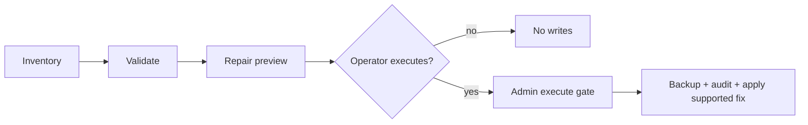

# Memory Doctor

Memory Doctor inspects an Agent workspace, validates memory artifacts, and
builds dry-run repair proposals for simple memory setup problems.

The normal diagnostic flow is read-only. File writes happen only through a
separate operator-admin execute path.

## What It Checks

Memory Doctor can report:

- missing `MEMORY.md`, `memory.md`, or `memory/` roots
- unreadable, symlinked, or wrong-kind memory paths
- QMD index, collection, and session export path state
- session-memory hook state and filename diagnostics
- memory backend/provider health
- selected memory plugin state

It does not read transcript bodies during diagnostic preview.

## Surfaces

CLI:

```bash
fased memory doctor
fased memory doctor --agent main
fased memory doctor --json
fased memory repair execute --proposal-id <id> --yes
fased memory repair execute --proposal-id memory-repair-preview-1 --yes
```

Control UI:

- Open **Advanced > Debug**.
- Review the **Memory Repair Preview** card.

## Live Surface Inventory

Gateway RPC:

| RPC                            | Scope            | Purpose                                                 |
| ------------------------------ | ---------------- | ------------------------------------------------------- |
| `doctor.memory.status`         | `operator.read`  | Memory backend/provider status.                         |
| `doctor.memory.inventory`      | `operator.read`  | Workspace roots, index paths, plugin state, and counts. |
| `doctor.memory.validate`       | `operator.read`  | Validation findings from inventory.                     |
| `doctor.memory.repair.preview` | `operator.read`  | Dry-run repair proposals.                               |
| `doctor.memory.repair.execute` | `operator.admin` | Execute selected supported proposals.                   |
| `doctor.memory.wiki.status`    | `operator.read`  | Memory Wiki export status.                              |
| `doctor.memory.wiki.rebuild`   | `operator.admin` | Rebuild Memory Wiki export.                             |

The internal preflight contracts are still not separate live surfaces.
Closed legacy dreaming/reset/backfill RPC names and standalone preflight RPCs
are not listed by the gateway, not classified for scopes, and not handled by
the core gateway handler map.

`doctor.memory.repair.execute` and `doctor.memory.wiki.rebuild` are the only
live write-capable Memory Doctor RPCs. Both require `operator.admin`.

## Diagnostic Flow



## Preview Contract

`doctor.memory.repair.preview` returns a small read-only envelope:

- `agentId`
- `dryRun`
- `ok`
- `validation`
- `summary`
- `proposals`

Proposal rows include:

- `id`
- `area`
- `sourceCode`
- `severity`
- `action`
- `description`
- optional `targetPath` for path-based proposals
- `dryRun`
- `wouldMutate`
- `requiresOperatorWrite`
- `supported`
- optional `blockReason`

The dashboard redacts rendered target paths to basename labels such as
`[path:MEMORY.md]`. The raw diagnostic payload may include target paths that are
inside the configured workspace or state roots; paths outside those roots are
redacted before validation.

The preview payload must not include executable fields such as a route, URL,
request params, handler, token, backup path, audit path, or rollback path.
`action` is a preview category, not a command.

## Execute Boundary

`doctor.memory.repair.execute` is deliberately narrow:

- requires `operator.admin`
- requires `confirm="EXECUTE_MEMORY_REPAIR"` over RPC or `--yes` from CLI
- accepts selected proposal ids
- checks the accepted preview and audit-plan fingerprints, or explicitly accepts
  the current preview and audit plan
- applies only supported file/directory creation proposals implemented by the
  write executor
- writes backup, audit, rollback, lock, and result metadata before applying
  changes

The current write executor implements `create_file` and `create_directory`.
Other preview actions stay review-only or are denied before a filesystem write.

Repair execution is not exposed through plugin, channel, cron, ACP, MCP, or
generic tool surfaces.

Not exposed:

- generic repair dispatcher
- legacy dreaming reset/backfill repair RPCs
- standalone preflight RPCs
- transcript-body repair passes

## CLI And Debug Behavior

`fased memory doctor --json` emits the same diagnostic report shape as the RPC
flow. It is suitable for scripts because it contains inventory, validation, and
preview metadata only.
The JSON report is tested as including inventory and validation sections.
The tested contract says each report contains only `agentId`, `inventory`,
`validation`, and `repairPreview`.
The preview schema test snapshots the full JSON envelope shape.

Advanced > Debug renders paths as redacted basename labels such as
`[path:MEMORY.md]` and routes execution only through
`doctor.memory.repair.execute`.

## Regression Coverage

Focused tests lock the boundary:

- `src/memory/repair-readonly-surface-inventory.test.ts` verifies the live RPC
  inventory, the closed preflight/dreaming names, the doc inventory, and that
  read-only surfaces stay read-only.
- `src/memory/memory-doctor-readonly-test-helpers.ts` and
  `src/memory/memory-doctor-readonly-test-helpers.test.ts` keep the
  forbidden-field, JSON-shape, shape merger, or transcript/body checks shared
  across memory doctor tests.
- `src/memory/repair-preview-schema-snapshot.test.ts` snapshots the full JSON
  envelope shape and rejects executable fields.
- `src/memory/repair-preview-redaction-regression.test.ts` verifies preview
  generation does not copy transcript/body text.
- `src/cli/memory-cli.test.ts` verifies CLI `doctor --json`, including
  inventory and validation sections. It verifies this contract: each report contains only
  `agentId`, `inventory`, `validation`, and `repairPreview`; it also verifies
  repair execution requires `--yes`.
- `ui/src/ui/controllers/debug.test.ts` strips unsafe transcript/body or
  executable fields before state storage.
- `ui/src/ui/views/debug.test.ts` snapshots the visible gated-execute dashboard
  copy and redacted path rendering.

## Related

- [Memory](/concepts/memory)
- [`fased memory`](/cli/memory)
- [Debug](/debug/index)
- [Gateway protocol](/gateway/protocol)
