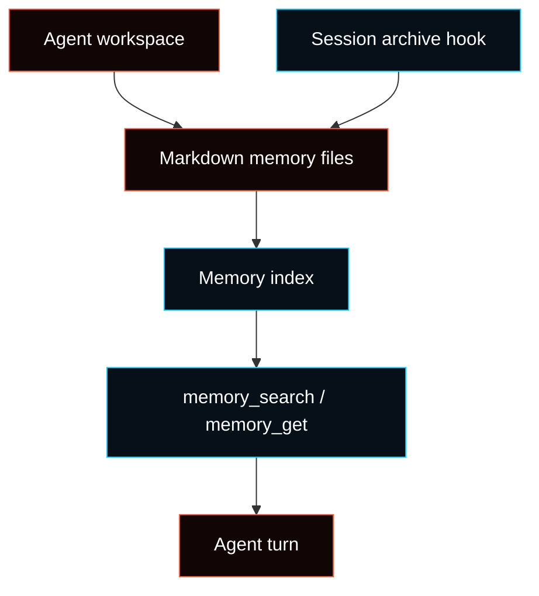

# Memory

Fased memory is workspace-owned Markdown plus optional search indexes. The
Markdown files are the durable source of truth; search backends only help the
Agent retrieve relevant snippets.



## Layers

| Layer                | Role                                                                   |
| -------------------- | ---------------------------------------------------------------------- |
| Agent workspace      | Each Agent has its own workspace path.                                 |
| Markdown files       | Durable memory such as `MEMORY.md` and Markdown files under `memory/`. |
| Session archive hook | Optional hook that writes session artifacts on `/new` or `/reset`.     |
| Memory plugin        | Usually `memory-core`; exposes memory tools to the Agent.              |
| Search backend       | Builtin SQLite full-text/embedding index, or optional QMD sidecar.     |

The global Memory page is diagnostic. Agent-owned archive controls live in
**Agent > Memory**.

## What gets recorded

Memory is recorded only when something writes it:

- the user asks the Agent to remember something
- the Agent writes to `MEMORY.md` or a Markdown file under `memory/`
- the `session-memory` hook archives a session on `/new` or `/reset`
- a pre-compaction flush asks the model to store durable notes
- a human edits workspace Markdown files

If no memory file exists, there is nothing to recall yet. An enabled archive
hook with zero files usually means no later `/new` or `/reset` has written an
archive.

Memory is not a secret store. Keep API keys, credentials, and private runtime
settings in configuration or the OS secret store, not in `MEMORY.md`.

## How memory is read

Fased does not inject every memory file into every prompt.

- `MEMORY.md` and other bootstrap files may be loaded at session start, within
  bootstrap limits.
- Markdown files under `memory/` are normally retrieved on demand.
- `memory_search` returns snippets with source paths and line ranges.
- `memory_get` reads a specific allowed memory file or range.

This keeps normal turns smaller while still making memory available when the
Agent needs it.

## Task memory

Tasks use the owning Agent's memory policy.

| Scope             | Behavior                                                                          |
| ----------------- | --------------------------------------------------------------------------------- |
| `none`            | Prior transcript context is omitted; memory/session-history tools are hidden.     |
| `session-summary` | Compact session context only; memory/session-history tools are hidden.            |
| `pinned`          | Direct or pinned memory only; broad memory search and session history are hidden. |
| `search`          | Memory search and direct memory reads can be available when policy allows.        |
| `agent`           | Use the Agent's normal memory policy.                                             |

No-model and deterministic skill-only tasks usually do not need memory. Task run
history records requested and effective memory scope.

## File layout

Default workspace layout:

```text
~/.fased/workspace/
├── MEMORY.md
└── memory/
    └── YYYY-MM-DD-HHMM.md
```

Recommended use:

- `MEMORY.md`: curated durable facts, preferences, and decisions.
- `memory/*.md`: archived session summaries, daily notes, and running context.

See [Agent workspace](/concepts/agent-workspace) for workspace layout.

## Memory Doctor

Use Memory Doctor to inspect readiness before changing files:

```bash
fased memory doctor
fased memory doctor --json
```

Memory Doctor reports workspace roots, backend state, session-memory paths,
plugin state, validation findings, and dry-run repair proposals. Agent memory
also has a read-only Memory Wiki export for reviewing the current Markdown
memory surface without changing files.

Detailed reference: [Memory Doctor](/concepts/memory-doctor).

## Search backends

The default backend indexes Markdown files and can use vector search when an
embedding provider is configured.

Optional QMD mode uses a local sidecar:

```json5
{
  memory: {
    backend: "qmd",
  },
}
```

Use QMD only when you want the sidecar's local-first search behavior and are
comfortable installing its runtime dependencies.

For field-by-field configuration, see
[Memory Config Reference](/reference/memory-config).

## Vector search

Vector search lets natural-language queries find related notes even when wording
differs.

Supported provider modes include:

- `auto`
- `openai` with optional OpenAI-compatible `remote.baseUrl`
- `gemini`
- `voyage`
- `mistral`
- `ollama`
- `local`

Remote embedding providers require their own API keys. OpenAI chat sign-in does
not automatically configure embeddings.

Local mode may need native build approval for `node-llama-cpp` and a local GGUF
model path or supported `hf:` model URI.

## Session transcript search

Session transcript indexing is optional and experimental. When enabled, Fased
can index sanitized session transcript snippets for the same Agent.

Important boundaries:

- off by default
- indexed asynchronously
- isolated per Agent
- snippets only; `memory_get` remains limited to memory files
- disk access remains the trust boundary

## When to write memory

Write memory when information should survive the current context window:

- durable preferences
- decisions
- stable project facts
- recurring workflow notes
- names, routes, and constraints the Agent should remember

Do not use memory as a dump for every message. For short-lived context, keep it
in the session.

## Related docs

- [Agent workspace](/concepts/agent-workspace)
- [Memory Doctor](/concepts/memory-doctor)
- [Memory Config Reference](/reference/memory-config)
- [Session management and compaction](/reference/session-management-compaction)
