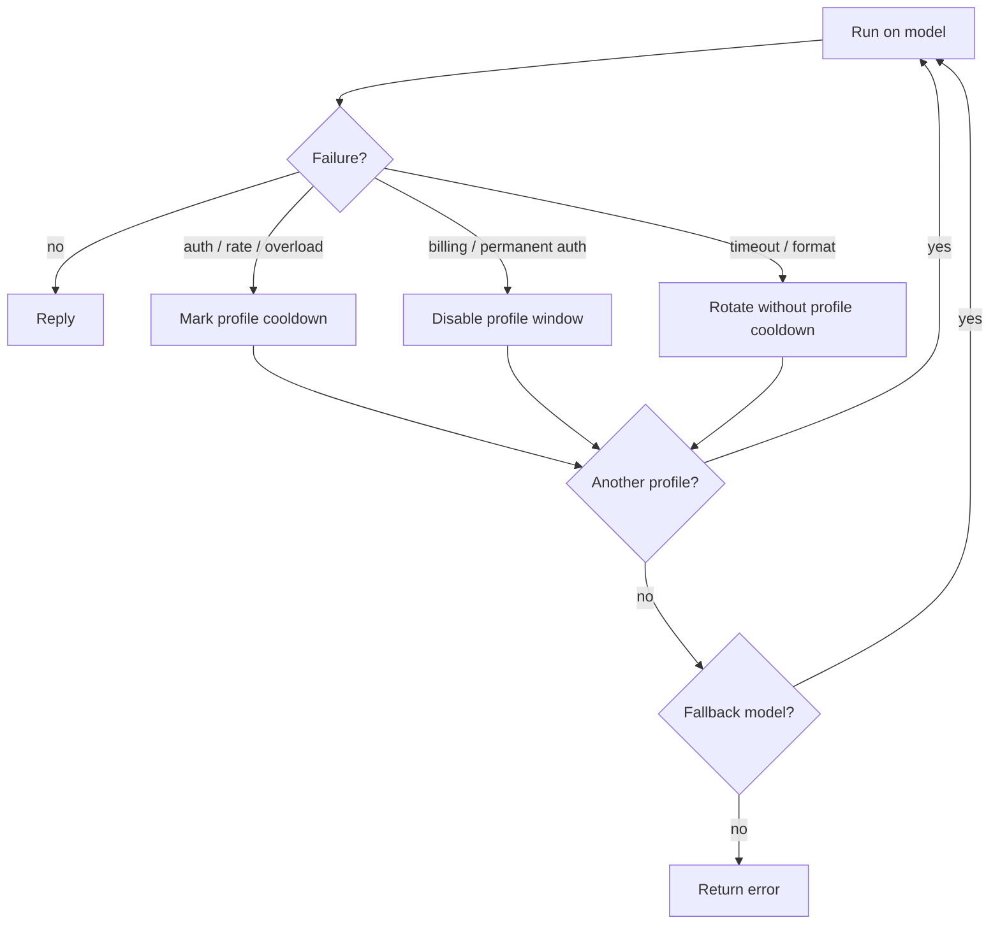

# Model failover

Fased handles failures in two stages:

1. **Auth profile rotation** within the current provider.
2. **Model fallback** to the next model in `agents.defaults.model.fallbacks`.

This doc explains the runtime rules and the data that backs them.

## Auth storage (keys + OAuth)

Fased uses auth profiles for API keys, provider tokens, and OAuth credentials.

- Secrets live in `~/.fased/agents/<agentId>/agent/auth-profiles.json` (legacy: `~/.fased/agent/auth-profiles.json`).
- Config `auth.profiles` / `auth.order` are **metadata + routing only** (no secrets).
- Legacy import-only OAuth file: `~/.fased/credentials/oauth.json` (imported into `auth-profiles.json` on first use).

More detail: [/concepts/oauth](/concepts/oauth)

Credential types:

- `type: "api_key"` -> `{ provider, key }`
- `type: "token"` -> `{ provider, token, expires? }`
- `type: "oauth"` -> `{ provider, access, refresh, expires, email? }` (+ `projectId`/`enterpriseUrl` for some providers)

## Profile IDs

OAuth logins create distinct profiles so multiple accounts can coexist.

- Default: `provider:default` when no email is available.
- OAuth with email: `provider:<email>` (for example `anthropic:user@example.com`).

Profiles live in `~/.fased/agents/<agentId>/agent/auth-profiles.json` under `profiles`.

## Rotation order

When a provider has multiple profiles, Fased chooses an order like this:

1. **Explicit config**: `auth.order[provider]` (if set).
2. **Configured profiles**: `auth.profiles` filtered by provider.
3. **Stored profiles**: entries in `auth-profiles.json` for the provider.

If no explicit order is configured, Fased uses a round-robin order:

- **Primary key:** profile type (**OAuth**, then **token**, then **API key**).
- **Secondary key:** `usageStats.lastUsed` (oldest first, within each type).
- **Cooldown/disabled profiles** are moved to the end, ordered by soonest expiry.

### Session stickiness (cache-friendly)

Fased pins the chosen auth profile per session to keep provider caches warm.
It does **not** rotate on every request. The pinned profile is reused until:

- the session is reset (`/new` / `/reset`)
- a compaction completes (compaction count increments)
- the profile is in cooldown/disabled

Manual selection via `/model ...@<profileId>` sets a **user override** for that session
and is not auto-rotated until a new session starts.

Auto-pinned profiles (selected by the session router) are treated as a **preference**:
they are tried first, but Fased may rotate to another profile on rate limits or timeouts.
User-pinned profiles stay locked to that profile; if it fails and model fallbacks
are configured, Fased moves to the next model instead of switching profiles.

### Why OAuth can "look lost"

If you have both an OAuth profile and an API key profile for the same provider,
round-robin can switch between them across messages unless pinned. To force a
single profile:

- Pin with `auth.order[provider] = ["provider:profileId"]`, or
- Use a per-session override via `/model ...` with a profile override (when
  supported by your UI/chat surface).

## Cooldowns

When a profile fails due to auth, rate-limit, overload, model-not-found, or
session-expired errors, Fased records that profile in cooldown and moves to the
next usable profile.

Timeout and provider format errors can still trigger profile rotation or model
fallback for the current run, but Fased does **not** mark the auth profile in
cooldown for those reasons. A timeout is model/network-specific, and a format
error is usually request-shape specific; marking the credential would block
other valid model routes on the same provider.

OpenRouter profiles intentionally bypass auth-profile cooldown tracking because
OpenRouter is itself a multi-provider router. Fallback and runtime errors still
surface normally.

Cooldowns use exponential backoff:

- 1 minute
- 5 minutes
- 25 minutes
- 1 hour (cap)

State is stored in `auth-profiles.json` under `usageStats`:

```json
{
  "usageStats": {
    "provider:profile": {
      "lastUsed": 1736160000000,
      "cooldownUntil": 1736160600000,
      "errorCount": 2
    }
  }
}
```

## Billing disables

Billing or credit failures are treated as failover-worthy, but they are usually
not transient. Instead of a short cooldown, Fased marks the profile as disabled
with a longer backoff and rotates to the next profile or provider.

State is stored in `auth-profiles.json`:

```json
{
  "usageStats": {
    "provider:profile": {
      "disabledUntil": 1736178000000,
      "disabledReason": "billing"
    }
  }
}
```

Defaults:

- Billing backoff starts at **5 hours**, doubles per billing failure, and caps at **24 hours**.
- Backoff counters reset if the profile hasn't failed for **24 hours** (configurable).

## Model fallback

If all profiles for a provider fail, Fased moves to the next model in
`agents.defaults.model.fallbacks`. This applies to failover-worthy errors such
as auth failures, rate limits, billing disables, overload, model-not-found,
format errors, and timeouts after the current route has no usable profile left.
Other application errors do not advance fallback.

When a run starts with a model override (hooks or CLI), fallbacks still end at
`agents.defaults.model.primary` after trying any configured fallbacks.



## Related config

See [Gateway configuration](/gateway/configuration) for:

- `auth.profiles` / `auth.order`
- `auth.cooldowns.billingBackoffHours` / `auth.cooldowns.billingBackoffHoursByProvider`
- `auth.cooldowns.billingMaxHours` / `auth.cooldowns.failureWindowHours`
- `agents.defaults.model.primary` / `agents.defaults.model.fallbacks`
- `agents.defaults.imageModel` routing

See [Models](/concepts/models) for the broader model selection and fallback overview.
