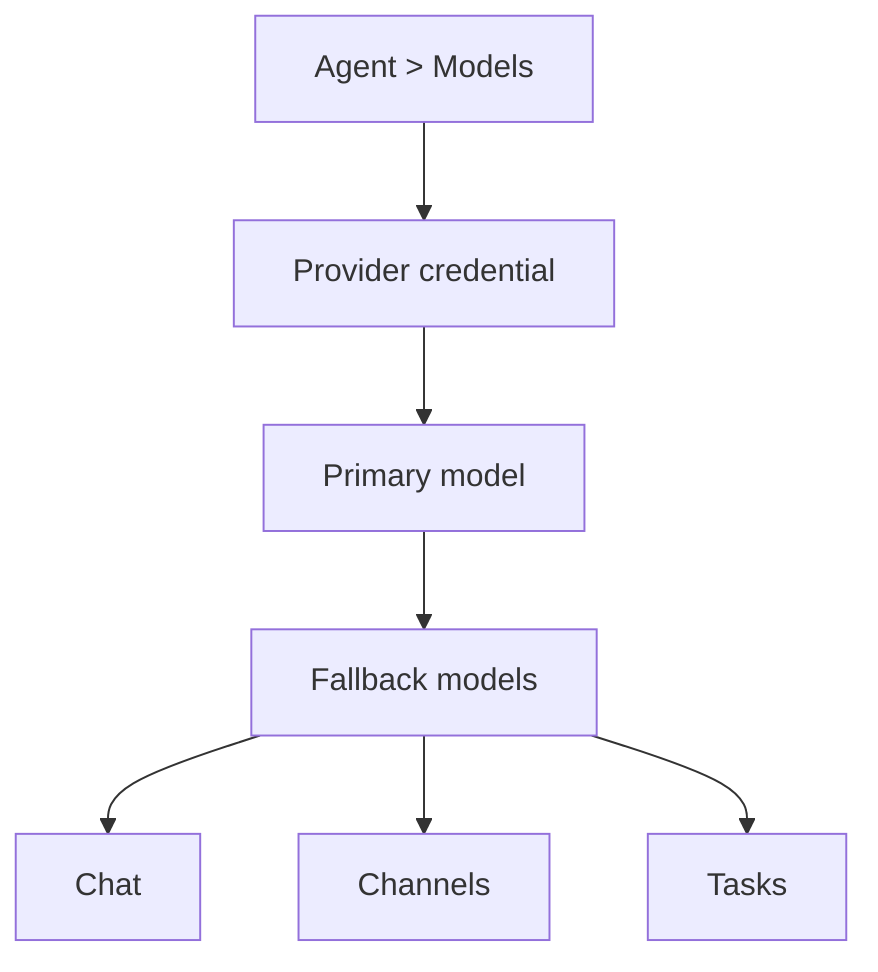

# Model Providers

This page covers model providers, not chat channels like Telegram, Discord, or
WhatsApp. For model selection rules, see [/concepts/models](/concepts/models).

## One provider registry

Normal setup uses one Fased provider registry. Onboarding, CLI, **Agent > Models**,
Chat, and channel-routed Agents use the same list:

- same provider order
- same provider names
- same auth methods
- same route-compatible model lists
- same capability metadata

Old upstream/runtime providers are compatibility inputs only. They should not
appear as normal first-run choices unless they are added to the Fased provider
registry below.

## Current Provider Order

Signed-in providers can float to the top of Agent > Models provider controls,
but the default ordering is:

| Order | Provider        | Normal setup methods                                           |
| ----- | --------------- | -------------------------------------------------------------- |
| 1     | OpenAI          | Sign in, API key                                               |
| 2     | Anthropic       | Sign in, Token, API key                                        |
| 3     | Chutes          | Sign in, API key                                               |
| 4     | Ollama          | Native URL and model                                           |
| 5     | LM Studio       | Local URL, optional token, and model key                       |
| 6     | vLLM            | Custom URL and model                                           |
| 7     | MiniMax         | Sign in, API key, API key CN, Highspeed API key                |
| 8     | Moonshot AI     | Kimi API key, Kimi CN API key, Kimi Code API key               |
| 9     | Google          | Gemini API key, Sign in                                        |
| 10    | xAI             | API key                                                        |
| 11    | Mistral AI      | API key                                                        |
| 12    | Volcano Engine  | API key                                                        |
| 13    | BytePlus        | API key                                                        |
| 14    | OpenRouter      | API key                                                        |
| 15    | Qwen            | Coding Plan API key, DashScope API key                         |
| 16    | Z.AI            | Coding Plan Global, Coding Plan CN, Global API key, CN API key |
| 17    | Qianfan         | API key                                                        |
| 18    | Copilot         | GitHub sign in, Proxy sign in                                  |
| 19    | Vercel AI       | API key                                                        |
| 20    | OpenCode Zen    | API key                                                        |
| 21    | Xiaomi          | API key                                                        |
| 22    | Synthetic       | API key                                                        |
| 23    | Together AI     | API key                                                        |
| 24    | Hugging Face    | Token                                                          |
| 25    | Venice AI       | API key                                                        |
| 26    | LiteLLM         | API key plus base URL when needed                              |
| 27    | Cloudflare AI   | API key plus gateway route                                     |
| 28    | Custom Provider | Base URL, model id, and optional key                           |

Qwen portal sign-in is not a normal setup method. Use Coding Plan or DashScope
API keys.

## Normal setup path

Use this path after onboarding:

1. **Agent > Models**: add a provider credential, sign in, paste an API key/token, or
   configure a local/manual endpoint.
2. In the same Agent > Models tab, choose that Agent's primary, fallback, and task
   model refs.
3. `/chat`: talk to the selected Agent. The model picker can override the model
   for the current chat session when the selected provider route is usable.
4. **Agent > Channels**: connect apps such as Telegram or Discord and route each
   account/topic/guild to the selected Agent.

The Agent owns model defaults, skills, services, saved context, chat app
routes, tasks, and wallet controls. Browser chat and connected chat apps both
talk to an Agent; they are different delivery surfaces for the same setup.



## Model Metadata

Each recommended model should have capability metadata. The UI uses this data
to decide what to show in Chat:

- context window
- max output tokens
- input modes such as text or image
- output modes such as text, audio, speech, or video when known
- tool support
- JSON support
- thinking/reasoning mode
- supported thinking levels
- default thinking level
- private-network or manual setup requirements
- auth mode hints

Some providers expose this cleanly from their model catalogs. Others do not.
For local/manual providers, metadata can be curated or user-supplied. Unknown
metadata must stay explicit; the UI should not pretend a model supports
thinking, tools, images, speech, or video when the registry does not know.

## Provider Registry Refresh

Fased owns the normal setup provider manifest instead of blindly showing every
model returned by an upstream runtime catalog:

```bash
fased providers refresh
fased providers refresh --write-review
fased providers refresh --wizard
fased providers refresh --no-network
```

The refresh is review-first. It reports new models, source-missing routes, and
capability changes. It must not silently delete curated models or break existing
Agent configs.

Apply only after review:

```bash
fased providers refresh --apply
```

Manual model edits are separate from live refresh:

```bash
fased providers models list
fased providers models list --provider custom

fased providers models add \
  --provider custom \
  --model my-local-model \
  --base-url http://127.0.0.1:8000/v1 \
  --api openai-completions \
  --context-window 128000 \
  --max-tokens 4096 \
  --reasoning \
  --tools \
  --json

fased providers models remove --provider custom --model my-local-model
```

`providers models add/remove` edits configured provider entries for the current
installation. `providers refresh` updates the shared curated registry only after
review or explicit apply.

The Dashboard, Chat, Agent defaults, and ordinary `models.list` requests use
that reviewed catalog. SDK-discovered historical models are available only to
advanced/debug callers through `models.list` with `all: true`. Dynamic local
providers and explicitly configured custom models remain selectable because
their catalog belongs to the operator's own endpoint.

## Local Models

Use one of the registry-supported local/manual routes:

- **Ollama**: local, tailnet, or Ollama Cloud setup with the native `/api/chat`
  path.
- **LM Studio**: local model discovery from LM Studio, usually on
  `localhost:1234`.
- **vLLM**: a vLLM server exposed as a first-class local provider.
- **LiteLLM**: multiple models routed through a LiteLLM gateway.
- **Cloudflare AI**: Cloudflare AI Gateway routing.
- **Custom Provider**: another OpenAI-compatible or Anthropic-compatible
  endpoint, including SGLang.

Ollama is native in Fased. Use `http://127.0.0.1:11434`, not `/v1`. LM Studio is
OpenAI-compatible and normally uses `http://127.0.0.1:1234/v1`. SGLang stays
under **Custom Provider** or vLLM-compatible setup unless Fased adds a dedicated
provider card later.

## Credential rotation

For normal use, add multiple credentials as auth profiles in **Agent > Models**
or with the models auth CLI. Fased orders those profiles, skips profiles in
cooldown, and rotates only for failover-worthy provider errors. See
[/concepts/model-failover](/concepts/model-failover).

Single environment variables such as `OPENAI_API_KEY`, `ANTHROPIC_API_KEY`, and
provider-specific API key variables can still back a credential or compatibility
provider config. They are not the preferred way to manage multiple user-facing
profiles.

## Advanced Compatibility

Raw config may still contain legacy runtime providers or provider adapters for
existing installations. That compatibility layer is not the normal setup path.
For normal users, use Agent > Models, Chat, and Agent > Channels with the current
provider registry above.
