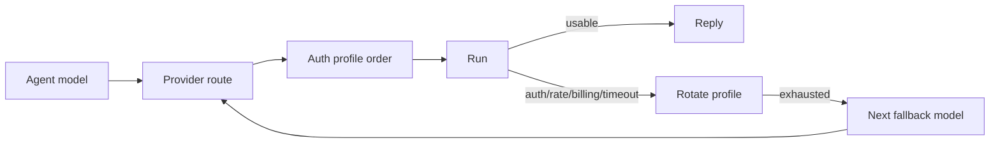

# Models

See [/concepts/model-failover](/concepts/model-failover) for auth profile
rotation, cooldowns, and how that interacts with fallbacks.
Quick provider overview + examples: [/concepts/model-providers](/concepts/model-providers).

## How model selection works

Fased resolves a run in this order:

1. **Primary model** from the selected Agent (`agents.defaults.model.primary`
   or `agents.defaults.model`).
2. **Auth profile rotation** inside that model's provider, when more than one
   usable profile exists.
3. **Fallback models** in `agents.defaults.model.fallbacks`, in order, after
   the current provider route is exhausted for a failover-worthy error.



Related:

- `agents.defaults.models` is the allowlist or catalog of models Fased can use, plus aliases.
- `agents.defaults.imageModel` is used **only when** the primary model can't accept images.
- Per-agent defaults can override `agents.defaults.model` via `agents.list[].model` plus bindings (see [/concepts/multi-agent](/concepts/multi-agent)).

## Choosing a model

Choose by capability, latency, cost, and provider reliability for the Agent's
actual job. For example:

- Tool-heavy Agents need a model with reliable tool calling.
- Image input requires a model with image input metadata, or an image fallback.
- Long sessions need enough context window and stable compaction behavior.
- Public channel Agents should use models and fallbacks you are willing to run unattended.

## Setup wizard and UI setup

If you don't want to hand-edit config, run the onboarding wizard:

```bash
fased onboard
```

It can set up model + auth for common providers. OpenAI is presented as one
brand with two methods: **OpenAI API key** (`openai/*`) and **OpenAI sign-in**
through the OpenAI Codex provider route. Anthropic supports API key, OAuth, and
`claude setup-token`.

Normal setup surfaces show Fased's curated current model list. Legacy,
route-incompatible, or retired upstream model IDs are hidden from normal setup
even if an upstream runtime catalog still reports them.

After onboarding, use **Agent > Models** to connect provider credentials and set
the selected Agent's primary, fallback, and task model refs. The Chat model
picker is a session override; clearing it returns the session to the Agent's
primary model.

## Config keys (overview)

- `agents.defaults.model.primary` and `agents.defaults.model.fallbacks`
- `agents.defaults.imageModel.primary` and `agents.defaults.imageModel.fallbacks`
- `agents.defaults.models` (allowlist + aliases + provider params)
- `models.providers` (custom providers written into `models.json`)

Model refs are normalized to lowercase. Provider aliases like `z.ai/*` normalize
to `zai/*`.

Provider configuration examples (including OpenCode Zen) live in
[/gateway/configuration](/gateway/configuration#opencode-zen-multi-model-proxy).

## "Model is not allowed" (and why replies stop)

If `agents.defaults.models` is set, it becomes the **allowlist** for `/model`,
Agent > Models, and session overrides. When a user selects a model that isn't
in that allowlist, Fased returns:

```
Model "provider/model" is not allowed. Use /model to list available models.
```

This happens **before** a normal reply is generated, so the message can feel
like it "didn't respond." The fix is to either:

- Add the model to `agents.defaults.models`, or
- Clear the allowlist (remove `agents.defaults.models`), or
- Pick a model from `/model list`.

Example allowlist config:

```json5
{
  agents: {
    defaults: {
      model: { primary: "anthropic/claude-sonnet-4-6" },
      models: {
        "anthropic/claude-sonnet-4-6": { alias: "Sonnet" },
        "anthropic/claude-opus-4-7": { alias: "Opus" },
      },
    },
  },
}
```

## Switching models in chat (`/model`)

You can switch models for the current session without restarting:

```
/model
/model list
/model 3
/model openai/gpt-5.5
/model status
```

Notes:

- `/model` (and `/model list`) is a compact, numbered picker (model family + available providers).
- On Discord, `/model` and `/models` open an interactive picker with provider and model dropdowns plus a Submit step.
- `/model <#>` selects from that picker.
- `/model status` is the detailed view (auth candidates and, when configured, provider endpoint `baseUrl` + `api` mode).
- Model refs are parsed by splitting on the **first** `/`. Use `provider/model` when typing `/model <ref>`.
- If the model ID itself contains `/` (OpenRouter-style), you must include the provider prefix (example: `/model openrouter/moonshotai/kimi-k2`).
- If you omit the provider, Fased treats the input as an alias or a model for the default provider, but only when there is no `/` in the model ID.

Full command behavior/config: [Slash commands](/tools/slash-commands).

## CLI commands

```bash
fased models list
fased models status
fased models set <provider/model>
fased models set-image <provider/model>

fased models aliases list
fased models aliases add <alias> <provider/model>
fased models aliases remove <alias>

fased models fallbacks list
fased models fallbacks add <provider/model>
fased models fallbacks remove <provider/model>
fased models fallbacks clear

fased models image-fallbacks list
fased models image-fallbacks add <provider/model>
fased models image-fallbacks remove <provider/model>
fased models image-fallbacks clear
```

`fased models` (no subcommand) is a shortcut for `models status`.

### `models list`

Shows configured models by default. Useful flags:

- `--all`: full catalog
- `--local`: local providers only
- `--provider <name>`: filter by provider
- `--plain`: one model per line
- `--json`: machine-readable output

The full catalog path is shared with onboarding, Agent > Models, and Chat. Matching
provider/model ids are merged in this order: configured `models.providers`,
runtime-discovered models, then Fased's bundled current-model overlay. Normal
setup pickers apply the provider registry after the merge, so old OpenAI API
models are not offered just because the upstream runtime catalog still reports
them.

### `models status`

Shows the resolved primary model, fallbacks, image model, and an auth overview
of configured providers. It also surfaces OAuth expiry status for profiles found
in the auth store (warns within 24h by default). `--plain` prints only the
resolved primary model.
OAuth status is always shown (and included in `--json` output). If a configured
provider has no credentials, `models status` prints a **Missing auth** section.
JSON includes `auth.oauth` (warn window + profiles) and `auth.providers`
(effective auth per provider).
Use `--check` for automation (exit `1` when missing/expired, `2` when expiring).

Preferred Anthropic auth is the Claude Code CLI setup-token (run anywhere; paste on the gateway host if needed):

```bash
claude setup-token
fased models status
```

## Scanning (OpenRouter free models)

`fased models scan` inspects OpenRouter's **free model catalog** and can
optionally probe models for tool and image support.

Key flags:

- `--no-probe`: skip live probes (metadata only)
- `--min-params <b>`: minimum parameter size (billions)
- `--max-age-days <days>`: skip older models
- `--provider <name>`: provider prefix filter
- `--max-candidates <n>`: fallback list size
- `--set-default`: set `agents.defaults.model.primary` to the first selection
- `--set-image`: set `agents.defaults.imageModel.primary` to the first image selection

Probing requires an OpenRouter API key (from auth profiles or
`OPENROUTER_API_KEY`). Without a key, use `--no-probe` to list candidates only.

Scan results are ranked by:

1. Image support
2. Tool latency
3. Context size
4. Parameter count

Input

- OpenRouter `/models` list (filter `:free`)
- Requires OpenRouter API key from auth profiles or `OPENROUTER_API_KEY` (see [/environment](/help/environment))
- Optional filters: `--max-age-days`, `--min-params`, `--provider`, `--max-candidates`
- Probe controls: `--timeout`, `--concurrency`

When run in a TTY, you can select fallbacks interactively. In non-interactive
mode, pass `--yes` to accept defaults.

## Models registry (`models.json`)

Custom providers in `models.providers` are written into `models.json` under the
agent directory (default `~/.fased/agents/<agentId>/models.json`). This file
is merged by default unless `models.mode` is set to `replace`.

Merge mode precedence for matching provider IDs:

- Non-empty `apiKey`/`baseUrl` already present in the agent `models.json` win.
- Empty or missing agent `apiKey`/`baseUrl` fall back to config `models.providers`.
- Other provider fields are refreshed from config and normalized catalog data.
