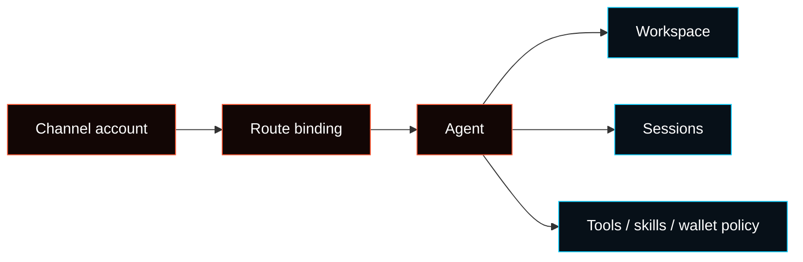

# Multi-Agent Routing

Multi-Agent Routing lets one gateway host more than one Agent while keeping
workspaces, auth profiles, sessions, model defaults, and policies separate.

Bindings route inbound messages to Agents. After routing, Sessions and Tasks own
the work context.



For the broader ownership model, see
[Agents, Sessions, And Tasks](/concepts/agents-sessions-tasks).

## What one Agent owns

An Agent is a scoped worker identity with its own:

- workspace files
- `agentDir`
- auth profiles
- session store
- model choices
- skill and tool policy
- wallet policy
- route/task permissions

Default paths:

| Item           | Default                              |
| -------------- | ------------------------------------ |
| Config         | `~/.fased/fased.json`                |
| State dir      | `~/.fased`                           |
| Main workspace | `~/.fased/workspace`                 |
| Agent dir      | `~/.fased/agents/<agentId>/agent`    |
| Sessions       | `~/.fased/agents/<agentId>/sessions` |

Do not reuse one `agentDir` across Agents. It causes auth and session state to
collide.

## Quick start

Create Agents interactively:

```bash
fased agents add coding
fased agents add social
fased agents list --bindings
```

For scripts or VPS setup, pass the workspace explicitly:

```bash
fased agents add coding --workspace ~/.fased/workspace-coding --non-interactive
```

Create channel accounts from the relevant channel setup page, then bind accounts
to Agents:

```bash
fased agents bind --agent coding --bind discord:coding
fased agents bindings --agent coding
```

Use raw config for peer, guild, team, or role-specific rules.

Example shape:

```json5
{
  agents: {
    list: [
      { id: "main", workspace: "~/.fased/workspace-main" },
      { id: "coding", workspace: "~/.fased/workspace-coding" },
    ],
  },
  bindings: [
    { agentId: "main", match: { channel: "telegram", accountId: "default" } },
    { agentId: "coding", match: { channel: "discord", accountId: "coding" } },
  ],
}
```

Restart and verify:

```bash
fased gateway restart
fased agents list --bindings
fased channels status --probe
```

## Routing rules

Bindings are deterministic. More specific matches win:

1. exact peer
2. parent peer or thread inheritance
3. Discord role/guild match
4. team/workspace match
5. account-scoped channel binding
6. all-account channel binding (`accountId: "*"`)
7. default Agent

If two bindings match at the same level, config order decides.

Account scope:

- omitting `accountId` matches only the channel's default account
- `accountId: "*"` matches all accounts for that channel
- explicit account bindings are clearer for multi-account setups

## Common patterns

### One account per Agent

Use this when each Agent has a separate bot, phone number, or workspace account.

```json5
{
  bindings: [
    { agentId: "home", match: { channel: "whatsapp", accountId: "personal" } },
    { agentId: "work", match: { channel: "whatsapp", accountId: "work" } },
  ],
}
```

### One channel, specific peer to another Agent

Use a peer binding above the channel fallback.

```json5
{
  bindings: [
    {
      agentId: "research",
      match: { channel: "telegram", peer: { kind: "direct", id: "123456789" } },
    },
    { agentId: "main", match: { channel: "telegram" } },
  ],
}
```

### Group Agent with stricter policy

Bind a group to a dedicated Agent and narrow tools for that Agent.

```json5
{
  agents: {
    list: [
      {
        id: "family",
        workspace: "~/.fased/workspace-family",
        sandbox: { mode: "all", scope: "agent" },
        tools: {
          allow: ["read", "sessions_list", "sessions_history"],
          deny: ["exec", "write", "edit", "apply_patch", "browser"],
        },
      },
    ],
  },
  bindings: [
    {
      agentId: "family",
      match: {
        channel: "whatsapp",
        peer: { kind: "group", id: "120363999999999999@g.us" },
      },
    },
  ],
}
```

## Multi-account channels

Channels that support multiple accounts use `accountId`.

Example:

```bash
fased channels login --channel whatsapp --account personal
fased channels login --channel whatsapp --account work
```

Then route each `accountId` to the intended Agent.

## Auth and skills

Auth profiles are per-Agent. Main Agent credentials are not shared
automatically. If you intentionally want another Agent to use the same provider
auth, copy or configure the profile for that Agent.

Skills can be per-Agent through the workspace `skills/` directory, or shared
from `~/.fased/skills` when the Agent's skill policy allows them.

## Models and sessions

Each Agent can override the default model and fallback list. If an Agent does
not set a model, it inherits `agents.defaults.model`.

Session keys include the Agent id, for example `agent:coding:main` or
`agent:coding:discord:channel:123`. That keeps transcripts and run history tied
to the routed Agent instead of the delivery channel alone.

## Sandboxing and tools

Per-Agent sandbox and tool restrictions can narrow what an Agent can do.

Important boundaries:

- workspace is the default cwd, not a hard sandbox by itself
- absolute paths can still reach host locations unless sandboxing/policy blocks
  them
- `tools.elevated` is global and sender-based
- use `agents.list[].tools` for per-Agent tool allow/deny

See [Sandboxing](/gateway/sandboxing) for the full policy model.

## Guardrails

- Keep Agent ids stable.
- Keep one `agentDir` per Agent.
- Route channels/accounts explicitly.
- Avoid hidden fan-out to all Agents.
- Keep group Agents narrower than private Agents.
- Do not assume a Channel owns the work; it only routes and delivers.

## Related docs

- [Agents, Sessions, And Tasks](/concepts/agents-sessions-tasks)
- [Channels](/channels)
- [Channel routing](/channels/channel-routing)
- [Sandboxing](/gateway/sandboxing)
- [Skills](/tools/skills)
