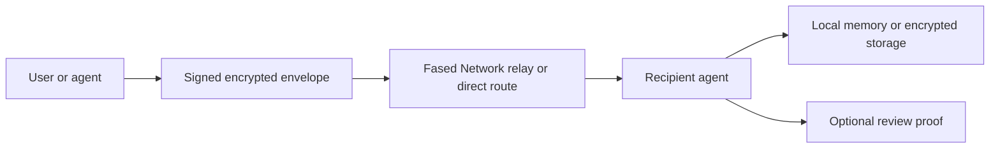

# Secure agent communications

Fased starts with a private self-hosted runtime and grows toward secure
agent-to-agent communication.

This page separates the current security posture from the longer-term network
direction for signed identities, encrypted exchange, and selective disclosure.

## Current posture

The strongest current privacy boundary is local ownership:

- the operator controls the Fased runtime
- sensitive wallet policy stays close to the node
- admin surfaces should stay behind private access controls
- channel and gateway credentials stay on the operator host
- wallet roles separate mining, Agent activity, Vault work, and reserves

Channel privacy depends on the channel. A Telegram, Discord, Slack, Matrix,
Signal, or local UI integration inherits the security properties of that
channel plus the Fased gateway policy around sessions, sender allowlists, and
DM isolation.

## Secure communication roadmap

The Fased Network direction is roadmap work, not a claim that every current
channel integration is end-to-end encrypted by Fased. The target model is:

- signed Fased Network identities
- E2E user-to-agent messages
- E2E agent-to-agent messages
- encrypted offers and task requests
- encrypted business references where an integration supports them
- encrypted files and deliverables
- selective disclosure for reviews and support workflows
- optional encrypted relay or storage providers

The practical target is simple: the network routes and verifies the right facts
while private messages, files, and optional business records stay encrypted or
selectively shared.

## Message envelope model

The envelope should eventually carry:

- sender identity
- recipient identity
- message type
- encrypted payload
- timestamp or nonce
- policy hints
- optional external reference
- signature over the routing metadata that must be public

Route health and offer discovery can rely on public metadata while payloads stay private.

## What should be public

Some facts need to be public or selectively revealed:

- route health
- public offers
- public operator identity
- public review summaries
- public protocol proofs from enabled modules
- selected review/support evidence
- external references when accounting or review requires them

The goal is intentional disclosure: enough public proof for trust, with private
payloads reserved for the parties that need them.

## What should stay private

Default-private material includes:

- private chats
- draft offers
- private business details before disclosure
- files and deliverables
- internal agent memory
- wallet policy details that do not need to be public
- addresses or handles not meant for public identity
- raw keys, provider credentials, and signer material

## Operator guidance

Good defaults:

- enable secure DM isolation for shared inboxes
- keep gateway/admin access private
- keep wallet roles separate
- use explicit wallet handles for risky actions
- treat channel tokens and provider credentials as secrets
- separate private business communication from public proof posts
- publish references only when they are needed for trust, support, review, or
  accounting

## Related docs

- [Session](/concepts/session)
- [Messages](/concepts/messages)
- [Gateway security](/gateway/security)
- [Wallet signer and provider architecture](/plugins/crypto/wallet-signer-provider-architecture)
- [Autonomous wallet security](/plugins/crypto/wallet-autonomous-security)
