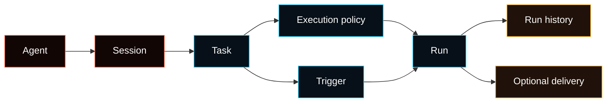

# Task Operating Layer

The Task Operating Layer is Fased's model for ongoing work.

Scheduler, heartbeat, webhooks, channel commands, and manual runs are trigger
mechanisms. The product object is a **Task** owned by an **Agent** and
**Session**.



For the current proof boundary, read [Tasks v1 Freeze](/concepts/tasks-v1-freeze).

Current local implementation includes cron-backed saved Task definitions,
webhook triggers, saved workflow definitions, graph workflow definitions,
standing orders, task run history, and source-owned activity records. Planner,
evaluator, source-repair, and adaptive routing behavior should be treated as
proof-gated unless a concrete adapter or workflow path records the evidence.

## Why it exists

Not every wakeup should run a full model turn.

- A reminder may need no model.
- A balance or status check may be skill-only.
- A service check may use a cheap model first and escalate only on signal.
- A webhook should run from the event, not from polling.
- A research task may need memory, source collection, and stronger synthesis.

The Task Operating Layer makes those choices explicit and auditable.

## Trigger types

| Trigger     | Meaning                                                                        |
| ----------- | ------------------------------------------------------------------------------ |
| `schedule`  | Runs at a time, interval, or cron expression.                                  |
| `heartbeat` | Lightweight recurring wake/check loop.                                         |
| `webhook`   | Runs when an authenticated external event arrives.                             |
| `channel`   | Runs from Telegram, Discord, Slack, WebChat, or another channel.               |
| `manual`    | Runs because a user clicked **Run now** or used a command.                     |
| `event`     | Runs because another Agent, subagent, skill, or network room emitted an event. |

## Execution policy

Each Task carries policy so Fased can run only what the job needs.

| Policy area    | Purpose                                                                       |
| -------------- | ----------------------------------------------------------------------------- |
| Execution mode | No model, skill-only, Agent turn, or automatic planner choice.                |
| Memory scope   | None, session summary, pinned memory, search, or Agent memory.                |
| Skill scope    | No skills, selected skills, or Agent default skills.                          |
| Model policy   | Agent default, task override, cheap/check role, escalation role, or no model. |
| Budget         | Token, cost, timeout, run-frequency, and escalation caps.                     |
| Stop policy    | Stop on success, marker, max successful runs, or max total runs.              |
| Delivery       | Internal only, channel announce, or webhook POST.                             |

Task policy cannot bypass wallet, mining, marketplace, service, or tool policy.
Domain pages remain the control surface for their own actions.

## Execution modes

| Mode         | Use when                                                                               |
| ------------ | -------------------------------------------------------------------------------------- |
| `no-model`   | The task only records, reminds, or delivers known text/state.                          |
| `skill-only` | A deterministic tool action can answer the request.                                    |
| `agent-turn` | Normal Agent reasoning is needed.                                                      |
| `auto`       | The planner may choose a direct tool, cheap model, stronger model, or escalation path. |

`skill-only` tasks must name an exact tool/action. If the tool is missing,
outside the selected skill scope, or disabled by policy, preflight blocks the
task before recurring execution continues.

## Memory, skills, and models

Memory is retrieval context for a run. It is not where task state lives.
Recurring checks should usually start with `none` or `session-summary`; research
or continuity work can opt into search or Agent memory.

Skills are capability gates. A recurring task should use selected skills when a
small deterministic action is enough, then escalate only when the result needs
reasoning.

Model selection follows this order:

1. explicit task model
2. selected Agent task role
3. global task role
4. Agent default

Router refs such as `openrouter/auto` are not treated as cheap/check models.
If a cheap-check task has no configured cheap/check role, it blocks with a
model-role setup message instead of guessing.

## Planner flow

Users can create a task manually, from Chat, from a channel command, or from an
Agent proposal.

The planner target is to produce:

- trigger
- execution mode
- memory scope
- skill scope
- model policy
- budget
- stop policy
- delivery target

Explicit user choices win. If the user selects a mode, model, skill action, or
delivery route, the planner records that choice instead of replacing it.

Auto planning should stay conservative. The preferred order is:

```text
direct/no-model -> deterministic skill-only -> cheap/check model -> stronger model
```

## Evaluator flow

The evaluator runs after a task run completes.

Its target jobs are:

- decide whether a cheap/check run needs stronger follow-up
- apply stop policy
- apply budget/escalation caps
- record source quality and repair state when a task gathered evidence
- mark missing access or weak evidence as a reviewable block

Cheap/check tasks use a structured cue such as:

```text
Needs deeper analysis: yes
Needs deeper analysis: no
```

Only a valid positive cue, or a configured evaluator cue, queues an immediate
stronger follow-up. No cue means the task waits for the next normal schedule.

## Source and evidence handling

Tasks that need outside or runtime evidence can collect sources before model
analysis. Source nodes may include provider status, wallet state, mining state,
offers, explicit URLs, or live search where policy allows it.

When a workflow/source adapter records source evidence, run detail should show:

- source id and source role
- source status and freshness
- quality band
- unavailable or conflicting evidence
- repair decision, if any

Source repair is bounded. The runtime may retry or add a configured source path,
but it does not let a model rewrite the task graph or create new authority.

## Programs and proposals

Programs are standing orders. They can propose work for review; they do not run
with authority by themselves.

```text
Program -> blocked proposal -> operator review -> Task or Workflow definition -> Run history
```

A Program cannot grant wallet, mining, marketplace, tool, service, or credential
access. It only creates reviewable intent.

## Coordination evidence

Tasks can ask helper Agents for evidence. Helper Agent runs are recorded under
the same correlation chain:

```text
Task -> helper Agent run -> evidence -> final result
```

Helper rows are evidence, not authority. They do not bypass the parent task's
model, memory, skill, wallet, mining, marketplace, or service policy.

## Queue and recovery

Each run should expose durable run state:

- run id
- trigger source
- queued/running/terminal status
- attempts and retry state
- checkpoint keys
- delivery status
- recovery/cancel state

The gateway schedules runs. Local or managed workers can lease executable
steps. Stale-lease recovery and checkpoint replay must be validated per adapter
before the adapter is treated as frozen.

Useful commands:

```bash
fased task status
fased task run-show <run-id>
fased task cancel-run <run-id>
fased task retry-run <run-id>
fased task clear-stale <run-id>
```

## Observability

A task run should show:

- trigger
- Agent and Session
- execution mode
- model used, if any
- skills used, if any
- memory scope
- token/cost estimate when available
- duration
- result summary
- delivery state
- escalation or block reason

Run detail is the preferred debug surface. It combines queue state, policy,
planner/evaluator decisions, source evidence, delivery, checkpoints, and
transcript links in one place.

## Network future

The same model can extend to Fased Network task rooms:

```text
Local Agent/Session Task
  -> network task envelope
  -> remote Agent/Session execution
  -> result/proof/artifact/status
  -> local delivery
```

Network rooms should carry task metadata and shared context explicitly. They
should not merge private transcripts or private memory by default.

## Related docs

- [Agents, Sessions, And Tasks](/concepts/agents-sessions-tasks)
- [Tasks v1 Freeze](/concepts/tasks-v1-freeze)
- [Scheduled Tasks](/automation/cron-jobs)
- [Tasks vs Heartbeat](/automation/cron-vs-heartbeat)
- [Task CLI](/cli/task)
