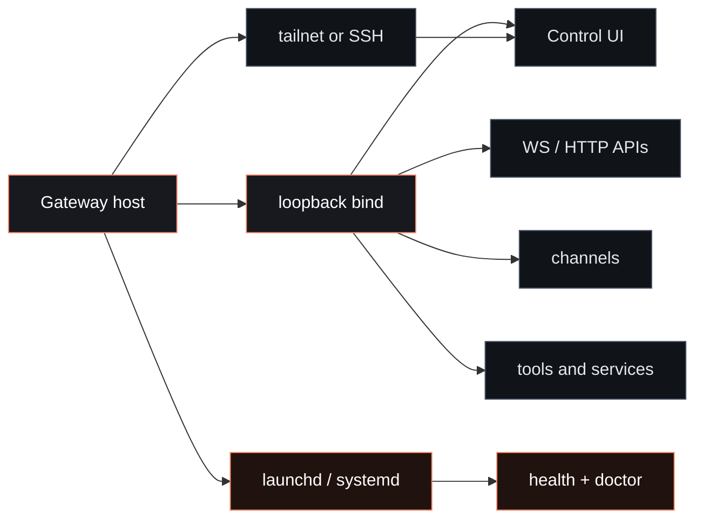

# Gateway runbook

Use this page for day-1 setup and day-2 operations of the gateway service.

The intended default is simple:

- keep the gateway on `loopback`
- keep the raw gateway port closed to LAN and internet
- choose the right onboarding profile up front
- add remote access through Tailscale Serve, a direct tailnet path, or SSH only when you actually need it

Normal product setup happens in the browser from the selected Agent:

- **Agent > Models** for provider sign-in, API keys, and model roles
- **Chat** for the first working message
- **Agent > Channels** for Telegram, Discord, WhatsApp, Slack, Signal, and other chat routes
- **Agent > Services** for web/search, GitHub, Gmail, and other API connectors
- **Agent > Skills**, **Agent > Memory**, and **Agent > Tasks** for per-Agent behavior

Use **Advanced > Config** only as an escape hatch for settings that have not
moved into a focused page yet.

## Operator map



<CardGroup cols={2}>
  <Card title="Deep troubleshooting" icon="siren" href="/gateway/troubleshooting">
    Symptom-first diagnostics with exact command ladders and log signatures.
  </Card>
  <Card title="Configuration" icon="sliders" href="/gateway/configuration">
    Task-oriented setup guide + full configuration reference.
  </Card>
  <Card title="Secrets management" icon="key-round" href="/gateway/secrets">
    SecretRef contract, runtime snapshot behavior, and migrate/reload operations.
  </Card>
  <Card title="Secrets plan contract" icon="shield-check" href="/gateway/secrets-plan-contract">
    Exact `secrets apply` target/path rules and ref-only auth-profile behavior.
  </Card>
</CardGroup>

## Start with the right onboarding profile

- **Local**: runtime on the machine you use directly. Best default for private desktop or laptop setups.
- **Hosting**: VPS or always-on box. Best when the runtime should stay online even while your main machine sleeps.

Typical entrypoints:

```bash
fased onboard --host-profile local
fased onboard --host-profile hosting --install-daemon
```

In both profiles, the raw gateway port should stay closed to the public internet by default.

## 5-minute local startup

<Steps>
  <Step title="Start the Gateway">

```bash
fased gateway --port 18789
# debug/trace mirrored to stdio
fased gateway --port 18789 --verbose
# force-kill listener on selected port, then start
fased gateway --force
```

  </Step>

  <Step title="Verify service health">

```bash
fased gateway status
fased status
fased logs --follow
```

Healthy baseline: `Runtime: running` and `RPC probe: ok`.

  </Step>

  <Step title="Validate channel readiness">

```bash
fased channels status --probe
```

You can also check this from **Agent > Channels** in the Control UI.

  </Step>
</Steps>

<Note>
Gateway config reload watches the active config file path (resolved from profile/state defaults, or `FASED_CONFIG_PATH` when set).
Default mode is `gateway.reload.mode="hybrid"`.
</Note>

## Runtime model

- One always-on process for routing, control plane, and channel connections.
- Single multiplexed port for:
  - WebSocket control/RPC
  - HTTP APIs (OpenAI-compatible, Responses, tools invoke)
  - browser Control UI and HTTP hooks/webhooks
- Default bind mode: `loopback`.
- Auth is required by default (`gateway.auth.token` / `gateway.auth.password`, or `FASED_GATEWAY_TOKEN` / `FASED_GATEWAY_PASSWORD`).

### Control UI login protection

Token auth is the recommended personal default for the Gateway. First-run
startup/onboarding generates a long random token when Gateway auth is not
explicitly configured.

- On remote/public hosts, token mode shows a browser sign-in page and exchanges
  the Gateway token for an HttpOnly `fased_ui_session` cookie.
- On `localhost`, `127.0.0.1`, and `.local` hosts, the SPA page can load
  directly for local convenience. WebSocket and API data/actions still go
  through Gateway auth, session, and device checks.
- `fased dashboard` and the onboarding finish step open an auth-ready link.
  The token stays in the URL fragment, is stripped by the UI, and is exchanged
  for a Control UI session when possible. Keep the printed token as the recovery
  token for future browsers or hosts.
- Password mode protects WebSocket/API calls, but it is not the same page-level
  browser login shell as token mode. Use token mode, Tailscale Serve identity,
  or trusted-proxy auth when you want browser login in front of the UI.
- HTTP APIs such as `/v1/*`, `/tools/invoke`, and `/api/channels/*` require
  Gateway auth even when the browser UI is reachable through Tailscale Serve.

### Port and bind precedence

| Setting      | Resolution order                                           |
| ------------ | ---------------------------------------------------------- |
| Gateway port | `--port` → `FASED_GATEWAY_PORT` → `gateway.port` → `18789` |
| Bind mode    | CLI/override → `gateway.bind` → `loopback`                 |

### Hot reload modes

| `gateway.reload.mode` | Behavior                                   |
| --------------------- | ------------------------------------------ |
| `off`                 | No config reload                           |
| `hot`                 | Apply only hot-safe changes                |
| `restart`             | Restart on reload-required changes         |
| `hybrid` (default)    | Hot-apply when safe, restart when required |

## Operator command set

```bash
fased gateway status
fased gateway status --deep
fased gateway status --json
fased gateway install
fased gateway restart
fased gateway stop
fased secrets reload
fased logs --follow
fased doctor
```

## Remote access

Preferred: Tailscale Serve or a private tailnet path.
Fallback: SSH tunnel.

Do not treat `18789` as a public internet port you should open by default. In the normal local and hosting profiles, the gateway stays on loopback and the exposure layer lives above it.

```bash
ssh -N -L 18789:127.0.0.1:18789 user@host
```

Then connect clients to `ws://127.0.0.1:18789` locally through the tunnel.

<Warning>
If gateway auth is configured, clients still must send auth (`token`/`password`) even over SSH tunnels.
</Warning>

See: [Remote Gateway](/gateway/remote), [Gateway security](/gateway/security), [Tailscale](/gateway/tailscale).

## Supervision and service lifecycle

Use supervised runs for production-like reliability.

<Tabs>
  <Tab title="macOS (launchd)">

```bash
fased gateway install
fased gateway status
fased gateway restart
fased gateway stop
```

LaunchAgent labels are `ai.fased.gateway` (default) or `ai.fased.<profile>` (named profile). `fased doctor` audits and repairs service config drift.

  </Tab>

  <Tab title="Linux (systemd user)">

```bash
fased gateway install
systemctl --user enable --now fased-gateway[-<profile>].service
fased gateway status
```

For persistence after logout, enable lingering:

```bash
sudo loginctl enable-linger <user>
```

  </Tab>

  <Tab title="Linux (system service)">

Use a system unit for multi-user/always-on hosts.

```bash
sudo systemctl daemon-reload
sudo systemctl enable --now fased-gateway[-<profile>].service
```

  </Tab>
</Tabs>

## Firewall and exposure rules

Recommended defaults:

- keep `gateway.bind: "loopback"`
- keep the raw gateway port closed in host and cloud firewalls
- use Tailscale Serve for tailnet-only browser and WebSocket access
- use SSH tunnels for operator-only remote access
- reserve direct public exposure for deliberate, reviewed setups only

If you intentionally bind beyond loopback:

- `tailnet` is safer than `lan`
- non-loopback binds require auth
- browser and node access should still be treated as operator-level capabilities

## Multiple gateways on one host

Most setups should run **one** Gateway.
Use multiple only for strict isolation/redundancy (for example a rescue profile).

Checklist per instance:

- Unique `gateway.port`
- Unique `FASED_CONFIG_PATH`
- Unique `FASED_STATE_DIR`
- Unique `agents.defaults.workspace`

Example:

```bash
FASED_CONFIG_PATH=~/.fased/a.json FASED_STATE_DIR=~/.fased-a fased gateway --port 19001
FASED_CONFIG_PATH=~/.fased/b.json FASED_STATE_DIR=~/.fased-b fased gateway --port 19002
```

See: [Multiple gateways](/gateway/multiple-gateways).

### Dev profile quick path

```bash
fased --dev setup
fased --dev gateway --allow-unconfigured
fased --dev status
```

Defaults include isolated state/config and base gateway port `19001`.

## Protocol quick reference (operator view)

- First client frame must be `connect`.
- Gateway returns `hello-ok` snapshot (`presence`, `health`, `stateVersion`, `uptimeMs`, limits/policy).
- Requests: `req(method, params)` → `res(ok/payload|error)`.
- Common events: `connect.challenge`, `agent`, `chat`, `presence`, `tick`, `health`, `heartbeat`, `shutdown`.

Agent runs are two-stage:

1. Immediate accepted ack (`status:"accepted"`)
2. Final completion response (`status:"ok"|"error"`), with streamed `agent` events in between.

See full protocol docs: [Gateway Protocol](/gateway/protocol).

## Operational checks

### Liveness

- Open WS and send `connect`.
- Expect `hello-ok` response with snapshot.

### Readiness

```bash
fased gateway status
fased channels status --probe
fased health
```

### Gap recovery

Events are not replayed. On sequence gaps, refresh state (`health`, `system-presence`) before continuing.

## Common failure signatures

| Signature                                                      | Likely issue                             |
| -------------------------------------------------------------- | ---------------------------------------- |
| `refusing to bind gateway ... without auth`                    | Non-loopback bind without token/password |
| `another gateway instance is already listening` / `EADDRINUSE` | Port conflict                            |
| `Gateway start blocked: set gateway.mode=local`                | Config set to remote mode                |
| `unauthorized` during connect                                  | Auth mismatch between client and gateway |

For full diagnosis ladders, use [Gateway Troubleshooting](/gateway/troubleshooting).

## Runtime guarantees

- Gateway protocol clients fail fast when Gateway is unavailable (no implicit direct-channel fallback).
- Invalid/non-connect first frames are rejected and closed.
- Graceful shutdown emits `shutdown` event before socket close.

---

Related:

- [Troubleshooting](/gateway/troubleshooting)
- [Background Process](/gateway/background-process)
- [Configuration](/gateway/configuration)
- [Health](/gateway/health)
- [Doctor](/gateway/doctor)
- [Provider Authentication](/gateway/authentication)
