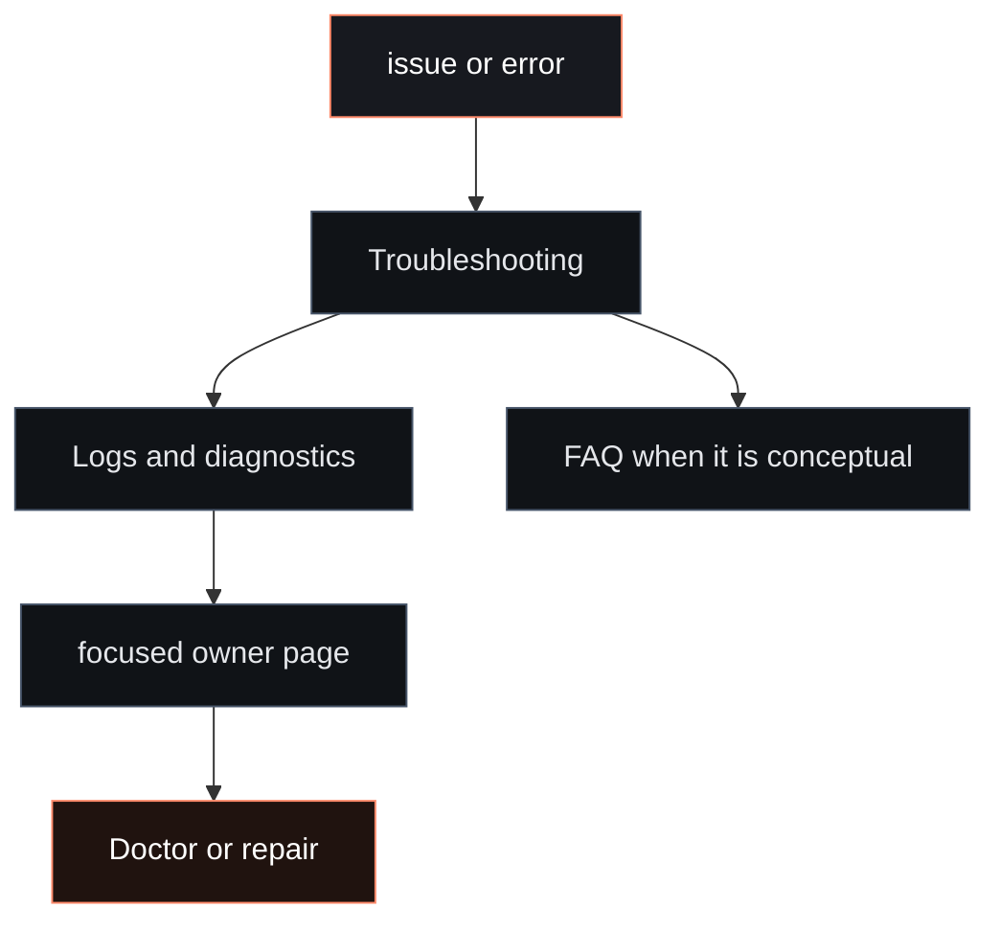

# Help

Use Help when something is broken, unclear, or hard to inspect. Normal setup
still starts in the selected Agent: Models, Channels, Services, Skills, Tools,
Memory, Tasks, Wallets, Mining, and Fased Network each have their own owner
page.

## Fast path



<CardGroup cols={2}>
  <Card title="Troubleshooting" icon="wrench" href="/help/troubleshooting">
    Symptom-first checks for no replies, gateway issues, channels, tasks, nodes, browser, wallet, mining, and Fased Network.
  </Card>
  <Card title="Diagnostics" icon="activity" href="/diagnostics/index">
    Where to use Logs, Usage, Advanced > Debug, Advanced > Nodes, diagnostic flags, and structured diagnostics.
  </Card>
  <Card title="Environment" icon="terminal" href="/help/environment">
    How Fased loads env vars, `.env`, config `env`, shell imports, SecretRefs, and state-path overrides.
  </Card>
  <Card title="FAQ" icon="circle-help" href="/help/faq">
    Conceptual and setup questions when nothing is actively broken.
  </Card>
</CardGroup>

## Useful commands

```bash
fased status
fased status --all
fased gateway probe
fased gateway status
fased doctor
fased logs --follow
```

For wallet, mining, and Fased Network issues:

```bash
fased wallet status --json
fased wallet signer doctor --json
fased mining readiness --wallet mining
fased mining status
fased federation status
```

## Related

- [Gateway troubleshooting](/gateway/troubleshooting)
- [Doctor](/gateway/doctor)
- [Testing](/help/testing)
- [Docs map](/start/docs-directory)
