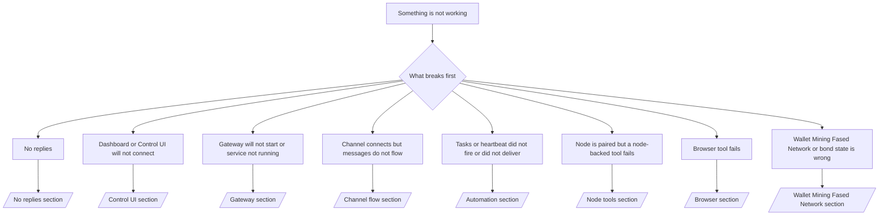

# Troubleshooting

If you only have 2 minutes, use this page as a triage front door.

Browser triage:

1. Check the top-bar health dot.
2. Open **Logs** and filter for the failing subsystem.
3. Open the focused owner page: **Agent > Channels**, **Agent > Services**,
   **Agent > Skills**, **Agent > Tools**, **Agent > Memory**, Wallets, Mining,
   Fased Network, or Marketplace.
4. Use **Advanced > Debug** only for raw status snapshots, plugin runtime
   diagnostics, Memory Doctor repair preview, and raw RPC checks.
5. Use **Advanced > Nodes** only for paired device/runtime diagnostics.

## First 60 seconds

Run this exact ladder in order:

```bash
fased status
fased status --all
fased gateway probe
fased gateway status
fased doctor
fased channels status --probe
fased logs --follow
```

Good output in one line:

- `fased status` → shows configured channels and no obvious auth errors.
- `fased status --all` → full report is present and shareable.
- `fased gateway probe` → expected gateway target is reachable.
- `fased gateway status` → `Runtime: running` and `RPC probe: ok`.
- `fased doctor` → no blocking config/service errors.
- `fased channels status --probe` → channels report `connected` or `ready`.
- `fased logs --follow` → steady activity, no repeating fatal errors.

If Wallet, Mining, or Fased Network broke, run this ladder next:

```bash
fased wallet status --json
fased wallet signer doctor --json
fased mining wallets
fased mining readiness --wallet mining
fased mining status
fased federation status
fased federation bond-wallet status
```

Good output in one line:

- `fased wallet status --json` → provider, RPC, custody, and policy look healthy.
- `fased wallet signer doctor --json` → local signer is reachable and ready to
  sign.
- `fased mining wallets` → the intended mining wallet is visible to the runtime.
- `fased mining readiness --wallet mining` → no signer, RPC, capital, or wallet
  mismatch blocker.
- `fased mining status` → live SAT state is readable and not stuck on obvious gaps.
- `fased federation status` → Fased Network state and public route picture make
  sense.
- `fased federation bond-wallet status` → the bond assignment points at the wallet you expect.

## Decision tree



<AccordionGroup>
  <Accordion title="No replies">
    ```bash
    fased status
    fased gateway status
    fased channels status --probe
    fased pairing list --channel <channel> [--account <id>]
    fased logs --follow
    ```

    Good output looks like:

    - `Runtime: running`
    - `RPC probe: ok`
    - Your channel shows connected/ready in `channels status --probe`
    - Sender appears approved (or DM policy is open/allowlist)
    - In the UI, **Agent > Channels** shows the route/account as ready.

    Common log signatures:

    - `drop guild message (mention required` → mention gating blocked the message in Discord.
    - `pairing request` → sender is unapproved and waiting for DM pairing approval.
    - `blocked` / `allowlist` in channel logs → sender, room, or group is filtered.

    Deep pages:

    - [/gateway/troubleshooting#no-replies](/gateway/troubleshooting#no-replies)
    - [/channels/troubleshooting](/channels/troubleshooting)
    - [/channels/pairing](/channels/pairing)

  </Accordion>

  <Accordion title="Dashboard or Control UI will not connect">
    ```bash
    fased status
    fased gateway status
    fased logs --follow
    fased doctor
    fased channels status --probe
    ```

    Good output looks like:

    - `Dashboard: http://...` is shown in `fased gateway status`
    - `RPC probe: ok`
    - No auth loop in logs

    Common log signatures:

    - `device identity required` → HTTP/non-secure context cannot complete
      device auth.
    - `unauthorized` / reconnect loop → wrong token/password or auth mode mismatch.
    - `gateway connect failed:` → UI is targeting the wrong URL/port or unreachable gateway.

    Deep pages:

    - [/gateway/troubleshooting#dashboard-control-ui-connectivity](/gateway/troubleshooting#dashboard-control-ui-connectivity)
    - [/web/control-ui](/web/control-ui)
    - [/diagnostics/index](/diagnostics/index)
    - [/gateway/security](/gateway/security)

  </Accordion>

  <Accordion title="Gateway will not start or service installed but not running">
    ```bash
    fased status
    fased gateway status
    fased logs --follow
    fased doctor
    fased channels status --probe
    ```

    Good output looks like:

    - `Service: ... (loaded)`
    - `Runtime: running`
    - `RPC probe: ok`

    Common log signatures:

    - `Gateway start blocked: set gateway.mode=local` → gateway mode is unset/remote.
    - `refusing to bind gateway ... without auth` → non-loopback bind without token/password.
    - `another gateway instance is already listening` or `EADDRINUSE` → port already taken.

    Deep pages:

    - [/gateway/troubleshooting#gateway-service-not-running](/gateway/troubleshooting#gateway-service-not-running)
    - [/gateway/background-process](/gateway/background-process)
    - [/gateway/configuration](/gateway/configuration)

  </Accordion>

  <Accordion title="Channel connects but messages do not flow">
    ```bash
    fased status
    fased gateway status
    fased logs --follow
    fased doctor
    fased channels status --probe
    ```

    Good output looks like:

    - Channel transport is connected.
    - Pairing/allowlist checks pass.
    - Mentions are detected where required.
    - **Agent > Channels** shows the selected Agent route and delivery target.

    Common log signatures:

    - `mention required` → group mention gating blocked processing.
    - `pairing` / `pending` → DM sender is not approved yet.
    - `not_in_channel`, `missing_scope`, `Forbidden`, `401/403` → channel
      permission token issue.

    Deep pages:

    - [Gateway troubleshooting](/gateway/troubleshooting#channel-connected-messages-not-flowing)
    - [/channels/troubleshooting](/channels/troubleshooting)

  </Accordion>

  <Accordion title="Wallet, Mining, Fased Network, or bond state is wrong">
    ```bash
    fased wallet status --json
    fased wallet signer doctor --json
    fased mining wallets
    fased mining readiness --wallet mining
    fased mining status
    fased federation status
    fased federation bond-wallet status
    ```

    Good output looks like:

    - wallet provider, custody, and policy status all read healthy
    - signer doctor says the self-hosted signer is reachable
    - mining readiness passes for the wallet you actually want to use
    - mining status shows capital, commit, and cycle state without blocker notes
    - Fased Network status shows the expected handle, network state, and public
      route picture
    - `fased federation bond-wallet status` shows the intended bond Vault

    Common signatures:

    - signer unhealthy or socket missing → fix the local signer before debugging
      mining or Fased Network
    - wallet not listed in `fased mining wallets` → wrong role or wrong wallet selection
    - readiness fails on SOL, capital, or commit → fund the wallet, deposit
      capital, or set commit first
    - Fased Network orange after unlock request → full bond unlock cooldown is
      active until cancel or withdraw
    - bond Vault mismatch → Fased Network is reading a different Vault wallet
      than the one you funded

    Deep pages:

    - [/plugins/crypto/wallet-page](/plugins/crypto/wallet-page)
    - [/plugins/crypto/wallet-self-hosted](/plugins/crypto/wallet-self-hosted)
    - [/plugins/crypto/mining-page](/plugins/crypto/mining-page)
    - [/start/federation](/start/federation)
    - [/start/bond-operator-economy](/start/bond-operator-economy)
    - [/cli/mining](/cli/mining)
    - [/cli/federation](/cli/federation)

  </Accordion>

  <Accordion title="Tasks or heartbeat did not fire or did not deliver">
    ```bash
    fased status
    fased gateway status
    fased task status
    fased task list
    fased task runs --id <task-id> --limit 20
    fased logs --follow
    ```

    Good output looks like:

    - `task status` shows enabled with a next wake.
    - `task runs` shows recent `ok` entries.
    - Heartbeat is enabled and not outside active hours.
    - **Agent > Tasks** shows the selected Agent's scheduled work.

    Common log signatures:

    - `cron: scheduler disabled; jobs will not run automatically` → the scheduler is disabled.
    - `heartbeat skipped` with `reason=quiet-hours` → outside configured active hours.
    - `requests-in-flight` → main lane busy; heartbeat wake was deferred.
    - `unknown accountId` → heartbeat delivery target account does not exist.

    Deep pages:

    - [/gateway/troubleshooting#cron-and-heartbeat-delivery](/gateway/troubleshooting#cron-and-heartbeat-delivery)
    - [/automation/troubleshooting](/automation/troubleshooting)
    - [/gateway/heartbeat](/gateway/heartbeat)

  </Accordion>

  <Accordion title="Node is paired but a node-backed tool fails">
    ```bash
    fased status
    fased gateway status
    fased nodes status
    fased nodes describe --node <idOrNameOrIp>
    fased logs --follow
    ```

    Good output looks like:

    - Node is listed as connected and paired for role `node`.
    - Capability exists for the command you are invoking.
    - Permission state is granted for the tool.
    - **Advanced > Nodes** shows the same connected capability state.
    - **Agent > Tools** allows the selected Agent to use the node-backed tool.

    Common log signatures:

    - `NODE_BACKGROUND_UNAVAILABLE` → bring node app to foreground.
    - `*_PERMISSION_REQUIRED` → OS permission was denied/missing.
    - `SYSTEM_RUN_DENIED: approval required` → exec approval is pending.
    - `SYSTEM_RUN_DENIED: allowlist miss` → command not on exec allowlist.

    Deep pages:

    - [/gateway/troubleshooting#node-paired-tool-fails](/gateway/troubleshooting#node-paired-tool-fails)
    - [/nodes/troubleshooting](/nodes/troubleshooting)
    - [/tools/exec-approvals](/tools/exec-approvals)

  </Accordion>

  <Accordion title="Browser tool fails">
    ```bash
    fased status
    fased gateway status
    fased browser status
    fased logs --follow
    fased doctor
    ```

    Good output looks like:

    - Browser status shows `running: true` and a chosen browser/profile.
    - `fased` profile starts or `chrome` relay has an attached tab.

    Common log signatures:

    - `Failed to start Chrome CDP on port` → local browser launch failed.
    - `browser.executablePath not found` → configured binary path is wrong.
    - `Chrome extension relay is running, but no tab is connected` → extension
      not attached.
    - `Browser attachOnly is enabled ... not reachable` → attach-only profile
      has no live CDP target.

    Deep pages:

    - [/gateway/troubleshooting#browser-tool-fails](/gateway/troubleshooting#browser-tool-fails)
    - [/tools/browser-linux-troubleshooting](/tools/browser-linux-troubleshooting)
    - [/tools/chrome-extension](/tools/chrome-extension)

  </Accordion>
</AccordionGroup>
