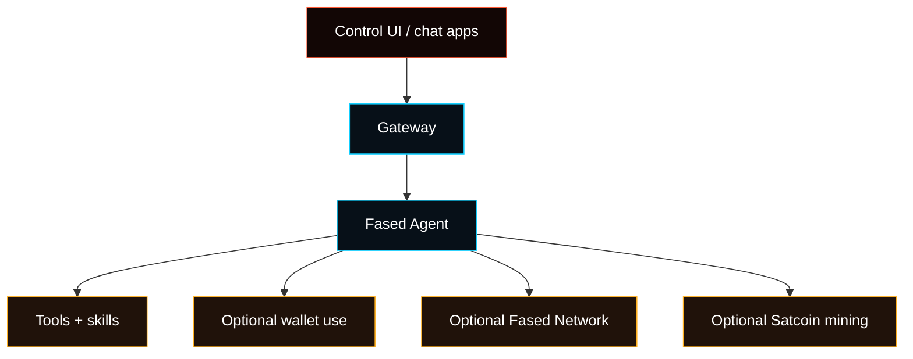

# Fased

**Run Agent. Mine SAT. Build Trust.**

Fased Agent is the agent you run yourself. Start with tasks and the browser
dashboard. Add wallets, services, Fased Network, and Satcoin mining when the
work is ready for them.

Start by choosing one of two setup profiles:

- **Local install** for your own computer. Use Terminal on macOS, WSL2 Ubuntu
  on Windows, or your Linux distro terminal.
- **VPS Hosting install** for an always-on server. Ubuntu LTS is the
  recommended VPS default. Fedora and RHEL-family systems are hosted targets
  too. Alpine, Arch, macOS, and FreeBSD are local/dev targets until their
  hosted hardening paths are validated separately.

<Warning>
On Windows, PowerShell is used only to install or manage WSL2. Install WSL2
Ubuntu, open the Ubuntu shell, and run the Fased installer and every `fased`
command there. Do not run Fased through native PowerShell, Command Prompt, Git
Bash, or native Windows Node.js. See [Windows (WSL2)](/platforms/windows).
</Warning>

After the Gateway and browser dashboard are working, add only what you need:
wallets, services, Fased Network, or Satcoin mining.

**Gateway + dashboard + agent + wallets + services + mining when ready.**

<Columns>
  <Card title="Get Started" href="/start/getting-started" icon="rocket">
    Choose Local or VPS Hosting and bring up the agent.
  </Card>
  <Card title="Run the Wizard" href="/start/wizard" icon="sparkles">
    Guided setup with `fased onboard`.
  </Card>
  <Card title="Open the Control UI" href="/web/control-ui" icon="layout-dashboard">
    Launch the browser dashboard and start working.
  </Card>
</Columns>

## What is Fased?

Fased is an **agent workbench you run yourself**. Use it first through the
browser dashboard, then connect services, wallet features, Fased Network, and
Satcoin mining as your setup grows.

**Who is it for?** Developers, builders, and power users who want an agent they
can run from their own computer or VPS.

**What makes it different?**

- **Runs under your control**: choose Local for this computer or VPS Hosting for an always-on server
- **Browser-first setup**: start in the Control UI
- **Tasks and tools**: run useful work across services and plugins
- **Wallets when enabled**: use wallet roles, reviewed sends, receive links, and payment history
- **Fased Network**: make services easier to find and trust
- **Satcoin mining**: mine SAT and build mining proof

The product shape is simple: run the agent first, then add mining and network
work when they have a specific job.

- **Runs on your machine**: use your own computer or your own VPS
- **Chat app ready**: install and connect WhatsApp, Telegram, Discord, and more when needed
- **Built for agent work**: tasks, tools, memory, sessions, and multi-agent routing
- **Wallet-ready when enabled**: wallet actions can use wallet roles and protected signing
- **Network-ready when enabled**: Fased Network and Satcoin mining live beside the base agent
- **Open source**: MIT licensed with preserved upstream and third-party notices

**What do you need?** For normal setup, use the installer path for Local or VPS
Hosting. If you manage Node yourself, use Node 24, or Node 22.14+ with
`node:sqlite`.

## How it works



The Gateway keeps sessions, routing, chat app connections, and agent behavior in
one place.

## Key capabilities

<Columns>
  <Card title="Chat app gateway" icon="network">
    Install the channel add-ons you use, then connect them when you want remote chat surfaces.
  </Card>
  <Card title="Agent you run" icon="cpu">
    Sessions, tasks, tools, memory, and plugins in one setup profile.
  </Card>
  <Card title="Plugin integrations" icon="plug">
    Add Mattermost and other integrations with extension packages.
  </Card>
  <Card title="Multi-agent routing" icon="route">
    Isolated sessions per agent, workspace, or sender.
  </Card>
  <Card title="Media support" icon="image">
    Send and receive images, audio, and documents.
  </Card>
  <Card title="Web Control UI" icon="monitor">
    Browser dashboard for chat, config, sessions, and nodes.
  </Card>
  <Card title="Fased Network and SAT mining" icon="coins">
    Add Fased Network and Satcoin mining after the base agent works.
  </Card>
  <Card title="Mobile nodes" icon="smartphone">
    Pair iOS and Android nodes with Canvas support.
  </Card>
</Columns>

## Choose Your Install

<Tabs>
  <Tab title="Local install">
    Use this on your own computer. On macOS, use Terminal. On Windows, use WSL2
    with Ubuntu and run the command below **inside the Ubuntu shell**, not in
    PowerShell. On Linux, use your distro terminal.

    ```bash
    curl -fsSL https://raw.githubusercontent.com/fased-ai/fased/main/install.sh | bash -s -- --local
    ```

    Then open the dashboard:

    ```bash
    fased dashboard
    ```

    Local setup keeps the Gateway on this machine. Tailscale is optional.

  </Tab>
  <Tab title="VPS Hosting install">
    Use this on the VPS that will run Fased all the time. Ubuntu LTS is the
    recommended default for a first hosted setup.

    Follow the [pre-execution verified tagged bootstrap](/install/vps#3-install-fased-and-connect-through-tailscale)
    from the VPS provider's root console. It verifies the installer release
    asset and attestation bundle before root execution. Fased installs/starts
    Tailscale when needed and prints the VPS login URL. Open that URL from your local
    computer's browser. Before running hosted setup, shut down local VPNs such
    as Mullvad and confirm your local computer is already signed into
    Tailscale. Before SSH/firewall lock-down, confirm that
    `tailscale status`, `tailscale ip -4`, and
    `ssh app@YOUR_VPS_TAILSCALE_NAME` work from your own computer and that SSH
    reaches `/home/app/fased`.

    <Accordion title="Hosted support boundary">
      - Hosted VPS hardening: Ubuntu/Fedora/RHEL-family Linux with systemd.
      - Local/dev install: Alpine, Arch, macOS, FreeBSD, WSL2, and common Linux
        desktops until their hosted hardening paths are validated separately.
    </Accordion>

  </Tab>
</Tabs>

Need the full install guide? See [Install](/install).
Want the Agent setup path after first boot? See [Fased Agent Setup](/start/fased).

## Dashboard

Open the browser Control UI after the Gateway starts.

- Local default: [http://localhost:18789/](http://localhost:18789/) (gateway still binds loopback)
- Remote access: [Web surfaces](/web) and [Tailscale](/gateway/tailscale)

## Configuration (optional)

Config lives at `~/.fased/fased.json`.

- If you **do nothing**, Fased uses the bundled Pi binary in RPC mode with per-sender sessions.
- If you want to lock it down, start with `channels.whatsapp.allowFrom` and (for groups) mention rules.

Example:

```json5
{
  channels: {
    whatsapp: {
      allowFrom: ["+15555550123"],
      groups: { "*": { requireMention: true } },
    },
  },
  messages: { groupChat: { mentionPatterns: ["@fased"] } },
}
```

## Start here

<Columns>
  <Card title="Docs hubs" href="/start/hubs" icon="book-open">
    All docs and guides, organized by use case.
  </Card>
  <Card title="Configuration" href="/gateway/configuration" icon="settings">
    Core Gateway settings, tokens, and provider config.
  </Card>
  <Card title="Install and operate" href="/install" icon="server">
    Install methods, deployment choices, and maintenance.
  </Card>
  <Card title="Wallets, Fased Network, and SAT" href="/start/fased" icon="shield">
    Add wallets, network participation, and mining after first-run setup.
  </Card>
  <Card title="Fased glossary" href="/start/operator-glossary" icon="book-open">
    Learn the shared wallet, mining, Fased Network, and bond terms.
  </Card>
  <Card title="Remote access" href="/gateway/remote" icon="globe">
    SSH and tailnet access patterns.
  </Card>
  <Card title="Chat apps" href="/channels/telegram" icon="message-square">
    Setup guides for WhatsApp, Telegram, Discord, and more.
  </Card>
  <Card title="Nodes" href="/nodes" icon="smartphone">
    iOS and Android nodes with pairing and Canvas.
  </Card>
  <Card title="Help" href="/help" icon="life-buoy">
    Common fixes and troubleshooting entry point.
  </Card>
</Columns>

## Learn more

<Columns>
  <Card title="Full feature list" href="/concepts/features" icon="list">
    Complete chat app, routing, and media capabilities.
  </Card>
  <Card title="Multi-agent routing" href="/concepts/multi-agent" icon="route">
    Workspace isolation and per-agent sessions.
  </Card>
  <Card title="Security" href="/gateway/security" icon="shield">
    Tokens, allowlists, and safety controls.
  </Card>
  <Card title="Troubleshooting" href="/gateway/troubleshooting" icon="wrench">
    Gateway diagnostics and common errors.
  </Card>
  <Card title="Legal and risk" href="/reference/legal" icon="scale">
    License, third-party notices, and finance/crypto risk boundaries.
  </Card>
  <Card title="Origin and credits" href="/reference/credits" icon="info">
    Project origin and current attribution policy.
  </Card>
  <Card title="Roadmap" href="/reference/roadmap" icon="map">
    What comes after the current wallet, Fased Network, and trust features.
  </Card>
</Columns>
