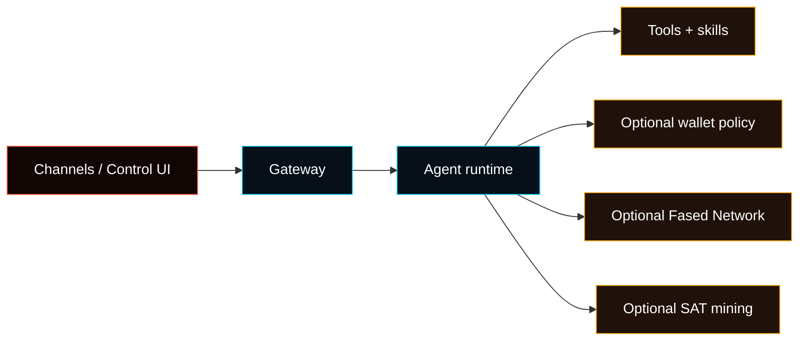

# Fased

**A self-hosted Agent runtime with gateway, channels, plugins, and optional operator modules.**

Run your own agent on your own machine or server, start with the browser dashboard,
then add channels, services, wallet policy, Fased Network, or SAT mining only
where you actually need them.

Fased is an owned AI runtime: gateway, sessions, tools, memory, channels,
plugins, and policy controls running under your operator boundary.

**Gateway + agent runtime + channels + optional wallet/network modules.**

<Columns>
  <Card title="Get Started" href="/start/getting-started" icon="rocket">
    Install Fased and bring up the Gateway in minutes.
  </Card>
  <Card title="Run the Wizard" href="/start/wizard" icon="sparkles">
    Guided setup with `fased onboard` and pairing flows.
  </Card>
  <Card title="Open the Control UI" href="/web/control-ui" icon="layout-dashboard">
    Launch the browser dashboard for chat, config, and sessions.
  </Card>
</Columns>

## What is Fased?

Fased is a **self-hosted agent runtime**. You can use it immediately through the
browser dashboard, then layer on channels, services, plugins, wallet policy,
Fased Network, and SAT mining as your setup grows. It runs on your own machine
or server and stays under your runtime and policy control.

**Who is it for?** Developers, operators, and power users who want an Agent they can message from anywhere without giving up runtime control, wallet control, or plugin control.

**What makes it different?**

- **Owned runtime**: not rented AI; the node runs under the operator's control
- **Signer and policy boundary**: wallet actions use policy, caps, approvals, custody state, and audit instead of raw keys in skills
- **Skills and plugins**: agents can do real work, not only chat
- **Fased Network**: identity, routing, service discovery, and reviewed offer flows
- **Optional Satcoin path**: mining and bond can contribute to operator-history signals
- **Optional wallet tools**: policy-bound sends, receive links, receipts, and wallet audit
- **Optional operator modules**: wallet, Fased Network, SAT mining, and Marketplace stay separate from first chat

The product shape is simple: owned runtime first, optional operator modules when
the base agent is trusted.

- **Self-hosted**: runs on your hardware, your rules
- **Multi-channel**: one Gateway serves WhatsApp, Telegram, Discord, and more simultaneously
- **Agent-native**: built for coding agents with tool use, sessions, memory, and multi-agent routing
- **Wallet-aware when enabled**: the runtime can enforce wallet policy and approvals
- **Network-ready when enabled**: Fased Network and SAT mining live beside the base runtime
- **Open source**: MIT licensed with preserved upstream and third-party notices

**What do you need?** Node 22+, an API key (Anthropic recommended), and 5 minutes.

## How it works



The Gateway is the single source of truth for sessions, routing, channels, and operator runtime behavior.

## Key capabilities

<Columns>
  <Card title="Multi-channel gateway" icon="network">
    Add WhatsApp, Telegram, Discord, iMessage, and more when you want remote chat surfaces.
  </Card>
  <Card title="Sovereign agent runtime" icon="cpu">
    Sessions, tools, memory, plugins, and policy stay under operator control.
  </Card>
  <Card title="Plugin channels" icon="plug">
    Add Mattermost and more with extension packages.
  </Card>
  <Card title="Multi-agent routing" icon="route">
    Isolated sessions per agent, workspace, or sender.
  </Card>
  <Card title="Media support" icon="image">
    Send and receive images, audio, and documents.
  </Card>
  <Card title="Web Control UI" icon="monitor">
    Browser dashboard for chat, config, sessions, and nodes.
  </Card>
  <Card title="Fased Network and SAT mining" icon="coins">
    Add Fased Network and SAT mining only after the base runtime is trusted.
  </Card>
  <Card title="Mobile nodes" icon="smartphone">
    Pair iOS and Android nodes with Canvas support.
  </Card>
</Columns>

## Quick start

<Steps>
  <Step title="Install Fased">
    ```bash
    git clone https://github.com/fased-ai/agent.git fased
    cd fased
    ./install.sh
    ```
  </Step>
  <Step title="Onboard and install the service">
    ```bash
    fased onboard --install-daemon
    ```
  </Step>
  <Step title="Open the Control UI and confirm the runtime">
    ```bash
    fased dashboard
    fased status
    ```
  </Step>
</Steps>

<Note>
If this machine is a VPS or hosted operator node, join it to **Tailscale before
onboarding**, then choose the **hosting** profile. Keep the dashboard and admin
surface private through the tailnet instead of exposing the raw gateway port.
</Note>

Need the full install and dev setup? See [Quick start](/start/quickstart).
Want the sovereign runtime path after first boot? See [Build with Fased](/start/fased).

## Dashboard

Open the browser Control UI after the Gateway starts.

- Local default: [http://localhost:18789/](http://localhost:18789/) (gateway still binds loopback)
- Remote access: [Web surfaces](/web) and [Tailscale](/gateway/tailscale)

## Configuration (optional)

Config lives at `~/.fased/fased.json`.

- If you **do nothing**, Fased uses the bundled Pi binary in RPC mode with per-sender sessions.
- If you want to lock it down, start with `channels.whatsapp.allowFrom` and (for groups) mention rules.

Example:

```json5
{
  channels: {
    whatsapp: {
      allowFrom: ["+15555550123"],
      groups: { "*": { requireMention: true } },
    },
  },
  messages: { groupChat: { mentionPatterns: ["@fased"] } },
}
```

## Start here

<Columns>
  <Card title="Docs hubs" href="/start/hubs" icon="book-open">
    All docs and guides, organized by use case.
  </Card>
  <Card title="Configuration" href="/gateway/configuration" icon="settings">
    Core Gateway settings, tokens, and provider config.
  </Card>
  <Card title="Install and operate" href="/install" icon="server">
    Install methods, deployment choices, and maintenance.
  </Card>
  <Card title="Wallets, Fased Network, and SAT" href="/start/fased" icon="shield">
    Follow the sovereign operator path after first-run setup.
  </Card>
  <Card title="Operator glossary" href="/start/operator-glossary" icon="book-open">
    Learn the shared wallet, mining, Fased Network, bond, and operator terms.
  </Card>
  <Card title="Remote access" href="/gateway/remote" icon="globe">
    SSH and tailnet access patterns.
  </Card>
  <Card title="Channels" href="/channels/telegram" icon="message-square">
    Channel-specific setup for WhatsApp, Telegram, Discord, and more.
  </Card>
  <Card title="Nodes" href="/nodes" icon="smartphone">
    iOS and Android nodes with pairing and Canvas.
  </Card>
  <Card title="Help" href="/help" icon="life-buoy">
    Common fixes and troubleshooting entry point.
  </Card>
</Columns>

## Learn more

<Columns>
  <Card title="Full feature list" href="/concepts/features" icon="list">
    Complete channel, routing, and media capabilities.
  </Card>
  <Card title="Multi-agent routing" href="/concepts/multi-agent" icon="route">
    Workspace isolation and per-agent sessions.
  </Card>
  <Card title="Security" href="/gateway/security" icon="shield">
    Tokens, allowlists, and safety controls.
  </Card>
  <Card title="Troubleshooting" href="/gateway/troubleshooting" icon="wrench">
    Gateway diagnostics and common errors.
  </Card>
  <Card title="Legal and risk" href="/reference/legal" icon="scale">
    License, third-party notices, and finance/crypto risk boundaries.
  </Card>
  <Card title="Origin and credits" href="/reference/credits" icon="info">
    Project origin and current attribution policy.
  </Card>
  <Card title="Roadmap" href="/reference/roadmap" icon="map">
    What comes after the current wallet, Fased Network, and operator tranche.
  </Card>
</Columns>
