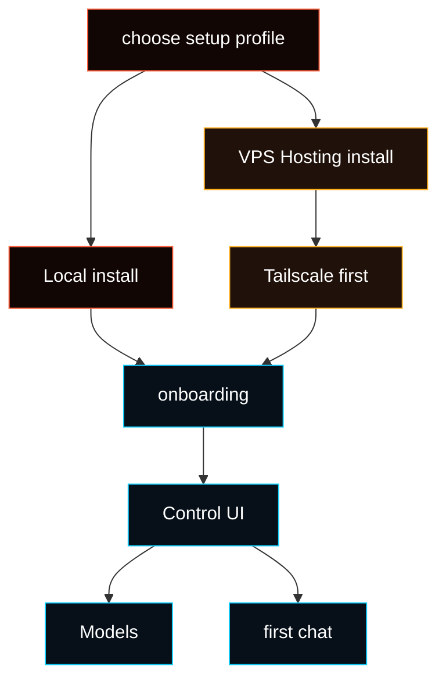

# Install

Already followed [Getting Started](/start/getting-started)? You can usually
continue there. This page is for the two supported setup profiles, platform
notes, hosting details, and maintenance.



## System requirements

- macOS, Linux, or Windows through WSL2
- Git access to the Fased repository
- Node 24, or Node 22.14+ with `node:sqlite`, when you manage Node yourself

<Note>
On common VPS and workstation systems, the repo installer can install missing
command-line tools, Node, and `pnpm` when auto-install is enabled. That includes
Ubuntu, Debian, Kali, Fedora, CentOS, AlmaLinux, Rocky Linux, CloudLinux, Oracle
Linux, Amazon Linux, openSUSE, SLES, Alpine, Arch, FreeBSD, WSL2 Ubuntu, and
macOS with Homebrew. Normal users should start with the curl bootstrap; source
build commands are for developer workflows.
</Note>

<Note>
Windows has two different paths:

- **Local install on your Windows PC:** use
  [WSL2](https://learn.microsoft.com/en-us/windows/wsl/install) and run Fased
  inside Ubuntu.
- **Managing a hosted VPS from Windows:** use PowerShell or Windows Terminal
  with the Windows Tailscale app online. Use WSL for hosted SSH checks only
  unless Tailscale is also installed and logged in inside WSL.

</Note>

## Pick local or VPS hosting

These are different setup paths. Start with **Local** unless you already know
you need an always-on server. Choose **VPS Hosting** only on the server that
will run Fased all the time. For the first hosted VPS, Ubuntu LTS is the
recommended default.

- **Local install**
  - Best for: your own computer: macOS Terminal, Windows with WSL2 Ubuntu,
    Linux desktop, or dev box.
  - Posture: lowest setup risk. Gateway stays on your machine; a home router
    usually does not expose it to the public internet. Tailscale is optional.
  - Access dependency: your local OS login.
- **VPS Hosting**
  - Best for: always-on cloud server.
  - Posture: higher exposure by default because a VPS is internet-reachable.
    Hosted setup closes public admin ports and requires Tailscale for private
    dashboard and SSH access.
  - Access dependency: your Tailscale account plus the VPS provider console for
    emergency recovery.

<Warning>
If you lose access to the Tailscale account used for a hosted VPS, normal
dashboard and SSH access can be lost. Recovery then depends on the VPS
provider's web console/rescue mode/rebuild tools. Keep your Tailscale account
recovery options and VPS provider console access working.
</Warning>

<Tabs>
  <Tab title="Local install">
    Use this on your own machine. Most local users fit one of these paths:

    - **macOS:** run the command in Terminal.
    - **Windows:** install WSL2 with Ubuntu, then run the command inside the
      Ubuntu shell.
    - **Linux:** run the command in your distro terminal.

    ```bash
    curl -fsSL https://raw.githubusercontent.com/fased-ai/fased/main/install.sh | bash
    ```

    Local setup keeps the Gateway on this machine and does not apply VPS SSH or
    firewall hardening. Tailscale is optional for Local.

    After local setup:

    1. Keep the dashboard tab that opens, or run `fased dashboard`.
    2. Go to **Agent > Models** and connect a model provider.
    3. Open **Chat** and send a test message.

    Successful install output is intentionally short. If a step fails, the
    installer prints the full log path under `~/.fased/logs/`.

    If `~/.fased` already exists, the installer keeps it. Normal upgrades
    preserve sessions, wallets, provider keys, channel settings, mining/bond
    state, and gateway tokens. Advanced reset/test installs use
    `FASED_EXISTING_DATA_ACTION` from the installer reference.

    If old channel credentials create warnings, run `fased doctor --fix`; it
    can disable stale channel entries without deleting wallets or provider
    secrets.

    Local setup finishes with a health check for the service path, gateway
    token, dashboard HTTP 200, and gateway online state. Later, use
    `fased health` as the single pass/fail check for the running Gateway. Use
    `fased health --verbose` only when you want optional channel details.

  </Tab>
  <Tab title="VPS Hosting install">
    Use this on a clean Linux VPS. Ubuntu LTS is the recommended default for a
    first hosted setup. Debian is close to the same path. Fedora/RHEL-family and
    other Linux VPS systems can work, but use their OS-specific package-manager
    commands when a minimal image is missing basic tools.

    A 1 vCPU / 1 GB RAM VPS can work as a minimum test server, but expect slow
    install/onboarding. For a smoother public server, use at least 2 GB RAM; 2
    vCPU / 4 GB RAM is more comfortable.

    Hosted setup uses two machines:

    - **Your own computer:** opens the dashboard and runs SSH checks.
    - **The VPS:** runs Fased Agent.

    Start on your own computer:

    - **Windows**: use PowerShell or Windows Terminal. Install and sign into the
      Windows Tailscale app from
      [tailscale.com/download](https://tailscale.com/download). PowerShell can
      SSH into the Linux VPS.
    - **macOS**: use Terminal and sign into the macOS Tailscale app.
    - **Linux**: use Terminal and install/start Tailscale on that Linux machine.
    - **WSL**: advanced only. Use PowerShell instead, or install/start Tailscale
      inside WSL too. Windows Tailscale does not automatically make WSL a
      Tailscale node.

    Installing Tailscale from PowerShell is fine, but it still installs the
    Windows Tailscale app/service. PowerShell uses that Windows Tailscale
    connection.

    Other private-access systems are custom deployments. The standard hosted
    installer does not configure or verify WireGuard, Headscale, ZeroTier,
    bastion hosts, or manual SSH tunnels. If you replace Tailscale, you own
    dashboard exposure, SSH rules, TLS, firewall rules, and recovery.

    Do not paste the Linux install commands into PowerShell unless PowerShell is
    already connected to the VPS over SSH. The commands below run **inside the
    VPS SSH session**.

    First SSH into the fresh VPS using the login your VPS provider gives you,
    often `root@YOUR_PUBLIC_VPS_IP`:

    ```bash
    ssh root@YOUR_PUBLIC_VPS_IP
    ```

    Then run this on the VPS:

    ```bash
    curl -fsSL https://tailscale.com/install.sh | sh
    tailscale up --ssh

    curl -fsSL https://raw.githubusercontent.com/fased-ai/fased/main/install.sh | bash -s -- --hosting
    ```

    The Fased installer bootstraps the repository itself. A fresh VPS does not
    need `git clone` first. If the image is so small that `curl` is missing,
    install only the downloader for that VPS OS, then rerun the same hosted
    command.

    **Ubuntu / Debian / Kali:**

    ```bash
    apt-get update
    apt-get install -y curl ca-certificates
    ```

    **Fedora / RHEL-family:**

    ```bash
    dnf install -y curl ca-certificates
    ```

    **Arch:**

    ```bash
    pacman -Sy --needed --noconfirm curl ca-certificates
    ```

    **Alpine:**

    ```bash
    apk add --no-cache curl ca-certificates
    ```

    Current installers try a clean fast-forward update from Git before building.
    If you already started from an older installer and it stopped, run
    `git pull --ff-only origin main` once in the checkout and rerun
    `./install.sh --hosting`.

    If you start as `root`, the installer creates a non-root `app` user,
    prepares `/home/app/fased`, re-runs itself there, and removes the temporary
    root checkout after successful hosted onboarding.

    The VPS must also join the same Tailscale tailnet before setup can finish.
    The hosted profile keeps the raw Gateway port closed.

    Before SSH/firewall lock-down, setup pauses and asks you to test terminal
    access from your own computer. That computer must have Tailscale installed,
    running, and signed into the same tailnet as the VPS. Do not run the check
    commands inside the VPS SSH session.

    If your own computer says `tailscale: command not found`, install Tailscale
    on your own computer first. Use the command for your own computer's OS, not
    the VPS OS:

    **Ubuntu / Debian / Kali local computer:**

    ```bash
    curl -fsSL https://tailscale.com/install.sh | sh
    sudo tailscale up
    ```

    **Fedora local computer:**

    ```bash
    sudo dnf install -y tailscale
    sudo systemctl enable --now tailscaled
    sudo tailscale up
    ```

    **Arch local computer:**

    ```bash
    sudo pacman -S tailscale
    sudo systemctl enable --now tailscaled
    sudo tailscale up
    ```

    On Windows, install and sign into the Tailscale app, then use PowerShell
    for the check. On macOS, install and sign into the Tailscale app, then use
    Terminal. A separate VPN on your own computer can interfere with Tailscale
    DNS or routing; if ping/SSH cannot reach the VPS, disconnect the other VPN
    or allow Tailscale traffic and try again.

    If `tailscale ping 100.x.x.x` works but
    `ssh app@YOUR_VPS_TAILSCALE_NAME` fails with a hostname/DNS error,
    Tailscale is connected but MagicDNS is being blocked or overridden, often
    by the other VPN. Disconnect the other VPN, fix its DNS split-tunnel rules,
    or use the Tailscale IP directly:

    ```bash
    tailscale ping YOUR_VPS_TAILSCALE_NAME
    ssh app@YOUR_VPS_TAILSCALE_NAME
    ssh app@100.x.x.x
    ```

    If `tailscale ping` says `no matching peer`, your computer and the VPS are
    not in the same Tailscale network. Sign your computer into the same
    Tailscale account, or re-authenticate Tailscale on the VPS, then rerun the
    check.

    Only confirm after that command connects through Tailscale and opens
    `/home/app/fased`. If it does not connect, setup stops before disabling root
    or password SSH.
    If the original VPS login was password-only and no SSH public key is
    available, setup stops before hardening; add your public key and rerun.

    At the end, onboarding prints two access paths:

    - **Web dashboard:** open the printed `https://...ts.net/` URL in a browser
      on your own computer. That computer must be signed into the same
      Tailscale account. Save the gateway token in case the browser asks for it.
    - **SSH terminal:** use regular SSH over Tailscale as `app` for CLI commands,
      updates, logs, and repairs. Run it from a computer signed into the same
      Tailscale network.

    After hosted onboarding completes, leave the original root bootstrap shell
    and reconnect over Tailscale as the `app` user from your own computer:

    ```bash
    ssh app@YOUR_VPS_TAILSCALE_NAME
    fased status
    fased dashboard
    ```

    The `app` shell is a full Linux shell on the VPS and is configured to start
    in `/home/app/fased`.

    Hosted VPS setup uses the root-managed `fased-gateway.service`, and that
    service runs as the non-root `app` user. It should not ask for the `app`
    password to run `sudo loginctl enable-linger app`.

    Root SSH is for initial bootstrap or emergency repair, not normal
    operation. `http://localhost:18789` is only the advanced SSH tunnel fallback:
    it works on your local computer after you start the tunnel shown by
    onboarding and leave it running.

  </Tab>
</Tabs>

## Update after setup

Normal end-user updates use the stable channel:

```bash
fased update status
fased update
```

On a hosted VPS, run updates as `app` over Tailscale:

```bash
ssh app@YOUR_VPS_TAILSCALE_NAME
cd /home/app/fased
fased update status
fased update
```

Stable resolves to the latest stable release tag for repo checkouts. It does
not follow every commit on `main`. Use the developer channel only when you
intentionally want latest development commits:

```bash
fased update --channel dev
```

For development/testing from a source checkout:

```bash
git checkout main
git pull --ff-only origin main
./install.sh
```

Use `./install.sh --hosting` for that same development checkout flow on a
hosted VPS, and run it as `app` from `/home/app/fased`.

The installer is repo-backed from `fased-ai/fased`.

<Note>
Do not use normal local `fased onboard` on a laptop to configure a remote VPS.
Run the hosted install **on the VPS itself**. If you choose Hosting from a
session that cannot apply host security, onboarding stops with “Hosted setup
unavailable” instead of creating an incomplete hosted setup.
</Note>

## Basic Local Installer Command

```bash
curl -fsSL https://raw.githubusercontent.com/fased-ai/fased/main/install.sh | bash
```

Use this only for the **Local install** profile. For a VPS, use the **VPS
Hosting install** tab above so Tailscale and hosted hardening are part of first
setup.

The installer:

- checks the host environment
- checks Node and installs supported Linux dependencies when needed
- installs the `fased` CLI
- runs onboarding by default
- opens the path to the browser Control UI

To install the CLI without onboarding:

```bash
./install.sh --no-onboard
```

For flags and automation details, see [Installer Reference](/install/installer).

## Updating after install

Use `fased update` for normal updates. On a hosted VPS, log in as the `app`
user through Tailscale first:

```bash
ssh app@YOUR_VPS_TAILSCALE_NAME
fased update status
fased update
```

The browser Control UI can also run **Update & Restart** when the gateway is
healthy. Rerun `./install.sh` for repair/reinstall behavior; the current
installer fast-forwards a clean Git checkout before building unless
`--no-git-update` is set.

## What onboarding does

Onboarding creates the baseline install: state directory, config, workspace,
Gateway service, dashboard access, and selected hosting posture.

It does not configure every Agent capability. After install, continue in the
Control UI from the selected Agent:

1. **Models**
2. **Chat**
3. **Channels**
4. **Services**
5. **Skills / Tools**
6. **Memory**
7. **Tasks**
8. Wallets, Mining, and Fased Network only when you intentionally enable them

<Note>
Pre-launch installs keep Satcoin mainnet IDs empty. After official Satcoin
mainnet proof is published, use **Mining > Sync** to verify the signed manifest
and write `config/sat-runtime.env`.
</Note>

## VPS hosting posture

For a hosted or VPS install:

1. start from a clean Linux VPS
2. create/sign into Tailscale and join the VPS to your tailnet with `sudo tailscale up --ssh`
3. run `./install.sh --hosting` or choose **Hosting** during onboarding
4. after onboarding, reconnect as `app` over the Tailscale network
5. avoid exposing the raw Gateway port publicly

Normal manual setup does **not** need a Tailscale API key. If the VPS is not
logged in, Tailscale prints a login URL in the SSH terminal. Open that URL in
your local computer's browser, then return to the SSH session. Use
`--ts-authkey` only for non-interactive provisioning.

If Tailscale is missing or not logged in, Hosting onboarding tries to install or
start it. If it cannot get a valid tailnet IP, it refuses to apply the SSH/UFW
lockdown because you could lose remote access.

Use [VPS hosting](/install/vps), [Hetzner](/install/hetzner), or
[GCP](/install/gcp) for provider-specific commands.

## Advanced References

Normal users should choose **Local install** or **VPS Hosting install** above.
The pages below are references for advanced environments after that profile
choice is clear.

| Reference                | Status                    | Use when                                                      |
| ------------------------ | ------------------------- | ------------------------------------------------------------- |
| Repo-backed `install.sh` | Main bootstrap            | You are using either Local or VPS Hosting                     |
| Source checkout          | Contributor path          | You want to build, test, or patch the repo directly           |
| Docker                   | Advanced reference        | You want a containerized Gateway or sandbox validation        |
| Podman                   | Advanced reference        | You want rootless containers on Linux                         |
| Nix                      | Advanced/declarative path | You already manage systems with Nix/Home Manager              |
| Bun                      | Experimental dev path     | You want local TypeScript iteration; use Node for the Gateway |
| Remote client mode       | Client mode               | This machine should connect to an existing Gateway            |
| Task worker install      | After setup               | You want separate task workers once a Gateway already exists  |

<CardGroup cols={2}>
  <Card title="Docker" href="/install/docker" icon="container">
    Containerized Gateway and sandbox reference.
  </Card>
  <Card title="Podman" href="/install/podman" icon="container">
    Rootless container reference for Linux.
  </Card>
  <Card title="Nix" href="/install/nix" icon="snowflake">
    Declarative install path for Nix users.
  </Card>
  <Card title="Node.js" href="/install/node" icon="terminal">
    Runtime version and PATH troubleshooting.
  </Card>
</CardGroup>

<Note>
The curl bootstrap remains the normal beginner setup path because it can install
missing tools and handle fresh VPS setup. If you already have Node/npm and only
want the CLI package, use the npm package path below.
</Note>

## Install Order

Fresh machines should start with the correct curl bootstrap for their profile:

- **Local install:** use the Local tab above.
- **VPS Hosting install:** use the VPS Hosting tab above.

If Node/npm is already installed and compatible, install the published CLI
package for a Local CLI install:

```bash
npm install -g @fased/fased@latest
fased --version
fased dashboard --no-open
```

The npm package name is `@fased/fased`; the installed command is `fased`.

## Package manager rule

The repository itself uses `pnpm` internally. The curl installer installs or
activates `pnpm` when it is needed. Do not run plain `npm install` to install
Fased from source.

- `pnpm`: source builds, tests, docs, Docker builds, and contributor workflows.
- `npm`: global install of the published `@fased/fased` package, occasional
  plugin/skill dependency installs, or fallback for installing `pnpm` when
  Corepack is unavailable.
- `Bun`: experimental local development only. Use Node for the Gateway runtime.

## OS support boundary

- Local install: macOS, FreeBSD, WSL2 Ubuntu, and common Linux hosts including
  Ubuntu, Debian, Kali, Fedora, CentOS, AlmaLinux, Rocky Linux, CloudLinux,
  Oracle Linux, Amazon Linux, openSUSE, SLES, Alpine, and Arch.
- Hosted/VPS hardening: Linux with systemd, including the common Debian/Ubuntu,
  Fedora, and RHEL-family hosts. Alpine and Arch can install Fased, but hosted
  firewall/service hardening depends on the provider image and init system.
- Containers: Docker and Podman paths are separate from host package managers.
- Native Windows: use WSL2 for the Gateway. The native Windows app/runtime path
  is not the public install path.

## Validate install

```bash
fased doctor
fased status
fased dashboard
```

Good result:

- `fased doctor` reports no blocking setup errors
- `fased status` shows the Gateway target you expect
- `fased dashboard` opens an auth-ready Control UI link

## After install

Use this order for a new install:

1. verify install health
2. confirm private operator access
3. configure model access
4. send a first chat message
5. add channels and services as needed
6. define wallet and signer posture before using wallet-related features
7. enable Mining or Fased Network only after the base Agent is stable

Successful installation means Fased is installed. It does not replace the
setup checks for channels, services, wallets, mining, or network roles.

## Troubleshooting: `fased` not found

<Accordion title="PATH diagnosis and fix">
  Quick diagnosis:

```bash
node -v
ls -l "$HOME/.local/bin/fased"
echo "$PATH"
```

The repo-backed installer writes the launcher to
`${FASED_CLI_BIN_DIR:-$HOME/.local/bin}/fased`. If `$HOME/.local/bin` is not on
your PATH, your shell cannot find `fased`.

Fix by adding it to `~/.zshrc` or `~/.bashrc`:

```bash
export PATH="$HOME/.local/bin:$PATH"
```

Then open a new terminal, or run `rehash` in zsh / `hash -r` in bash.
</Accordion>

## Update, migrate, uninstall

<CardGroup cols={3}>
  <Card title="Updating" href="/install/updating" icon="refresh-cw">
    Refresh the repo-backed install.
  </Card>
  <Card title="Migrating" href="/install/migrating" icon="arrow-right">
    Move state and workspace to a new machine.
  </Card>
  <Card title="Uninstall" href="/install/uninstall" icon="trash-2">
    Remove services, CLI, and state.
  </Card>
</CardGroup>
