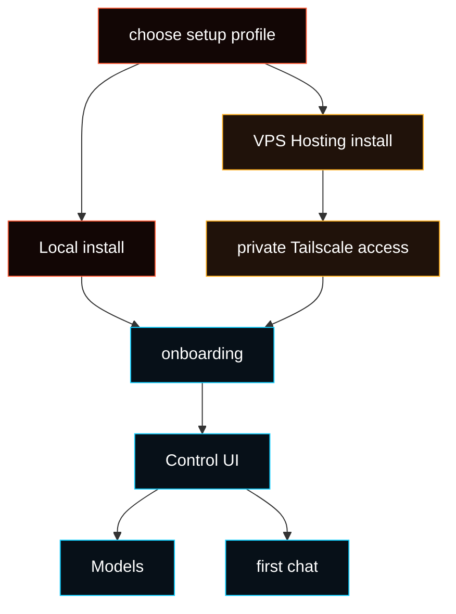

# Install

Already followed [Getting Started](/start/getting-started)? You can usually
continue there. This page is for the two supported setup profiles, platform
notes, hosting details, and maintenance.



## System requirements

- macOS, Linux, or Windows through WSL2
- Git access to the Fased repository
- Node 24, or Node 22.14+ with `node:sqlite`, when you manage Node yourself

<Note>
Use the Fased installer as the public install path. It can install missing
command-line tools and Node on common systems, then runs the right Local or VPS
Hosting setup. Hosted installs may use the published runtime package internally
to avoid a slow source build, but normal users should still start from the curl
installer.
</Note>

<Warning>
Windows has two different paths:

- **Local install on your Windows PC:** use
  [WSL2](https://learn.microsoft.com/en-us/windows/wsl/install) on Windows 11
  or Windows 10 version 2004/build 19041 or newer. Run `wsl --install -d
Ubuntu` in Administrator PowerShell, restart if requested, open Ubuntu, and
  run the Fased installer inside that Ubuntu shell.
- **Managing a hosted VPS from Windows:** use PowerShell or Windows Terminal
  with the Windows Tailscale app online. Use WSL for hosted SSH checks only
  unless Tailscale is also installed and logged in inside WSL.

Do not run the Fased installer, CLI, Gateway, wallet, or signer in native
PowerShell, Command Prompt, Git Bash, or native Windows Node.js. The wallet
signer requires Unix sockets. See the complete [Windows (WSL2)
guide](/platforms/windows).
</Warning>

## Pick local or VPS hosting

These are different setup paths. Start with **Local** unless you already know
you need an always-on server. Choose **VPS Hosting** only on the server that
will run Fased all the time. For the first hosted VPS, Ubuntu LTS is the
recommended default.

- **Local install**
  - Best for: your own computer: macOS Terminal, Windows with WSL2 Ubuntu,
    Linux desktop, or dev box.
  - Posture: lowest setup risk. Gateway stays on your machine; a home router
    usually does not expose it to the public internet. Tailscale is optional.
  - Access dependency: your local OS login.
- **VPS Hosting**
  - Best for: always-on cloud server.
  - Posture: higher exposure by default because a VPS is internet-reachable.
    Hosted setup closes public admin ports and requires Tailscale for private
    dashboard and SSH access.
  - Access dependency: your Tailscale account plus the VPS provider console for
    emergency recovery.

<Warning>
If you lose access to the Tailscale account used for a hosted VPS, normal
dashboard and SSH access can be lost. Recovery then depends on the VPS
provider's web console/rescue mode/rebuild tools. Keep your Tailscale account
recovery options and VPS provider console access working.
</Warning>

<Tabs>
  <Tab title="Local install">
    Use this on your own machine. Most local users fit one of these paths:

    - **macOS:** run the command in Terminal.
    - **Windows:** install WSL2 with Ubuntu, then run the command inside the
      Ubuntu shell. PowerShell is not the Fased runtime shell.
    - **Linux:** run the command in your distro terminal.

    ```bash
    curl -fsSL https://raw.githubusercontent.com/fased-ai/fased/main/install.sh | bash -s -- --local
    ```

    Local setup keeps the Gateway on this machine and does not apply VPS SSH or
    firewall hardening. Tailscale is optional for Local.

    After local setup:

    1. Keep the dashboard tab that opens, or run `fased dashboard`.
    2. Go to **Agent > Models** and connect a model provider.
    3. Open **Chat** and send a test message.

    Successful install output is intentionally short. If a step fails, the
    installer prints the full log path under `~/.fased/logs/`.

    If `~/.fased` already exists, the installer keeps it. Normal upgrades
    preserve sessions, wallets, provider keys, channel settings, mining/bond
    state, and gateway tokens. Advanced reset/test installs use
    `FASED_EXISTING_DATA_ACTION` from the installer reference.

    If old channel credentials create warnings, run `fased doctor --fix`; it
    can disable stale channel entries without deleting wallets or provider
    secrets.

    Local setup finishes with a health check for the service path, gateway
    token, dashboard HTTP 200, and gateway online state. Later, use
    `fased health` as the single pass/fail check for the running Gateway. Use
    `fased health --verbose` only when you want optional channel details.

  </Tab>
  <Tab title="VPS Hosting install">
    Use this on a clean Linux VPS. Ubuntu LTS is the recommended default for a
    first hosted setup. Debian is close to the same path.

    Honest support boundary:

    - **Hosted VPS hardening:** Ubuntu/Fedora/RHEL-family Linux with systemd.
    - **Local/dev install:** Alpine, Arch, macOS, FreeBSD, WSL2, and common
      Linux desktops until their hosted hardening paths are validated
      separately.

    A 1 vCPU / 1 GB RAM VPS can work as a minimum test server, but expect slow
    install/onboarding. For a smoother public server, use at least 2 GB RAM; 2
    vCPU / 4 GB RAM is more comfortable.

    Hosted setup uses two machines:

    - **Your own computer:** opens the dashboard and runs SSH checks.
    - **The VPS:** runs Fased Agent.

    ### 1. Connect your local PC to Tailscale

    Your own computer must join the same Tailscale account/tailnet as the VPS.
    That is the computer where you will open the dashboard and run SSH checks.
    Before you start the remote VPS installer, shut down local VPNs such as
    Mullvad, Proton VPN, NordVPN, corporate VPN clients, and browser/device VPN
    apps. For Fased hosted setup, do not run another VPN beside Tailscale while
    verifying dashboard and SSH access. Other VPNs can override DNS, firewall
    rules, or the `100.64.0.0/10` address range that Tailscale uses.

    If you need Mullvad-style privacy while using Tailscale, use Tailscale's
    paid Mullvad VPN add-on instead of running the Mullvad app beside
    Tailscale. That add-on supports Mullvad only; it does not cover Proton,
    NordVPN, corporate VPN clients, or other VPN providers. See
    [Other VPNs and Mullvad](/gateway/tailscale#other-vpns-and-mullvad).

    <Tabs>
      <Tab title="Windows">
        Install the Tailscale app from
        [tailscale.com/download](https://tailscale.com/download), sign in, and
        use PowerShell or Windows Terminal for checks. Disconnect other local
        VPNs first.

        PowerShell uses the Windows Tailscale app/service. If you use WSL
        instead, install and sign into Tailscale inside WSL too.
      </Tab>
      <Tab title="macOS">
        Install the Tailscale app from
        [tailscale.com/download](https://tailscale.com/download) or the App
        Store, sign in, and use Terminal for checks.
      </Tab>
      <Tab title="Ubuntu">
        Use this for Ubuntu, Debian, or Kali local computers:

        ```bash
        curl -fsSL https://tailscale.com/install.sh | sh
        sudo systemctl enable --now tailscaled
        sudo tailscale up
        tailscale status
        tailscale ip -4
        ```
      </Tab>
      <Tab title="Fedora">
        ```bash
        curl -fsSL https://tailscale.com/install.sh | sh
        sudo systemctl enable --now tailscaled
        sudo tailscale up
        tailscale status
        tailscale ip -4
        ```
      </Tab>
      <Tab title="Arch">
        ```bash
        sudo pacman -S tailscale
        sudo systemctl enable --now tailscaled
        sudo tailscale up
        tailscale status
        tailscale ip -4
        ```
      </Tab>
    </Tabs>

    Do not continue until `tailscale status` shows your local computer online
    and `tailscale ip -4` prints a `100.x.x.x` address. If status says it failed
    to connect to local `tailscaled`, start the daemon with
    `sudo systemctl enable --now tailscaled` on Linux, then rerun
    `sudo tailscale up` and sign in.

    Other private-access systems are custom deployments. The standard hosted
    installer does not configure or verify WireGuard, Headscale, ZeroTier,
    bastion hosts, or manual SSH tunnels. If you replace Tailscale, you own
    dashboard exposure, SSH rules, TLS, firewall rules, and recovery.

    Do not paste the Linux VPS install commands into PowerShell unless
    PowerShell is already connected to the VPS over SSH. The commands below run
    **inside the VPS SSH session**.

    ### 2. SSH into the VPS

    First SSH into the fresh VPS using the login your VPS provider gives you,
    often `root@YOUR_PUBLIC_VPS_IP`:

    ```bash
    ssh root@YOUR_PUBLIC_VPS_IP
    ```

    ### 3. Install Fased and connect through Tailscale

    Use the same hosted command on supported VPS systems:

    ```bash
    curl -fsSL https://raw.githubusercontent.com/fased-ai/fased/main/install.sh | bash -s -- --hosting
    ```

    The hosted installer installs/starts Tailscale when needed. When Fased
    prints a Tailscale login URL, open that URL in your local PC browser, sign
    in, and approve. After that, the VPS is added to your tailnet
    automatically.

    <Accordion title="If you already ran Tailscale manually and it is stuck">
    Avoid running `tailscale up --ssh` manually before Fased. On some VPS
    images, the Tailscale UI can show the VPS as approved while the manual CLI
    command keeps waiting. If you already ran it and it is stuck, open a second
    provider SSH session and verify that Tailscale is actually online:

    ```bash
    tailscale status
    tailscale ip -4
    ```

    If those commands show the VPS and a `100.x.x.x` tailnet IP, press
    `Ctrl+C` in the stuck `tailscale up --ssh` terminal and continue with the
    Fased hosted install command. If they do not show a tailnet IP, run
    `tailscale logout`, restart `tailscaled`, and run the Fased hosted install
    command again.
    </Accordion>

    The Fased installer bootstraps the repository itself. A fresh VPS does not
    need `git clone` first. If the image is so small that `curl` is missing,
    install only the downloader for that VPS OS, then rerun the hosted command
    above.

    <Accordion title="Minimal VPS image: install curl first">
      <Tabs>
        <Tab title="Ubuntu">
          Use this for Ubuntu, Debian, or Kali VPS images:

          ```bash
          apt-get update
          apt-get install -y curl ca-certificates
          ```
        </Tab>
        <Tab title="Fedora">
          ```bash
          dnf install -y curl ca-certificates
          ```
        </Tab>
        <Tab title="RHEL">
          Use this for RHEL-family VPS images:

          ```bash
          dnf install -y curl ca-certificates
          ```
        </Tab>
        <Tab title="Arch">
          ```bash
          pacman -Sy --needed --noconfirm curl ca-certificates
          ```
        </Tab>
        <Tab title="Alpine">
          ```bash
          apk add --no-cache curl ca-certificates
          ```
        </Tab>
      </Tabs>
    </Accordion>

    Hosted setup keeps `/home/app/fased` as the app checkout for updates and
    repair commands. The installer may use the published runtime package behind
    the scenes so the full source tree does not need to build on small VPS
    hosts.

    Current installers try a clean fast-forward update from Git before setup.
    If you already started from an older installer and it stopped, run
    `git pull --ff-only origin main` once in the checkout and rerun
    `./install.sh --hosting`.

    If you start as `root`, the installer creates a non-root `app` user,
    prepares `/home/app/fased`, re-runs itself there, and removes the temporary
    root checkout after successful hosted onboarding.

    The installer adds the VPS to the same Tailscale tailnet before setup can
    finish. The hosted profile keeps the raw Gateway port closed.

    Before SSH/firewall lock-down, setup pauses and asks you to test terminal
    access from your own computer. That computer must have Tailscale installed,
    running, and signed into the same tailnet as the VPS. Do not run the check
    commands inside the VPS SSH session.

    <Accordion title="Tailscale check, VPN, and MagicDNS troubleshooting">
    If your own computer says `tailscale: command not found`, return to step 1
    and install Tailscale on your local PC first. If `tailscale status` says it
    cannot connect to local `tailscaled`, the local Tailscale service is not
    running; start it and sign in before continuing. A separate VPN on your own
    computer can interfere with Tailscale DNS or routing. Turn the other VPN off
    for hosted setup. If it must stay on later, use the `100.x.x.x` Tailscale IP
    instead of the hostname and configure split tunneling in that VPN.

    If the VPN you want is Mullvad, prefer Tailscale's paid Mullvad VPN add-on
    instead of running the Mullvad desktop/mobile VPN app beside Tailscale. The
    add-on is enabled in the Tailscale admin console, then granted to devices;
    it supports Mullvad only. See
    [Other VPNs and Mullvad](/gateway/tailscale#other-vpns-and-mullvad).

    If `tailscale ping 100.x.x.x` works but
    `ssh app@YOUR_VPS_TAILSCALE_NAME` fails with a hostname/DNS error,
    Tailscale is connected but MagicDNS is being blocked or overridden, often
    by the other VPN. Turn the other VPN off, fix its DNS split-tunnel rules, or
    use the Tailscale IP directly:

    ```bash
    tailscale status
    tailscale ping YOUR_VPS_TAILSCALE_NAME
    tailscale ping 100.x.x.x
    ssh app@YOUR_VPS_TAILSCALE_NAME
    ssh app@100.x.x.x
    ```

    If `tailscale ping` says `no matching peer`, your computer and the VPS are
    not in the same Tailscale network. Sign your computer into the same
    Tailscale account, or re-authenticate Tailscale on the VPS, then rerun the
    check.
    </Accordion>

    Only confirm after that command connects through Tailscale and opens
    `/home/app/fased`. If it does not connect, setup stops before disabling root
    or password SSH.
    If the original VPS login was password-only and no SSH public key is
    available to copy, the wizard uses Tailscale SSH first:

    ```bash
    tailscale ssh app@YOUR_VPS_TAILSCALE_NAME
    ```

    Use the SSH public key fallback only if Tailscale SSH is unavailable in your
    tailnet.

    At the end, onboarding prints two access paths:

    - **Web dashboard:** open the printed `https://...ts.net/` URL in a browser
      on your own computer. That computer must be signed into the same
      Tailscale account. Save the gateway token in case the browser asks for it.
    - **SSH terminal:** use regular SSH over Tailscale as `app` for CLI commands,
      updates, logs, and repairs. Run it from a computer signed into the same
      Tailscale network.

    After hosted onboarding completes, leave the original root bootstrap shell
    and reconnect over Tailscale as the `app` user from your own computer:

    ```bash
    ssh app@YOUR_VPS_TAILSCALE_NAME
    fased status
    fased dashboard
    ```

    The `app` shell is a full Linux shell on the VPS and is configured to start
    in `/home/app/fased`.

    Hosted VPS setup uses the root-managed `fased-gateway.service`, and that
    service runs as the non-root `app` user. It should not ask for the `app`
    password to run `sudo loginctl enable-linger app`.

    Root SSH is for initial bootstrap or emergency repair, not normal
    operation. `http://localhost:18789` is only the advanced SSH tunnel fallback:
    it works on your local computer after you start the tunnel shown by
    onboarding and leave it running. If SSH says
    `bind [127.0.0.1]:18789: Address already in use`, Tailscale worked but
    your local port is busy. Stop the local Fased gateway, or forward a
    different local port:

    ```bash
    ssh -N -L 18790:127.0.0.1:18789 app@YOUR_VPS_TAILSCALE_NAME
    ```

    Then open `http://localhost:18790/`.

  </Tab>
</Tabs>

## Update after setup

Normal end-user updates use the stable channel:

```bash
cd ~/fased
fased update status
fased update
```

On a hosted VPS, run updates as `app` over Tailscale:

```bash
ssh app@YOUR_VPS_TAILSCALE_NAME
fased update status
fased update
```

After hosted onboarding, SSH as `app` should open directly in `/home/app/fased`.
If it does not, fix the hosted login/shell setup before updating.

Stable resolves to the latest stable release tag for repo checkouts. It does
not follow every commit on `main`. For package installs, stable uses npm
`latest` when the package manager path is active and detected. Use the developer
channel only when you intentionally want latest development commits:

```bash
fased update --channel dev
```

For development/testing from a source checkout:

```bash
git checkout main
git pull --ff-only origin main
./install.sh --source-install
```

Use `./install.sh --hosting` for that same development checkout flow on a
hosted VPS by adding `--source-install`, and run it as `app` from
`/home/app/fased`.

The installer is repo-backed from `fased-ai/fased`.

Manual `npm install -g @fased/fased` is an advanced local/dev or self-managed
host path. It is not the recommended VPS hosting path. For VPS hosting, use the
hosted installer so Fased can set up the `app` runtime, Tailscale-private
access, and closed public admin posture.

<Note>
Do not use normal local `fased onboard` on a laptop to configure a remote VPS.
Run the hosted install **on the VPS itself**. If you choose Hosting from a
session that cannot apply host security, onboarding stops with “Hosted setup
unavailable” instead of creating an incomplete hosted setup.
</Note>

## Installer Behavior

The curl installer:

- checks the host environment
- checks Node and installs supported Linux dependencies when needed
- installs the `fased` CLI
- runs onboarding by default
- opens the path to the browser Control UI

To install the CLI without onboarding:

```bash
./install.sh --no-onboard
```

For flags and automation details, see [Installer Reference](/install/installer).

## Updating after install

Use `fased update` for normal updates. On a hosted VPS, log in as the `app`
user through Tailscale first:

```bash
ssh app@YOUR_VPS_TAILSCALE_NAME
fased update status
fased update
```

The browser Control UI reports version and update availability under
**Advanced > Debug > Update Status**. Run the actual update from the CLI.
Rerun `./install.sh` for repair/reinstall behavior; the installer refreshes a
clean checkout and supported Linux Local and VPS Hosting profiles prefer the
verified prebuilt runtime artifact.

## What onboarding does

Onboarding creates the baseline install: state directory, config, workspace,
Gateway service, dashboard access, and selected hosting posture.

It does not configure every Agent capability. After install, continue in the
Control UI from the selected Agent:

1. **Models**
2. **Chat**
3. **Channels**
4. **Services**
5. **Skills / Tools**
6. **Memory**
7. **Tasks**
8. Wallets, Mining, and Fased Network only when you intentionally enable them

<Note>
Pre-launch installs keep Satcoin mainnet IDs empty. After official Satcoin
mainnet proof is published, use **Mining > Sync** to verify the signed manifest
and write `config/sat-runtime.env`.
</Note>

## VPS hosting posture

For a hosted or VPS install:

1. start from a clean Linux VPS
2. create/sign into Tailscale and join the VPS using the OS-specific hosted steps above
3. run `./install.sh --hosting` or choose **Hosting** during onboarding
4. after onboarding, reconnect as `app` over the Tailscale network
5. avoid exposing the raw Gateway port publicly

Normal manual setup does **not** need a Tailscale API key. If the VPS is not
logged in, Tailscale prints a login URL in the SSH terminal. Open that URL in
your local computer's browser, then return to the SSH session. Use
`--ts-authkey` only for non-interactive provisioning.

If Tailscale is missing or not logged in, Hosting onboarding tries to install or
start it. If it cannot get a valid tailnet IP, it refuses to apply the SSH/UFW
lockdown because you could lose remote access.

Use [VPS hosting](/install/vps), [Hetzner](/install/hetzner), or
[GCP](/install/gcp) for provider-specific commands.

## Advanced References

Normal users should choose **Local install** or **VPS Hosting install** above.
The pages below are references for advanced environments after that profile
choice is clear.

| Reference                | Status                    | Use when                                                      |
| ------------------------ | ------------------------- | ------------------------------------------------------------- |
| Repo-backed `install.sh` | Main bootstrap            | You are using either Local or VPS Hosting                     |
| Source checkout          | Contributor path          | You want to build, test, or patch the repo directly           |
| Docker                   | Supported Local container | You want a containerized Gateway on your own computer         |
| Podman                   | Experimental Gateway-only | You want a local rootless Gateway without wallet/mining       |
| Nix                      | Advanced/declarative path | You already manage systems with Nix/Home Manager              |
| Bun                      | Experimental dev path     | You want local TypeScript iteration; use Node for the Gateway |
| Remote client mode       | Client mode               | This machine should connect to an existing Gateway            |
| Task worker install      | After setup               | You want separate task workers once a Gateway already exists  |

<CardGroup cols={2}>
  <Card title="Docker" href="/install/docker" icon="container">
    Supported Local containerized Gateway and sandbox reference. Not for VPS hosting.
  </Card>
  <Card title="Podman" href="/install/podman" icon="container">
    Experimental local Gateway-only container. Wallet and mining are unsupported.
  </Card>
  <Card title="Nix" href="/install/nix" icon="snowflake">
    Declarative install path for Nix users.
  </Card>
  <Card title="Node.js" href="/install/node" icon="terminal">
    Runtime version and PATH troubleshooting.
  </Card>
</CardGroup>

## Package manager rule

The repository itself uses `pnpm` internally. The curl installer installs or
activates `pnpm` only when a source build is needed. Do not run plain
`npm install` to install Fased from source.

- `pnpm`: source builds, tests, docs, Docker builds, and contributor workflows.
- `npm`: used by the installer for the published runtime package when that is
  the fastest safe path, plus occasional dependency tooling.
- `Bun`: experimental local development only. Use Node for the Gateway runtime.

## OS support boundary

- Local install: macOS, FreeBSD, WSL2 Ubuntu, and common Linux hosts including
  Ubuntu, Debian, Kali, Fedora, CentOS, AlmaLinux, Rocky Linux, CloudLinux,
  Oracle Linux, Amazon Linux, openSUSE, SLES, Alpine, and Arch.
- Hosted/VPS hardening: Ubuntu/Fedora/RHEL-family Linux with systemd. Alpine,
  Arch, macOS, and FreeBSD are local/dev install targets until their hosted
  hardening paths are validated separately.
- Containers: the full Docker Gateway is Local only. Podman is experimental,
  Gateway-only, and does not support wallet or mining. VPS Hosting is host-managed.
- Native Windows: use WSL2 for the Gateway. The native Windows app/runtime path
  is not the public install path.

## Validate install

```bash
fased doctor
fased status
fased dashboard
```

Good result:

- `fased doctor` reports no blocking setup errors
- `fased status` shows the Gateway target you expect
- `fased dashboard` opens an auth-ready Control UI link

## After install

Use this order for a new install:

1. verify install health
2. confirm private operator access
3. configure model access
4. send a first chat message
5. add channels and services as needed
6. define wallet and signer posture before using wallet-related features
7. enable Mining or Fased Network only after the base Agent is stable

Successful installation means Fased is installed. It does not replace the
setup checks for chat apps, services, wallets, mining, or network roles.

For a hosted VPS, keep your local computer signed into Tailscale whenever you
need the hosted dashboard or `ssh app@YOUR_VPS_TAILSCALE_NAME`. If the
dashboard or SSH stops working after you re-enable another VPN, turn that VPN
off and test `tailscale status`, `tailscale ping`, and the `100.x.x.x`
Tailscale IP. For Mullvad, use Tailscale's paid Mullvad VPN add-on/Mullvad exit
nodes instead of running the Mullvad VPN app beside Tailscale. The add-on is
Mullvad-only; other VPN providers still need their own split-tunnel or firewall
workaround.

## Troubleshooting: `fased` not found

<Accordion title="PATH diagnosis and fix">
  Quick diagnosis:

```bash
node -v
ls -l "$HOME/.local/bin/fased"
echo "$PATH"
```

The repo-backed installer writes the launcher to
`${FASED_CLI_BIN_DIR:-$HOME/.local/bin}/fased`. If `$HOME/.local/bin` is not on
your PATH, your shell cannot find `fased`.

Fix by adding it to `~/.zshrc` or `~/.bashrc`:

```bash
export PATH="$HOME/.local/bin:$PATH"
```

Then open a new terminal, or run `rehash` in zsh / `hash -r` in bash.
</Accordion>

## Update, migrate, uninstall

<CardGroup cols={3}>
  <Card title="Updating" href="/install/updating" icon="refresh-cw">
    Refresh the repo-backed install.
  </Card>
  <Card title="Migrating" href="/install/migrating" icon="arrow-right">
    Move state and workspace to a new machine.
  </Card>
  <Card title="Uninstall" href="/install/uninstall" icon="trash-2">
    Remove services, CLI, and state.
  </Card>
</CardGroup>
