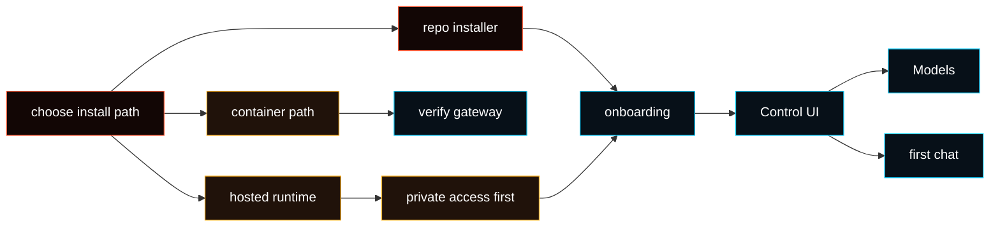

# Install

Already followed [Getting Started](/start/getting-started)? You can usually
continue there. This page is for install methods, platform notes, hosting
profiles, and maintenance.



## System requirements

- [Node 24 recommended, or Node 22.14+ with `node:sqlite`](/install/node)
- macOS, Linux, or Windows through WSL2
- `pnpm` only when building from source

<Note>
On Windows, use [WSL2](https://learn.microsoft.com/en-us/windows/wsl/install)
and run Fased inside Ubuntu.
</Note>

## Pick local or VPS hosting

These are different setup paths. Choose **Local** for a laptop, desktop, dev
box, or WSL2. Choose **VPS Hosting** only on the server that will run Fased
all the time.

<Tabs>
  <Tab title="Local install">
    Use this on your own machine:

    ```bash
    git clone https://github.com/fased-ai/fased.git fased
    cd fased
    ./install.sh
    ```

    Local setup keeps the Gateway on this machine and does not apply VPS SSH or
    firewall hardening. Tailscale is optional for Local.

  </Tab>
  <Tab title="VPS Hosting install">
    Use this on a clean Linux VPS:

    ```bash
    curl -fsSL https://tailscale.com/install.sh | sh
    sudo tailscale up --ssh

    git clone https://github.com/fased-ai/fased.git fased
    cd fased
    ./install.sh --hosting
    ```

    If you start as `root`, the installer creates a non-root `app` user,
    prepares `/home/app/agent`, and re-runs itself there.

    Hosting requires the VPS to be in your Tailscale tailnet before the
    Gateway is treated as remotely reachable. The hosted profile keeps the
    raw Gateway port closed and routes operator access through Tailscale or a
    deliberate private tunnel.

    Save the gateway token printed at the end. From a later root SSH session,
    run CLI commands as `app`, for example `sudo -iu app fased dashboard`.

  </Tab>
</Tabs>

The installer is repo-backed from `fased-ai/fased`.

<Note>
Do not use normal local `fased onboard` on a laptop to configure a remote VPS.
Run the hosted install **on the VPS itself**. If you choose Hosting from a
session that cannot apply host security, onboarding stops with “Hosted setup
unavailable” instead of creating an incomplete hosted setup.
</Note>

## Basic installer command

```bash
git clone https://github.com/fased-ai/fased.git fased
cd fased
./install.sh
```

The installer:

- checks the host environment
- checks Node and installs supported Linux dependencies when needed
- installs the `fased` CLI
- runs onboarding by default
- opens the path to the browser Control UI

To install the CLI/runtime without onboarding:

```bash
./install.sh --no-onboard
```

For flags and automation details, see [Installer Reference](/install/installer).

## What onboarding does

Onboarding creates the baseline runtime: state directory, config, workspace,
Gateway service, dashboard access, and selected hosting posture.

It does not configure every Agent capability. After install, continue in the
Control UI from the selected Agent:

1. **Models**
2. **Chat**
3. **Channels**
4. **Services**
5. **Skills / Tools**
6. **Memory**
7. **Tasks**
8. Wallets, Mining, and Fased Network only when you intentionally enable them

<Note>
Pre-launch installs keep Satcoin runtime IDs empty. After official Satcoin
mainnet proof is published, use **Mining > Sync** to verify the signed manifest
and write `config/sat-runtime.env`.
</Note>

## VPS hosting posture

For a hosted or VPS runtime:

1. start from a clean Linux VPS
2. create/sign into Tailscale and join the VPS to your tailnet with `sudo tailscale up --ssh`
3. run `./install.sh --hosting` or choose **Hosting** during onboarding
4. keep admin access private through Tailscale or an SSH tunnel
5. avoid exposing the raw Gateway port publicly

Normal manual setup does **not** need a Tailscale API key. If the VPS is not
logged in, Tailscale prints a login URL in the SSH terminal. Open that URL in
your local computer's browser, then return to the SSH session. Use
`--ts-authkey` only for non-interactive provisioning.

If Tailscale is missing or not logged in, Hosting onboarding tries to install or
start it. If it cannot get a valid tailnet IP, it refuses to apply the SSH/UFW
lockdown because you could lose remote access.

Use [VPS hosting](/install/vps), [Hetzner](/install/hetzner), or
[GCP](/install/gcp) for provider-specific commands.

## Install method map

| Method                   | Status                    | Use when                                                              |
| ------------------------ | ------------------------- | --------------------------------------------------------------------- |
| Repo-backed `install.sh` | Recommended public path   | macOS, Linux, WSL2, local laptop, or VPS runtime                      |
| Source checkout          | Contributor path          | You want to build, test, or patch the repo directly                   |
| Hosted/VPS profile       | Supported                 | You want an always-on Linux host with private access first            |
| Docker                   | Supported optional path   | You want a containerized Gateway or sandbox validation                |
| Podman                   | Supported container path  | You want rootless containers on Linux                                 |
| Nix                      | Advanced/declarative path | You already manage runtimes with Nix/Home Manager                     |
| Bun                      | Experimental dev path     | You want local TypeScript iteration; use Node for the Gateway runtime |
| Remote client mode       | Supported client mode     | This machine should connect to an existing Gateway                    |
| Task worker install      | Supported after setup     | You want separate task workers once a Gateway/runtime already exists  |

<CardGroup cols={2}>
  <Card title="Docker" href="/install/docker" icon="container">
    Containerized Gateway and sandbox reference.
  </Card>
  <Card title="Podman" href="/install/podman" icon="container">
    Rootless container path for Linux.
  </Card>
  <Card title="Nix" href="/install/nix" icon="snowflake">
    Declarative install path for Nix users.
  </Card>
  <Card title="Node.js" href="/install/node" icon="terminal">
    Runtime version and PATH troubleshooting.
  </Card>
</CardGroup>

<Note>
Public npm/pnpm global installation is not the normal public setup path yet.
Use the repo-backed installer until a package release is published and
documented.
</Note>

## Validate install

```bash
fased doctor
fased status
fased dashboard
```

Good result:

- `fased doctor` reports no blocking setup errors
- `fased status` shows the Gateway target you expect
- `fased dashboard` opens an auth-ready Control UI link

## After install

Use this order for a new runtime:

1. verify runtime health
2. confirm private operator access
3. configure model access
4. send a first chat message
5. add channels and services as needed
6. define wallet and signer posture before using wallet-related features
7. enable Mining or Fased Network only after the base runtime is stable

Successful installation means the runtime exists. It does not replace the
setup checks for channels, services, wallets, mining, or network roles.

## Troubleshooting: `fased` not found

<Accordion title="PATH diagnosis and fix">
  Quick diagnosis:

```bash
node -v
ls -l "$HOME/.local/bin/fased"
echo "$PATH"
```

The repo-backed installer writes the launcher to
`${FASED_CLI_BIN_DIR:-$HOME/.local/bin}/fased`. If `$HOME/.local/bin` is not on
your PATH, your shell cannot find `fased`.

Fix by adding it to `~/.zshrc` or `~/.bashrc`:

```bash
export PATH="$HOME/.local/bin:$PATH"
```

Then open a new terminal, or run `rehash` in zsh / `hash -r` in bash.
</Accordion>

## Update, migrate, uninstall

<CardGroup cols={3}>
  <Card title="Updating" href="/install/updating" icon="refresh-cw">
    Refresh the repo-backed runtime.
  </Card>
  <Card title="Migrating" href="/install/migrating" icon="arrow-right">
    Move state and workspace to a new machine.
  </Card>
  <Card title="Uninstall" href="/install/uninstall" icon="trash-2">
    Remove services, CLI, and state.
  </Card>
</CardGroup>
