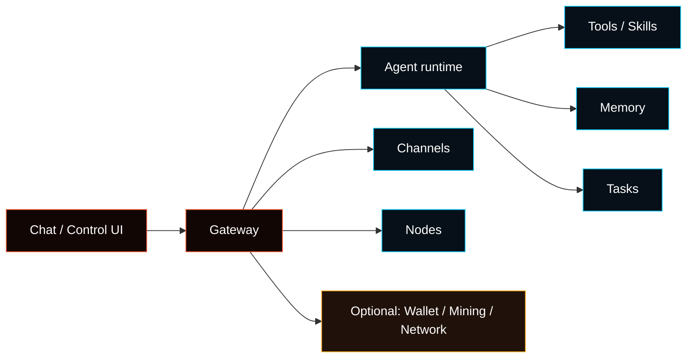

---
read_when:
  - 新規ユーザーにFasedを紹介するとき
summary: Fasedは、Gateway、Control UI、チャネル、ツール、タスク、ウォレット関連モジュールを備えたセルフホスト型エージェントランタイムです。
title: Fased
x-i18n:
  generated_at: "2026-05-31T00:00:00Z"
  model: manual
  provider: codex
  source_path: index.md
  workflow: 15
---

# Fased

**Fasedは、あなたが管理するマシンまたはサーバーで動くセルフホスト型エージェントランタイムです。**

まずはブラウザのControl UIでチャットできる状態を作ります。その後、必要に応じてチャネル、モデル、サービス、スキル、タスク、ノード、ウォレット、Mining、Fased Networkを追加します。

<Columns>
  <Card title="はじめに" href="/start/getting-started" icon="rocket">
    インストールから最初のブラウザチャットまでの最短ルート。
  </Card>
  <Card title="ウィザード" href="/start/wizard" icon="sparkles">
    `fased onboard`でランタイム、Gateway、ワークスペースを設定します。
  </Card>
  <Card title="Control UI" href="/web/control-ui" icon="layout-dashboard">
    Agent、Models、Channels、Services、Tasksをブラウザで管理します。
  </Card>
</Columns>

## 何をするものか

Fasedはチャットアプリだけではありません。Gatewayがランタイムの中心になり、Agentのセッション、ルーティング、ツール、メモリ、タスク、ノード接続を扱います。



## 基本の流れ

1. インストールする。
2. `fased onboard`でGatewayとワークスペースを作る。
3. `fased dashboard`でControl UIを開く。
4. **Agent > Models**でモデルを設定する。
5. **Chat**で最初のメッセージを送る。
6. 必要な機能だけ追加する。

```bash
git clone https://github.com/fased-ai/fased.git fased
cd fased
./install.sh
fased dashboard
```

## 主な領域

<CardGroup cols={2}>
  <Card title="Gateway" href="/gateway" icon="server">
    Control UI、CLI、チャネル、ノードが接続する実行面。
  </Card>
  <Card title="Agents" href="/concepts/agents-sessions-tasks" icon="bot">
    Agent、セッション、保存タスクの基本モデル。
  </Card>
  <Card title="Channels" href="/channels" icon="message-square">
    WhatsApp、Telegram、DiscordなどをAgentへ接続します。
  </Card>
  <Card title="Tools and Skills" href="/tools" icon="wrench">
    Agentが使える操作能力と、外部サービスとの接続。
  </Card>
  <Card title="Nodes" href="/nodes" icon="smartphone">
    ローカル端末の画面、カメラ、Canvas、実行能力をGatewayに接続します。
  </Card>
  <Card title="Wallet / Mining / Network" href="/plugins/crypto/wallet-page" icon="shield">
    ベースランタイムが安定してから有効化するオプションのオペレーターモジュール。
  </Card>
</CardGroup>

## 次に読む

- [Getting Started](/start/getting-started)
- [Wizard](/start/wizard)
- [Install](/install)
- [Features](/concepts/features)
- [Gateway security](/gateway/security)
- [Help](/help)
