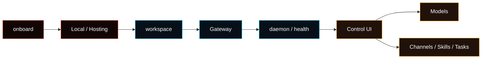

---
read_when:
  - オンボーディングウィザードを実行または確認するとき
  - 新しいマシンにFasedをセットアップするとき
sidebarTitle: Wizard (CLI)
summary: CLIオンボーディングウィザードは、ホスト姿勢、ワークスペース、Gateway、基本ランタイムを設定します。
title: オンボーディングウィザード（CLI）
x-i18n:
  generated_at: "2026-05-31T00:00:00Z"
  model: manual
  provider: codex
  source_path: start/wizard.md
  workflow: 15
---

# オンボーディングウィザード（CLI）

`fased onboard`は、Fasedを動かすための基礎ランタイムを作ります。モデル、チャネル、スキル、サービス、タスクの細かい設定は、Gateway起動後にControl UIで続けます。

```bash
fased onboard
```

再設定やサービス再インストールが必要な場合：

```bash
fased onboard --install-daemon
```

<Note>
`--json`は非対話モードではありません。スクリプトでは`--non-interactive`を使います。
</Note>

## ウィザードが設定するもの



主なステップ：

1. **Quick start または Manual**: 既定値で進めるか、詳細に選ぶか。
2. **Setup profile**: LocalまたはHosting。
3. **Existing config**: 既存設定の更新または修復。
4. **Workspace**: Agentファイルの場所。
5. **Gateway**: Control UI、CLI、チャネルが接続する実行面。
6. **Optional wallet setup**: 必要な場合だけウォレット用途を割り当てる。
7. **Daemon and health**: サービス起動、ヘルスチェック、dashboard案内。

Hostingプロファイルでは、オンボーディング前にTailscaleへ参加し、管理アクセスをprivate pathに寄せます。生のGatewayポートを公開する前提でセットアップしないでください。

## ウィザードが設定しないもの

オンボーディングはベースランタイムをオンラインにします。次はControl UIで設定します：

- **Agent > Models**: モデルプロバイダーまたはローカルモデル。
- **Agent > Channels**: Telegram、Discord、WhatsAppなど。
- **Agent > Services**: Web/search、Gmail、Calendar、GitHub、custom APIなど。
- **Agent > Skills / Tools**: Agentに許可する能力。
- **Agent > Memory**: セッションメモリ、QMD、アーカイブ。
- **Agent > Tasks**: 保存されたタスク定義と実行履歴。
- Wallets、Mining、Fased Network: ベースランタイムが安定してから、必要に応じて設定。

## Local と Hosting

| Profile       | 用途                      | 基本姿勢                              |
| ------------- | ------------------------- | ------------------------------------- |
| Local         | 自分のPCやローカル開発    | loopback Gateway、ローカルControl UI  |
| Hosting       | VPSや常時稼働サーバー     | Tailscale-first、private admin access |
| Remote client | 既存Gatewayへ接続する端末 | Gatewayを新規作成しない               |

Remote modeは、別の場所にあるGatewayへ接続するクライアントだけを構成します。Gatewayがまだ存在しない場合は、先にホスト側でLocalまたはHostingオンボーディングを実行してください。

## 既存設定の扱い

ウィザードを再実行しても、既存設定を自動で消すものではありません。既存設定がある場合は、通常次のどちらかを選びます：

- **Review settings**: 設定を確認し、必要な部分だけ変更する。ウォレット、シークレット、マイニング/ボンド状態は保持されます。
- **Repair sign-in**: 認証またはセッション状態だけを修復する。ウォレットとシークレットは保持されます。

破壊的なリセットが必要な場合だけ、専用のresetコマンドを明示的に使います。

## ウォレット用途

ウォレット設定は通常のチャットには不要です。使う場合は用途を分けます：

- `agent`: Agent関連のウォレット操作。
- `mining`: SAT Mining用。
- `vault`: 保管、bond、ネットワーク関連用途。

Mining用の有効構成ウォレットは1つです。置き換える場合は、まずMiningを停止し、保留中の処理と残高状態を確認してから入れ替えます。

## よく使う確認コマンド

```bash
fased status
fased gateway status
fased doctor
fased dashboard
```

ウォレットまたはMiningを設定した場合：

```bash
fased wallet status --json
fased wallet signer doctor --json
fased mining readiness --wallet mining
```

## 関連ドキュメント

- [Getting Started](/start/getting-started)
- [Install](/install)
- [Control UI Setup](/start/control-ui-setup)
- [Gateway security](/gateway/security)
- [Help](/help)
