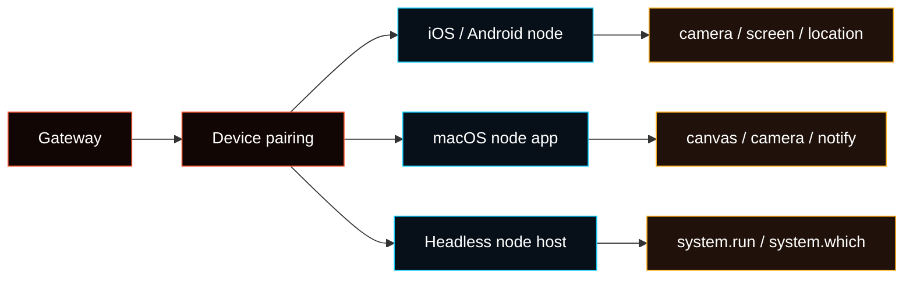

# Nodes

A **node** is a paired device or headless runner that connects to the Gateway
WebSocket with `role: "node"` and exposes device or host commands through
`node.invoke`.

Nodes are optional peripherals. They do not run the Gateway service, and they
are not needed for first-run Agent setup. Use **Advanced > Nodes** when you need
paired-device status, pending pairings, advertised capabilities, runtime
clients, permissions, or command exposure details.



Protocol details: [Gateway protocol](/gateway/protocol).

## What belongs where

- **Advanced > Nodes**: paired node status, pending pairings, capabilities,
  permissions, runtime clients, and raw diagnostics.
- **Agent > Tools**: whether a selected Agent may use node-backed tools.
- **Device settings**: camera, screen, microphone, location, notification, and
  wake-word permissions.
- **Advanced > Config**: raw config only when the setting does not yet have a
  focused page.

For failures, start with [Node troubleshooting](/nodes/troubleshooting).

## Pairing and status

WS nodes use device pairing. The node presents a device identity during
`connect`; the Gateway creates a pairing request for role `node`.

```bash
fased devices list
fased devices approve <requestId>
fased devices reject <requestId>
fased nodes status
fased nodes describe --node <idOrNameOrIp>
```

Notes:

- `nodes status` marks a node as paired when device pairing includes role `node`.
- **Advanced > Nodes** shows the same paired/runtime state in the browser UI.
- `node.pair.*` and `fased nodes pending/approve/reject` remain compatibility
  paths for clients that explicitly call the older pairing methods.

## Node host for system.run

Use a **node host** when the Gateway runs on one machine but shell commands
should execute on another. The model still talks to the Gateway; the Gateway
forwards `exec` calls to the node host when `host=node` is selected.

What runs where:

- **Gateway host**: receives messages, runs the model, routes tool calls.
- **Node host**: executes `system.run` and `system.which`.
- **Approvals**: enforced on the node host through `~/.fased/exec-approvals.json`.

Start a node host:

```bash
export FASED_GATEWAY_TOKEN="<gateway-token>"
fased node run --host <gateway-host> --port 18789 --display-name "Build Node"
```

Install it as a service:

```bash
fased node install --host <gateway-host> --port 18789 --display-name "Build Node"
fased node restart
```

For hosted gateways, prefer Tailscale or a private SSH tunnel. Do not expose the
raw Gateway port publicly just to attach a node host.

SSH tunnel example:

```bash
# Terminal A: forward local 18790 -> gateway 127.0.0.1:18789
ssh -N -L 18790:127.0.0.1:18789 user@gateway-host

# Terminal B: connect the node through the tunnel
export FASED_GATEWAY_TOKEN="<gateway-token>"
fased node run --host 127.0.0.1 --port 18790 --display-name "Build Node"
```

Approve and name the node from the Gateway host:

```bash
fased devices list
fased devices approve <requestId>
fased nodes list
fased nodes rename --node <id|name|ip> --name "Build Node"
```

## Exec approvals and binding

Exec approvals are local to the node host.

```bash
fased approvals get --node <id|name|ip>
fased approvals allowlist add --node <id|name|ip> "/usr/bin/uname"
```

Set the default node for `exec host=node`:

```bash
fased config set tools.exec.host node
fased config set tools.exec.security allowlist
fased config set tools.exec.node "<id-or-name>"
```

Per session:

```text
/exec host=node security=allowlist node=<id-or-name>
```

Related:

- [Node host CLI](/cli/node)
- [Exec tool](/tools/exec)
- [Exec approvals](/tools/exec-approvals)

## Common node commands

Low-level invoke:

```bash
fased nodes invoke --node <idOrNameOrIp> --command canvas.eval --params '{"javaScript":"location.href"}'
```

Higher-level helpers print `MEDIA:<path>` when they create an attachment for the
Agent.

| Capability        | CLI                                                                    |
| ----------------- | ---------------------------------------------------------------------- |
| Canvas snapshot   | `fased nodes canvas snapshot --node <id>`                              |
| Canvas navigation | `fased nodes canvas present --node <id> --target https://example.com`  |
| Canvas eval       | `fased nodes canvas eval --node <id> --js "document.title"`            |
| Camera photo      | `fased nodes camera snap --node <id>`                                  |
| Camera clip       | `fased nodes camera clip --node <id> --duration 10s`                   |
| Screen record     | `fased nodes screen record --node <id> --duration 10s --fps 10`        |
| Location          | `fased nodes location get --node <id>`                                 |
| System command    | `fased nodes run --node <id> -- echo "hello"`                          |
| Notification      | `fased nodes notify --node <id> --title "Ping" --body "Gateway ready"` |

## Capability notes

- `canvas.*`, `camera.*`, and `screen.*` usually require the node app to be
  foregrounded on iOS/Android.
- Camera and screen commands require OS permissions.
- Location is off by default and requires device permission.
- Android `sms.send` is available only on devices that support telephony and
  grant SMS permission.
- Screen and camera clips are duration-limited to avoid oversized payloads.
- `system.run` is gated by exec approvals on macOS node mode and headless node
  hosts.

Focused pages:

- [Camera capture](/nodes/camera)
- [Location command](/nodes/location-command)
- [Media understanding](/nodes/media-understanding)
- [Audio and voice notes](/nodes/audio)
- [Images and media](/nodes/images)
- [Talk mode](/nodes/talk)
- [Voice wake](/nodes/voicewake)

## Permissions map

Nodes may include a `permissions` map in `node.list` / `node.describe`, keyed by
permission name such as `screenRecording` or `accessibility`, with boolean
values (`true` means granted).

## Headless node host

The headless node host connects to the Gateway WebSocket and exposes
`system.run` / `system.which`. It is useful on Linux, Windows, or a server next
to your Gateway.

```bash
fased node run --host <gateway-host> --port 18789
```

Notes:

- Pairing is still required.
- Node state lives in `~/.fased/node.json`.
- Exec approvals live in `~/.fased/exec-approvals.json`.
- Add `--tls` / `--tls-fingerprint` when the Gateway WebSocket uses TLS.
- For hosted gateways, use a private network path instead of public WebSocket
  exposure.

## macOS node mode

The macOS menubar app can connect to the Gateway as a node and expose local
canvas, camera, notification, and exec-host capabilities. In remote mode, prefer
Tailscale or an SSH tunnel to a loopback-bound Gateway.
