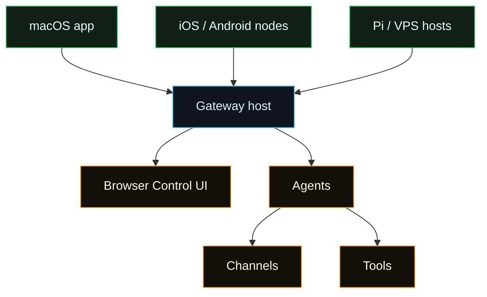

# Platforms

Fased core runs through the Gateway. **Node is the recommended runtime**.

The normal setup path is:

Companion apps exist for macOS and mobile nodes. Windows and Linux companion apps
are planned, but the Gateway is fully supported today. On Windows, the practical
path is WSL2.

## Current UI model

- The Gateway serves the browser Control UI at `http://localhost:18789`.
- Normal setup is Agent-first: open **Agents**, select an Agent, then use its
  **Models**, **Channels**, **Skills**, **Tools**, **Memory**, **Services**, and
  **Tasks** tabs.
- **Dashboard** is the customizable overview board.
- **Chat** is the normal browser chat surface for the selected Agent/session.
- **Advanced** contains raw Config, Debug, and Nodes operator surfaces. Mobile
  and desktop companion devices appear under **Advanced → Nodes**.

## Choose your OS

- [macOS](/platforms/macos): Gateway plus native menu bar companion.
- [Linux](/platforms/linux): Gateway host, local machine, VPS, or always-on node.
- [Windows](/platforms/windows): WSL2 for the Gateway. Native companion app is
  planned.
- [iOS](/platforms/ios): mobile node connected to another Gateway.
- [Android](/platforms/android): mobile node connected to another Gateway.
- [Raspberry Pi](/platforms/raspberry-pi): low-power always-on Gateway host.

## VPS & hosting

- VPS hub: [VPS hosting](/install/vps)
- Raspberry Pi: [Raspberry Pi](/platforms/raspberry-pi)
- Hetzner: [Hetzner](/install/hetzner)
- GCP (Compute Engine): [GCP](/install/gcp)
- DigitalOcean: [DigitalOcean](/platforms/digitalocean)
- Oracle Cloud: [Oracle](/platforms/oracle)

All VPS provider guides use the non-Docker `install.sh --hosting` profile. The
full Docker Gateway is Local only. Fly.io and Render are
[unsupported archives](/install/fly), not hosting options.

## Common links

- Install guide: [Getting Started](/start/getting-started)
- Gateway runbook: [Gateway](/gateway)
- Gateway configuration: [Configuration](/gateway/configuration)
- Service status: `fased gateway status`

## Gateway service install (CLI)

Use one of these (all supported):

- Wizard (recommended): `fased onboard --install-daemon`
- Direct: `fased gateway install`
- Configure flow: `fased configure` → select **Gateway service**
- Repair/migrate: `fased doctor` (offers to install or fix the service)

The service target depends on OS:

- macOS: LaunchAgent (`ai.fased.gateway` or `ai.fased.<profile>`; legacy
  `com.fased.*`)
- Linux/WSL2: systemd user service (`fased-gateway[-<profile>].service`)
