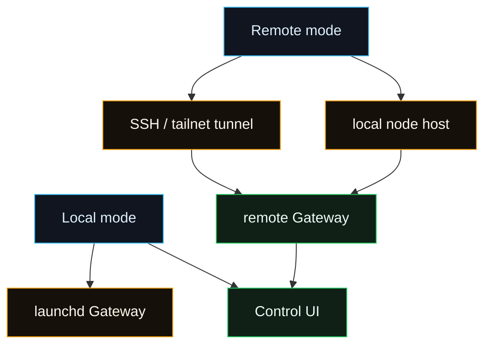

# Fased macOS

<Note>
Managed **Local** install/update targets both Apple Silicon and Intel macOS.
The signed release supplies native Darwin lifecycle, signer, Node, application,
and dependency assets. Hosting remains Linux x86_64-only. A release must include
the Darwin assets before its public installer can be used on macOS.
</Note>

The macOS app is the menu-bar companion for Fased. It owns macOS permissions,
connects to a local or remote Gateway, and exposes Mac capabilities as a node.

Use it when you want native status, permission prompts, local node capabilities,
and one-click entry into the browser Control UI.

## What it does

- Shows native notifications and status in the menu bar.
- Owns TCC prompts (Notifications, Accessibility, Screen Recording, Microphone,
  Speech Recognition, Automation/AppleScript).
- Runs or connects to the Gateway (local or remote).
- Exposes macOS‑only tools (Canvas, Camera, Screen Recording, `system.run`).
- Starts the local node host service in **remote** mode and stops it in
  **local** mode.
- Optionally hosts **PeekabooBridge** for UI automation.
- Uses a repo-backed CLI only for explicit source-development compatibility.

## Managed Local install

Open Terminal as your normal macOS user and run:

```bash
curl -fsSL https://github.com/fased-ai/fased/releases/latest/download/install.sh \
  | bash -s -- --local
```

The installer asks for `sudo` only for the root-managed lifecycle transaction,
installs the public `fased` command, and uses system `launchd` services. It does
not require Homebrew, npm, pnpm, Go, or a checkout.

After onboarding:

```bash
fased status
fased update
```

`fased update` must report `Already current` when the selected channel has not
advanced. Open the Control UI at <http://localhost:18789>.

## Local vs remote mode

- **Local:** the app attaches to the root-managed Local Gateway installed by the
  public lifecycle. Contributor builds may attach to a source-development
  Gateway but do not replace managed acceptance.
- **Remote**: the app connects to a Gateway over SSH/Tailscale and does not
  start a local Gateway.
  The app starts the local **node host service** so the remote Gateway can reach
  this Mac.
  The app does not spawn the Gateway as a child process.



## launchd control

The managed Local profile owns system LaunchDaemons under
`/Library/LaunchDaemons` with instance-bound `ai.fased.*` labels. The public
`fased` command is the user interface; these commands are maintainer diagnostics:

```bash
sudo launchctl print system/ai.fased.lifecycle.<instance>
```

Older source-development LaunchAgents are separate and are not managed release
evidence.

## Node capabilities (mac)

The macOS app presents itself as a node. Common commands:

- Canvas: `canvas.present`, `canvas.navigate`, `canvas.eval`, `canvas.snapshot`,
  `canvas.a2ui.*`
- Camera: `camera.snap`, `camera.clip`
- Screen: `screen.record`
- System: `system.run`, `system.notify`

The node reports a `permissions` map so agents can decide what’s allowed.

Node service + app IPC:

- When the headless node host service is running in remote mode, it connects to
  the Gateway WebSocket as a node.
- `system.run` executes in the macOS app UI/TCC context over a local Unix socket;
  prompts and output stay in-app.

For protocol details, see [macOS IPC](/platforms/mac/xpc).

## Exec approvals (system.run)

`system.run` is controlled by **Exec approvals** in the app. Approval policy is
stored locally on the Mac in:

```
~/.fased/exec-approvals.json
```

Key behavior:

- Allowlist entries match resolved binary paths.
- Shell control syntax requires explicit approval unless the shell path is
  already allowed.
- Environment overrides are filtered before the command runs.
- "Always Allow" persists the approved executable path where it can be resolved
  cleanly.

For the security model, see [Gateway security](/gateway/security).

## Deep links

The app registers the `fased://` URL scheme for local actions.

### `fased://agent`

Triggers a Gateway `agent` request.

```bash
open 'fased://agent?message=Hello%20from%20deep%20link'
```

Without an unattended key, the app asks for confirmation and keeps the request
bounded. With a valid key, the request can run unattended for personal
automation.

## Onboarding flow (typical)

1. Run the managed Local installer.
2. Complete Gateway, Wallet, model, and optional component onboarding.
3. Optionally install and launch **FasedAgent.app** for native Mac permissions
   and node capabilities.
4. Open `http://localhost:18789` for the Control UI.
5. Finish normal setup in **Agents**: choose model refs, channel accounts,
   skills, tools, memory, and tasks for the selected Agent.
6. Use the repo-backed developer CLI if you need terminal access.

## Build & dev workflow (native)

- `cd apps/macos && swift build`
- `swift run FasedAgent` (or Xcode)
- Package app: `scripts/package-mac-app.sh`

## Debug gateway connectivity (macOS CLI)

Use the debug CLI to test the same Gateway handshake and discovery path the app
uses.

```bash
cd apps/macos
swift run fased-mac connect --json
swift run fased-mac discover --timeout 3000 --json
```

Compare with `fased gateway discover --json` when Bonjour or tailnet discovery
does not match the app.

## Remote connection plumbing (SSH tunnels)

Remote mode uses either an SSH tunnel or a direct private Gateway URL. For setup
steps, see [macOS remote access](/platforms/mac/remote). For protocol details,
see [Gateway protocol](/gateway/protocol).

## Related docs

- [Gateway runbook](/gateway)
- [Gateway (macOS)](/platforms/mac/bundled-gateway)
- [macOS permissions](/platforms/mac/permissions)
- [macOS remote access](/platforms/mac/remote)
- [Canvas](/platforms/mac/canvas)
