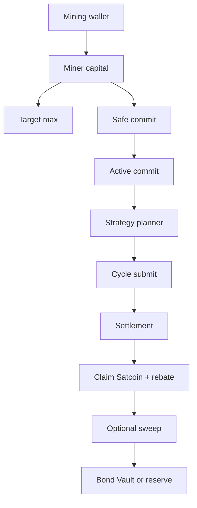
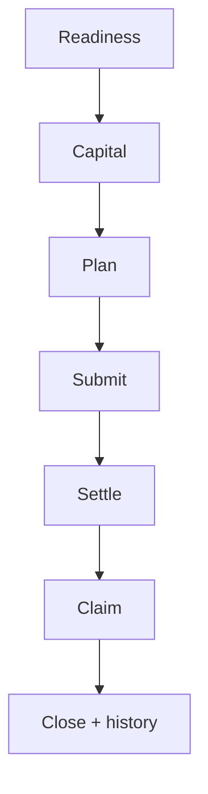

# Advanced Satcoin mining

Advanced mining is about keeping the loop stable while you tune capital posture,
strategy, claim, sweep, and recovery.

Start here after the singleton Mining wallet is configured, funded,
initialized, and already completing small cycles.

## Operator model



Read it like this:

- wallet SOL pays transaction fees and keeps the signer alive
- wallet SOL also pays miner-cycle account rent and claim ATA rent when needed
- miner capital is the SOL pool used by the Satcoin program
- target max is the user's saved upper limit for later
- safe commit is the amount the runtime can safely submit right now
- active commit is the amount stored in the miner capital PDA
- submitted commit is locked until distribute releases that cycle
- erosion is charged from miner capital when the cycle is submitted
- the planner decides whether and how to submit
- settlement must finish before claim is meaningful
- claim mints Satcoin and accounts for SOL rebate
- sweep is optional post-claim wallet hygiene

Keep mining separate from ordinary payment sends and long-lived bond storage.

## Cycle loop

Satcoin mining is cycle-native. A cycle is the five-minute participation window
that the runtime reads, submits into, settles, and later claims from.



The Control UI and CLI show this as:

- current cycle
- latest submitted cycle
- latest settled cycle
- pending cycle ids
- exact pending stage and reason
- recent actions
- recent failures
- worker state

`Stop` stops new cycle submits. Claim and recovery can keep running so capital
already tied to submitted or pending cycles can settle, claim, close, and
become withdrawable.

When `Stop` finds locked capital, the page enters `Clearing`.

Clearing means:

- no new cycle submits are allowed
- claim and recovery workers can still run
- locked capital can return to free capital as settlement and claim complete
- `Resume` starts new cycle submits again
- when locked and pending capital are both clear, the page returns to `Ready`

If the user funds more capital while clearing, the target can be saved, but the
runtime still waits for `Resume` before submitting new cycles. If `Target max`
is above `Safe commit`, the target stays saved for later and the next active
update uses the current safe value.

## Capital safety

There are two SOL pools.

**Wallet SOL**

Pays fees, rent, and signer-side transaction costs. Keep enough wallet SOL
outside miner capital so the wallet can still submit and claim.

**Miner capital**

Protocol capital account used for cycle commit. Keep target commit below the
whole funded balance so recovery and missed-cycle work still have room.

Current runtime defaults:

| Value                 | Default                                  |
| --------------------- | ---------------------------------------- |
| minimum entry         | `0.25 SOL`                               |
| cycle cadence         | `300 seconds`                            |
| wallet reserve target | `0.15 SOL`                               |
| erosion               | `83 ppm` of committed lamports per cycle |

The runtime computes safe spend from:

- wallet balance
- signer reserve
- fee buffer
- funded capital
- free capital
- locked capital
- target max
- safe commit
- active commit
- minimum entry
- erosion and recovery buffer

Read the Mining page like this:

| UI value      | Operator meaning                                 |
| ------------- | ------------------------------------------------ |
| Capital       | total SOL deposited into the miner capital PDA   |
| Locked        | SOL reserved by submitted cycles                 |
| Withdraw      | free SOL that can leave miner capital now        |
| Target max    | saved upper limit for later                      |
| Safe commit   | maximum commit usable right now                  |
| Active commit | current protocol commit in the miner capital PDA |

Target changes save in Fased Agent. `Update` sends the transaction that changes
active commit on-chain. If locked capital makes the target too high right now,
the update uses safe commit and leaves the target available for later.

Commit-reduction messages live in Mining activity/history. The current-cycle
card keeps the cycle number plain; read `Your commit`, `SOL in cycle`, locked
capital, and fee reserve together before deciding that a low submitted commit is
a failure.

Example:

| UI value              | Reading                                               |
| --------------------- | ----------------------------------------------------- |
| `Capital 9.247`       | total miner capital is funded                         |
| `Locked 5.975`        | earlier cycle capital is still not free               |
| `Withdraw 3.272`      | only this amount is free now                          |
| `Target max 9`        | desired future commit                                 |
| `Safe commit 3.272`   | maximum usable now                                    |
| `Active commit 5.975` | current on-chain commit from the last submitted cycle |

This is healthy if the older cycle is still settling. The full target can be
used after enough capital is free from settlement and claim.

Good posture:

1. keep wallet SOL above reserve
2. keep target max below realistic free capital
3. leave enough free capital for missed-cycle and recovery work
4. scale after several settled and claimed cycles, not after one successful submit

Shared cycle accounts are not paid by the miner wallet directly. They are paid
from the protocol registry reserve. The miner still pays signer fees and miner
state costs, and miner capital still pays erosion.

For common operator symptoms, see [Mining troubleshooting](/plugins/crypto/mining-troubleshooting).

## Strategy presets

| Preset       | Risk mode      | Use when                                                  |
| ------------ | -------------- | --------------------------------------------------------- |
| `spread`     | `conservative` | you want wider coverage and lower concentration           |
| `balanced`   | `balanced`     | you want the default middle path                          |
| `conviction` | `aggressive`   | you accept higher variance for tighter focus              |
| `swarm`      | `swarm`        | you want clustered coverage for coordination-style mining |

Recommended first stable mode:

```text
strategyPreset: balanced
strategyExecution: deterministic
claimMode: auto
active commit: small
```

Move strategy execution to `auto` only after deterministic mining is stable.
For launch canaries, unattended mode means deterministic mining plus automatic
claim stays stable across cycles.
Keep first runs on automatic miner claim unless you are deliberately testing an
advanced profile. `prompt` and `manual` are profile values for review or
recovery-oriented setups; they are not a separate protocol claim path.

## Execution modes

| Mode            | Runtime behavior                                                                         |
| --------------- | ---------------------------------------------------------------------------------------- |
| `deterministic` | uses the fixed allocation array for the selected preset                                  |
| `auto`          | lets the runtime plan the cycle path and fall back to deterministic behavior when needed |

Auto mode does not make mining uncontrolled. It changes how the next strategy
path is selected; the Mining wallet, signer policy, reserve checks, active
commit, cycle submit, settlement, and claim rules still apply.

A strategy-only mining task is narrower than full Auto mining. It may read mining
status/history and update strategy fields, but it must not change active commit,
target max, capital, funding, withdraw, claim mode, or sweep policy. In task
logs, "no wallet source" means the isolated task did not load the generic wallet
tool/source; it does not mean the Mining wallet is unused by the runtime.

The strategy planner competes on allocation quality. It can review mining
status and history, choose a preset or execution mode, and in advanced paths
prepare a dense 25-bucket allocation vector. The Satcoin program then scores
that allocation against the cycle benchmark and crowding model.

Auto mode can include:

- model-guided strategy if skill config is enabled
- rule planner snapshots
- UCB or Thompson policy evaluation when configured
- fallback to base strategy on latency, model, signer, or planning failure

Fased strategy compiler modes now sit above the same protocol vector:

**Top-K Sparse**

Choose only the strongest K buckets. Set the rest to zero or a tiny floor.

**Ranked Allocation**

Output ranked preferences, then convert rank into weights.

**Adaptive Agent Allocation**

Review history, rebates, net SOL cost, missed cycles, crowding exposure,
preset, and result before changing mode.

**Crowd-Aware Allocation**

Avoid likely overcrowded buckets and spread into underweighted buckets.

**Safe Fallback**

Use deterministic balanced preset if planner, model, signer, or RPC checks fail.

These are strategy intents, not protocol changes. Each mode still compiles to
one valid dense 25-bucket allocation vector before `sat_submit_cycle`.

Example compiler path:

```text
strategy intent
-> Fased allocation compiler
-> 25-bucket allocation vector
-> sat_submit_cycle
-> on-chain score/rebate
```

The useful status fields are:

- `lastStrategyDecision`
- `lastPlannerDecision`
- `plannerMemorySummary`
- `plannerRegimeBuckets`
- `deterministicBaseline`
- `plannerPolicySummary`
- `plannerLiveValidation`

Read these as diagnostics, not promises. A better-looking planner run or a
larger active commit can still perform worse after fees, crowding, erosion,
failed settlement, or missed claim.

## Proving a strategy helps

A one-miner run proves runtime wiring only. It shows that the selected strategy
compiled into a valid 25-bucket vector, submitted, settled, claimed, and
recorded. It does not prove the strategy is better.

Strategy quality is competitive. The on-chain program compares each miner's
allocation against the cycle benchmark and the other miners' positive skill
scores. To prove a strategy helps, run several miners through the same cycles:

1. assign equal submitted commit targets;
2. assign different strategies to different miners;
3. rotate strategies across wallets to avoid wallet/funding bias;
4. record actual submitted commit, SAT earned, deterministic rebate,
   performance rebate, net SOL cost, score versus benchmark, and fallback
   reason;
5. compare after many settled cycles, not one cycle.

`Skill` is the model/agent source inside `auto`, not a separate protocol mode.
It can inspect status/history and propose or submit a strategy choice, but the
protocol still scores the final allocation on-chain. Use Agent Tasks to run
periodic strategy review with explicit limits before enabling automatic changes.

For a safe scheduled strategy review, the expected task scope is mining-only:
`allowedSkills=["mining"]`, `memoryScope=none`, mining source only, no generic
wallet source, no web-search source, and no capital mutation. The live regression
for this mode verifies that saved target commit and live active commit stay
unchanged while the strategy profile changes.

## Claim policy

Claim mode is an advanced miner-profile setting for how ready miner claims are
handled after cycles settle. The normal Mining page path keeps miner claim
automatic once the runtime is stable.

| Claim mode | Use when                                             |
| ---------- | ---------------------------------------------------- |
| `auto`     | normal stable mining and unattended miner claim      |
| `prompt`   | advanced review/recovery profiles that support it    |
| `manual`   | deliberate testing or recovery-oriented claim review |

Claim does two things:

- mints earned Satcoin into the miner token account
- accounts SOL rebate back into miner capital

This claim policy is miner-side. Protocol treasury and SAT distributor lanes use
separate maintenance instructions and are outside the Mining page claim flow.

Claim does not unlock committed capital. Distribute unlocks committed capital
first; claim then collects Satcoin and rebate after the cycle is settled.

Watch:

- `claimableSatRaw`
- `claimableSatDisplay`
- `lastClaimAccountedSatRaw`
- `lastClaimTransferredSatRaw`
- `lastClaimSolRebateLamports`
- `lastClaimFeeLamports`

If claim fails with an already-closed or invalid-owner style error, the runtime
may record it as a no-op when the cycle was already claimed and closed.

## Keeper economics

Submitted miners can be selected for shared settlement work. The signer pays the
transaction fee for the work it sends.

When the cycle performance rebate lane can fund it, keeper bounty is credited
back into the keeper's miner capital. It is not paid from a human treasury
wallet.

Scale hardening should focus on better visibility and headless operation:

- settlement lag
- failed keeper steps
- keeper wins and misses
- claim backlog count
- oldest pending claim
- RPC timeout and rate-limit counters
- resolved account cleanup queue

Those metrics are what tell an operator whether the runtime is healthy before
they increase commit.

## Sweep policy

Sweep is wallet hygiene after claim. It should not be confused with claim itself.

Satcoin sweep can target:

- another runtime wallet id
- an external Solana address

Sweep modes:

| Mode         | Meaning                                                        |
| ------------ | -------------------------------------------------------------- |
| `all`        | move claimed Satcoin above the configured keep amount          |
| `percentage` | move a configured percentage when the minimum threshold is met |

Important fields:

- `automation.satSweep.enabled`
- `automation.satSweep.destinationWalletId`
- `automation.satSweep.destinationAddress`
- `automation.satSweep.mode`
- `automation.satSweep.percentage`
- `automation.satSweep.minRaw`
- `automation.satSweep.keepRaw`

Use raw SAT units only when you know the decimal scale. SAT uses `11` decimals.

## Workers

The mining runtime reports worker state so you can tell the difference between
waiting, retrying, and failing.

| Worker         | Role                                                 |
| -------------- | ---------------------------------------------------- |
| `roundWatcher` | reads cycle timing and prepares participation        |
| `epoch`        | advances settlement and crank-style work             |
| `claim`        | claims settled cycles according to claim policy      |
| `recovery`     | inspects blocked state and proposes recovery actions |

Useful worker fields:

- `enabled`
- `running`
- `waitingReason`
- `nextScheduledAt`
- `lastRunAt`
- `lastSuccessAt`
- `lastFailureAt`
- `lastError`
- `lastSelectedCycleId`
- `lastSelectedStage`
- `lastSkipReason`

If a worker is waiting, read the waiting reason before treating it as blocked.

## Recovery

Recovery is for blocked state.

Common readings:

| Reading             | Meaning                              | First fix                          |
| ------------------- | ------------------------------------ | ---------------------------------- |
| `Need SOL`          | wallet cannot pay fees or reserve    | fund wallet SOL                    |
| `Need free capital` | capital cannot cover the next commit | deposit capital or lower commit    |
| `Capital locked`    | submitted cycles still hold capital  | wait for settlement and claim      |
| `Blocked`           | signer, RPC, dispute, or state issue | read recovery detail before action |

Recovery actions may include:

- retry claim
- resolve dispute
- republish roots
- export support bundle
- clear local history after you know the local record is stale

Use the selected recovery candidate when available. It carries the cycle or legacy epoch values the runtime thinks are relevant.

## History review

History is the truth surface for whether a mining setup is improving.

Review:

- committed SOL
- Satcoin earned
- rebate
- transaction fees
- net live cost
- valid participation
- participant count
- page count
- crowding ratio
- strategy preset
- execution mode
- fallback use

Good scaling rule:

1. run deterministic balanced
2. collect enough settled history
3. compare net live cost, not only Satcoin earned
4. try one change at a time
5. scale commit only after claim and recovery stay clean

## Advanced config example

```json5
{
  plugins: {
    entries: {
      "sat-mining": {
        enabled: true,
        config: {
          enabled: true,
          network: "mainnet-beta", // or your configured network
          walletId: "mining",
          role: "miner",
          strategyPreset: "balanced",
          strategyExecution: "deterministic",
          claimMode: "auto",
          commitLamports: 250000000,
          minSolBalanceLamports: 150000000,
          automation: {
            autoFinalizeEpoch: true,
            autoClaim: true,
            satSweep: {
              enabled: false,
              mode: "all",
              minRaw: "0",
              keepRaw: "0",
            },
          },
          plannerConfig: {
            policyMode: "ucb",
            explorationRatePpm: 0,
            minContextSamples: 12,
            priorSamples: 4,
            enableCapitalTierPolicies: true,
          },
        },
      },
    },
  },
}
```

Use the UI or CLI for normal changes. Edit config directly only when you are
operating a known server profile and can restart cleanly.

## Advanced runbook

For a stable VPS miner:

1. keep the Gateway private through SSH or Tailscale
2. use a dedicated `local-socket-signer` mining wallet
3. keep the wallet above fee reserve
4. keep capital and active commit separate in your head
5. start with `balanced` and `deterministic`
6. let several cycles settle and claim
7. inspect history windows before changing strategy
8. prove automatic claim before calling the miner unattended
9. sweep excess Satcoin out of the working wallet
10. move Satcoin intended for bond into the selected bond Vault deliberately

## Related docs

- [Operator glossary](/start/operator-glossary)
- [Mining](/plugins/crypto/mining-page)
- [Mining Chat and Automation](/plugins/crypto/mining-chat-and-automation)
- [Mining API and protocol](/plugins/crypto/mining-protocol)
- [Wallet](/plugins/crypto/wallet-page)
- [Self-hosted wallet signer](/plugins/crypto/wallet-self-hosted)
- [CLI mining](/cli/mining)
- [Fased Network](/start/federation)
- [Satcoin docs](https://docs.satcoin.app)
