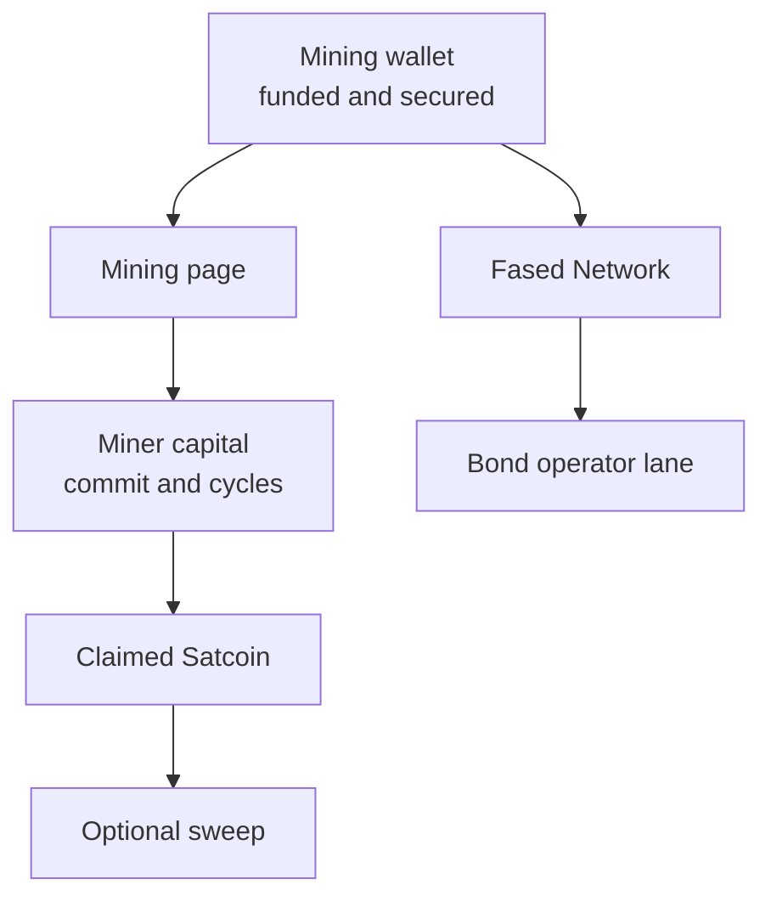

# Mining

Mining is the Satcoin (SAT) runtime control surface.

Fased Agent runs the Satcoin mining workflow for agent-operated infrastructure
on Solana.

Use it to:

- confirm the active `@wallet:mining` runtime wallet
- check readiness before starting
- initialize miner capital
- deposit or withdraw capital
- choose strategy posture
- set the active commit amount
- start or stop the Satcoin runtime
- understand cycles, claim, sweep, and recovery
- coordinate the same operations from chat or channels with `@mining`

Use the matching page for the surrounding work:

- [Wallet](/plugins/crypto/wallet-page) for funding, manual sends, approval, and wallet security
- [Solana RPC setup](/plugins/crypto/wallet-rpc-setup) for reliable RPC before long-running mining
- [Mining Chat and Automation](/plugins/crypto/mining-chat-and-automation)
  for `@mining` commands, scheduled mining, and channel control
- [Fased Network](/start/federation) for bond posture and public-network state
- [Operator glossary](/start/operator-glossary) for shared terms across wallet, mining, Fased Network, bond, and payment

## Read path

Use this page for first operation and daily checks.

<Columns>
  <Card title="Mainnet Sync" href="/plugins/crypto/mining-mainnet-sync" icon="refresh-cw">
    Sync official SAT mint and program IDs after launch proof is published.
  </Card>
  <Card title="Advanced mining" href="/plugins/crypto/mining-advanced" icon="sliders-horizontal">
    Tune strategy, auto mode, claim, sweep, recovery, workers, and history.
  </Card>
  <Card title="Mining troubleshooting" href="/plugins/crypto/mining-troubleshooting" icon="circle-help">
    Diagnose low commit, locked capital, fee reserve, skipped cycles, claim backlog, and RPC errors.
  </Card>
  <Card title="Mining API" href="/plugins/crypto/mining-protocol" icon="terminal">
    Inspect routes, gateway methods, config fields, account state, and protocol constants.
  </Card>
  <Card title="Satcoin site" href="https://satcoin.app" icon="coins">
    Use the official Satcoin site for launch status and public references.
  </Card>
  <Card title="Satcoin docs" href="https://docs.satcoin.app" icon="book-open">
    Use Satcoin docs for protocol constants, economics, addresses, and launch proof.
  </Card>
</Columns>

## Satcoin docs and Fased Agent

Fased Agent owns the mining wallet UX, signer controls, readiness checks,
capital controls, claim flow, sweep, recovery, and operator automation.

Satcoin docs own protocol truth:

- official mint and program IDs
- signed mainnet manifest
- IDL hash
- emission, erosion, treasury, and staking constants
- launch proof and explorer links

Before mainnet mining, the Fased Agent values should match the official Satcoin
docs and signed manifest.

Pre-launch Fased Agent releases intentionally ship without active Satcoin
mainnet IDs in `config/sat-runtime.env`. After the official Satcoin launch
notice appears in the docs and official announcement channels, click **Sync** in
the Mining page top bar. Sync verifies the signed mainnet manifest before it
writes the SAT mint and program IDs locally.

## How Mining fits into the stack



Read it like this:

- Wallet prepares and funds the mining wallet
- Mining uses that wallet for capital, commit, cycles, and claim
- claimed Satcoin can stay in the mining wallet or sweep elsewhere
- Fased Network and bond are separate later layers on top of the wider Satcoin stack

## What you see on this page

The Mining page is organized around live operation.

### 1. Header status and start or stop

This is where you:

- start mining
- stop mining
- see whether the runtime is ready, running, blocked, or waiting

### 2. Mining summary cards

The top cards show the operator numbers that matter most:

- mining wallet
- wallet Satcoin
- capital
- locked capital
- withdrawable capital
- target max
- safe commit
- active commit

Read them this way:

- `capital` is SOL deposited into the miner capital PDA, separate from wallet SOL
- `locked` is capital tied up in pending or live cycles
- `withdraw` is free capital that can leave now
- `target max` is your saved upper limit for later
- `safe commit` is what the agent can safely use right now
- `active commit` is what the protocol currently sees in your capital PDA

Commit-reduction reasons appear in activity/history and troubleshooting. The
current-cycle card shows the cycle number plainly; read low-cycle commits from
`Your commit`, `SOL in cycle`, locked capital, and fee reserve together.

### 3. Mining capital

This is the main operator block for:

- deposit capital
- withdraw capital
- update active commit
- review the capital account and cycle state

Commit edits save the target in Fased Agent. `Update` sends the transaction
that changes active commit in the miner capital PDA.

If the target is larger than the safe commit right now, `Update` submits the
safe value while keeping the saved target available for later cycles.

When the submitted commit is lower than the saved target, check locked capital
and fee reserve first. A smaller safe submit is usually better than missing the
cycle entirely. See [Mining troubleshooting](/plugins/crypto/mining-troubleshooting).

### 4. Recent activity and history

Use this to confirm what the runtime did:

- participation
- finalization
- claim
- RPC failures
- missed cycles
- fee or gap events

### 5. Recovery

Recovery is for blocked or disputed state.

Use it only after you understand the blocker.

## Before you start mining

Healthy mining usually requires all of these:

- a dedicated Solana mining wallet
- signer healthy
- Solana RPC healthy
- miner capital initialized
- funded capital available
- token account readiness
- a dedicated `@wallet:mining` runtime wallet

Solana RPC health matters for long-running mining because the runtime has to
read chain time, submit cycles, settle pages, and claim ready cycles on schedule.
A weak or wrong RPC can turn a healthy wallet into missed reads, missed submits,
delayed settlement, or delayed claim.

For serious mainnet mining, use a reliable private or commercial Solana RPC. Any
provider with stable HTTP/WebSocket support, usage visibility, and enough request
capacity can work if it stays healthy under your mining load.

Useful checks:

```bash
fased mining wallets
fased mining readiness --wallet mining
fased wallet signer doctor --json
fased mining status
```

At bare minimum, the mining wallet needs enough SOL to open the next round. The
runtime fallback check uses about `0.005 SOL` as the floor, but long-running
mining should keep more than that on hand for fees and buffer.

## Beginner start sequence

You do not normally activate mining by enabling the bundled plugin manually.
`fased plugins enable sat-mining` only controls plugin loading; it does not start
mining. Start from the Mining wallet and readiness flow below.

Use this flow before pressing **Start** for the first time:

1. Create a dedicated signer-owned **Mining** wallet during onboarding or with
   `fased wallet setup --chain solana`, then open **Wallets** to inspect it.
   Existing-key import uses the separate native signer-admin control socket.
2. Configure signer execution RPC and Gateway read RPC, activate the reviewed
   Mining policy with the owner helper, verify exact policy/network hashes, and
   enroll signer WebAuthn for manual Mining reviews.
3. Only then copy the Mining address and fund it with a deliberately small
   amount of SOL for fees, reserve, and intended capital.
4. Open **Mining** and confirm the wallet shown is `@wallet:mining`.
5. Check official mainnet status. The manifest verification public key belongs
   to the Fased release, not to your wallet; no wallet is required to check it.
6. Run readiness. Fix signer, both RPC planes, policy, SOL, token-account, or capital warnings
   before continuing.
7. Deposit a small amount of SOL into miner capital. The Fund action creates
   the wallet-scoped miner account on-chain when it is missing.
8. Set a conservative commit amount lower than the free capital and wallet fee
   reserve.
9. Click **Update** to write the active commit.
10. Click **Start** only after readiness is green and the fee warning is clear.

Start must confirm the active commit transaction before mining workers run. If
the wallet fee reserve is short but free miner capital can cover the exact
shortfall, Fased may withdraw that amount from miner capital back to the same
Mining wallet. A stop with locked or pending capital enters drain mode: no new
cycle participation starts while settlement, claims, and recovery complete.

Starting mining does not turn the Mining wallet into an Agent wallet. Ordinary
sends, Marketplace order actions, wallet-capable skills, and Fased Network bond
actions still use Agent or Vault wallets.

## Mining terms that matter

The Mining page uses a few terms repeatedly:

**Mining wallet**

Dedicated Solana wallet configured as `@wallet:mining`.

**Capital**

SOL deposited into the miner capital PDA.

**Locked**

Capital tied to pending or live cycles.

**Withdraw**

Free capital that can withdraw or support future commits now.

**Target max**

Saved upper commit limit for later.

**Safe commit**

Usable now after locks, reserve, fees, buffer, and erosion.

**Active commit**

Current commit stored in the miner capital PDA.

**Cycle**

Current Satcoin participation window.

**Erosion**

Per-cycle SOL cost applied to committed capital.

**Rebate**

Miner-side SOL returned by deterministic and performance rebate routing.

`Target max` is the saved upper bound. The runtime can submit less when capital
is locked, wallet fee reserve is low, erosion coverage is tight, recovery
buffer is retained, or stale-RPC guards block the full target.

If target is `9.9 SOL` and a cycle submits `0.8 SOL`, inspect `Locked`,
`Withdraw`, `Safe commit`, worker reason, and recent claim state before changing
strategy. The lower submit can be correct while the target remains saved for
later.

For detailed examples, read [Mining troubleshooting](/plugins/crypto/mining-troubleshooting)
and [Advanced Satcoin mining](/plugins/crypto/mining-advanced).

## How to choose a strategy

Mining supports both preset posture and execution mode.

You do not need a model provider to mine. `Deterministic` execution runs the
wallet, readiness, capital, commit, cycle submission, settlement, and claim
path locally. A configured model is optional: it can guide `Auto` allocations
or run guarded Mining strategy-review tasks, but it never replaces wallet
policy or transaction approval.

### Strategy presets

Current presets are:

- `Spread`
  Wider center-weighted coverage for steadier participation and lower concentration risk.
- `Balanced`
  Moderate concentration and practical upside with less volatility than aggressive posture.
- `Conviction`
  Tighter concentration around strongest buckets for more variance and more upside if the read is right.
- `Swarm`
  Coordination-friendly clustered coverage that keeps the miner flexible without fully flattening conviction.
- `Top-K`
  Sparse high-conviction compiler that chooses a small ranked bucket set.
- `Ranked`
  Converts deterministic bucket ranking into weighted exposure with a tail.
- `Adaptive`
  Blends stable coverage with cycle-ranked opportunity and fallback safety.
- `Crowd-aware`
  Keeps broader tail exposure to reduce crowding risk.
- `Safe fallback`
  Uses the balanced deterministic allocation for recovery or low-confidence operation.

### Execution mode

Current execution paths are:

- `Deterministic`
  Uses the locked 25-bucket allocation arrays for the selected posture and does not require model inference.
- `Auto`
  Uses the model-guided strategy path when available and falls back to deterministic execution if the strategy step fails.
  The protocol still receives one dense 25-bucket allocation vector and scores it on-chain.

The Mining page also has a `Task` shortcut beside Strategy and Execution.
It opens the Agent Task dialog with the `Mining strategy review` template already
filled. That task is strategy-only: it can inspect Mining status/history and
change strategy fields, but it must not change capital, target max, funding,
withdrawals, wallet sends, bond actions, or start/stop state.

Mining history includes strategy analytics for settled cycles. Use it to compare
which strategies were used most, which averaged the most SAT, which averaged the
most miner rebate, and which had the best net SOL result. When the settled
cycle record has protocol score fields, the analytics also show deterministic
rebate, performance rebate, score edge versus benchmark, skill score, crowding,
and pool size.

### Choosing a strategy

Use this rule:

- start with `Balanced` + `Deterministic`
- choose `Spread` if you want lower concentration and steadier participation
- choose `Conviction` only if you accept higher variance
- choose `Swarm` when you deliberately want the clustered coordination posture
- choose `Top-K`, `Ranked`, `Adaptive`, or `Crowd-aware` only when you want the compiler to change the 25-bucket shape
- use `Safe fallback` when you want the most conservative valid allocation while recovering or testing
- choose `Auto` only after the base runtime is stable and you actually want model-guided placement

## How much SOL to keep in the wallet

There are two separate SOL pools to understand:

- wallet SOL for reserve and fees
- miner capital for cycle participation

Defaults in the runtime profile are:

- minimum eligibility commit: `0.25 SOL`
- minimum wallet reserve target: `0.15 SOL`

The eligibility minimum is not a recommended always-on capital balance. Keep
additional miner capital for reveal collateral, read the estimated runway, and
use every-second, every-sixth, or every-twelfth-cycle economy mode when you want
lower cost frequency.

The UI also calculates a fee warning based on the next cycle open or submit requirement. If the page warns:

- `Leave at least X SOL in Wallet for cycle creation and fees`

take it literally. The runtime is comparing:

- `nextSubmitCycleSignerLamports`
- against what the signer can actually spend now

Good rule:

- keep the mining wallet above the reserve target
- leave extra headroom for tx fees
- do not expect the full funded balance to be usable while cycles are locked

## Start path

The clean operator sequence is:

1. create the single signer-owned Mining wallet in onboarding/wallet setup, or
   import it through the native signer-admin control socket
2. configure both RPC planes and activate the owner-reviewed Mining policy
3. enroll signer WebAuthn for manual reviewed Mining actions
4. confirm exact policy/network hashes and readiness
5. fund the wallet deliberately small and initialize miner capital if missing
6. deposit SOL into miner capital
7. set a target commit
8. click `Update` when you are ready to update the active commit PDA
9. confirm wallet reserve and fee buffer
10. click `Start`

CLI equivalent:

```bash
fased mining readiness --wallet mining
fased mining deposit-capital --sol 1
fased mining set-commit --sol 0.75
fased mining start --wallet mining
```

Chat equivalent:

```text
Check @mining readiness.
Deposit 1 SOL into @mining capital.
Set @mining commit to 0.75 SOL.
Start @mining with @wallet:mining.
```

## Stop path

`Stop` means:

- the runtime stops new cycle submits
- claim and recovery can keep running until locked capital is free
- it does not instantly free capital already tied to pending or live cycles
- the page may show `Clearing` while claim and recovery finish the older cycle work

Practical reading:

- stop first if you want to halt new participation
- wait for locked capital to clear as cycles settle
- withdraw only the free capital that is actually available
- click `Resume` if you want new cycle submits to start again
- no extra stop action is needed while the page is already clearing; new submits are already off

Button meaning:

- `Stop`: stop future cycle submits. Already-submitted cycles still settle and claim.
- `Resume`: exit clearing and allow new cycle submits again.

Clearing is the controlled stop state for wallets that still have capital locked
in pending or live cycles. When locked and pending capital are both clear, the
page returns to `Ready`.

## Claim and sweep

Claiming and sweeping are separate settings.

### Claim mode

Current miner profile values are:

- `auto`
- `prompt`
- `manual`

Use them like this:

- `auto` for normal stable miner claim
- `prompt` for advanced review/recovery profiles that support it
- `manual` for deliberate testing or recovery-oriented claim review

This claim mode is for miner claim-out. It does not run protocol treasury or
SAT distributor claim-out.

### Claim backlog

The Mining page shows a `Claims` counter when settled cycles still need miner
claim work. The runtime keeps that backlog durably by cycle id, retry
count, last error, and last transaction hash, then claims the oldest ready
cycles first.

The hidden operator cap is `automation.claimBatchCycles`. It defaults to `5` and
is capped at `16` so staged operator tests can compare `5`, `8`, `10`, `12`,
and `16` without changing the beginner UI.

Manual recovery commands:

```bash
fased mining claim-backlog
fased mining keeper run
fased mining cleanup resolved --cycle <id>
```

### Satcoin sweep

Post-claim sweep supports:

- destination runtime wallet id
- destination external Solana address
- `all` or `percentage` mode
- minimum sweep threshold
- keep-after-sweep balance

Mining automated signing exists for Satcoin mining operations and this Satcoin
sweep path. Generic chat, skill, wallet-action, and Marketplace work uses Agent
wallets. Fased Network bond uses a Vault wallet selected on Fased Network.

Good practice:

- keep the mining wallet as a working wallet
- sweep excess Satcoin out after claim
- do not let the mining wallet become long-term treasury storage

## Common states and errors

### Need SOL

The mining wallet does not have enough SOL for readiness or next-round work.

Fix:

- fund the wallet itself, not just the capital account

### Needs setup

Miner setup or capital initialization is still missing.

Fix:

- initialize capital first

### Need free capital

There is not enough free miner capital to enter the next cycle.

Fix:

- deposit more capital
- or lower commit

### Capital locked

Most capital is still tied up in pending cycles.

Fix:

- wait for the pending range to settle before expecting withdrawable capital

### Blocked

Mining is blocked because of signer, RPC, dispute, or unresolved cycle state.

Fix:

- read the blocker first
- use Recovery only after you know which state is broken

## Best practices

- keep Agent, mining, and Vault bond authority separate
- keep a private RPC provider for long-running mining if public RPC starts degrading
- start with balanced deterministic strategy
- keep claim and sweep intentional
- treat the mining wallet as a working wallet, not storage
- leave SOL in the mining wallet for reserve and fees
- do not push active commit to the full capital balance just because the number is available

## CLI quick reference

```bash
fased mining status
fased mining readiness --wallet mining
fased mining deposit-capital --sol 1
fased mining withdraw-capital --sol 0.25
fased mining set-commit --sol 0.75
fased mining start --wallet mining
fased mining stop
fased mining history
```

For automation, run the same commands with `--json` and read the API map in
[Satcoin mining API and protocol](/plugins/crypto/mining-protocol).

For chat/channel automation, use [Mining Chat and Automation](/plugins/crypto/mining-chat-and-automation).

## Related docs

- [Operator glossary](/start/operator-glossary)
- [Advanced Satcoin mining](/plugins/crypto/mining-advanced)
- [Mining Chat and Automation](/plugins/crypto/mining-chat-and-automation)
- [Satcoin mining API and protocol](/plugins/crypto/mining-protocol)
- [Wallet](/plugins/crypto/wallet-page)
- [Solana RPC setup](/plugins/crypto/wallet-rpc-setup)
- [Self-hosted wallet signer](/plugins/crypto/wallet-self-hosted)
- [Wallet operations and security](/plugins/crypto/wallet-production-flow)
- [Fased Network](/start/federation)
- [Bond operator](/start/bond-operator-economy)
- [CLI Mining](/cli/mining)
- [Satcoin docs](https://docs.satcoin.app)
