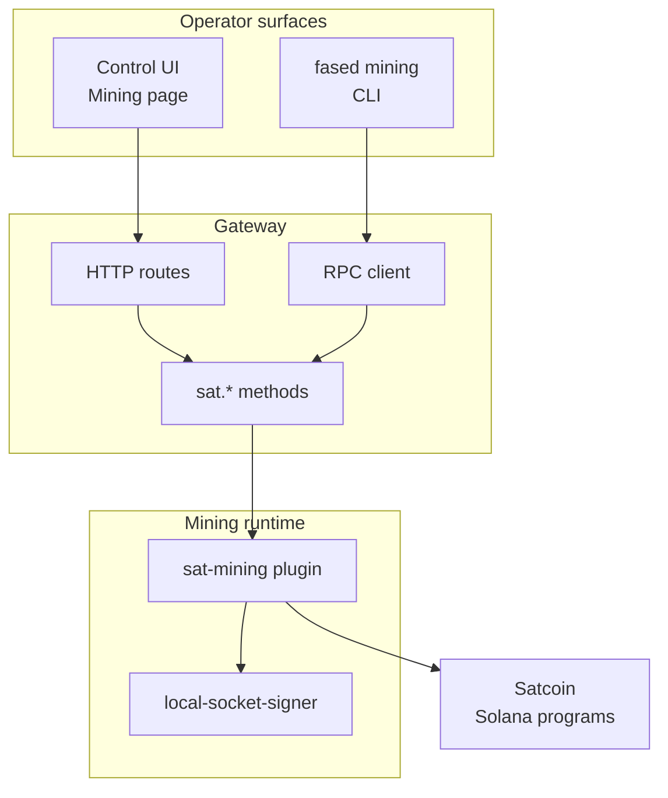
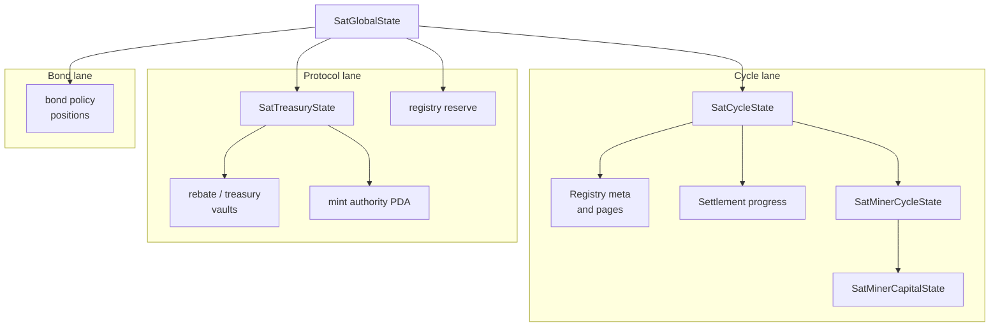

# Satcoin mining API and protocol

This is the technical map for Satcoin (SAT) mining inside Fased Agent.

Use it to understand how the Control UI, CLI, plugin gateway methods, and Satcoin program instructions line up.

This page describes how Fased Agent connects to **Satcoin mining v1**, the
current agent-operated mining protocol implementation.

Use the official Satcoin docs to verify current program addresses, manifest
hashes, IDL hashes, launch proof, and public protocol status.

Use this page to understand how Fased Agent connects Satcoin mining to wallets,
Gateway, CLI, and the Mining page.

## Stack map



The public operator surfaces are the Mining page and `fased mining`.

The internal integration surface is the `sat.*` gateway method family
registered by the `sat-mining` plugin.

## Runtime IDs

Pre-launch Fased Agent releases do not ship active Satcoin mainnet IDs.
Mainnet IDs are written only after **Mining Sync** verifies the signed Satcoin
mainnet manifest.

```text
config/sat-runtime.env
```

Manual values are for explicit local/devnet testing or recovery review only.
All four values must come from the same signed manifest or the same test
deployment:

```text
FASED_SAT_PROGRAM_ID=
FASED_SAT_BOND_PROGRAM_ID=
FASED_SAT_MINT_ADDRESS=
FASED_SAT_MINT_PROGRAM_ID=
```

See [SAT Mainnet Sync](/plugins/crypto/mining-mainnet-sync) for the operator
flow.

## Constants

| Constant                 | Value            |
| ------------------------ | ---------------- |
| SAT decimals             | `11`             |
| hard cap                 | `21,000,000 SAT` |
| cycle seconds            | `300`            |
| minimum entry            | `0.25 SOL`       |
| allocation buckets       | `25`             |
| erosion                  | `83 ppm`         |
| miner SAT route          | `90%`            |
| SAT distributor route    | `5%`             |
| treasury SAT route       | `5%`             |
| SOL deterministic rebate | `30%`            |
| SOL performance rebate   | `50%`            |
| SOL treasury route       | `20%`            |

## Control UI routes

The browser Mining page talks to Gateway HTTP routes. These routes require the
normal Control UI auth and wallet approval gates where applicable.

| Route                                  | Method | Purpose                                                        |
| -------------------------------------- | ------ | -------------------------------------------------------------- |
| `/api/mining/profile`                  | `GET`  | read miner profile                                             |
| `/api/mining/profile`                  | `PUT`  | save miner profile, strategy, funding, claim, and sweep policy |
| `/api/mining/wallet-attachment`        | `GET`  | read the active singleton mining-wallet assignment             |
| `/api/mining/wallets`                  | `GET`  | list mining-eligible wallets                                   |
| `/api/mining/readiness`                | `GET`  | run readiness checks                                           |
| `/api/mining/status`                   | `GET`  | read live mining status                                        |
| `/api/mining/history`                  | `GET`  | read cycle outcomes and recent actions                         |
| `/api/mining/recovery`                 | `GET`  | read recovery summary                                          |
| `/api/mining/start`                    | `POST` | start the runtime                                              |
| `/api/mining/stop`                     | `POST` | stop the runtime                                               |
| `/api/mining/capital/init`             | `POST` | initialize miner capital                                       |
| `/api/mining/reserve/top-up`           | `POST` | bootstrap registry reserve                                     |
| `/api/mining/capital/deposit`          | `POST` | deposit SOL into miner capital                                 |
| `/api/mining/capital/withdraw`         | `POST` | withdraw free miner capital                                    |
| `/api/mining/capital/commit`           | `POST` | set active commit                                              |
| `/api/mining/action/participate`       | `POST` | manually submit current participation                          |
| `/api/mining/action/crank`             | `POST` | manually advance crank-style work                              |
| `/api/mining/action/finalize-epoch`    | `POST` | legacy-named finalize helper for current roots                 |
| `/api/mining/action/claim`             | `POST` | claim an eligible cycle                                        |
| `/api/mining/recovery/claim`           | `POST` | retry claim for a selected recovery cycle                      |
| `/api/mining/recovery/resolve-dispute` | `POST` | resolve a selected dispute                                     |
| `/api/mining/recovery/republish-roots` | `POST` | republish selected roots after preflight                       |
| `/api/mining/history/clear`            | `POST` | clear local mining history                                     |

Some recovery route names still carry legacy `epoch` wording because the
surrounding UI used that name before the current cycle-native protocol was
finalized. New protocol language should use `cycle` where possible.

## CLI surface

`fased mining` calls gateway methods through the normal Gateway RPC client. The
Mining page and chat `@mining` control use the same runtime methods. The
documented operator command is the installed `fased mining ...` binary. If the
command is missing from a source checkout, run `./install.sh --no-onboard` once
to install the repo-backed CLI.

**`fased mining status`**

Gateway method: `sat.getMiningStatus`. Shows live status, workers, capital,
planner, and action summary.

**`fased mining readiness`**

Gateway method: `sat.getMiningReadiness`. Checks wallet, signer, RPC, funding,
miner init, and ATAs.

**`fased mining wallets`**

Gateway method: `sat.listMiningWallets`. Lists mining-eligible local wallets.

**`fased mining start`**

Gateway method: `sat.startMining`. Waits for final result and validates
`running=true`.

**`fased mining stop`**

Gateway method: `sat.stopMining`. Waits for final result and reports drain mode
separately.

**`fased mining history`**

Gateway method: `sat.getMiningHistory`. Shows history and activity windows.

**`fased mining deposit-capital`**

Gateway method: `sat.depositMinerCapital`. Deposits SOL into miner capital.

**`fased mining withdraw-capital`**

Gateway method: `sat.withdrawMinerCapital`. Withdraws free miner capital.

**`fased mining set-commit`**

Gateway method: `sat.setActiveCommit`. Updates active commit amount.

**`fased mining claim-backlog`**

Gateway method: `sat.claimBacklog`. Claims the oldest ready backlog batch.

**`fased mining keeper run`**

Gateway method: `sat.runKeeperOnce`. Runs one keeper/cranker tick.

**`fased mining cleanup resolved`**

Gateway method: `sat.closeResolvedCycleAccounts`. Closes resolved cycle accounts
for one cycle.

CLI start and stop do not rely on a submitted request alone. `start` prints
success only when the final Gateway payload says mining started and the returned
status is running. `stop` prints a hard stopped message only when status is not
running; if locked capital or pending cycles remain, the CLI reports drain mode.

## Gateway methods

### Profile and wallet methods

| Method                          | Purpose                                                                      |
| ------------------------------- | ---------------------------------------------------------------------------- |
| `sat.getMinerProfile`           | read active profile                                                          |
| `sat.setMinerProfile`           | save profile and runtime policy                                              |
| `sat.listMiningWallets`         | list wallets with mining capability and balances                             |
| `sat.getMiningWalletAttachment` | read the active singleton mining-wallet assignment                           |
| `sat.getMiningReadiness`        | return wallet, signer, RPC, funding, miner init, and ATA checks              |
| `sat.getMiningStatus`           | return live status, issuance, capital, workers, planner, and history summary |
| `sat.getMiningHistory`          | return stored outcome and action windows                                     |
| `sat.getMiningRecovery`         | return recovery summary and recommended action                               |

### Capital methods

| Method                         | Purpose                                                  |
| ------------------------------ | -------------------------------------------------------- |
| `sat.initMinerCapital`         | initialize miner capital account                         |
| `sat.depositMinerCapital`      | move wallet SOL into miner capital                       |
| `sat.withdrawMinerCapital`     | withdraw free capital back to the wallet                 |
| `sat.setActiveCommit`          | set on-chain active commit and optionally persist config |
| `sat.bootstrapRegistryReserve` | initialize or top up shared reserve support              |

### Cycle methods

| Method                           | Purpose                                         |
| -------------------------------- | ----------------------------------------------- |
| `sat.openCycle`                  | open shared cycle state                         |
| `sat.submitCycle`                | submit miner allocation for a cycle             |
| `sat.settleCyclePage`            | settle a registry page chunk                    |
| `sat.finalizeCycleSettlement`    | finalize page settlement for a cycle            |
| `sat.scoreCyclePage`             | score participants on a page                    |
| `sat.distributeCyclePage`        | distribute miner SAT and rebates for a page     |
| `sat.runKeeperOnce`              | run one keeper/cranker tick                     |
| `sat.claimCycleRewards`          | claim one cycle                                 |
| `sat.claimCycleRewardsBatch`     | claim several cycles                            |
| `sat.claimBacklog`               | claim oldest ready backlog batch                |
| `sat.retargetUnlock`             | adjust unlock target on cadence                 |
| `sat.closeResolvedCycleAccounts` | close resolved cycle artifacts and reclaim rent |
| `sat.compactPendingCycleRange`   | compact local pending-cycle tracking            |

### Recovery and dispute methods

| Method                           | Purpose                                                    |
| -------------------------------- | ---------------------------------------------------------- |
| `sat.getEpoch`                   | inspect legacy epoch-compatible state for recovery tooling |
| `sat.getRecoverySummary`         | build targeted recovery summary                            |
| `sat.resolveDispute`             | resolve dispute state                                      |
| `sat.republishEpochRoots`        | republish roots after preflight                            |
| `sat.getValidatorAttestation`    | inspect one attestation                                    |
| `sat.listValidatorAttestations`  | list attestations                                          |
| `sat.submitValidatorAttestation` | submit validator attestation                               |
| `sat.getDispute`                 | inspect one dispute                                        |
| `sat.listDisputes`               | list disputes                                              |
| `sat.openDispute`                | open a dispute                                             |

### Protocol lane methods

| Method                                  | Purpose                                                                 |
| --------------------------------------- | ----------------------------------------------------------------------- |
| `sat.setProtocolRecipients`             | set treasury and SAT distributor recipients                             |
| `sat.refillRegistryReserveFromTreasury` | refill the registry reserve from protocol treasury SOL shortfall        |
| `sat.claimProtocolTreasury`             | claim treasury lane, leaving reserve-aware maintenance first            |
| `sat.claimProtocolDistributorSat`       | claim SAT distributor lane to the bond distributor                      |
| `sat.runProtocolMaintenanceOnce`        | one bounded operator pass over reserve, treasury, and distributor lanes |

These are protocol maintenance operations. They are not normal miner day-to-day
actions, and they are not shown on the Mining page. Launch operators run them
from internal maintenance tooling.

The bounded model is permissionless: any caller may pay the transaction fee, but
the program fixes recipients and caps the action. Reserve refill can only target
`sat_registry_reserve` and only up to the configured shortfall. Treasury, SAT
distributor claims use fixed protocol recipients, so a random caller cannot
redirect protocol funds.

### Bond-staking roadmap boundary

Miner auto-claim only claims that miner's own cycle SAT and rebates. It does not
claim protocol treasury, SAT distributor, or other miners' SAT.

The bond distributor consumes the existing SAT distributor lane without coupling
bond logic into mining settlement:

- split SAT claim pulls pending distributor SAT to the bond distributor vault
- eligible bonds can share SAT from the distributor by index accounting
- each bond owner still claims their own synced SAT amount

Bond-staking policy belongs to launch configuration and public launch proof.
This API page only describes the integration boundary: miner auto-claim is
miner-owned, while bond distributor claims are position-owned and separate from
miner claim-out. Basic bonds can mark a public operator position and add spam
cost, while any staking-weight thresholds, warmup, cooldown, or unlock timing
must come from the active launch configuration.

### Scale improvement roadmap

The current keeper and auto-claim loop is the launch baseline. The runtime now
has the operator controls needed to rehearse scale deliberately before raising any
defaults:

<CardGroup cols={2}>
  <Card title="Larger claim batches">
    `automation.claimBatchCycles` defaults to `5` and is capped at `16`.
    Benchmark `5`, `8`, `10`, `12`, and `16` before raising the default.
  </Card>
  <Card title="Delayed-claim recovery">
    Persist backlog status, claim oldest ready cycles first, and expose
    `fased mining claim-backlog`.
  </Card>
  <Card title="Public keeper tooling">
    Expose `fased mining keeper run` for one headless keeper/cranker tick by an
    eligible miner wallet.
  </Card>
  <Card title="RPC hardening">
    Support primary/backup RPC, show timeout/rate-limit counters, and separate
    read/submit paths where useful.
  </Card>
  <Card title="Account cleanup">
    Expose `fased mining cleanup resolved --cycle <id>` first. Add broad
    scanners only after delayed claims are proven.
  </Card>
  <Card title="Metrics">
    Show settlement lag, claim backlog, failed keeper steps, keeper wins/misses,
    reserve health, and cleanup queue size.
  </Card>
</CardGroup>

Keep settlement chunk size conservative until compute, account count, and
unattended soak runs prove a larger value.

## Config fields

The plugin config lives under `plugins.entries["sat-mining"].config`.

**`enabled`**

Whether the runtime wants mining enabled.

**`network`**

`local`, `devnet`, or `mainnet-beta`.

**`walletId`**

Active mining wallet id.

**`role`**

`miner`, `validator`, or `admin`.

**`riskMode`**

Legacy risk name: `conservative`, `balanced`, `aggressive`, or `swarm`.

**`strategyPreset`**

Current preset: `spread`, `balanced`, `conviction`, `swarm`, `top_k`, `ranked`,
`adaptive`, `crowd_aware`, or `safe_fallback`.

**`strategyExecution`**

`deterministic` or `auto`.

**`strategyMode`**

Legacy mode: `base` or `skill`.

**`commitLamports`**

Configured active commit in lamports.

**`minSolBalanceLamports`**

Wallet reserve target.

**`claimMode`**

`auto`, `prompt`, or `manual`.

**`skillConfig`**

Model or skill-backed strategy planning options.

**`automation.autoFinalizeEpoch`**

Automatic settlement-finalize helper.

**`automation.autoClaim`**

Automatic claim helper.

**`automation.claimBatchCycles`**

Hidden claim backlog batch cap; defaults to `5`, capped at `16`.

**`automation.satSweep`**

Post-claim sweep policy.

**`tokenConfig`**

SAT program, bond program, mint, and mint program overrides.

**`plannerConfig`**

UCB or Thompson planner policy options.

**`federationHandle`**

Optional Fased Network handle context.

**`federationPeers`**

Optional coordination peer list.

**`coordinationGroup`**

Optional coordination group label.

`claimMode` is a runtime profile value. The beginner Mining page should not be
read as promising a separate manual protocol claim product. Normal stable mining
uses automatic miner claim; `prompt` and `manual` are advanced review or
recovery profile settings when exposed by the active install.

## State layout



Common PDA seed families:

- `sat_global_state`
- `sat_cycle_state`
- `sat_cycle_registry_meta`
- `sat_cycle_registry_page`
- `sat_cycle_settlement_progress_v2`
- `sat_miner_cycle_state`
- `sat_miner_capital_state`
- `sat_treasury_state`
- `sat_registry_reserve`
- `sat_rebate_vault`
- `sat_treasury_vault`
- `sat_bond_position`
- `sat_bond_tier_policy`

## Authority and PDA notes

PDAs do not have private key files. The program signs for them by seed when an
instruction path allows it.

Satcoin authority surfaces:

| Surface                            | Meaning                                                  |
| ---------------------------------- | -------------------------------------------------------- |
| SAT program upgrade authority      | can upgrade SAT mining program code while retained       |
| SAT mint program upgrade authority | can upgrade mint-program code while retained             |
| SPL mint authority                 | should be the SAT mint-authority PDA after init          |
| SPL freeze authority               | should be none for the public mint posture               |
| SAT `program_admin`                | can set treasury and SAT distributor recipient addresses |
| bond policy update authority       | can update bond tier thresholds and unlock delay         |

The miner runtime does not hold admin keys. It uses the singleton
`@wallet:mining` wallet for operator actions and reads the configured program
ids, mint address, mint program id, bond program id, network, and RPC.

## Cost and account flow

Satcoin mining has three separate SOL concepts:

| Concept          | Meaning                                                                             |
| ---------------- | ----------------------------------------------------------------------------------- |
| wallet SOL       | pays transaction fees and missing account creation                                  |
| miner capital    | SOL deposited into the miner capital PDA for commit, erosion, and rebate accounting |
| registry reserve | protocol PDA that pays shared cycle, registry, and settlement account rent          |

Per-cycle flow:

- the miner wallet pays submit, settlement, claim, and recovery transaction fees
- the miner wallet pays miner-cycle PDA rent when it first submits that cycle
- active commit is locked inside miner capital until distribute releases it
- erosion is charged from miner capital and routed into miner rebate and treasury lanes
- keeper bounty comes from the performance rebate lane when the cycle can fund it
- claim mints Satcoin to the miner ATA and moves SOL rebate back into miner capital

Treasury and SAT distributor are fixed accounting lanes. They are
not the payer for normal shared cycle account creation. In the launch posture,
the SAT distributor recipient is the bond distributor path, while non-rebate SOL
claims into treasury custody.

Cycle committed SOL is mining participation. Market liquidity is a separate
post-launch venue concept.

## Integration rules

- Use the CLI or Control UI for operator actions.
- Use `sat.*` gateway methods for internal automation.
- Use the Satcoin IDL and program account layouts as source of truth for raw wire integration.
- Keep wallet SOL, miner capital, claimed Satcoin, and bond Satcoin separate.
- Treat legacy `epoch` names as compatibility names around recovery helpers, not the current protocol vocabulary.
- Prefer `local-socket-signer` for unattended Satcoin mining.
- Do not bypass wallet approval gates for capital, sweep, or policy changes.

## Related docs

- [Mining](/plugins/crypto/mining-page)
- [Advanced Satcoin mining](/plugins/crypto/mining-advanced)
- [SAT protocol maintainer](/plugins/crypto/sat-protocol-maintainer)
- [CLI mining](/cli/mining)
- [Wallet](/plugins/crypto/wallet-page)
- [Fased Network](/start/federation)
- [Satcoin docs](https://docs.satcoin.app)
