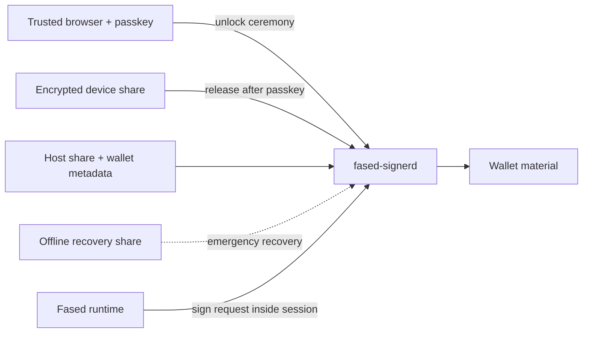

# Autonomous wallet security

This guide explains the recommended end-user model for unattended self-hosted wallets in Fased.

Use it when you want:

- Agent wallet automation for sends, skills, plugins, or schedules
- Vault custody for manual storage and Fased Network bond assignment
- wallet separation for service receipts, invoices, or fresh receiving addresses
- recoverable wallet security without turning one VPS into the only secret boundary

The practical rule is simple:

- `local-socket-signer` is the signer path
- `fased-signerd` is the signer process
- Wallet Control Passkey is the ceremony layer
- split-key custody is the locked-wallet layer

## What the runtime should protect

For an unattended self-hosted wallet, the locked state should protect against:

- a copied VPS disk
- a leaked app config
- a browser session without passkey approval
- a runtime compromise while the wallet is still locked

It should not pretend to abolish all risk during a live unlocked session.

## The healthy custody model

For production, use this split:

- encrypted wallet material on the host
- host-side share on the host
- device share on a trusted browser or second device
- recovery share offline

That means the host is necessary, but not sufficient by itself.

## What to avoid

Avoid these patterns:

- one Agent wallet reused for mining, bond, and vault storage
- one wallet reused for mining, service payments, treasury, and private business receipts
- host-only passphrase files as the only real unlock boundary
- recovery share stored next to the device share
- leaving Agent automation enabled without tight caps and allowlists
- leaving Vault custody unlocked longer than the work requires
- treating passkey login as the same thing as complete at-rest custody protection

## Recommended wallet split

The recommended public split is:

- one or more Agent wallets, with one primary fallback
- mining wallet
- one or more Vault wallets
- one or more Agent wallets for invoices, payments, or service receipts
- optional Fased Network bond assignment to a Vault wallet
- offline reserve outside the runtime

## Unlock discipline

Agent and Vault use different controls:

- Agent `Stop` pauses automated execution for chat, skills, plugins, and schedules.
- Vault split-key unlock opens a manual signing window.
- Mining does not use the generic wallet lock; it is Satcoin mining ops only.

Good defaults:

- Agent: keep automation on only when caps and allowlists are correct; use `Stop` as emergency pause.
- Vault: unlock until manual lock for deliberate work, or choose a short timed unlock.
- Keep wallet-specific sessions instead of one global unlock.

## Recovery discipline

Good practice:

1. export the recovery share during setup
2. store it offline
3. keep it separate from the host
4. rotate it after any suspected device compromise

If the device share is lost, recover immediately and issue a fresh one.

## Mining-specific reading

For Satcoin mining, the correct posture is:

- dedicated mining wallet
- stable Solana RPC
- Satcoin mining actions only, not generic sends or skill wallet actions
- post-claim sweep policy that moves excess Satcoin out of the working wallet

Mining wallets are working wallets, not treasury wallets.

## Agent-wallet reading

For Agent wallet sends, Fased Network wallet actions, skill/plugin wallet actions, or
advanced wallet automation, the conservative posture is:

- separate Agent wallet
- tight SOL caps and per-mint SPL token caps
- explicit wallet-action allowlists when optional route actions are enabled
- automation `Stop` available as an emergency pause
- easy revoke and clear audit trail

Risky agent actions should use explicit handles such as `@wallet:agent`. Mining and vault wallets must not be generic prompt wallets.

Optional route actions add another boundary. Keep them behind Fased wallet
policy, action allowlists, small working limits, explicit expiry, and visible
cancel or review history.

## Bottom line

The recommended autonomous model is:

- self-hosted wallet
- signer-only decryption
- passkey unlock ceremony
- split-key custody
- recovery share kept offline
- short, scoped unlock windows

## Related docs

- [Wallet](/plugins/crypto/wallet-page)
- [Self-hosted wallet signer](/plugins/crypto/wallet-self-hosted)
- [Wallet signer and provider architecture](/plugins/crypto/wallet-signer-provider-architecture)
- [Wallet operations and security](/plugins/crypto/wallet-production-flow)
- [Wallet Control Passkey](/plugins/crypto/wallet-control-passkey)
- [Autonomous wallet sessions](/plugins/crypto/wallet-autonomous-sessions)
- [Mining](/plugins/crypto/mining-page)
