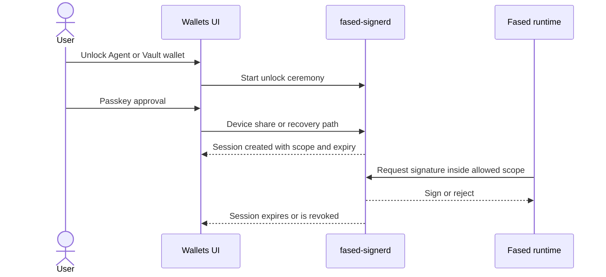

# Autonomous wallet sessions

This guide explains how unattended wallet work should run in Fased without leaving a self-hosted wallet permanently open.

Use it for:

- Agent wallet automation
- Vault manual signing windows
- emergency revoke/relock procedures

The core idea is:

- the wallet stays locked by default
- the user opens a signer session with Wallet Control Passkey
- the runtime may sign only inside that session's scope
- expiry or revoke returns the wallet to locked posture

## Why sessions exist

Autonomous work needs some signing ability.
Permanent unlock is the wrong answer.

Unlock sessions separate:

- long-lived wallet storage
- short-lived runtime permission

## Session flow



## What a healthy session should include

A session should be tied to:

- one wallet
- one purpose
- one or more allowed chains
- a short duration
- explicit spend or action limits

Current runtime defaults:

- default unlock TTL: `15 minutes`
- maximum unlock TTL: `60 minutes`

## Mining note

Satcoin mining is a separate runtime path, not a generic Agent/Vault unlock
session. The normal posture is:

- mining wallet only
- Solana only
- Satcoin mining actions and configured sweep behavior only

Do not turn a mining session into a general send session.

## Agent-wallet session reading

For Agent wallet sends, Fased Network wallet actions, skill/plugin wallet actions, or
other reviewed automation, the normal session posture is:

- Agent wallet only
- stricter spend controls than mining
- explicit counterparty, contract, or program boundaries when available
- shorter duration than a mining session

## Fased Network bond Vault session reading

Fased Network bond posture is narrower than Agent-wallet automation.

The Vault wallet assigned to bond should be used for:

- bond open or top-up
- proof-related actions
- unlock and withdraw lifecycle

It should not quietly become the same wallet used for routine outbound work.

## When to relock immediately

Relock or revoke immediately if:

- a browser or device share is lost
- passkey state changes unexpectedly
- the host is handed to another operator
- you are rotating RPC, wallet, or policy boundaries
- you suspect the session stayed open too long

## Operator checklist

Before you trust unattended wallet work:

1. signer health is clean
2. the wallet appears in runtime state
3. RPC is healthy
4. Wallet Control Passkey is enrolled
5. the recovery share is offline
6. the wallet role is dedicated to its purpose
7. the session is scoped to that purpose
8. you know how to revoke it

Useful checks:

```bash
fased wallet signer doctor --json
fased wallet status --json
fased mining readiness --wallet mining
```

## Bottom line

If you want automation, the conservative mental model is:

- storage stays locked
- automation gets a temporary lane
- the signer enforces that lane
- expiry closes the lane again

## Related docs

- [Wallet](/plugins/crypto/wallet-page)
- [Self-hosted wallet signer](/plugins/crypto/wallet-self-hosted)
- [Wallet operations and security](/plugins/crypto/wallet-production-flow)
- [Wallet Control Passkey](/plugins/crypto/wallet-control-passkey)
- [Autonomous wallet security](/plugins/crypto/wallet-autonomous-security)
- [Mining](/plugins/crypto/mining-page)
