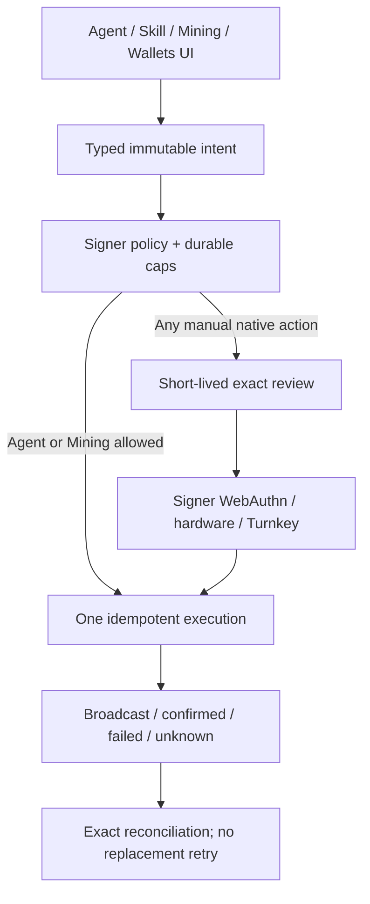

# Autonomous wallet authorization

Production Fased does not open a broad timed wallet unlock session for Agent or
Vault work.

The old split-share/passphrase model—unlock a wallet for 15 to 60 minutes and
let the runtime sign inside that window—is not the supported custody boundary.
A compromised caller could change transaction intent during a broad unlock.

## Current model

- Agent autonomy is durable, narrow signer policy with exact operations,
  programs, assets, destinations, and positive caps.
- Mining autonomy is generated typed SAT operations only.
- every manual native Agent, Mining, or Vault action uses one short-lived
  immutable review plus signer-owned WebAuthn;
- hardware Wallet Standard or Turnkey supplies a separate manual custody lane.
- Request ids, digests, cap reservations, signed bytes, and
  broadcast/confirmed/failed/unknown state survive restart.



## Agent authorization

Agent authority stays active only while its acknowledged signer policy allows
the exact request. Keep its balance and caps small. Installing a skill or
creating a task is a separate operation and does not expand signer policy.

To remove authority, stop new Gateway work and tighten the signer policy. There
is no need to wait for a broad session TTL to expire.

## Mining authorization

Mining policy permits the generated SAT action set and configured SOL/SAT
movement needed for fees, capital, claim, cleanup, and sweep. It does not
authorize arbitrary SPL assets, generic sends, or serialized swaps.

## Manual native authorization

Every manual native Agent, Mining, or Vault action requires a freshly prepared
exact review. Signer WebAuthn binds the wallet, role, decoded transaction,
policy hash, request id, nonce, and expiry. The authorization is consumed once.
The Wallets Access-tab Wallet Control Passkey is separate Gateway
authentication and cannot satisfy this signer challenge.

A hardware Wallet Standard Vault instead signs that immutable review in the
browser wallet; confirm transaction intent on-device. Turnkey relies on its
independent provider policy.

## Pause and revoke procedure

1. Use Agent or Mining **Stop** to reject new Gateway automation.
2. Inspect signer request state for `reserved`, `broadcast`, or `unknown` work.
3. Reconcile exact stored signatures/signed bytes; do not retry with changed
   parameters.
4. Tighten signer policy through the owner/admin workflow.
5. Remove or narrow skill grants and disable schedules.
6. Sweep excess working value through a reviewed typed transfer.
7. Review both Gateway and signer audit logs.

`Stop` is not key deletion, cap reset, transaction cancellation, or offline
custody.

## Recovery events

Treat unexpected credential changes, signer policy hash changes, wallet-id or
address mismatch, corrupt signer state, missing RPC hash, or an unknown
broadcast as a stop condition. Preserve state and use the documented native
recovery/reconciliation procedure; never delete state to obtain a fresh
default.

Useful checks:

```bash
fased wallet signer doctor --json
fased wallet status --json
fased mining readiness --wallet mining
```

## Related docs

- [Autonomous wallet security](/plugins/crypto/wallet-autonomous-security)
- [Wallet roles and policies](/plugins/crypto/wallet-roles-and-policies)
- [Wallet Control Passkey](/plugins/crypto/wallet-control-passkey)
- [Self-hosted wallet signer](/plugins/crypto/wallet-self-hosted)
