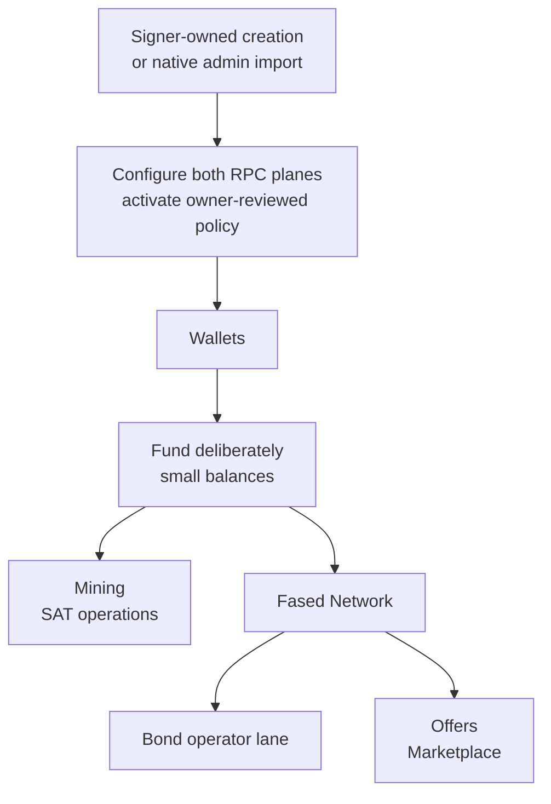

# Wallets

The Wallets page is the day-to-day control surface for Fased wallets.

Use it to:

- see which wallets exist
- copy addresses and fund the right wallet
- confirm which wallets are Agent, mining, vault, or bond-adjacent
- create and approve sends
- manage Gateway Wallet Control Passkeys and inspect native review readiness
- review signer policy version/hash and RPC readiness
- inspect wallet controls and recent activity

Use the matching page for each workflow:

<CardGroup cols={2}>
  <Card title="Mining" href="/plugins/crypto/mining-page">
    Satcoin capital, commit, start, stop, claim, and sweep.
  </Card>
  <Card title="Wallet chat" href="/plugins/crypto/wallet-chat-and-channels">
    `@wallet` balances, sends, advanced wallet actions, skills, and channel control.
  </Card>
  <Card title="Mining chat" href="/plugins/crypto/mining-chat-and-automation">
    `@mining` start, stop, fund, withdraw, commit, and strategy commands.
  </Card>
  <Card title="Fased Network" href="/start/federation">
    Network participation and public route health.
  </Card>
  <Card title="Bond operator" href="/start/bond-operator-economy">
    Bond posture and operator lanes.
  </Card>
  <Card title="Operator glossary" href="/start/operator-glossary">
    Shared wallet, mining, Fased Network, bond, and order terms.
  </Card>
</CardGroup>

## How wallets fit into the stack



Read it like this:

- onboarding creates the wallet inside Go and registers its public address;
  existing-key import uses the separate native signer-admin command
- The Wallets page is where you inspect, fund, secure, and approve wallet actions
- Mining uses a dedicated mining wallet
- Fased Network uses the wallet map to show Agent wallet and bond posture
- bond lifecycle stays on the Fased Network surface even though the wallet is visible in Wallets

## Beginner path

For a first public setup, use this order:

1. Run onboarding or `fased wallet setup --chain solana` to create signer-owned wallets.
2. Create one **Agent** wallet for normal sends, Marketplace order actions,
   reviewed wallet actions, scheduled wallet work, and skill wallet actions.
3. Create one **Mining** wallet only if you plan to run Satcoin mining.
4. Create one **Vault** wallet if you need protected storage or Fased
   Network bond authority.
5. Configure the signer execution RPC and Gateway read RPC for each wallet.
6. Copy and review the installed role policy template, activate it with the
   owner helper, and verify the exact signer policy version/hash and RPC
   readiness.
7. Enroll signer WebAuthn with the native launcher before any manual native
   Agent, Mining, or Vault review. The Wallets **Access** passkey is separate.
8. Only then copy the address and fund it with a deliberately small amount.
9. Refresh balances and confirm the funds arrived before sending, mining, or
   scheduling wallet work.

Keep the roles separate. Agent wallets do normal agent work. The Mining wallet
does Satcoin mining only. Vault wallets are manual-first reserve/bond wallets.

## What you see on this page

The Wallets page is intentionally compact. The main sections are:

### 1. Access

The **Access** tab manages the Gateway-owned **Wallet Control Passkey**. It
authenticates Gateway approval requests and settings changes; it is not the
credential that `fased-signerd` verifies for an exact native review.

Use it for:

- Gateway send approvals and wallet settings
- Gateway passkey enrollment/list/removal
- review-readiness guidance

Signer WebAuthn is a separate Go-owned credential set. Enroll it only through
`fased-signer-enroll`; the Access UI cannot enroll or remove signer credentials.

### 2. Wallet inventory cards

This is the live wallet list.

Use it to answer:

- which wallets exist
- which address belongs to each wallet
- what balances are visible now
- which wallets are Agent wallets
- which wallet is configured as `@wallet:mining`
- which Vault wallet is currently assigned to Fased Network bond

### 3. Send and approval flow

The Wallets page is manual-first.

The real flow is:

1. choose the source wallet by exact `@wallet:<id>` handle
2. fill out the destination as another local wallet handle or an external address
3. click `Create Approval Request`
4. review the pending request, wallet-control simulation, and approval diff
5. click `Approve`
6. complete Gateway Wallet Control Passkey approval if enabled
7. for a manual native wallet, complete signer WebAuthn for the exact immutable
   review
8. let Fased execute and log the send

That is why the Wallets page is an approval surface, not just a raw signer surface.

### 4. Selected wallet controls

This section changes by role.

- Agent wallets show `Caps`, `Send`, and `Auto`
- Vault wallets show `Caps` and `Security`
- Mining wallets show `Sweep`

### 5. Wallet controls and safety

This is where you review or save wallet controls:

- Preset: a requested starting point that is not active until the signer
  acknowledges its exact version/hash
- Caps: signer-owned positive per-transaction and daily limits for every
  executable asset policy
- Send: one Agent-wallet recurring send setting shared by chat and the Wallets UI
- Auto: Agent background execution, denied until an explicit signer policy
  grants the exact typed operations
- Security: Gateway passkey status plus signer WebAuthn, hardware Wallet
  Standard, or Turnkey custody guidance
- Sweep: Mining-only SAT movement after successful claims

Automated execution means the Agent wallet may execute approved background
actions when role controls and the signer's operations, programs, assets,
destinations, positive caps, and durable request checks allow it.
Wallets UI manual Send still creates a reviewed request first, then approval
executes the request.

For Mining, automated signing is reserved for Satcoin mining operations and Satcoin
sweep. It does not allow generic chat, skill, wallet-action, or bond actions from the
mining wallet. For Agent, automation is the working-wallet path for approved
agent tasks. Vault stays manual-only and uses reviewed Wallets page approval.

Gateway preview controls cannot disable signer caps. An executable native
policy always requires positive per-transaction and daily caps for each asset.
Missing or zero caps deny signing.

Pending approvals include a compact diff showing what will spend, from which
wallet role, to which destination, and what source triggered it. Fased also
stores the wallet-control simulation result so an operator can see whether the
request is passing controls, blocked, or waiting for manual approval.

Each pending approval also creates an audit record. Use Wallets recent activity
or the run/history surfaces to inspect the matching `wallet` record, control
simulation, related marketplace/task ids when available, and final broadcast
result. The record is audit visibility only; approval and signing still happen
from Wallets.

### 6. Recent activity

This is the fastest way to confirm what Fased actually did:

- request created
- request approved or rejected
- send executed or failed
- no unexpected outbound work

## Wallet types and assignments

There are three permanent wallet purposes in the product:

- Agent
- Mining
- Vault

Those purposes are stored on the wallet record and stay fixed after creation.
The current public wallet UI is Solana-only. Display name is only a label; the
permanent handle is `@wallet:<walletId>`.

Bond authority is configured through Fased Network and points to a Vault wallet.

### Agent wallet

This is the normal working role for:

- ordinary reviewed sends
- Fased Network wallet actions
- order evidence publication
- skill/plugin wallet tasks
- reviewed advanced wallet actions

You can have more than one Agent wallet. One Agent wallet can be marked primary;
that is the fallback when an approved wallet action does not include an explicit
handle. Other Agent wallets are still usable with their exact handles.

The wallet purpose stored on the wallet is Agent because it is the wallet the
agent is allowed to use for risky chat, skill, plugin, Fased Network, and
advanced wallet actions.

New wallets should be assigned explicitly during onboarding or CLI creation.
Legacy wallets without purpose metadata are manual-first until you create or
mark a proper Agent wallet. Keep Mining and Vault wallets in their original
roles.

Use the wallet name/id for purpose. Use `Agent` / `agent`; the UI shows the
chain separately as `Solana`.

Use explicit handles for risky actions:

```text
@wallet:agent
```

Display names are hints only. Execute a send, wallet action, or scheduled
wallet action with the exact `@wallet:<walletId>` handle or a structured
tool/API `walletId`.

Agent wallet actions from owner chat or allowed channels can execute
automatically when Auto is On and signer policy allows the action. Manual Send
is the Wallets page request flow. Agent wallet chat actions still use
signer-owned caps, allowlists, balance checks, semantic transaction inspection,
durable request state, and audit logs before signing.

The same Agent wallet controls also gate advanced `wallet_action` chat flows and
scheduled wallet work. Those flows must name the Agent wallet handle or resolve
the configured primary Agent wallet; they never use Mining or Vault wallets as
advanced wallet-action sources.

Marketplace order actions and evidence also use Agent wallets only. If a user
buys an offer, handles an order, receives service receipts, or publishes order
evidence, Fased should use an Agent wallet under wallet controls. Mining wallets
are for Satcoin mining and SAT sweep. Vault wallets are protected/manual-first;
keep Marketplace automation on Agent wallets.

Examples:

```text
Send 0.05 SOL to <address> from @wallet:agent
Every day at 9am prepare a reviewed wallet action from @wallet:agent.
```

For token names or symbols, the agent may resolve metadata from configured token
metadata sources. Symbol/name is accepted only when it resolves to one
unambiguous mint. If more than one token matches, use the exact mint.

Caps are edited in one table:

- open the Agent wallet
- open `Policy`
- open `Caps`
- keep Caps enabled and set positive limits; Off, missing, or zero means deny,
  never unlimited
- set the `SOL` row for native SOL
- search or paste a token mint to add USDC, SAT, FCOD, or another SPL asset row
- set `Daily` and `Per tx` for that asset, then click `Save`

The UI stores caps by mint, not by token symbol. This keeps one SPL token from
reusing another token's cap accidentally.

If the wallet already holds the token, the Balance section also shows the token
with metadata and the same cap fields. If search is ambiguous, choose the exact
mint manually.

For advanced wallet-action details, use [Wallet Chat and Channels](/plugins/crypto/wallet-chat-and-channels)
and [Wallet selection contract](/plugins/crypto/wallet-selection-contract).

### Mining wallet

This is the dedicated Solana working wallet for:

- Satcoin miner readiness
- miner capital funding
- active commit
- claim
- post-claim sweep

Mining wallet automation is limited to Satcoin mining and configured SAT sweep.
Keep Marketplace checkout, service receipts, chat sends, plugin order actions,
recurring transfers, and API/data-service subscriptions on Agent wallets.

For unattended mining, use a background-ready self-hosted signer path. In
practice that means `local-socket-signer` with `fased-signerd`, enough wallet
SOL for fees, and the dedicated singleton `@wallet:mining` wallet.

Fased treats the active mining wallet as protected operational state. Keep it
in place while mining is active.

To stop using a mining wallet: stop mining, let pending cycles clear, claim,
withdraw or sweep what you need, then use **Archive/remove from Fased**. Fased
first tightens the signer policy to deny-all and verifies the acknowledgement;
only then does it detach and unregister the wallet. The encrypted signer-owned
key remains recoverable and is not securely erased. Create a new Agent or Vault
wallet for other purposes.

### Vault wallet

This is the manual-first wallet for:

- higher-friction outbound work
- hot or warm reserve behavior
- balances you do not want reused for routine automation
- Satcoin bond authority when selected for Fased Network bond

Vault wallets are reserve/custody wallets. They can receive funds manually and
can be selected for bond-related authority. Keep Marketplace checkout, provider
order actions, subscription renewal, chat automation, plugin order actions, and
scheduled transfers on Agent wallets. Vault can still have Caps for reviewed
Wallets UI sends, but Vault never gets Auto.

Policy, custody, and signer status records use `vault` for this purpose.

### Offline reserve outside Fased

You should still keep an offline reserve or cold wallet outside Fased.

That matters more than inventing extra Fased wallet labels.

## How wallets are created or imported

The normal public path is:

1. run onboarding or `fased wallet setup`
2. create a wallet inside the native signer
3. choose a permanent purpose and display label
4. record the operator-facing registry id and canonical signer id
5. configure signer execution RPC and Gateway read RPC
6. let Fased register the public address
7. activate an owner-reviewed role policy and verify its exact version/hash
8. enroll signer WebAuthn before manual native reviews
9. confirm the wallet appears in Wallet and only then fund it

Role defaults:

- onboarding asks for wallet purpose: Agent, Mining, or Vault
- onboarding lets you edit the wallet name once during creation; this is a display label only
- the permanent `walletId` and handle are generated from wallet purpose, not from the display name
- native creation records the permanent Agent, Mining, or Vault role in signer state
- one singleton Mining wallet is created as `@wallet:mining`
- wallets with no Agent role behave like Vault/manual-first wallets for risky chat and skill actions
- existing wallet purpose is treated as permanent; create a new wallet for a different purpose
- onboarding reset does not delete signer-owned key state or the wallet registry
- archive/removal is separate and per-wallet; save recovery material, move funds
  if needed, then type the exact wallet id. It locks signing and unregisters the
  wallet, but does not erase the encrypted native key

Existing-key import is deliberately outside the dashboard and normal setup
wizard. Pass one Solana CLI 64-byte JSON keypair array on stdin to
`fased-signerd admin wallet import` through the signer-only control socket. Do
not use a seed phrase, base58, hex, base64, environment variable, command
argument, or chat. See [Self-hosted wallet
signer](/plugins/crypto/wallet-self-hosted).

For production, use role/purpose ids without chain suffixes:

- `Agent` / `agent`
- `Mining` / `mining`
- `Vault` / `vault`

Only Agent and Vault are multi-wallet purposes. Duplicates get numeric ids:

- `Agent 2` / `agent-2`
- `Vault 2` / `vault-2`

The operator registry handle can contain a hyphen, while the native signer uses
its canonical underscore form. For example, `@wallet:agent-2` maps to signer
wallet id `agent_2`. Policy and native admin JSON must use the canonical signer
id reported by setup, not a guessed display handle.

Display names can still be user-friendly:

- display name `Operations`, role Agent, handle `@wallet:agent-2`
- display name `Cold`, role Vault, handle `@wallet:vault-2`

Use the handle in prompts and skill configuration:

```text
@wallet:agent
@wallet:agent-2
```

## Agent wallet actions and skills

Chat, skills, plugins, and schedules can use the bundled wallet-action path only
through Agent wallets and only when wallet controls allow it.

The Wallets page is where you see the resulting controls, approvals, activity, and
Skill Grants state. It is not the reference page for every wallet-action schema.

Use these docs for the deeper paths:

- [Wallet Chat and Channels](/plugins/crypto/wallet-chat-and-channels) for chat prompts, scheduled sends, and channel behavior
- [Wallet Roles and Policies](/plugins/crypto/wallet-roles-and-policies) for role boundaries and skill grants
- [Wallet selection contract](/plugins/crypto/wallet-selection-contract) for exact handles and caller fields

The important rule is simple: custom or installed skills cannot use Mining or
Vault wallets. They must use explicitly granted Agent wallets, and normal wallet
controls still check role, caps, balance, signer state, transaction inspection,
and audit logging.

## How to fund a wallet

Fund only after both RPC planes are configured, the owner-reviewed signer
policy is acknowledged, and signer WebAuthn is ready for manual native work.
Then:

1. open **Wallets**
2. copy the correct address from the wallet card
3. send assets in from your external wallet or exchange
4. refresh balances and confirm the funds arrived

Operational rules:

- keep every Solana working wallet funded with enough SOL for transaction fees
- keep the Agent wallet near working-capital size
- keep the mining wallet small except when you deliberately stage capital or claim activity
- use a Vault wallet for bond-related Satcoin
- move excess value back to vault or offline reserve on purpose

If a Fased wallet silently grows into treasury-sized balance, the operator model has already slipped.

## Self-hosted signer and lock model

The public self-hosted path is:

- local wallet registry
- provider id `local-socket-signer`
- native signer `fased-signerd`
- signer-owned versioned RPC
- fail-closed typed policy and durable cap/request state
- signer-owned WebAuthn for every manual native Agent, Mining, or Vault review

The important distinction is:

- `local-socket-signer` is the provider id
- `fased-signerd` is the Go signer process
- `walletId` and `walletName` are your operator-facing identities
- `@wallet:<walletId>` is the explicit handle for chat, skill, plugin, and scheduled wallet actions

For the full architecture, storage paths, and security model, see [Self-hosted wallet signer](/plugins/crypto/wallet-self-hosted).

## Manual authorization and passkey

The conservative operator order is:

1. verify the wallet id, permanent role, public address, RPC, and signer policy hash
2. enroll signer-owned WebAuthn through the Local or Hosting admin launcher
3. use exact immutable reviews for manual native Agent, Mining, and Vault work
4. use Agent `Stop` when you need to pause new chat, skill, plugin, or scheduled requests
5. reconcile any existing reserved/broadcast/unknown request and tighten signer policy when authority should be removed

The Access-tab Wallet Control Passkey authenticates Gateway actions. Signer
WebAuthn separately authorizes one exact native review. Agent `Stop` pauses new
Gateway automation but does not erase a key, reset caps, or cancel a broadcast.
The legacy split-key/passphrase unlock model is not production custody.

For the step-by-step flows, see:

- [Wallet Control Passkey](/plugins/crypto/wallet-control-passkey)
- [Autonomous wallet security](/plugins/crypto/wallet-autonomous-security)
- [Autonomous wallet sessions](/plugins/crypto/wallet-autonomous-sessions)

## Keep Wallet focused

Wallet stays focused on:

- wallet inventory
- funding checks
- approval controls
- wallet security
- signer and RPC health

Use the clean split:

- onboarding creates signer-owned wallets; native admin handles import
- Wallet handles inventory, funding, approval, controls, and security
- Mining handles Satcoin mining operations
- Fased Network handles bond posture and public network state

## CLI quick reference

```bash
fased wallet setup
fased wallet status --json
fased wallet signer doctor --json
"$HOME/.fased/bin/fased-signer-policy" --help
"$HOME/.fased/bin/fased-signer-enroll" --help
```

## Related docs

- [Operator glossary](/start/operator-glossary)
- [Wallet roles and policies](/plugins/crypto/wallet-roles-and-policies)
- [Self-hosted wallet signer](/plugins/crypto/wallet-self-hosted)
- [Wallet operations and security](/plugins/crypto/wallet-production-flow)
- [Wallet Control Passkey](/plugins/crypto/wallet-control-passkey)
- [Mining](/plugins/crypto/mining-page)
- [Advanced Satcoin mining](/plugins/crypto/mining-advanced)
- [Satcoin mining API and protocol](/plugins/crypto/mining-protocol)
- [Fased Network guide](/start/federation)
- [Bond operator](/start/bond-operator-economy)
