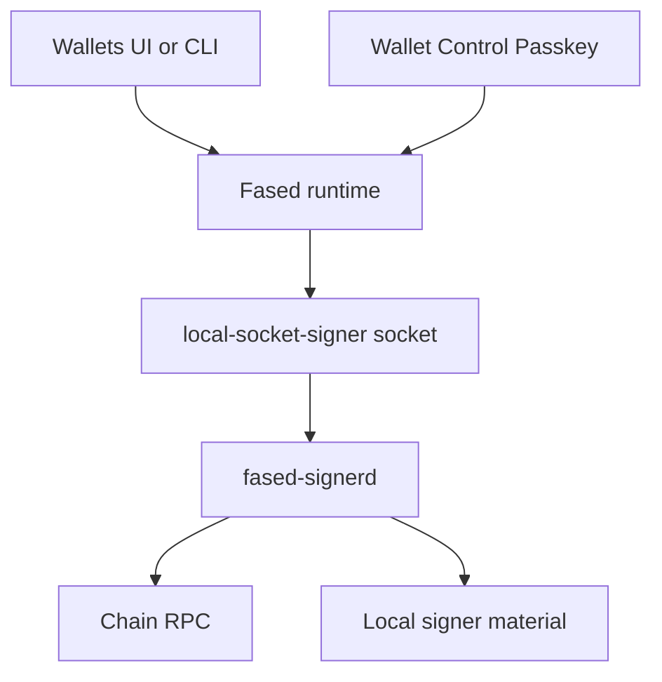

# Self-hosted wallet signer

This page explains the real self-hosted wallet model in Fased.

It is the guide for:

- how self-hosted wallets are created
- what `local-socket-signer` means
- what `fased-signerd` does
- where wallet state lives on disk
- what stays inside the signer boundary
- how passkey, lock, unlock, and recovery fit together

## The public self-hosted wallet stack

The self-hosted path is:

- a wallet entry in the runtime registry
- provider id `local-socket-signer`
- native Go signer process `fased-signerd`
- Solana RPC for balance checks and transaction work
- optional Wallet Control Passkey and split-key custody

The current public wallet UI and Agent wallet action path are Solana-only.

The self-hosted signer is the default sovereignty path. Hosted or MPC wallet
providers can be useful optional adapters later with their own custody,
credential, recovery, and policy model.

## Why Fased uses role-separated wallets

Fased is an Agent runtime with wallet actions. A normal wallet product asks
whether a user can sign. Fased also has to ask:

- which Agent requested the action
- whether the request came from chat, a task, a channel, a skill, or the UI
- which wallet role is allowed for that source
- whether a skill was reviewed and granted wallet access
- whether the action is ordinary Agent work, SAT mining, Vault storage, or
  Fased Network wallet work
- whether passkey approval, custody unlock, caps, and policy allow the action

This is why Fased uses permanent wallet purposes rather than one generic
signing account for everything:

- **Agent wallets** are the only normal automation wallets.
- **Mining wallets** are reserved for SAT mining and SAT sweep paths.
- **Vault wallets** are protected/manual-first and can back Fased Network bond
  authority.

This role split is the main safety boundary against prompt injection and
malicious skills. A skill can be installed, configured, and enabled for an Agent
without receiving mining, Vault, or raw key access.

## Local signer boundary

The local signer keeps raw wallet keys inside the signer boundary.

The intended boundary is:

- skills, plugins, chats, tasks, and channels request wallet work through the
  Gateway policy layer
- the Gateway stores wallet ids, addresses, balances, policy, approval requests,
  passkey readiness, and custody status
- the Gateway calls `local-socket-signer` over a local socket for signing work
- `fased-signerd` owns signer-side material, custody unlock state, signing, and
  signer audit logs

Agent code receives policy-mediated wallet tools and structured results. Seed
phrases, private keys, keystores, signer master passwords, and provider master
credentials stay out of Agent code.

Go is a reasonable implementation language for `fased-signerd` because it gives
Fased a small native process, static release binaries, simple deployment on
Linux/macOS, good standard-library networking/filesystem primitives, and a clean
process boundary from the TypeScript Gateway. The security property does not
come from Go alone. It comes from the combination of process separation, local
socket permissions, role policy, passkey/custody gates, short unlock sessions,
audit logs, and keeping the signer off public network surfaces.

If Fased later needs stronger key-erasure assurance or hardware-backed signing,
the signer boundary lets us improve the signer implementation without giving
skills or the Gateway direct raw key access.

## Hosted wallet providers vs local signer

Hosted or MPC wallet providers can be useful when an operator wants managed
recovery, hosted policy dashboards, or a third-party custody model. They also
introduce a different trust boundary:

- provider account credentials become critical secrets
- recovery and account suspension depend on the provider
- provider policy semantics may differ from Fased Agent/Skill/Task policy
- network availability and provider rate limits become part of wallet liveness

Fased treats external wallet providers as optional adapters. They must still
respect Fased role policy, Agent tool policy, skill grants, approval state, and
audit expectations.

Use the local signer when you want:

- self-hosted custody
- local-first operation
- SAT mining wallet separation
- Vault/bond separation
- minimal third-party wallet dependency
- clear Agent/Skill/Task policy boundaries

An external wallet provider may make sense when you need:

- managed recovery or organization custody
- account abstraction or MPC features that are not yet local
- enterprise audit/compliance integration
- a hosted wallet fleet for many app users

Keep these models explicit. If an external provider is added, document which
part of custody, recovery, policy, and audit moved outside the local signer.

Important distinction:

- `local-socket-signer` is the runtime provider id
- `fased-signerd` is the native signer process
- `walletId` and `walletName` are your operator-facing identities

## How it is put together



Read it like this:

- the UI and CLI talk to the runtime
- the runtime talks to the local signer over a local socket
- the signer handles signing work and RPC-backed chain operations
- passkey is the approval and ceremony layer on top

## How the wallet is created or imported

The normal public path is:

1. run onboarding or `fased wallet setup`
2. create or import the wallet
3. choose wallet id and wallet name
4. configure chain RPC
5. let Fased register the wallet entry
6. verify signer and wallet health

For Solana import, use a base58 64-byte private key when importing from a
wallet/export tool. Fased also accepts a Solana JSON byte array,
base64/base64url, or hex. Do not paste seed phrases into Fased wallet import.

Useful checks:

```bash
fased wallet status --json
fased wallet signer doctor --json
```

For long-running mining, Agent wallet automation, or Vault-backed Fased Network
bond use, RPC is required operating infrastructure. Public RPC can be enough for
local testing, but dedicated private RPC is the stronger operating posture.

For setup details, read [Solana RPC setup](/plugins/crypto/wallet-rpc-setup).

## Where wallet state lives

By default, wallet state lives under:

```text
~/.fased/wallet
```

Important files and paths:

**`~/.fased/wallet/wallet-keys.json`**

Runtime wallet registry and provider mappings.

**`~/.fased/wallet/policy-usage.json`**

Daily policy usage counters.

**`~/.fased/wallet/wallet-send-approvals.json`**

Pending wallet approval requests.

**`~/.fased/wallet/wallet-audit.jsonl`**

Wallet audit trail.

**`~/.fased/wallet/wallet-service.pid`**

Local wallet service pid file.

**`~/.fased/wallet/wallet-service.log`**

Local wallet service log.

**`~/.fased/wallet/wallet-service.meta.json`**

Local wallet service metadata.

**`~/.fased/wallet/local-signer.sock`**

Local signer socket.

**`~/.fased/wallet/local-signer.pid`**

Local signer pid file.

**`~/.fased/wallet/local-signer.audit.jsonl`**

Signer-side audit log.

**`~/.fased/wallet/wallet-approval-auth.json`**

Passkey public keys, challenges, and approval grants.

**`~/.fased/wallet/custody/<walletId>/state.json`**

Per-wallet custody and unlock-session state.

**`~/.fased/wallet/custody/<walletId>/shares.v1.json`**

Device-share and recovery-share metadata compatibility file.

The signer material root also defaults to `~/.fased/wallet` unless you override it with signer environment variables.

## What the runtime sees versus what the signer owns

The runtime is supposed to know:

- wallet ids and names
- addresses
- balances
- policy
- approval requests
- passkey readiness
- custody state and unlock state

The signer boundary is supposed to own:

- signing operations
- local signer socket
- signer audit stream
- signer-side material and unlock handling

Practical reading:

- the UI works through the runtime and signer boundary
- the runtime talks to the signer for signing work
- chain RPC is used for balance, mint metadata, and transaction operations
- skills and plugins should request wallet work through policy rather than
  receiving raw keys, seeds, keystores, or provider master credentials

## Passkey, lock, and unlock

Wallet Control Passkey is the approval and ceremony layer.

Use it for:

- send approvals
- policy changes
- wallet security setup
- unlock
- recovery
- device-share changes

Split-key custody is the lock layer.

The operator model is:

- wallet locked by default
- passkey starts the ceremony
- device share or recovery share completes the unlock path
- unlock creates a time-limited signer session

Current custody sessions default to:

- `15 minutes` by default
- up to `60 minutes` max

That is why “passkey enabled” and “wallet unlocked” are not the same thing.

## What the passkey file actually stores

The passkey state file is:

```text
~/.fased/wallet/wallet-approval-auth.json
```

It stores:

- passkey public-key metadata
- pending challenges
- approval grants

It is not the same thing as a wallet keystore or raw seed backup.

## Device share and recovery share

For secured wallets, the recommended split is:

- host-side signer material on the host
- device share on a trusted browser or second device
- recovery share offline

That gives you:

- fast local approval on your trusted client
- an offline recovery path if the device share is lost

Good practice:

- keep the recovery share offline
- store recovery share and device share separately
- revoke and rotate after any suspected device compromise

## Mining, Agent wallet, and bond separation

The recommended operating model is:

- Agent wallets for normal sends, Fased Network wallet work, and skill/plugin
  wallet actions
- mining wallet for Satcoin
- Vault wallet for manual-first hot or warm reserve use
- Agent wallets for invoices, fresh receiving addresses, or service receipts
- optional Fased Network bond assignment to a Vault wallet
- offline reserve outside the runtime

Why this matters:

- mining needs stable Solana RPC and ongoing fee headroom
- Agent wallet needs tighter everyday send control
- bond stays easier to review when it uses a Vault wallet separate from the
  everyday outbound wallet

## How to protect a self-hosted wallet

Recommended operator posture:

- keep admin access private through Tailscale or another private access layer
- keep the wallet host out of raw public exposure when possible
- use Wallet Control Passkey before enabling stronger wallet security
- keep secured wallets locked when idle
- keep the recovery share offline
- keep balances on runtime wallets small enough to be intentional
- sweep excess mining or Agent-wallet working value out on purpose
- review wallet and signer audit logs

## Useful commands

```bash
fased wallet setup
fased wallet status --json
fased wallet signer doctor --json
fased wallet policy profile manual-owner
fased wallet custody-lock
fased wallet canary
```

Signer-owned key creation/import, policy replacement, re-encryption, and first
WebAuthn enrollment are host-administrator operations. Hosted operators use the
typed `fased-signerd admin` client as the dedicated signer OS user through the
signer-only control socket. The Gateway account has no sudo or control-socket
access, and Fased does not provide a generic Gateway/HTTP proxy for these
operations. See the native signer's `tools/fased-signerd/ADMIN.md` in the source
release for the exact operator commands.

## Related docs

- [Wallet](/plugins/crypto/wallet-page)
- [Wallet operations and security](/plugins/crypto/wallet-production-flow)
- [Wallet signer and provider architecture](/plugins/crypto/wallet-signer-provider-architecture)
- [Wallet Control Passkey](/plugins/crypto/wallet-control-passkey)
- [Autonomous wallet security](/plugins/crypto/wallet-autonomous-security)
- [Autonomous wallet sessions](/plugins/crypto/wallet-autonomous-sessions)
- [Self-hosted wallet VPS validation](/plugins/crypto/wallet-self-hosted-vps)
