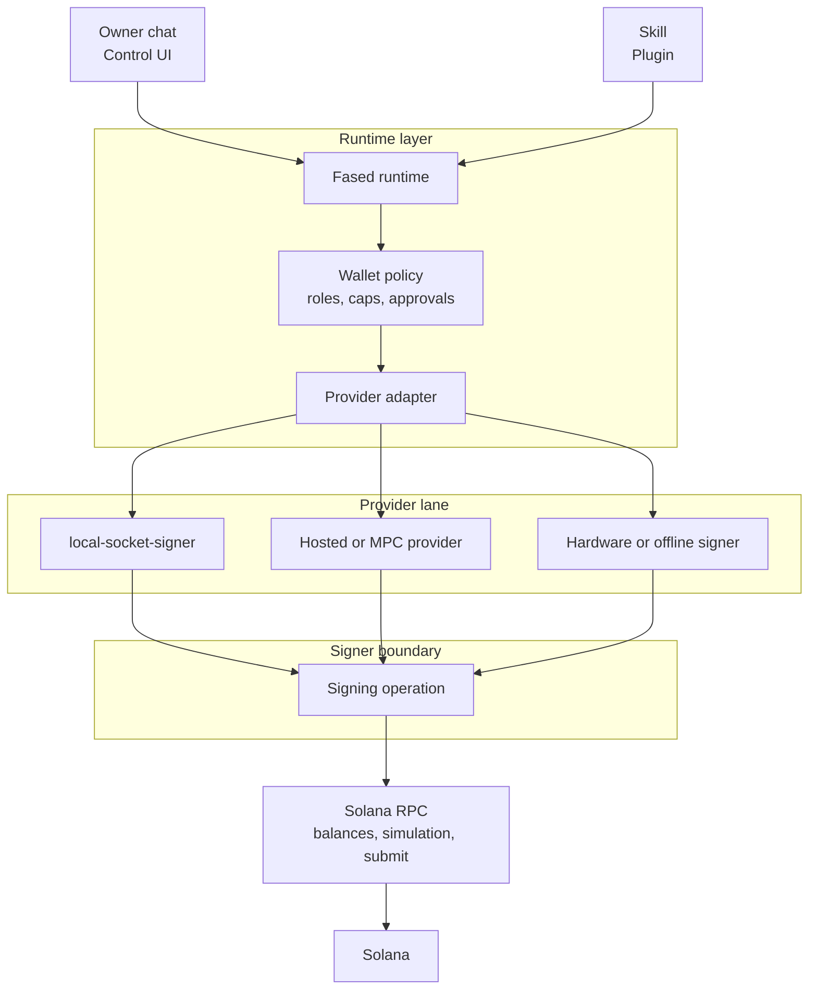

# Wallet signer and provider architecture

Fased separates the agent runtime from the wallet signer.

That separation is the main security difference between a self-hosted agent
that can use wallets and a plugin system that simply stores private keys or
provider secrets inside skills.

## Architecture layers



Fased should be read by layer:

- the runtime routes chat, tools, skills, schedules, mining, and order actions
- wallet policy decides whether a request is allowed
- provider adapters normalize the custody backend
- the signer boundary performs signing
- RPC is required for balances, simulation, submission, and confirmation

## Provider models

<CardGroup cols={2}>
  <Card title="Raw key in skill or env">
    Plugin code can reach the secret. This is the easiest prototype path, but
    it has the highest blast radius and is hard to audit.
  </Card>
  <Card title="local-socket-signer">
    Fased runtime asks a local signer to sign. This is the local-first,
    policy-aware path; the operator manages backups, RPC, and host security.
  </Card>
  <Card title="Hosted or MPC provider">
    An external provider controls or co-controls signing. This can simplify
    onboarding and recovery, with provider trust, cost, policy limits, and
    lock-in as tradeoffs.
  </Card>
  <Card title="Hardware or offline signer">
    Signing happens outside the live runtime. This is strongest for offline
    reserve, but it is slower and not suited to unattended automation.
  </Card>
</CardGroup>

The public Fased posture is local-first. Hosted providers can be useful later
as explicit optional adapters. The local signer remains the default
sovereignty path.

## Keep keys outside skills

Skills are execution surfaces. They may contain third-party code, model-driven
plans, external APIs, or user-authored workflows.

Skill install and wallet approval are separate gates.

If a skill can read a private key, seed phrase, raw keystore, provider master
API key, or unscoped wallet credential, the skill can become the wallet. That
is the wrong boundary for agent automation.

Fased instead routes wallet actions through:

- wallet purpose: Agent, Mining, or Vault
- explicit wallet selection and `@wallet:<walletId>` handles
- per-wallet SOL caps
- per-mint token caps
- program and route allowlists where needed
- signer and custody state
- approval/passkey ceremonies where configured
- audit logs and emergency stop controls

## Local signer path

The canonical unattended self-hosted path is:

- provider id: `local-socket-signer`
- signer process: `fased-signerd`
- wallet material: local signer material
- transport: local socket
- chain path: Solana-first in the public wallet path
- RPC: operator-provided Solana RPC

The runtime knows wallet ids, names, balances, policies, approvals, custody
state, and audit state. The signer owns signing operations and signer-side
material handling.

## Hosted provider path

Hosted or MPC providers can be added as adapters when the product needs easier
onboarding, recoverability, mobile flows, or enterprise policy.

Use them with care:

- provider API keys are high-value credentials
- secrets must not be visible to skills or model prompts
- provider policy must be mapped into Fased wallet policy
- spend caps and allowlists still matter
- chain fees and RPC/provider fees still exist
- operators should know whether the wallet is self-hosted, provider-managed, or hybrid

Hosted providers are a good optional lane. Keep the local sovereign signer as
the reference path for self-hosted operation.

## Reviewed wallet actions

Fased wallet actions can support reviewed routes for both manual and approved
automated flows.

Manual flow:

- the operator chooses a standard send or reviewed route action
- Fased previews amount, asset, recipient, route type, fees, expected timing, and receipt policy
- signer policy and approval decide whether the action can proceed

Skill or agent flow:

- a skill requests a reviewed send or route action through the wallet tool surface
- wallet policy checks wallet role, token allowlist, route allowlist, recipient
  or invoice trust, per-tx cap, daily cap, approval threshold, and custody state
- the signer executes only after policy and approval pass
- audit records route type, asset, amount, recipient reference, receipt reference, and the requesting skill

## RPC cost and reliability

Every Solana wallet path needs RPC.

Operators can use public RPC for testing, but production mining, order actions, or
agent services should use a reliable provider or private endpoint. RPC affects:

- balance freshness
- transaction simulation
- transaction submission
- confirmation latency
- mining and order-action reliability
- privacy and metadata exposure to infrastructure providers

Long term, Fased can support managed RPC or operator RPC lanes, but the T0
assumption is that operators bring their own reliable RPC.

## Recommended split

Use separate wallet roles:

- Agent wallet for sends, optional route actions, schedules, skills, plugins, and order actions
- Mining wallet for SAT mining only
- Vault wallet for manual reserve and bond assignment
- Agent wallet for invoices, fresh receiving addresses, or service receipts
- Offline reserve outside the runtime

This split makes privacy and security easier. One leaked address or bad
workflow should not describe the operator's entire business.

## Design rule

```text
Skills request work.
Policy decides permission.
Signer performs signing.
Audit records the result.
```

## Related docs

- [Wallet](/plugins/crypto/wallet-page)
- [Self-hosted wallet signer](/plugins/crypto/wallet-self-hosted)
- [Autonomous wallet security](/plugins/crypto/wallet-autonomous-security)
- [Wallet Control Passkey](/plugins/crypto/wallet-control-passkey)
- [Autonomous wallet sessions](/plugins/crypto/wallet-autonomous-sessions)
- [Mining](/plugins/crypto/mining-page)
