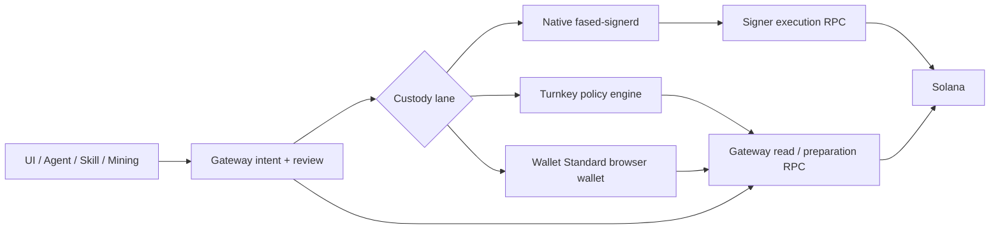

# Wallet signer and provider architecture

Fased does not give skills, chats, tasks, plugins, or the Gateway a generic
private-key or raw-signing API. Wallet work moves through a typed provider
adapter and an independently enforced policy.



The important rule is:

```text
The caller requests a typed operation.
The custody authority validates the exact intent and policy.
Only then can one exact transaction be signed and broadcast.
```

## Supported custody lanes

| Lane                                  | Current use                                            | Security boundary                                                                                                                                                                                                                                                                                                                          |
| ------------------------------------- | ------------------------------------------------------ | ------------------------------------------------------------------------------------------------------------------------------------------------------------------------------------------------------------------------------------------------------------------------------------------------------------------------------------------ |
| Native signer, Local Linux/macOS/WSL2 | Agent, Mining, and reviewed Vault wallets              | Keys are created/imported and used only by Go, but Gateway and signer run as the same OS user. This is process and code-path isolation, not a hard boundary against a compromised same-user process or host account.                                                                                                                       |
| Native signer, VPS Hosting            | Agent, Mining, and reviewed Vault wallets              | Root installs a verified fixed binary. `fased-signer` owns key state and the control socket. The Gateway account receives only the typed application socket and has no signer sudo access.                                                                                                                                                 |
| Native signer, Local Docker           | Local development and self-hosting on Linux/macOS/WSL2 | Signer has a separate non-root container and signer-only volume; Gateway receives only the socket volume. It is not VPS Hosting and is not a boundary against the Docker daemon or host administrator.                                                                                                                                     |
| Turnkey                               | Manual reviewed Agent or Vault SOL/SPL transfers       | Turnkey holds the signing authority. Its organization policy must independently restrict the dedicated API user. Fased requires the configured policy to be the exclusive `OUTCOME_ALLOW` for the completed activity before broadcast; the Gateway-held API key means the Turnkey policy, not this post-check, is the compromise boundary. |
| Solana Wallet Standard                | Manual hardware-backed Vault transfers                 | Fased stores only the public address. The browser wallet signs one immutable review. Wallet Standard discovery alone cannot prove hardware backing; confirm the account and transaction on the hardware device.                                                                                                                            |

Privy is not a supported signing lane. Its adapter is an unavailable placeholder
and Fased refuses to save credentials as if creation or signing worked.

The legacy Node `embedded-keystore` is not an execution option. Existing legacy
state must be migrated to the native signer; it is never silently reopened or
decrypted by the Gateway.

## What Go owns

For the native lane, `fased-signerd` owns:

- wallet creation and import;
- encrypted private-key state and re-encryption;
- the signer master key;
- wallet role and versioned policy;
- signer-owned RPC configuration;
- WebAuthn credentials, challenges, and single-use approvals;
- durable request ids, transaction digests, signed bytes, cap reservations,
  daily totals, broadcast state, and reconciliation.

New wallets start with an explicit deny-all policy. Empty operations, programs,
assets, mints, or destinations grant nothing. Policy health exposes its exact
version and hash. A UI policy change remains pending until the signer
acknowledges that exact hash.

The Gateway never creates a new key, accepts a key through an HTTP route, or
receives plaintext key material during normal creation/import. Import is an
explicit native admin command over the signer-only control socket.

<Warning>
Go is not itself a security boundary. On a Local same-user install, malicious
code running as that user may be able to inspect or alter the user's files and
processes. Use VPS Hosting's separate signer account, a hardware wallet, or a
properly configured provider policy when compromise isolation matters.
</Warning>

## Protocol v2 and typed operations

The Gateway and signer negotiate protocol-v2 capabilities. Missing or
incompatible capabilities fail closed.

The native application socket accepts narrowly typed operations, including:

- native SOL transfer;
- checked SPL transfer with exact mint, amount, source, and destination;
- generated SAT mining, claim, sweep, cleanup, bond, and federation actions;
- signer-validated Jupiter swap and Trigger order operations;
- exact review preparation, approval, execution, status, and reconciliation.

It does not expose arbitrary `signTx`, generic caller-selected serialized
transactions, raw instructions, generic messages, or a custody-control relay.
Typed Jupiter swap and Trigger operations may carry a provider-produced
transaction artifact, but Go decodes that artifact and semantically validates
the exact operation, amount, programs, mints, destinations, PDAs, signer flags,
and writable accounts before policy approval.

For a checked SPL transfer, Go derives both canonical token accounts and always
adds the Associated Token Program's idempotent destination-account creation.
It validates the existing source and any existing destination, explicitly
requires the System/Associated Token/Token programs in policy, and includes
possible account rent in the signer-owned fixed SOL reservation.

Every potentially mutating request admitted to the native signer has a stable
request id and immutable intent digest. The caller must persist and reuse that
same id across transport failure or restart; the signer never invents a safe
replacement for a caller that loses it. The signer stores its state atomically
in bbolt:

- `reserved`
- `broadcast`
- `confirmed`
- `failed`
- `unknown`

`broadcast` and `unknown` consume the reserved cap. An ambiguous response is
never retried with a replacement signature. Fased first reconciles the exact
stored signature or signed transaction bytes.

## Reviews and WebAuthn

Every manual native reviewed Agent, Mining, or Vault action uses signer-owned
WebAuthn. Narrowly autonomous Agent and generated Mining operations are the
explicit-policy exceptions. The challenge binds:

- wallet id and role;
- exact operation and immutable transaction or federation digest;
- decoded destinations, mints, and amounts;
- policy version and hash;
- request id, nonce, and short expiry.

The signer verifies the credential and consumes the approval once. A Gateway
token that binds only a host or operation is not a custody approval.

The optional Control UI account passkey under Account Security is separate
Gateway-owned authentication and cannot satisfy a signer review. The Control UI is also
served by the Gateway, so signer WebAuthn does not independently display
transaction intent on trusted hardware. A hardware wallet that shows the
account and transaction on-device provides a stronger manual Vault review.

## Wallet roles

- **Agent:** reviewed or narrowly autonomous typed SOL/SPL work. Autonomous
  use needs explicit positive per-transaction and daily caps plus exact
  programs, assets, mints, and destinations.
- **Mining:** typed SAT protocol actions and the SOL needed for fees/capital.
  Generic wallet sends remain reviewed; Mining is not a general token-trading
  wallet.
- **Vault:** manual-only reviewed reserve and bond authority. Do not enable
  generic direct signing to make Vault sends work.

"Low balance" means keeping only the amount whose loss fits the intended
working-risk envelope. It does not mean Mining can hold only SAT: Mining also
needs SOL for fees and configured capital. It does mean unrelated assets and
destinations should not be allowed by its signer policy.

## Skills and providers

Installing a skill never grants wallet authority. A wallet-capable skill needs
an explicit Agent-wallet grant with actions, wallet ids, chain, source
registry (or explicit `local` source), mints, amount/slippage caps, and any
autonomous or scheduled permission. The signer policy remains the final
authority.

Provider credentials are secrets too. Keep Turnkey API credentials and RPC
URLs out of chats, prompts, skill files, command arguments, and shell history.
The Turnkey API credential is loaded by the Gateway, so a dedicated restrictive
Turnkey policy must remain safe even if that process is compromised. Use the
supported credential and signer-admin input paths.

## RPC ownership

Protocol-v2 native execution reads encrypted, versioned, per-wallet execution
RPC from signer-owned state, not Gateway wallet environment variables. Signer
health exposes readiness and a keyed hash, not its URL/token.

The Gateway separately needs a read/preparation RPC for dashboard token
inventory, SAT watchers/readiness, federation/bond inspection, Jupiter/Trigger
preparation, and provider/hardware lanes. The simple wizard initially stores
the same endpoint in both planes, so it is visible to Gateway code. A stronger
deployment uses a distinct read-only Gateway credential. The Gateway has no
arbitrary RPC proxy through the signer.

## Choosing a lane

- Use Local native signing for development and low-value same-user operation.
- Use Local Docker when you want reproducible local containers, not VPS
  Hosting.
- Use VPS Hosting when you want an always-on self-hosted signer separated from
  the Gateway account.
- Use a hardware-backed Wallet Standard account for reserve/Vault funds that
  should require on-device review.
- Use Turnkey only with a dedicated API user and a provider policy you have
  verified independently.
- Keep long-term reserve outside unattended Agent and Mining wallets.

## Related docs

- [Self-hosted wallet signer](/plugins/crypto/wallet-self-hosted)
- [Wallet operations and security](/plugins/crypto/wallet-production-flow)
- [Wallet roles and policies](/plugins/crypto/wallet-roles-and-policies)
- [Wallet passkeys](/plugins/crypto/wallet-control-passkey)
- [Docker (Local only)](/install/docker)
- [Windows (WSL2)](/platforms/windows)
