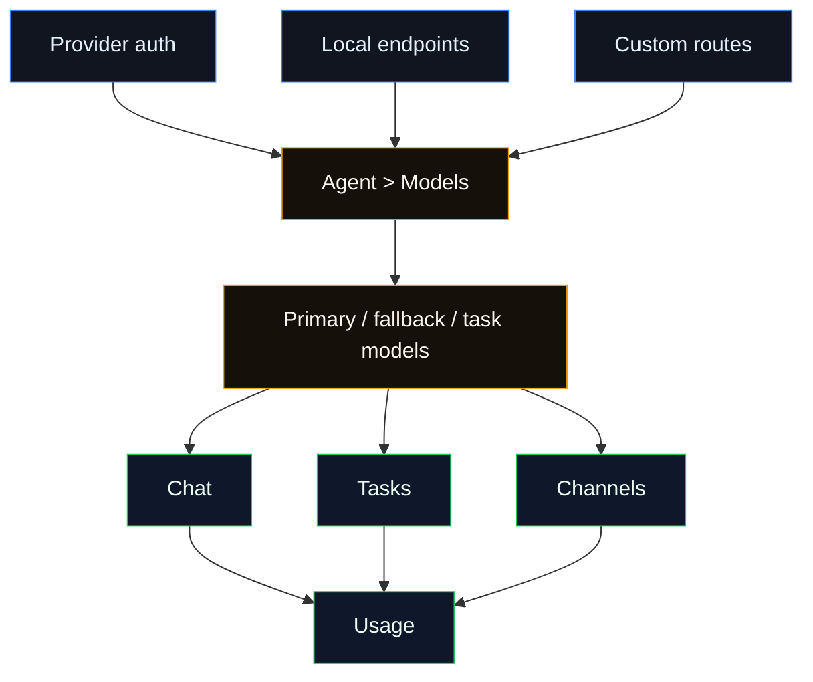

# Model Providers

Models are configured per Agent. Open **Agents**, select an Agent, then use
**Agent > Models** to connect provider credentials, choose model roles, and test
the route.

There is one provider registry shared by onboarding, CLI, Agent setup, Chat,
tasks, and channel-routed Agents. Channels such as Telegram or Discord are
separate from model providers; configure those from **Agent > Channels**.

## Model Route

## What This Section Covers

| Page                                           | Use it for                                                                |
| ---------------------------------------------- | ------------------------------------------------------------------------- |
| [Model Provider Quickstart](/providers/models) | First setup path from credential to first chat.                           |
| [Models](/concepts/models)                     | Model selection, aliases, fallbacks, session overrides, and CLI commands. |
| [Model providers](/concepts/model-providers)   | Provider registry rules, model metadata, refresh, and local endpoints.    |
| [Model failover](/concepts/model-failover)     | Auth profile rotation and fallback behavior.                              |

## Provider Groups

| Group                | Meaning                                                                                              |
| -------------------- | ---------------------------------------------------------------------------------------------------- |
| Common providers     | Main hosted providers most users start with.                                                         |
| Local and private    | Ollama, LM Studio, vLLM-compatible, LiteLLM, and Custom Provider routes.                             |
| Additional providers | Supported hosted or gateway providers that remain first-class but are less common first-run choices. |

## Code-Backed Provider Surface

These pages map to the shared provider registry used by onboarding, CLI, and
**Agent > Models**. If a provider is not visible as ready, first check that the
Agent has a credential, token, endpoint, or local server configured for that
provider.

| Provider page         | Registry id             | Main route or surface                                     |
| --------------------- | ----------------------- | --------------------------------------------------------- |
| OpenAI                | `openai`                | `openai`, `openai-codex`                                  |
| Anthropic             | `anthropic`             | `anthropic` with OAuth, setup-token, or API key auth      |
| Chutes                | `chutes`                | `chutes` with sign-in or API key                          |
| Ollama                | `ollama`                | native Ollama URL                                         |
| LM Studio             | `lmstudio`              | local LM Studio `/v1` server                              |
| vLLM-compatible       | `vllm`                  | OpenAI-compatible local server                            |
| MiniMax               | `minimax`               | `minimax`, `minimax-cn`, `minimax-portal`                 |
| Moonshot AI           | `moonshot`              | `moonshot`, `kimi-coding`                                 |
| Google                | `google`                | `google`, `gemini`, `google-gemini-cli`                   |
| xAI                   | `xai`                   | `xai` OAuth, device, or API key                           |
| Mistral AI            | `mistral`               | `mistral` API key                                         |
| Volcano Engine        | `volcengine`            | `volcengine`, `volcengine-coding`, `volcengine-plan`      |
| BytePlus              | `byteplus`              | `byteplus`, `byteplus-coding`, `byteplus-plan`            |
| OpenRouter            | `openrouter`            | `openrouter` dynamic model catalog                        |
| Qwen                  | `qwen`                  | `qwen`, `qwen-coding-plan`                                |
| Z.AI                  | `zai`                   | `zai` Global, CN, and Coding Plan profiles                |
| Qianfan               | `qianfan`               | `qianfan` API key                                         |
| GitHub Copilot        | `copilot`               | `github-copilot`, optional `copilot-proxy`                |
| Vercel AI             | `ai-gateway`            | `vercel-ai-gateway`                                       |
| OpenCode Zen          | `opencode-zen`          | `opencode` route with OpenCode Zen auth                   |
| Xiaomi                | `xiaomi`                | `xiaomi` MiMo API                                         |
| Synthetic             | `synthetic`             | `synthetic` Anthropic-compatible API                      |
| Together AI           | `together`              | `together` API key                                        |
| Hugging Face          | `huggingface`           | `huggingface` Inference Providers route                   |
| Venice AI             | `venice`                | `venice` API key                                          |
| LiteLLM               | `litellm`               | LiteLLM proxy URL and key                                 |
| Cloudflare AI Gateway | `cloudflare-ai-gateway` | built-in Anthropic through Cloudflare AI Gateway path     |
| Custom Provider       | `custom`                | manual OpenAI-compatible or Anthropic-compatible endpoint |

## Health And Usage

**Agent > Models** can show reachability, auth health, discovered models,
private-network approval, and known model capabilities. Token and cost
accounting stays on **Usage**, grouped by provider, model, Agent, session, task,
and channel.
