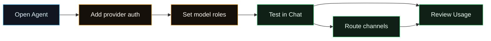

# Model Provider Quickstart

Fased uses one provider registry for onboarding, CLI, Agent setup, Chat, tasks,
and channel-routed Agents. The normal browser surface is **Agent > Models** for
the selected Agent.

## Quick Start Path

1. Open **Agents**, select an Agent, and use **Agent > Models** to add a
   credential, sign in, paste a token, or configure a local/manual endpoint.
2. Choose that Agent's primary/fallback/task model roles on the same page.
3. Use **Chat** to test the Agent. Chat can override the model for the current
   session when the route is usable.
4. Use **Agent > Channels** to route external apps to that Agent.
5. Use **Usage** when you need local token totals grouped by provider, model,
   Agent, session, task, or channel.

## Pick The Provider Shape

| Shape                 | Start with                                                                                                                                                                   |
| --------------------- | ---------------------------------------------------------------------------------------------------------------------------------------------------------------------------- |
| Hosted API or sign-in | [OpenAI](/providers/openai), [Anthropic](/providers/anthropic), [Chutes](/providers/chutes), or another provider page.                                                       |
| Router or aggregator  | [OpenRouter](/providers/openrouter), [Vercel AI](/providers/vercel-ai-gateway), [LiteLLM](/providers/litellm), or [Cloudflare AI Gateway](/providers/cloudflare-ai-gateway). |
| Local model           | [Ollama](/providers/ollama), [LM Studio](/providers/lmstudio), or [vLLM-compatible](/providers/vllm).                                                                        |
| Custom endpoint       | [Custom Provider](/providers/custom).                                                                                                                                        |

## Catalog Maintenance

Use `fased providers refresh` to compare the checked-in provider registry with
live or reviewed source catalogs. Use `fased providers refresh --write-review`
before applying model or capability changes.

Use `fased providers models add/remove` for local or custom model entries on the
current machine.

See [Model providers](/concepts/model-providers) for the exact refresh and
manual-model commands.

Provider docs intentionally list only first-class **Agent > Models** providers.
Use [Ollama](/providers/ollama) for native Ollama, [LM Studio](/providers/lmstudio)
for localhost:1234, [vLLM-compatible](/providers/vllm) for vLLM, SGLang, TGI,
LocalAI, FastChat, and similar OpenAI-compatible local servers, and
[Custom Provider](/providers/custom) when the shortcut does not fit.

Provider setup shows account/endpoint health: reachable, auth ok, models
discovered, and private network approved. Token and cost accounting remains on
Usage, where it is based on Fased's local usage history rather than provider
quota screens.
