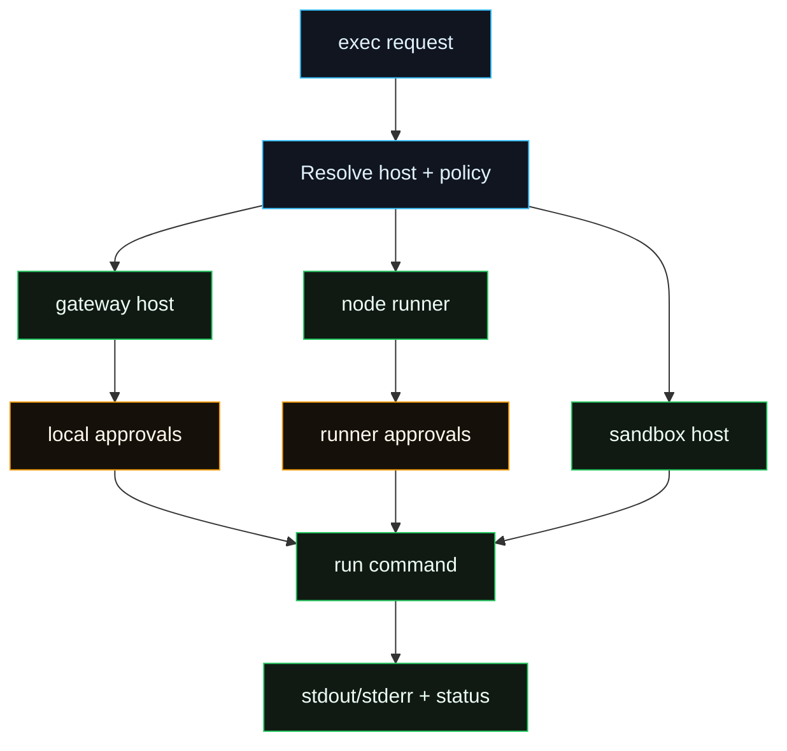
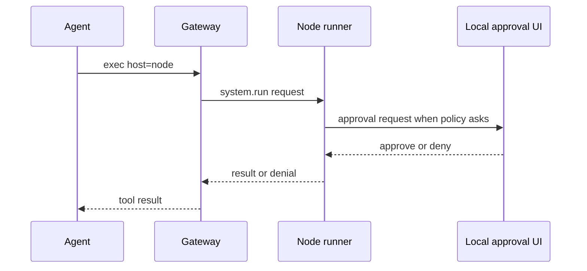

# Exec Host Refactor

This is an engineering note. Operator-facing docs live in [Exec tool](/tools/exec),
[Exec approvals](/tools/exec-approvals), [Elevated mode](/tools/elevated),
[Nodes](/nodes), and [Gateway protocol](/gateway/protocol).

## Status

Implemented for the current sandbox, gateway, and node exec policy path. This
page keeps the design boundary and remaining limitations concise.

## Goals

- Route execution across `sandbox`, `gateway`, and `node` hosts.
- Keep cross-host execution gated by explicit config and approval policy.
- Support per-Agent policy, allowlists, ask mode, and node binding.
- Use a runner service for node-host execution.
- Keep UI approval prompts optional; headless mode must still enforce policy.

## Non-Goals

- Legacy allowlist migration.
- PTY/background continuation for node exec. Node `system.run` returns an
  aggregate result; PTY and process continuation stay on the gateway/sandbox
  exec path.
- A second network protocol beyond Gateway WebSocket node/operator transport.

## Exec Route

## Key Concepts

| Concept      | Values                       | Meaning                               |
| ------------ | ---------------------------- | ------------------------------------- |
| Host         | `sandbox`, `gateway`, `node` | Where the command runs                |
| Security     | `deny`, `allowlist`, `full`  | How the host gates execution          |
| Ask mode     | `off`, `on-miss`, `always`   | When approval UI is requested         |
| Node binding | node id/name/ip/prefix       | Which paired node may run the command |

Policy resolution order:

1. Tool parameter.
2. Agent override.
3. Global config.
4. Built-in defaults.

## Defaults

- `exec.host = sandbox`.
- Non-sandbox hosts require explicit policy.
- `exec.ask = on-miss` where ask behavior is relevant.
- If multiple nodes are paired, set a node binding; otherwise node execution
  fails closed instead of guessing.

## Config Surface

Global keys:

- `tools.exec.host`
- `tools.exec.security`
- `tools.exec.ask`
- `tools.exec.node`

Per-Agent keys:

- `agents.list[].tools.exec.host`
- `agents.list[].tools.exec.security`
- `agents.list[].tools.exec.ask`
- `agents.list[].tools.exec.node`

Slash command aliases:

- `/elevated on`
- `/elevated ask`
- `/elevated full`
- `/elevated off`

## Approval Store

Execution hosts use local approval state, not a shared trust bypass.

Expected properties:

- Stored under the local Fased state directory.
- File permissions `0600`.
- Per-Agent policy and allowlists.
- Ask fallback for headless mode.
- UI clients authenticate before approval prompts are accepted.

## Runner And UI

Node-host execution goes through the paired node runner. When an approval UI is
available, the runner can ask through local IPC. When the UI is missing, the
runner applies the configured fallback. Node execution uses `system.run` and
returns the finished result to the Gateway; long-running foreground/background
process management remains a gateway/sandbox exec feature.

## Eventing

Exec lifecycle events should be concise:

- `Exec started`
- `Exec finished`
- `Exec denied`

Events are session-scoped and should avoid leaking unnecessary command details
outside the execution context.

## Delivered Boundaries

- Config + exec routing.
- Approval store + gateway enforcement.
- Node runner enforcement.
- Node-to-gateway lifecycle events.
- UI controls for approvals and node binding.

## Remaining Edges

- Node exec does not provide PTY/process continuation parity with local exec.
- Approval UI unavailable in ask-required flows falls back by policy.
- Long-running node commands depend on node timeout and event handling.

## Tests

- Allowlist matching.
- Policy resolution precedence.
- Gateway host deny/allow/ask flows.
- Node runner deny/allow/ask flows.
- Gateway event mapping.

## Watch Points

- Output caps and timeout behavior for large node commands.
- Node capability drift when a paired node reconnects with different commands.
- Clear operator messaging when approval fallback denies a request.
