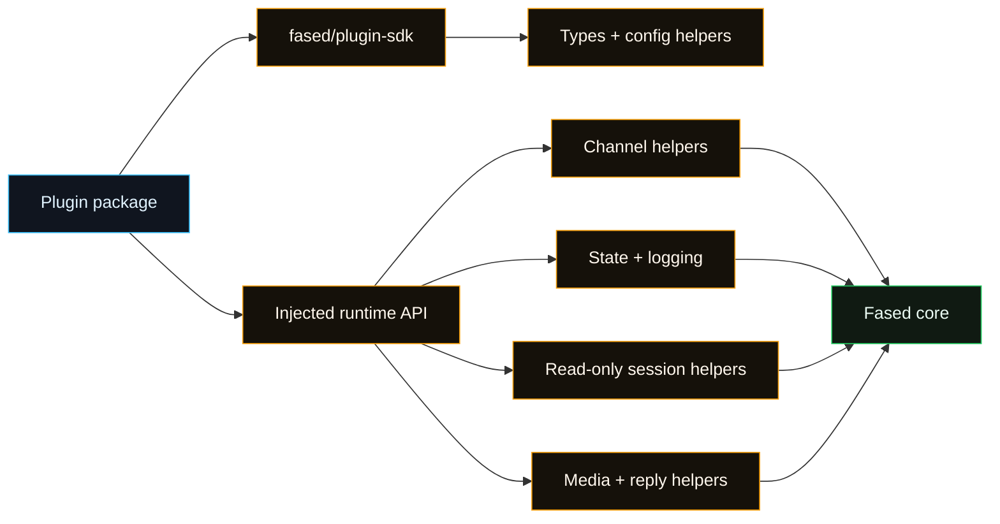

# Plugin SDK Refactor

This is an engineering note, not the stable public plugin API reference. Public
plugin docs live in [Plugin manifest](/plugins/manifest), [Plugin agent
tools](/plugins/agent-tools), and [Tools](/tools).

## Status

Fased has a core plugin SDK/runtime surface. Bundled and external plugins should
depend on the Fased SDK plus the injected runtime API. Direct `src/**` imports
inside plugin code are migration debt and should disappear over time.

Compatibility aliases may exist during migration, but new plugin docs and new
plugin code should use the Fased import path only.

## Target Boundary



## SDK Scope

The SDK is compile-time only: types, manifest helpers, config helpers, action
gate helpers, channel metadata helpers, and docs-link helpers. It should not
touch runtime state or import Fased internals.

Examples:

- `ChannelPlugin`, `ChannelMeta`, `ChannelCapabilities`.
- Config schema helpers.
- Pairing/onboarding helper types.
- Tool parameter helpers.
- Result formatting helpers.

## Runtime Scope

Runtime behavior is injected through `FasedAgentPluginApi.runtime`. Plugins use
that runtime instead of importing internal source files.

Runtime groups should stay narrow:

| Runtime group      | Purpose                                     |
| ------------------ | ------------------------------------------- |
| `channel.text`     | chunking, command detection, text limits    |
| `channel.reply`    | reply dispatch and buffered delivery        |
| `channel.routing`  | channel/account/peer session routing        |
| `channel.pairing`  | pairing replies and allow-from reads        |
| `channel.media`    | remote media fetch and saved media buffers  |
| `channel.mentions` | mention regex and matching helpers          |
| `channel.groups`   | group policy and require-mention resolution |
| `channel.debounce` | inbound debounce helpers                    |
| `channel.commands` | command authorization helpers               |
| `logging`          | plugin logger access                        |
| `state`            | state directory resolution                  |
| `helpers.sessions` | read-only session status/metadata           |

## Session Helper Rule

`runtime.helpers.sessions` is intentionally read-only. It may expose sanitized
session status for dashboards and diagnostics, but not transcripts, message
bodies, raw file paths, wallet actions, node invocation, config mutation, plugin
installation, or Gateway dispatch.

Enable it per plugin:

```bash
fased plugins helpers sessions enable my-plugin
fased plugins helpers sessions disable my-plugin
fased plugins helpers sessions status my-plugin
```

## Migration Plan

1. Keep SDK/runtime exports stable for migrated plugins.
2. Replace per-extension bridges with injected runtime helpers.
3. Migrate light direct-import plugins first.
4. Migrate heavier channel plugins after reply/routing helpers are complete.
5. Add CI checks so plugin packages do not import from `src/**`.

## Compatibility

- SDK changes follow semver.
- Runtime surface is versioned with the Fased core release.
- Plugins should declare the runtime range they require.
- Transitional aliases should be treated as temporary implementation support,
  not public documentation surface.

## Tests

- Runtime helper unit tests using the real core implementation.
- Golden channel tests for routing, pairing, allowlist, mention gating, and
  reply behavior.
- One external sample plugin smoke test in CI.

## Success Criteria

- Bundled connectors use SDK + injected runtime.
- New connector templates depend only on SDK/runtime.
- External plugins can be developed without core source imports.
- Refactor notes stay separate from public user setup docs.
