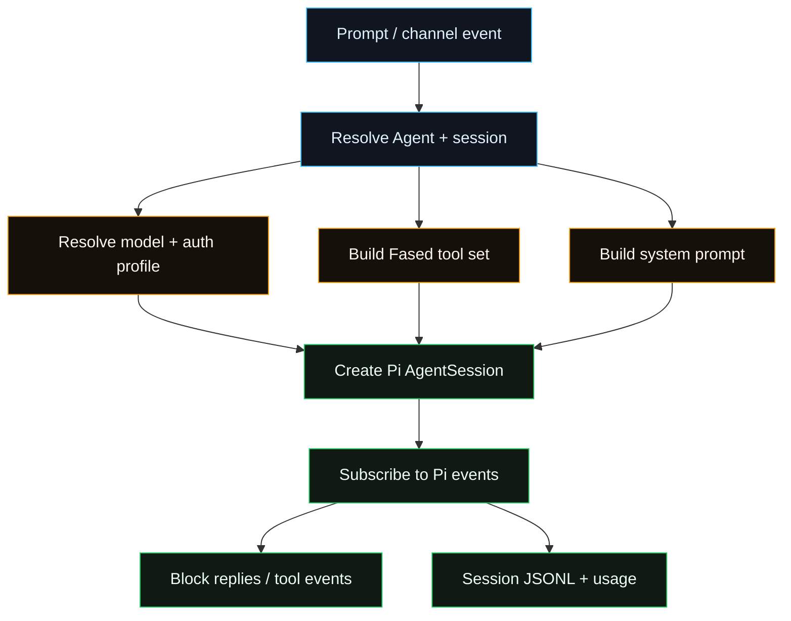
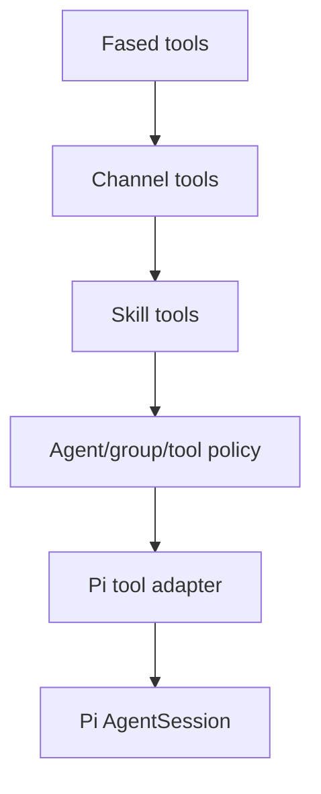

# Pi Integration Architecture

Fased embeds the Pi agent runtime directly instead of spawning a separate `pi`
process. This page is a reference map for maintainers. For normal operator setup,
use [Getting Started](/start/getting-started), [Models](/providers/index), and
[Agent Runtime](/concepts/agent).

## Dependency Boundary

Fased imports Pi packages from `package.json`:

- `@mariozechner/pi-ai`
- `@mariozechner/pi-agent-core`
- `@mariozechner/pi-coding-agent`
- `@mariozechner/pi-tui`

Keep exact versions in `package.json` and lockfiles, not in this page.

## Runtime Path

## Source Map

- Runner entry:
  `src/agents/pi-embedded-runner.ts`,
  `src/agents/pi-embedded-runner/run.ts`
- Run attempt:
  `src/agents/pi-embedded-runner/run/attempt.ts`
- Session manager:
  `src/agents/pi-embedded-runner/session-manager-*`
- Event subscription:
  `src/agents/pi-embedded-subscribe*.ts`
- Tool creation:
  `src/agents/pi-tools*.ts`, `src/agents/tools/**`
- Tool adaptation:
  `src/agents/pi-tool-definition-adapter.ts`
- Model/auth resolution:
  `src/agents/pi-embedded-runner/model.ts`, `src/agents/model-auth.ts`,
  `src/agents/auth-profiles/**`
- System prompt:
  `src/agents/pi-embedded-runner/system-prompt.ts`,
  `src/agents/system-prompt*.ts`
- Compaction/pruning:
  `src/agents/pi-embedded-runner/compact.ts`, `src/agents/pi-extensions/**`
- Provider quirks:
  `src/agents/pi-embedded-runner/extra-params.ts`,
  provider-specific wrapper files

## Session Lifecycle

1. Resolve the Agent, channel/session key, workspace, model role, auth profile,
   and tool policy.
2. Open or create the session JSONL through Pi's session manager.
3. Create a Pi `AgentSession` with Fased tools and Fased system prompt content.
4. Subscribe to Pi events for assistant text, tool calls, compaction, errors,
   and lifecycle events.
5. Stream response blocks back to Chat, Tasks, or channel delivery.
6. Persist session state and usage metadata through Fased's own stores.

## Tool Pipeline

Fased does not expose Pi's default tool surface directly. It builds a controlled
tool list, adapts it to Pi's tool definition shape, and then applies policy.

Important rules:

- Tool availability is controlled by Agent, channel, group, sandbox, and wallet
  policy.
- Channel tools are injected only when the current route supports them.
- Wallet-capable skills still need explicit wallet grants outside the model
  provider setup.
- Tool result shapes are normalized before they reach provider adapters.

## Model And Auth

Fased resolves provider/model/auth before creating the Pi session:

- Model refs use `provider/model`.
- Auth profiles can rotate on failures when configured.
- Failover uses Fased fallback policy, not an implicit provider promise.
- Provider-specific request shaping is isolated under the embedded runner and
  provider modules.

## Compaction And History

Fased keeps Pi session JSONL persistence but adds its own controls around:

- context overflow handling
- manual and automatic compaction
- cache-aware pruning
- image prompt handling
- token/usage history
- session archive and memory hooks

For details, see [Session Management & Compaction](/reference/session-management-compaction),
[Prompt caching](/reference/prompt-caching), and [Memory Config](/reference/memory-config).

## Streaming And Replies

Pi emits assistant, tool, and lifecycle events. Fased translates those into:

- Chat stream updates
- channel block replies
- tool result summaries
- task run updates
- usage records

Streaming cleanup includes thinking/final tag handling, reply directives, media
directives, and provider-specific transcript hygiene.

## Provider Handling

Provider-specific code should stay narrow and test-backed. Current categories:

- Anthropic-family transcript and cache behavior.
- Google/Gemini turn ordering and schema sanitation.
- OpenAI/Codex tool compatibility and Responses behavior.
- Router/provider extra params in `extra-params.ts`.

For provider setup, see [Model Providers](/providers/index).

## Tests

Primary coverage:

- `src/agents/pi-embedded-*.test.ts`
- `src/agents/pi-embedded-runner/**/*.test.ts`
- `src/agents/pi-embedded-subscribe*.test.ts`
- `src/agents/pi-tools*.test.ts`
- `src/agents/pi-tool-definition-adapter*.test.ts`
- `src/agents/pi-extensions/**/*.test.ts`

Live/opt-in coverage uses `FASED_LIVE_TEST=1` where test files require real
provider credentials.

For run commands, see [Pi Development Workflow](/reference/pi-development) and
[Tests](/reference/test).
