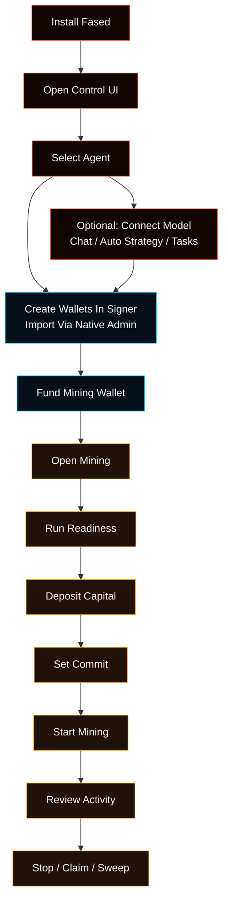

# Agent, Wallets, And Mining Walkthrough

This is the guided path from a fresh Fased install to a working Agent, wallet
setup, and Satcoin mining control. New native wallets are created inside the Go
signer and return only a public address. Existing-key import is a separate
native signer-admin operation; the browser and Gateway never accept a private
key.

Use this page when you want the shortest guided route. Each section links to the
deeper docs for the same area.

<Warning>
Do not start with wallet funding, mining, or bond. First prove the runtime:
install Fased, verify the Gateway, and open the dashboard. Connecting a model
and sending a test chat proves the broader Agent path, but it is optional for
deterministic mining.
</Warning>



## Before You Start

Pick where Fased Agent runs.

| Setup           | Use when                                     | Recommended path                                       |
| --------------- | -------------------------------------------- | ------------------------------------------------------ |
| Local           | you are learning or testing on this computer | macOS Terminal, Windows WSL2 Ubuntu, or Linux terminal |
| VPS Hosting     | you need an always-on machine                | Ubuntu LTS VPS first; Debian is close                  |
| Hosted advanced | you already manage Linux servers             | Fedora or RHEL-family with systemd                     |

Practical baseline:

- Local: a normal laptop/desktop that can run a browser and terminal.
- Hosted test VPS: `1 vCPU / 1 GB RAM` can work, but may feel slow.
- Hosted smoother VPS: `2 GB RAM` or `2 vCPU / 4 GB RAM`.
- Hosted disk: `20 GB` minimum, `40 GB+` more comfortable.

For hosted setup, keep the VPS provider console open until private access
works. Do not expose the dashboard as a public web panel.

## 1. Install Fased

Choose the setup profile first.

<Tabs>
  <Tab title="Local install">
    Use this on your own computer. On macOS, use Terminal. On Windows, use WSL2
    with Ubuntu. On Linux, use your distro terminal.

    ```bash
    curl -fsSL https://raw.githubusercontent.com/fased-ai/fased/main/install.sh | bash -s -- --local
    ```

    On Windows, first follow [Windows Local setup](/platforms/windows). Run the
    command above in the Ubuntu WSL2 shell—not PowerShell, Command Prompt, Git
    Bash, or native Windows Node.js. Wallet signing uses Unix sockets, and the
    verified Linux signer is installed automatically; users do not install Go.

    This selects the **Local** profile and keeps VPS SSH/firewall hardening off.

    If onboarding was interrupted, continue it:

    ```bash
    fased onboard --install-daemon
    ```

    Then open the dashboard:

    ```bash
    fased dashboard
    ```

    Screenshot: the local installer starts with the Fased Agent header,
    installer status, and the first Local profile choices.

    

    Screenshot: if an existing local config is detected, review the workspace,
    model, gateway mode, and loopback bind before continuing.

    

    Screenshot: setup finishes by printing the local dashboard URL, token
    backup, and health summary.

    

  </Tab>
  <Tab title="VPS Hosting install">
    Use this only on the VPS or always-on server. Ubuntu LTS is recommended.

    On your own computer, install and sign into Tailscale first. Then SSH into
    the VPS:

    ```bash
    ssh root@YOUR_PUBLIC_VPS_IP
    ```

    Run the hosted installer **inside the VPS SSH session**:

    ```bash
    curl -fsSL https://raw.githubusercontent.com/fased-ai/fased/main/install.sh \
      | bash -s -- --hosting
    ```

    It verifies the tagged Hosting release and installs/starts Tailscale on the
    VPS automatically. See [VPS Hosting](/install/vps) for access checks and
    the optional manual attestation procedure.

    Do not paste the hosted command into local PowerShell or Terminal unless
    that shell is already connected to the VPS.

    When setup prints the Tailscale login URL, open it in your local browser.
    Before setup hardens SSH/firewall access, confirm Tailscale SSH from your
    own computer:

    ```bash
    ssh app@YOUR_VPS_TAILSCALE_NAME
    ```

    It should connect and land in `/home/app/fased`.

    

    

    

  </Tab>
</Tabs>

Simple command recap:

```bash
# Local: run on this computer (inside Ubuntu WSL2 on Windows)
curl -fsSL https://raw.githubusercontent.com/fased-ai/fased/main/install.sh | bash -s -- --local

# VPS Hosting: run inside the VPS provider root SSH session
curl -fsSL https://raw.githubusercontent.com/fased-ai/fased/main/install.sh | bash -s -- --hosting

# Continue setup if interrupted
fased onboard --install-daemon

# Open browser dashboard
fased dashboard

# Check health
fased health
```

Before continuing, update and verify the Gateway:

```bash
fased update status
fased update
fased --version
fased gateway status
fased doctor --non-interactive
```

`fased gateway status` must report a running service and `RPC probe: ok`.

Read next:

- [Getting Started](/start/getting-started)
- [Setup Matrix](/start/setup-matrix)
- [Onboarding Wizard](/start/wizard)

## 2. Open The Control UI

After install, open the browser dashboard:

```bash
fased dashboard
```

To print the local link without opening a browser:

```bash
fased dashboard --no-open
```


If the browser asks for a token later, use the Gateway token printed by the
dashboard command or read the raw token:

```bash
fased config get gateway.auth.token
```

Read next:

- [Control UI Setup Model](/start/control-ui-setup)
- [Dashboard](/web/dashboard)

## 3. Select Or Create The Agent

Open **Agents**.

The selected Agent owns chat, model settings, skills, services, chat app
routes, tasks, saved context, and wallet controls. Start with one Agent unless
you already know you need separate work profiles.


If you choose chat channels during onboarding, the terminal wizard can collect
the channel token. You can skip this and add channels later.

Screenshot: optional chat channel setup can collect a Telegram bot token during
onboarding, or you can finish and add channels later.


Read next:

- [Control UI Setup Model](/start/control-ui-setup)
- [Models To Agents To Chat](/start/provider-agent-chat-flow)

## 4. Connect A Model (Optional For Mining)

Satcoin mining does not require a model provider. Fased can run the full wallet,
readiness, capital, commit, cycle, settlement, claim, recovery, and stop/drain
path with a deterministic strategy and no model configured.

For the smallest mining-only setup, skip this section and start with
**Balanced + Deterministic**. Other deterministic presets are Spread,
Conviction, Swarm, Top-K, Ranked, Adaptive, Crowd-aware, and Safe fallback.
They compile locally into the protocol's 25-bucket allocation and do not call a
model.

A model adds two optional capabilities:

1. **Auto strategy** uses the selected Agent model to propose a cycle allocation.
   Invalid, unavailable, or slow model output falls back to the configured
   deterministic preset when fallback is enabled.
2. **Mining tasks** can inspect status and settled history, recommend or change
   strategy fields, and report results. The guarded `Mining strategy review`
   template cannot change the wallet, capital, commit, funding, bond, or
   start/stop state.

Open **Agent > Models**.

Add a model provider key or sign in, then choose a primary model. Send a first
test message from **Chat** if you want Agent chat, Auto strategy, or task-driven
mining review. A failed chat test does not block deterministic mining, but it
does mean model-guided strategy and model-run tasks are not ready.


Screenshot: optional model setup lets you choose a provider and authentication
method from the terminal, including browser sign-in when supported.


Read next:

- [Model Providers](/concepts/model-providers)
- [Models](/concepts/models)
- [Mining Chat And Automation](/plugins/crypto/mining-chat-and-automation)

## 5. Create Wallets

Create signer-owned wallets during onboarding, or run the guarded terminal
wizard:

```bash
fased wallet setup --chain solana
```

The Control UI never accepts a private key. Existing-account import is a
separate `fased-signerd admin wallet import` operation through the signer-only
control socket, not a wizard or browser field. After terminal setup, open
**Wallets** to inspect addresses, balances, signer policy hashes, approvals, and
activity.

Create signer-owned wallets in this order:

1. **Agent wallet**
   Normal wallet for reviewed sends, receipts, Marketplace order actions, and
   wallet-capable skills.
2. **Mining wallet**
   Dedicated Solana wallet for Satcoin mining. There is one active configured
   mining wallet, normally `@wallet:mining`.
3. **Vault wallet**
   Manual-first wallet for reserve storage and Fased Network bond authority.
   Agent and Vault can have multiple wallets; Mining is a singleton role.

To reuse an existing account, export only that account as a Solana CLI 64-byte
JSON keypair array and pass it on stdin to `fased-signerd admin wallet import`
through the signer-only control socket. Fased does not accept seed phrases,
base58, base64, hex, environment variables, command arguments, the dashboard,
or chat for import. Follow [Self-hosted wallet
signer](/plugins/crypto/wallet-self-hosted) for the exact Local and Hosting
commands. Keep Agent, Mining, and Vault as separate accounts and import each
under its matching permanent role.


Screenshot: terminal wallet setup creates a signer-owned Solana wallet and
confirms which Agent, Mining, or Vault role should use it. Existing-key import
uses the separate native admin command.


Before funding, finish the signer activation sequence:

1. Record both ids printed by setup. A registry handle such as
   `@wallet:agent-2` maps to canonical signer id `agent_2`.
2. Configure and verify both the signer execution RPC and Gateway read RPC.
3. Copy the installed `agent`, `mining`, or `vault` policy template, edit it to
   the canonical signer id and intended permissions, and activate it with the
   owner helper.
4. Verify `fased wallet signer doctor --json` acknowledges the exact policy and
   network versions/hashes.
5. Enroll signer WebAuthn before any manual native Agent, Mining, or Vault
   review. The Wallets **Access** passkey is separate Gateway authentication.

Local Linux, macOS, or WSL2 policy activation:

```bash
cp "$HOME/.fased/share/signer-policies/<role>.json.template" \
  /secure/absolute/policy.json
chmod 0600 /secure/absolute/policy.json
"$HOME/.fased/bin/fased-signer-policy" \
  --initial-install \
  --policy-file /secure/absolute/policy.json
"$HOME/.fased/bin/fased-signer-enroll" "Primary security key"
```

VPS Hosting policy activation:

```bash
sudo cp /usr/local/share/fased/signer-policies/<role>.json.template \
  /root/fased-<role>-policy.json
sudo chmod 0600 /root/fased-<role>-policy.json
sudoedit /root/fased-<role>-policy.json
/usr/local/sbin/fased-signer-policy \
  --initial-install \
  --policy-file /root/fased-<role>-policy.json
/usr/local/sbin/fased-signer-enroll "Primary security key"
```

Open **Access** if you also want Wallet Control Passkey protection for Gateway
approval requests or settings changes.


Read next:

- [Wallets](/plugins/crypto/wallet-page)
- [Wallet Roles And Policies](/plugins/crypto/wallet-roles-and-policies)
- [Wallet Control Passkey](/plugins/crypto/wallet-control-passkey)

## 6. Fund The Mining Wallet

Only after policy activation, both RPC checks, and signer WebAuthn enrollment,
fund the Mining wallet with enough SOL for fees, reserve, and the deliberately
small capital you plan to deposit.

From **Wallets**:

1. Open the Mining wallet card.
2. Copy the address.
3. Fund it from the wallet or faucet you are using for the selected network.
4. Refresh balances.

Read next:

- [Wallets](/plugins/crypto/wallet-page)
- [Solana RPC Setup](/plugins/crypto/wallet-rpc-setup)

## 7. Verify And Sync Official Mainnet

The SAT mainnet manifest is signed by the Satcoin project. Its public
verification key arrives inside Fased releases; it is not a miner's wallet
key, a node key, or anything users create during wallet setup. A user with no
wallet can still check whether mainnet is live and whether the official
manifest is trusted.

Use either path:

- **UI:** open **Mining**, then press **Sync** in the Mining toolbar.
- **CLI:** run:

```bash
fased sat sync-mainnet --json
```

Both paths perform the same operation. They are safe before wallet setup and
do not create a wallet, move funds, sign a Solana transaction, deposit miner
capital, or start mining.

Before launch, Sync reports `not_live` and changes no wallet or mining state.
On mainnet day, use the same Sync control. Once the live signed manifest is
published, Fased verifies it and writes the four matching public runtime IDs:

- SAT mining program ID
- SAT bond program ID
- SAT mint address
- SAT mint program ID

`fased update` and **Sync** are different actions. Update installs a compatible
Fased release. Sync receives the final Satcoin mainnet IDs. Complete any
required Fased update during pre-launch preparation so that mainnet day only
requires **Mining > Sync** or `fased sat sync-mainnet`.

| State                   | Meaning                                       | Next action                               |
| ----------------------- | --------------------------------------------- | ----------------------------------------- |
| `not_live`              | Official mainnet launch is not active         | Keep learning; do not fund mainnet mining |
| live, trust key missing | This Fased release cannot verify launch data  | Update Fased                              |
| `available`             | Signed official IDs are verified              | Confirm and apply the mainnet sync        |
| `synced`                | This agent matches the signed official IDs    | Continue to wallet readiness              |
| verification failed     | Hash, signature, or trusted key did not match | Stop and verify official status           |

Normal users never supply the manifest verification key. The environment-key
override is only for controlled launch rehearsals and key-rotation tests.

## 8. Open Mining And Run Readiness

Open **Mining**.

Confirm the active wallet is `@wallet:mining`, then run readiness before
starting. Fix signer, RPC, SOL, token-account, or capital warnings before
continuing.

No-wallet readiness is expected to stop here and direct you to create the
singleton `@wallet:mining`, or use the separate native signer-admin import
path. A configured wallet can still be blocked by a
missing signer, RPC, SOL fee reserve, or miner capital; resolve the exact item
reported before continuing.

Read next:

- [Mining](/plugins/crypto/mining-page)
- [Mining Troubleshooting](/plugins/crypto/mining-troubleshooting)

## 9. Deposit Capital

On **Mining**, use the Mining Capital block.

Deposit a small amount of SOL into miner capital. The Fund action creates the
wallet-scoped miner account on-chain when it is missing.

`0.25 SOL` is minimum eligibility only. It is not a recommended always-on
balance: the runtime also reserves reveal collateral, while the Mining wallet
must retain separate SOL for transaction fees and rent. Use the runway estimate
and choose every second, sixth, or twelfth cycle if you want a lower-cost
economy schedule.


Read next:

- [Mining](/plugins/crypto/mining-page)
- [Mining API](/plugins/crypto/mining-protocol)

## 10. Set Commit

Set a conservative active commit amount lower than free capital and wallet fee
reserve.

Click **Update** to write the active commit. If the saved target is higher than
the safe value, Fased submits the safe value and keeps the saved target for
later.


Read next:

- [Mining](/plugins/crypto/mining-page)
- [Advanced Mining](/plugins/crypto/mining-advanced)

## 11. Start Mining

Click **Start** only after readiness is green and the fee warning is clear.

No model is invoked when Execution is **Deterministic**. With **Auto**, the
configured model may guide allocation; if model planning fails and deterministic
fallback is enabled, the miner continues with the configured preset and records
the fallback reason.

Start writes the active commit on-chain before enabling mining workers. If that
transaction fails, mining remains stopped and reports the transaction error.
When the Mining wallet is below its required fee reserve but has enough free
miner capital, Fased may withdraw only the missing reserve amount from free
miner capital back to the same Mining wallet before starting.

The Mining page shows whether the runtime is ready, running, blocked, or
waiting.

For each selected cycle, Fased first submits a hidden allocation commitment,
then reveals the saved allocation after all commits close. The protocol seals
future entropy only after reveal. This requires two miner transactions per
participation and prevents another miner from copying a live allocation.


Read next:

- [Mining](/plugins/crypto/mining-page)
- [Mining Chat And Automation](/plugins/crypto/mining-chat-and-automation)

## 12. Review Activity And History

Use recent activity and history to confirm what the runtime did:

- commit and reveal
- entropy and settlement
- finalization
- claim
- missed cycles
- fee or gap events
- RPC failures


Read next:

- [Advanced Mining](/plugins/crypto/mining-advanced)
- [Mining Troubleshooting](/plugins/crypto/mining-troubleshooting)

## 13. Stop, Claim, And Sweep

Click **Stop** when you want to stop new cycle submits. Claim and recovery can
continue through already-submitted cycles.

If capital is still locked or claims are pending, status enters drain mode.
Drain mode stops new participation while settlement, claim, and recovery finish
safely. Do not delete the wallet, signer state, or agent state while draining.

When claimable SAT exists, claim it. Claims above `10,000 SAT` are submitted in
bounded chunks and remain pending until every chunk confirms. If sweep is
enabled and configured, review the sweep destination before using it.

Read next:

- [Mining](/plugins/crypto/mining-page)
- [Mining Chat And Automation](/plugins/crypto/mining-chat-and-automation)

## 14. Review Wallet Ops

Return to **Wallets**.

Use Wallets to inspect balances, recent activity, approvals, policy controls,
and role separation after mining activity.

Read next:

- [Wallets](/plugins/crypto/wallet-page)
- [Wallet Chat And Channels](/plugins/crypto/wallet-chat-and-channels)
- [Wallet Production Flow](/plugins/crypto/wallet-production-flow)

## 15. Optional Fased Network And Bond

Open **Fased Network** after the base Agent, wallets, and mining path are clear.

Use this area for public route status, Fased Network readiness, Vault-backed
bond controls, and later operator-economy features.


Read next:

- [Fased Network](/start/federation)
- [SAT Bond Operator Overview](/start/bond-operator-economy)

## Screenshot Checklist

Keep screenshots aligned with the actual boundary between terminal setup and
browser management. The most useful missing captures are:

1. `fased gateway status` with the service running and `RPC probe: ok`.
2. The first successful Chat reply after provider setup.
3. `fased wallet setup --chain solana` at role selection, with no key visible.
4. Wallets showing configured Agent, Mining, and Vault cards.
5. Mining mainnet status before launch and after signed sync.
6. Readiness with each required check green.
7. Miner-capital deposit and confirmed active commit.
8. The first running cycle and its history entry.
9. Stop with both a clean stop and a drain-mode example.

Never capture private keys, seed phrases, provider secrets, Gateway tokens, RPC
credentials, signer paths, or personally identifying wallet history.
