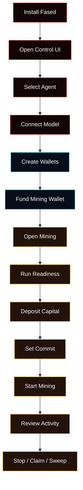

# Agent, Wallets, And Mining Walkthrough

This is the browser-first path from a fresh Fased install to a working Agent,
wallet setup, and Satcoin mining control.

Use this page when you want the shortest guided route. Each section links to the
deeper docs for the same area.



## 1. Install Fased

Use the normal install path:

```bash
git clone https://github.com/fased-ai/fased.git fased
cd fased
./install.sh
```

Choose **Local** for a laptop, desktop, dev box, or first test. Choose
**Hosting** only when the machine is a VPS or always-on server.

Read next:

- [Getting Started](/start/getting-started)
- [Setup Matrix](/start/setup-matrix)
- [Onboarding Wizard](/start/wizard)

## 2. Open The Control UI

After install, open the browser dashboard:

```bash
fased dashboard
```

To print the local link without opening a browser:

```bash
fased dashboard --no-open
```

If the browser asks for a token later, use the Gateway token printed by the
dashboard command or read the raw token:

```bash
fased config get gateway.auth.token
```

Read next:

- [Control UI Setup Model](/start/control-ui-setup)
- [Dashboard](/web/dashboard)

## 3. Select Or Create The Agent

Open **Agents**.

The selected Agent owns chat, model settings, skills, services, channels,
tasks, memory, and wallet policy. Start with one Agent unless you already know
you need separate work profiles.

Read next:

- [Control UI Setup Model](/start/control-ui-setup)
- [Models To Agents To Chat](/start/provider-agent-chat-flow)

## 4. Connect A Model

Open **Agent > Models**.

Add a model provider key or sign in, then choose a primary model. Send a first
test message from **Chat** before moving into wallet or mining flows.

Read next:

- [Model Providers](/concepts/model-providers)
- [Models](/concepts/models)

## 5. Create Wallets

Open **Wallets**.

Create or import wallets in this order:

1. **Agent wallet**
   Normal wallet for reviewed sends, receipts, Marketplace order actions, and
   wallet-capable skills.
2. **Mining wallet**
   Dedicated Solana wallet for Satcoin mining. There is one active configured
   mining wallet, normally `@wallet:mining`.
3. **Vault wallet**
   Manual-first wallet for reserve storage and Fased Network bond authority.
   Agent and Vault can have multiple wallets; Mining is a singleton role.

Read next:

- [Wallets](/plugins/crypto/wallet-page)
- [Wallet Roles And Policies](/plugins/crypto/wallet-roles-and-policies)
- [Wallet Control Passkey](/plugins/crypto/wallet-control-passkey)

## 6. Fund The Mining Wallet

Fund the Mining wallet with enough SOL for fees, reserve, and the capital you
plan to deposit.

From **Wallets**:

1. Open the Mining wallet card.
2. Copy the address.
3. Fund it from the wallet or faucet you are using for the selected network.
4. Refresh balances.

Read next:

- [Wallets](/plugins/crypto/wallet-page)
- [Solana RPC Setup](/plugins/crypto/wallet-rpc-setup)

## 7. Open Mining And Run Readiness

Open **Mining**.

Confirm the active wallet is `@wallet:mining`, then run readiness before
starting. Fix signer, RPC, SOL, token-account, or capital warnings before
continuing.

Read next:

- [Mining](/plugins/crypto/mining-page)
- [Mining Troubleshooting](/plugins/crypto/mining-troubleshooting)

## 8. Deposit Capital

On **Mining**, use the Mining Capital block.

Deposit a small amount of SOL into miner capital. The Fund action creates the
wallet-scoped miner account on-chain when it is missing.

Read next:

- [Mining](/plugins/crypto/mining-page)
- [Mining API](/plugins/crypto/mining-protocol)

## 9. Set Commit

Set a conservative active commit amount lower than free capital and wallet fee
reserve.

Click **Update** to write the active commit. If the saved target is higher than
the safe value, Fased submits the safe value and keeps the saved target for
later.

Read next:

- [Mining](/plugins/crypto/mining-page)
- [Advanced Mining](/plugins/crypto/mining-advanced)

## 10. Start Mining

Click **Start** only after readiness is green and the fee warning is clear.

The Mining page shows whether the runtime is ready, running, blocked, or
waiting.

Read next:

- [Mining](/plugins/crypto/mining-page)
- [Mining Chat And Automation](/plugins/crypto/mining-chat-and-automation)

## 11. Review Activity And History

Use recent activity and history to confirm what the runtime did:

- participation
- finalization
- claim
- missed cycles
- fee or gap events
- RPC failures

Read next:

- [Advanced Mining](/plugins/crypto/mining-advanced)
- [Mining Troubleshooting](/plugins/crypto/mining-troubleshooting)

## 12. Stop, Claim, And Sweep

Click **Stop** when you want to stop new cycle submits. Claim and recovery can
continue through already-submitted cycles.

When claimable SAT exists, claim it. If sweep is enabled and configured, review
the sweep destination before using it.

Read next:

- [Mining](/plugins/crypto/mining-page)
- [Mining Chat And Automation](/plugins/crypto/mining-chat-and-automation)

## 13. Review Wallet Ops

Return to **Wallets**.

Use Wallets to inspect balances, recent activity, approvals, policy controls,
and role separation after mining activity.

Read next:

- [Wallets](/plugins/crypto/wallet-page)
- [Wallet Chat And Channels](/plugins/crypto/wallet-chat-and-channels)
- [Wallet Production Flow](/plugins/crypto/wallet-production-flow)

## 14. Optional Fased Network And Bond

Open **Fased Network** after the base Agent, wallets, and mining path are clear.

Use this area for public route status, Fased Network readiness, Vault-backed
bond controls, and later operator-economy features.

Read next:

- [Fased Network](/start/federation)
- [SAT Bond Operator Overview](/start/bond-operator-economy)
