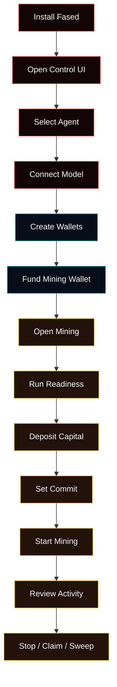

# Agent, Wallets, And Mining Walkthrough

This page is the simple user path from a fresh Fased install to a working Agent,
wallet setup, and Satcoin mining control.

Use it when you want one browser-first flow. For full details, follow the linked
deep docs from each step.

<Warning>
Use a devnet or test profile for screenshots and videos. Mainnet launch values,
private keys, API keys, production wallet addresses, recovery material, and full
balances should not appear in public docs.
</Warning>

## What This Walkthrough Covers



## 1. Install Fased

Use the normal local install path:

```bash
git clone https://github.com/fased-ai/fased.git fased
cd fased
./install.sh
```

Choose **Local** for a laptop, desktop, dev box, or first test. Choose
**Hosting** only when the machine is a VPS or always-on server.

Capture:

- `install/install-local-first-run.png`
- `install/onboarding-setup-map.png`

Read next:

- [Getting Started](/start/getting-started)
- [Setup Matrix](/start/setup-matrix)
- [Onboarding Wizard](/start/wizard)

## 2. Open The Control UI

After install, open the browser dashboard:

```bash
fased dashboard
```

The dashboard command opens an auth-ready local link. To print the link without
opening a browser:

```bash
fased dashboard --no-open
```

From a source checkout:

```bash
node fased.mjs dashboard --no-open
```

If the browser asks for a token later, use the Gateway token printed by the
dashboard command or read the raw token:

```bash
fased config get gateway.auth.token
```

Capture:

- `install/control-ui-first-open.png`
- `start/dashboard-home.png`

Read next:

- [Control UI Setup Model](/start/control-ui-setup)
- [Dashboard](/web/dashboard)

## 3. Select Or Create The Agent

Open `/agents`.

Use this page to select the Agent that owns chat, model settings, skills,
services, channels, tasks, memory, and wallet policy.

Capture:

- `start/agent-setup-checklist.png`
- `start/agent-selected.png`

Read next:

- [Control UI Setup Model](/start/control-ui-setup)
- [Models To Agents To Chat](/start/provider-agent-chat-flow)

## 4. Connect A Model

Open **Agent > Models**.

Add a model provider key or sign in, then choose a primary model. Send a first
test message from **Chat** before moving into wallet or mining flows.

Capture:

- `start/model-provider-setup.png`
- `start/model-connected.png`
- `start/first-chat.png`

Read next:

- [Model Providers](/concepts/model-providers)
- [Models](/concepts/models)

## 5. Create Wallets

Open `/wallet`.

Create or import wallets in this order:

1. **Agent wallet**
   Normal wallet for reviewed sends, receipts, Marketplace order actions, and
   wallet-capable skills.
2. **Mining wallet**
   Dedicated Solana wallet for Satcoin mining. There is one active configured
   mining wallet, normally `@wallet:mining`.
3. **Vault wallet**
   Manual-first wallet for reserve storage and Fased Network bond authority.
   Agent and Vault can have multiple wallets; Mining is a singleton role.

Capture:

- `wallet/wallet-empty-state.png`
- `wallet/wallet-create-agent.png`
- `wallet/wallet-create-mining.png`
- `wallet/wallet-create-vault.png`
- `wallet/wallet-overview-devnet.png`

Read next:

- [Wallets](/plugins/crypto/wallet-page)
- [Wallet Roles And Policies](/plugins/crypto/wallet-roles-and-policies)
- [Wallet Control Passkey](/plugins/crypto/wallet-control-passkey)

## 6. Fund The Mining Wallet

On devnet, fund the Mining wallet with enough SOL for fees, reserve, and the
capital you plan to deposit.

From `/wallet`:

1. Open the Mining wallet card.
2. Copy the address.
3. Fund it from your devnet faucet or external devnet wallet.
4. Refresh balances.

Capture:

- `wallet/wallet-copy-mining-address.png`
- `wallet/wallet-mining-funded-devnet.png`
- `wallet/wallet-recent-activity.png`

Read next:

- [Wallets](/plugins/crypto/wallet-page)
- [Solana RPC Setup](/plugins/crypto/wallet-rpc-setup)

## 7. Open Mining And Run Readiness

Open `/mining`.

Confirm the active wallet is `@wallet:mining`, then run readiness before
starting. Fix signer, RPC, SOL, token-account, or capital warnings before
continuing.

Capture:

- `mining/mining-overview-devnet.png`
- `mining/mining-readiness.png`
- `mining/mining-readiness-warning.png`

Read next:

- [Mining](/plugins/crypto/mining-page)
- [Mining Troubleshooting](/plugins/crypto/mining-troubleshooting)

## 8. Deposit Capital

On `/mining`, use the Mining Capital block.

Deposit a small amount of SOL into miner capital. The Fund action creates the
wallet-scoped miner account on-chain when it is missing.

Capture:

- `mining/mining-capital-empty.png`
- `mining/mining-fund-capital.png`
- `mining/mining-capital-funded.png`

Read next:

- [Mining](/plugins/crypto/mining-page)
- [Mining API](/plugins/crypto/mining-protocol)

## 9. Set Commit

Set a conservative active commit amount lower than free capital and wallet fee
reserve.

Click **Update** to write the active commit. If the saved target is higher than
the safe value, Fased submits the safe value and keeps the saved target for
later.

Capture:

- `mining/mining-set-commit.png`
- `mining/mining-safe-commit.png`
- `mining/mining-commit-updated.png`

Read next:

- [Mining](/plugins/crypto/mining-page)
- [Advanced Mining](/plugins/crypto/mining-advanced)

## 10. Start Mining

Click **Start** only after readiness is green and the fee warning is clear.

The Mining page should show whether the runtime is ready, running, blocked, or
waiting. Keep the page focused on devnet values for public screenshots.

Capture:

- `mining/mining-start-ready.png`
- `mining/mining-running.png`
- `mining/mining-current-cycle.png`

Read next:

- [Mining](/plugins/crypto/mining-page)
- [Mining Chat And Automation](/plugins/crypto/mining-chat-and-automation)

## 11. Review Activity And History

Use recent activity and history to confirm what the runtime did:

- participation
- finalization
- claim
- missed cycles
- fee or gap events
- RPC failures

Capture:

- `mining/mining-recent-activity.png`
- `mining/mining-history.png`
- `mining/mining-share-summary.png`

Read next:

- [Advanced Mining](/plugins/crypto/mining-advanced)
- [Mining Troubleshooting](/plugins/crypto/mining-troubleshooting)

## 12. Stop, Claim, And Sweep

Click **Stop** when you want to stop new cycle submits. Claim and recovery can
continue through already-submitted cycles.

When claimable SAT exists, claim it. If sweep is enabled and configured, review
the sweep destination before using it.

Capture:

- `mining/mining-stop-clearing.png`
- `mining/mining-claim-ready.png`
- `mining/mining-claim-complete.png`
- `mining/mining-sweep-settings.png`

Read next:

- [Mining](/plugins/crypto/mining-page)
- [Mining Chat And Automation](/plugins/crypto/mining-chat-and-automation)

## 13. Review Wallet Ops

Return to `/wallet`.

Use Wallets to inspect balances, recent activity, approvals, policy controls,
and role separation after mining activity.

Capture:

- `wallet/wallet-recent-activity-after-mining.png`
- `wallet/wallet-approval-request.png`
- `wallet/wallet-policy-panel.png`
- `wallet/wallet-passkey-approval.png`

Read next:

- [Wallets](/plugins/crypto/wallet-page)
- [Wallet Chat And Channels](/plugins/crypto/wallet-chat-and-channels)
- [Wallet Production Flow](/plugins/crypto/wallet-production-flow)

## 14. Optional Fased Network And Bond Screens

Open `/federation` only after the base Agent, wallets, and mining path are clear.

Capture:

- `network/fased-network-status.png`
- `network/bond-operator-card.png`
- `network/staking-card.png`

Read next:

- [Fased Network](/start/federation)
- [SAT Bond Operator Overview](/start/bond-operator-economy)

## Capture Checklist

Use [Screenshot And Video Capture Checklist](/images/screenshots/README) as the
working capture checklist for filenames, page targets, and video clips.
