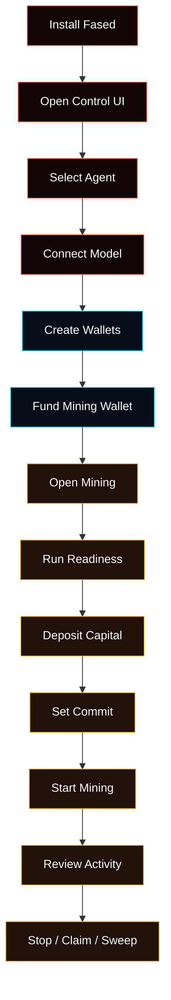

# Agent, Wallets, And Mining Walkthrough

This is the browser-first path from a fresh Fased install to a working Agent,
wallet setup, and Satcoin mining control.

Use this page when you want the shortest guided route. Each section links to the
deeper docs for the same area.

<Warning>
Do not start with wallet funding, mining, or bond. First prove the runtime:
install, open the dashboard, connect a model, and send one browser chat.
</Warning>



## Before You Start

Pick where Fased Agent runs.

| Setup           | Use when                                     | Recommended path                                       |
| --------------- | -------------------------------------------- | ------------------------------------------------------ |
| Local           | you are learning or testing on this computer | macOS Terminal, Windows WSL2 Ubuntu, or Linux terminal |
| VPS Hosting     | you need an always-on machine                | Ubuntu LTS VPS first; Debian is close                  |
| Hosted advanced | you already manage Linux servers             | Fedora or RHEL-family with systemd                     |

Practical baseline:

- Local: a normal laptop/desktop that can run a browser and terminal.
- Hosted test VPS: `1 vCPU / 1 GB RAM` can work, but may feel slow.
- Hosted smoother VPS: `2 GB RAM` or `2 vCPU / 4 GB RAM`.
- Hosted disk: `20 GB` minimum, `40 GB+` more comfortable.

For hosted setup, keep the VPS provider console open until private access
works. Do not expose the dashboard as a public web panel.

## 1. Install Fased

Choose the setup profile first.

<Tabs>
  <Tab title="Local install">
    Use this on your own computer. On macOS, use Terminal. On Windows, use WSL2
    with Ubuntu. On Linux, use your distro terminal.

    ```bash
    curl -fsSL https://raw.githubusercontent.com/fased-ai/fased/main/install.sh | bash -s -- --local
    ```

    This selects the **Local** profile and keeps VPS SSH/firewall hardening off.

    If onboarding was interrupted, continue it:

    ```bash
    fased onboard --install-daemon
    ```

    Then open the dashboard:

    ```bash
    fased dashboard
    ```

    

    

    

  </Tab>
  <Tab title="VPS Hosting install">
    Use this only on the VPS or always-on server. Ubuntu LTS is the recommended
    default for a first hosted setup. Fedora/RHEL-family systems need their own
    Tailscale/package steps, so use the OS tabs in
    [Install](/install#vps-hosting-install).

    On your own computer, install and sign into Tailscale first. Then SSH into
    the VPS:

    ```bash
    ssh root@YOUR_PUBLIC_VPS_IP
    ```

    Run the hosted installer **inside the VPS SSH session**:

    ```bash
    curl -fsSL https://raw.githubusercontent.com/fased-ai/fased/main/install.sh | bash -s -- --hosting
    ```

    Do not paste the hosted command into local PowerShell or Terminal unless
    that shell is already connected to the VPS.

    When setup prints the Tailscale login URL, open it in your local browser.
    Before setup hardens SSH/firewall access, confirm Tailscale SSH from your
    own computer:

    ```bash
    ssh app@YOUR_VPS_TAILSCALE_NAME
    ```

    It should connect and land in `/home/app/fased`.

    

    

    

  </Tab>
</Tabs>

Simple command recap:

```bash
# Local on this computer
curl -fsSL https://raw.githubusercontent.com/fased-ai/fased/main/install.sh | bash -s -- --local

# Hosted on the VPS itself
curl -fsSL https://raw.githubusercontent.com/fased-ai/fased/main/install.sh | bash -s -- --hosting

# Continue setup if interrupted
fased onboard --install-daemon

# Open browser dashboard
fased dashboard

# Check health
fased health
```

Read next:

- [Getting Started](/start/getting-started)
- [Setup Matrix](/start/setup-matrix)
- [Onboarding Wizard](/start/wizard)

## 2. Open The Control UI

After install, open the browser dashboard:

```bash
fased dashboard
```

To print the local link without opening a browser:

```bash
fased dashboard --no-open
```


If the browser asks for a token later, use the Gateway token printed by the
dashboard command or read the raw token:

```bash
fased config get gateway.auth.token
```

Read next:

- [Control UI Setup Model](/start/control-ui-setup)
- [Dashboard](/web/dashboard)

## 3. Select Or Create The Agent

Open **Agents**.

The selected Agent owns chat, model settings, skills, services, chat app
routes, tasks, saved context, and wallet controls. Start with one Agent unless
you already know you need separate work profiles.


If you choose chat channels during onboarding, the terminal wizard can collect
the channel token. You can skip this and add channels later.


Read next:

- [Control UI Setup Model](/start/control-ui-setup)
- [Models To Agents To Chat](/start/provider-agent-chat-flow)

## 4. Connect A Model

Open **Agent > Models**.

Add a model provider key or sign in, then choose a primary model. Send a first
test message from **Chat** before moving into wallet or mining flows.


Read next:

- [Model Providers](/concepts/model-providers)
- [Models](/concepts/models)

## 5. Create Wallets

Open **Wallets**.

Create or import wallets in this order:

1. **Agent wallet**
   Normal wallet for reviewed sends, receipts, Marketplace order actions, and
   wallet-capable skills.
2. **Mining wallet**
   Dedicated Solana wallet for Satcoin mining. There is one active configured
   mining wallet, normally `@wallet:mining`.
3. **Vault wallet**
   Manual-first wallet for reserve storage and Fased Network bond authority.
   Agent and Vault can have multiple wallets; Mining is a singleton role.

When importing a Solana wallet, use a base58 64-byte private key from your
wallet/export tool. Fased also accepts Solana JSON byte array, base64/base64url,
or hex imports. Do not paste seed phrases into wallet import.


Open **Access** to set the Wallet Control Passkey before higher-risk wallet
actions.


Read next:

- [Wallets](/plugins/crypto/wallet-page)
- [Wallet Roles And Policies](/plugins/crypto/wallet-roles-and-policies)
- [Wallet Control Passkey](/plugins/crypto/wallet-control-passkey)

## 6. Fund The Mining Wallet

Fund the Mining wallet with enough SOL for fees, reserve, and the capital you
plan to deposit.

From **Wallets**:

1. Open the Mining wallet card.
2. Copy the address.
3. Fund it from the wallet or faucet you are using for the selected network.
4. Refresh balances.

Read next:

- [Wallets](/plugins/crypto/wallet-page)
- [Solana RPC Setup](/plugins/crypto/wallet-rpc-setup)

## 7. Open Mining And Run Readiness

Open **Mining**.

Confirm the active wallet is `@wallet:mining`, then run readiness before
starting. Fix signer, RPC, SOL, token-account, or capital warnings before
continuing.

Read next:

- [Mining](/plugins/crypto/mining-page)
- [Mining Troubleshooting](/plugins/crypto/mining-troubleshooting)

## 8. Deposit Capital

On **Mining**, use the Mining Capital block.

Deposit a small amount of SOL into miner capital. The Fund action creates the
wallet-scoped miner account on-chain when it is missing.


Read next:

- [Mining](/plugins/crypto/mining-page)
- [Mining API](/plugins/crypto/mining-protocol)

## 9. Set Commit

Set a conservative active commit amount lower than free capital and wallet fee
reserve.

Click **Update** to write the active commit. If the saved target is higher than
the safe value, Fased submits the safe value and keeps the saved target for
later.


Read next:

- [Mining](/plugins/crypto/mining-page)
- [Advanced Mining](/plugins/crypto/mining-advanced)

## 10. Start Mining

Click **Start** only after readiness is green and the fee warning is clear.

The Mining page shows whether the runtime is ready, running, blocked, or
waiting.


Read next:

- [Mining](/plugins/crypto/mining-page)
- [Mining Chat And Automation](/plugins/crypto/mining-chat-and-automation)

## 11. Review Activity And History

Use recent activity and history to confirm what the runtime did:

- participation
- finalization
- claim
- missed cycles
- fee or gap events
- RPC failures


Read next:

- [Advanced Mining](/plugins/crypto/mining-advanced)
- [Mining Troubleshooting](/plugins/crypto/mining-troubleshooting)

## 12. Stop, Claim, And Sweep

Click **Stop** when you want to stop new cycle submits. Claim and recovery can
continue through already-submitted cycles.

When claimable SAT exists, claim it. If sweep is enabled and configured, review
the sweep destination before using it.

Read next:

- [Mining](/plugins/crypto/mining-page)
- [Mining Chat And Automation](/plugins/crypto/mining-chat-and-automation)

## 13. Review Wallet Ops

Return to **Wallets**.

Use Wallets to inspect balances, recent activity, approvals, policy controls,
and role separation after mining activity.

Read next:

- [Wallets](/plugins/crypto/wallet-page)
- [Wallet Chat And Channels](/plugins/crypto/wallet-chat-and-channels)
- [Wallet Production Flow](/plugins/crypto/wallet-production-flow)

## 14. Optional Fased Network And Bond

Open **Fased Network** after the base Agent, wallets, and mining path are clear.

Use this area for public route status, Fased Network readiness, Vault-backed
bond controls, and later operator-economy features.


Read next:

- [Fased Network](/start/federation)
- [SAT Bond Operator Overview](/start/bond-operator-economy)
