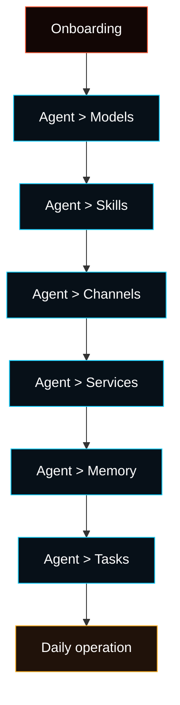

# Control UI Setup Model

Onboarding gets the machine ready. The Control UI makes the agent useful.

The intended flow is:



The first browser setup pass should start from the selected Agent:

<Steps>
  <Step title="/agents">
    Create or select the Agent that will own chat, channel routes, tasks, and memory.
  </Step>
  <Step title="Agent > Models">
    Connect provider auth if needed, then choose primary, fallback, and task models.
  </Step>
  <Step title="Agent > Skills">
    Create, review, install, configure, and allow skills for this Agent.
  </Step>
  <Step title="Agent > Channels">
    Connect chat apps and route accounts, topics, or guilds to this Agent.
  </Step>
  <Step title="Agent > Services">
    Connect external APIs such as web/search, Gmail, Calendar, GitHub, or browser/media.
  </Step>
  <Step title="Agent > Memory">
    Enable session-memory and review per-Agent archive/QMD state.
  </Step>
  <Step title="Agent > Tasks">
    Create saved tasks, triggers, workflows, graphs, programs, and templates.
  </Step>
  <Step title="/config">
    Use Advanced Config only for fields that do not have a friendly page yet.
  </Step>
</Steps>

For the focused model-to-agent flow, see
[Models to Agents to Chat](/start/provider-agent-chat-flow).

## What Onboarding Owns

Use onboarding for machine and security setup:

- Local or Hosting profile
- Gateway mode, port, auth, and token
- workspace and service startup
- local signer wallet setup when selected
- optional singleton Mining wallet setup
- Hosting profile Tailscale and host hardening

Onboarding is not the normal place to manage every model provider, skill,
extension, hook, channel, service, or scheduled task.

<Warning>
Hosting is for VPS or always-on server machines. It can change SSH and firewall
behavior. Local is for a laptop, desktop, or dev box and does not apply the
hosting security baseline.
</Warning>

## What The Control UI Owns

After onboarding, open:

```bash
fased dashboard
```

Then use the browser pages for product setup:

<CardGroup cols={2}>
  <Card title="/agents">
    Create or select an Agent and attach model, skills, services, channels,
    memory, tasks, tools, sessions, and wallet policy.
  </Card>
  <Card title="/extensions">
    Review runtime plugins, source trust, dependencies, scanner warnings, and advanced extension setup.
  </Card>
  <Card title="/usage">
    Review local model usage by provider, model, Agent, session, task, channel, and source.
  </Card>
  <Card title="/notifications">
    Configure notification routing and recent in-app/external delivery.
  </Card>
  <Card title="/wallet">
    Review wallet policy, approvals, balances, custody, and signer health.
  </Card>
  <Card title="/mining">
    Operate SAT mining readiness, capital, commit, recovery, and history.
  </Card>
  <Card title="/federation">
    Operate Fased Network status, routing, and marketplace-facing identity.
  </Card>
  <Card title="/marketplace">
    Review Fased Network offers, requests, purchases, and disputes.
  </Card>
  <Card title="/memory">
    Read memory diagnostics across Agents. Enable session-memory from `Agent > Memory`.
  </Card>
  <Card title="/config">
    Advanced Config only. Use this when a field is not exposed in a friendly page yet.
  </Card>
</CardGroup>

<Note>
Dashboard is a launch/status widget board. It is not the setup wizard. Start
with `/agents` when the Gateway is already online.
</Note>

## Agent Means

In the Control UI, an Agent is the routeable workspace identity you actually
operate.

It can have:

- model and fallbacks
- skills
- services
- channels
- memory settings
- scheduled tasks
- files and workspace context
- wallet policy

Examples:

- Researcher
- Support
- Mining Operator
- Operations Reviewer

Channels and scheduled tasks should route to a configured Agent. Subagents are
different: they are internal runtime workers used during a task, not normal
channel routing targets.

`Agent > Tasks` is the selected Agent's saved-work control surface. Create a
**Task** for scheduled work first. Add Triggers, Workflows, Graphs, Programs,
or Templates only when the run needs that structure.

Run history can include scheduled runs plus records mirrored from webhooks,
channels, subagents/ACP, CLI/system runs, media generation, wallet approvals,
Marketplace, mining, and workflows. It is audit data, not the primary task list.
Use the owning page for the actual domain operation: Wallets for signing,
Marketplace for orders/disputes, Mining for mining control, Channels for
routes/delivery, and Services/Media for connector setup.

## Skills, Extensions, Channels, Services

Use these words consistently:

**Skill**

A user-facing ability or instruction pack the agent can use. Create, review,
configure, and allow it from `Agent > Skills`.

**Extension**

Runtime plugin code that can add tools, channels, hooks, schemas, commands, or
UI panels. Review it in `/extensions`.

**Channel**

A chat app where the agent receives or sends messages. Connect and route it from
`Agent > Channels`. Channels do not own tasks.

**Service**

An external API the agent can use, such as Gmail, Calendar, GitHub, web/search,
browser/media, or a plugin-reported API. Connect it from `Agent > Services`.

**Hook**

Background automation around runtime events. Review hook packs in `/extensions`;
Agent memory archive control lives in `Agent > Memory`.

Skill setup is intentionally split by responsibility but exposed in one Agent
surface:

- **Agent > Skills**: create workspace skills, review plugin-catalog installs, save
  skill config, fix dependencies, edit skill files, and allow/deny skills for
  that Agent.
- **Agent > Tools**: allow or deny runtime tools exposed by core code, services,
  channels, or extensions.
- **Agent > Services**: connect API credentials a skill/tool depends on.
- **Wallet > Skill Grants tab**: grant narrow Agent-wallet actions for reviewed
  wallet-capable skills. Mining and Vault wallets stay outside generic skill
  grants.

`Agent > Channels` exposes setup fields for every supported channel in the same
order as onboarding: Telegram, WhatsApp, Discord, IRC, Google Chat, Slack,
Signal, iMessage, then bundled or external channel plugins. The normal setup
path is per Agent; any global channel page is an implementation/deep-link
fallback, not the first-run path.

`Agent > Services` is the connector recovery center for task preflight. If a
task needs web search, GitHub, Gmail/Google Workspace, Firecrawl, model auth,
channel delivery, or a configured skill, it should pause in `needs-access` and
point back to the matching setup surface instead of repeatedly running. Access
is still constrained by that Agent's Tools, Skills, wallet policy, and task
policy.

## Memory

Memory has multiple pieces:

- `MEMORY.md`: curated long-term workspace memory
- `memory/`: markdown archive directory
- `session-memory`: hook that archives recent session messages on `/new` and `/reset`
- QMD/backend: optional indexing, search, and export
- Memory Doctor: diagnostics and repair surfaces

Use `Agent > Memory` to enable or disable `session-memory` and review that
Agent's archive/QMD state. Use `/memory` for cross-Agent diagnostics and memory
health. Repair and raw doctor actions stay in Debug or CLI.

## Advanced Config

`/config` edits `~/.fased/fased.json` directly.

Use it when:

- a plugin or channel exposes a schema field that does not have a friendly UI yet
- you need raw JSON mode
- you need validation, diff, reload, save, or apply controls
- support or docs asks you to change a specific config field

Do not use Advanced Config as the normal first-run setup path. Prefer
Agents, Extensions, Wallets, Mining, Fased Network, Marketplace, Usage,
Notifications, Logs, and Debug first.

## CLI

CLI remains useful for:

- automation
- repair
- export/import
- host-level operations
- dangerous wallet or signer operations
- scripted installs

Normal product setup after onboarding should happen in the Control UI whenever
the relevant page exists.
