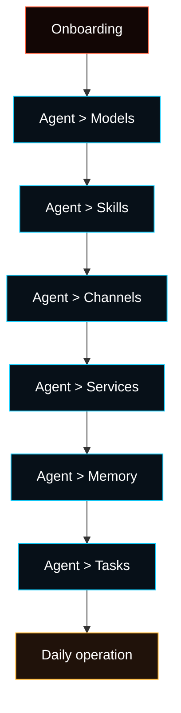

# Control UI Setup Model

Onboarding gets the machine ready. The Control UI makes the agent useful.

The intended flow is:


```mermaid
flowchart TD
  onboard["Onboarding"] --> models["Agent > Models"]
  models --> skills["Agent > Skills"]
  skills --> channels["Agent > Channels"]
  channels --> services["Agent > Services"]
  services --> memory["Agent > Memory"]
  memory --> tasks["Agent > Tasks"]
  tasks --> operate["Daily operation"]

  classDef machine fill:#120605,stroke:#ff5a36,color:#ffffff;
  classDef agent fill:#071018,stroke:#12cfff,color:#ffffff;
  classDef run fill:#20120a,stroke:#ffb020,color:#ffffff;
  class onboard machine;
  class models,skills,channels,services,memory,tasks agent;
  class operate run;
```

The first browser setup pass should start from the selected Agent:

<Steps>
  <Step title="/agents">
    Create or select the Agent that will own chat, chat app routes, tasks, and saved context.
  </Step>
  <Step title="Agent > Models">
    Connect provider auth if needed, then choose primary, fallback, and task models.
  </Step>
  <Step title="Agent > Skills">
    Create, review, install, configure, and allow skills for this Agent.
  </Step>
  <Step title="Agent > Channels">
    Install the official channel add-on when required, then connect and route
    accounts, topics, or guilds to this Agent.
  </Step>
  <Step title="Agent > Services">
    Connect external APIs such as web/search, Gmail, Calendar, GitHub, or browser/media.
  </Step>
  <Step title="Agent > Memory">
    Enable saved session context and review per-Agent archive state.
  </Step>
  <Step title="Agent > Tasks">
    Create saved tasks, triggers, workflows, graphs, programs, and templates.
  </Step>
  <Step title="/config">
    Use Advanced Config only for fields that do not have a friendly page yet.
  </Step>
</Steps>

For the focused model-to-agent flow, see
[Models to Agents to Chat](/start/provider-agent-chat-flow).

## What Onboarding Owns

Use onboarding for machine and security setup:

Onboarding is not the normal place to manage every model provider, skill,
extension, hook, channel, service, or scheduled task.

<Warning>
Hosting is for VPS or always-on server machines. It can change SSH and firewall
behavior. Local is for a laptop, desktop, or dev box and does not apply the
hosting security baseline.
</Warning>

## What The Control UI Owns

After onboarding, open:

```bash
fased dashboard
```

Then use the browser pages for product setup:

<Note>
Dashboard is a launch/status widget board. It is not the setup wizard. Start
with `/agents` when the Gateway is already online.
</Note>

## Agent Means

In the Control UI, an Agent is the workspace profile you actually operate.

It can have:

- model and fallbacks
- skills
- services
- chat apps
- saved context settings
- scheduled tasks
- files and workspace context
- wallet controls

Examples:

Channels and scheduled tasks should route to a configured Agent. In the UI,
Channels means chat app connections such as Telegram, Discord, and WhatsApp.
Subagents are different: they are internal runtime workers used during a task,
not normal chat routing targets.

`Agent > Tasks` is the selected Agent's saved-work control surface. Create a
**Task** for scheduled work first. Add Triggers, Workflows, Graphs, Programs,
or Templates only when the run needs that structure.

## Skills, Extensions, Channels, Services

Use these words consistently:

**Skill**

A user-facing ability or instruction pack the agent can use. Create, review,
configure, and allow it from `Agent > Skills`.

**Extension**

Plugin code that can add tools, channels, hooks, schemas, commands, or UI
panels. Review it in `/extensions`.

**Channel**

A chat app where the agent receives or sends messages. Connect and route it from
`Agent > Channels`. Channels do not own tasks.

**Service**

An external API the agent can use, such as Gmail, Calendar, GitHub, web/search,
browser/media, or a plugin-reported API. Connect it from `Agent > Services`.

**Hook**

Background automation around Fased events. Review hook packs in `/extensions`;
Agent memory archive control lives in `Agent > Memory`.

Skill setup is intentionally split by responsibility but exposed in one Agent
surface:

`Agent > Channels` exposes installed channels and official add-ons in the same
order as onboarding. Telegram, WhatsApp, Discord, Slack, Feishu, and Google Chat show an **Install**
action on a fresh core install; setup fields appear after the package is
installed and the Gateway restarts. The normal setup path is per Agent; any
global channel page is an implementation/deep-link fallback, not the first-run
path.

Fased includes provider clients for local model servers, but it does not install
Ollama, LM Studio, vLLM, LiteLLM, or model weights. Install and run that service
first, then connect it from **Agent > Models**. See
[Core And Optional Components](/install/components).

`Agent > Services` is the connector recovery center for task preflight. If a
task needs web search, GitHub, Gmail/Google Workspace, Firecrawl, model auth,
channel delivery, or a configured skill, it should pause in `needs-access` and
point back to the matching setup surface instead of repeatedly running. Access
is still constrained by that Agent's Tools, Skills, wallet controls, and task
policy.

## Memory (Saved Context)

Memory has multiple pieces:

- `MEMORY.md`: curated long-term workspace memory
- `memory/`: markdown archive directory
- `session-memory`: hook that archives recent session messages on `/new` and `/reset`
- QMD/backend: optional indexing, search, and export
- Memory Doctor: diagnostics and repair surfaces

Use `Agent > Memory` to enable or disable `session-memory` and review that
Agent's archive/QMD state. Use `/memory` for cross-Agent diagnostics and memory
health. Repair and raw doctor actions stay in Debug or CLI.

## Advanced Config

`/config` edits `~/.fased/fased.json` directly.

Use it when:

- a plugin or channel exposes a schema field that does not have a friendly UI yet
- you need raw JSON mode
- you need validation, diff, reload, save, or apply controls
- support or docs asks you to change a specific config field

## CLI

CLI remains useful for:

- automation
- repair
- export/import
- host-level operations
- dangerous wallet or signer operations
- scripted installs

Normal product setup after onboarding should happen in the Control UI whenever
the relevant page exists.
